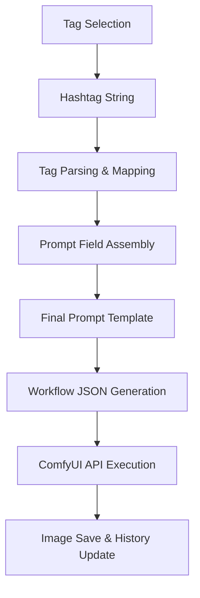

## Why I built it

Making Epoch: Unseen portraits, the bottleneck wasn't generation quality — it was prompt management. Hand-editing prompts made results unstable. Finding which combination worked before was tedious.

Instead of using ComfyUI raw, I wrapped it with a portrait-specific input layer: Character Forge. Not searching for one clever prompt. Building a flow for rapid iteration under similar conditions.

## Actual usage flow

Typical workflow:

- Set character concept and visual direction.
- Pick tags, generate 4 images at once.
- Repeat 5–6 rounds until something clicks.
- Favorite the promising results.
- Apply the final pick as an Epoch: Unseen portrait.

Still closer to rapid `txt2img` candidate screening than fine editing. `img2img` is built and tested but not used much at this stage.

## How tags become prompts

Input tags are split by role, like ingredients for building a character. Base settings — gender, age, class, race. Character traits — appearance, features, outfit, personality, moe. Background and lighting exist but portraits mostly use white backgrounds.

Key point: tags don't concatenate straight into a prompt string. The actual flow is `tag combination → per-category interpretation → final template application`.

- Selected tags become a category-ordered hashtag string in the UI.
- Server splits hashtags into buckets: gender, personality, appearance, outfit.
- Missing required categories block generation.
- Each tag maps to an English prompt fragment, assembled into the final template.

Not a complex per-tag weighting system. Tags get normalized into clean fields first, then the template stage applies lightweight rules. Outfit gets emphasized, certain task types drop background or camera tags entirely.

Pipeline summary:

## How ComfyUI connects

No folder-watching. Direct HTTP/WebSocket calls to local ComfyUI.

- Python sends `POST /prompt` with the workflow.
- `GET /history/{prompt_id}` checks completion.
- WebSocket receives step progress when available.
- On completion, `/view` fetches the result image.

The generation workflow is built as JSON in code. Final positive/negative prompts are assembled from Python-side templates. After tag selection in the UI, the portrait pipeline runs in a fairly consistent shape.

  
  

## What improved

Consistency improved most. Instead of agonizing over prompts from scratch, I run many attempts quickly within constrained tags. Fewer choices made repetition easier. A few button presses to retry — that mattered more than expected.

Local DB history storage proved useful too. Tags and prompts are saved together; one button replays the same conditions. Favorites helped separate good results from noise. Finding "what worked before" turned out more important than generating volume.

Currently running SDXL on a Mac Mini 64GB with ComfyUI. About 1–2 minutes per image. Manageable for portraits.

## Results reshaped the design

An interesting pattern: the design didn't always drive the image. Sometimes the image pulled the design back.

Erich, the protagonist, started as a neat-freak soldier — realistic, sharp, grounded. But across many generations, the ones I kept picking drifted toward a JRPG protagonist tone. Armor shape, color contrast, face, overall silhouette all shifted that direction. The current Erich is far more stylized and polished than the original mental image.

  <figure>
    
    <figcaption
      className="mt-3 text-center text-sm"
      style={{ color: "var(--text-secondary)" }}
    >
      1st: Realistic soldier tone
    </figcaption>
  </figure>

  <figure>
    
    <figcaption
      className="mt-3 text-center text-sm"
      style={{ color: "var(--text-secondary)" }}
    >
      2nd: JRPG tone emerges
    </figcaption>
  </figure>

  <figure>
    
    <figcaption
      className="mt-3 text-center text-sm"
      style={{ color: "var(--text-secondary)" }}
    >
      Current: Refined final direction
    </figcaption>
  </figure>

This shift showed up faster in the tag-based system than in free-form prompting. Tweaking conditions incrementally and comparing candidates in sequence reveals the gap between your mental image and what actually works on screen.

## Remaining limits

Control isn't complete. White background setting sometimes leaks background elements. For now I just rerun. Manageable for portraits, but extending to scene or event illustrations changes the equation.

Also, Character Forge is only validated for the portrait pipeline. Maintaining illustration consistency across more complex scenes hasn't been tested seriously. That stage might need tools with different strengths, like NanoBanana.

## It was an input system problem, not a prompt problem

Thought one good prompt was the key. Building this taught otherwise: a repeatable input system matters more. Free-form prompting is flexible but hard to manage across iterations. Tag-constrained input trades freedom per attempt for easy repetition.

Character Forge delivers on repeatability. Turning "prompt writing" into an "input system" changed the working feel more than expected.
