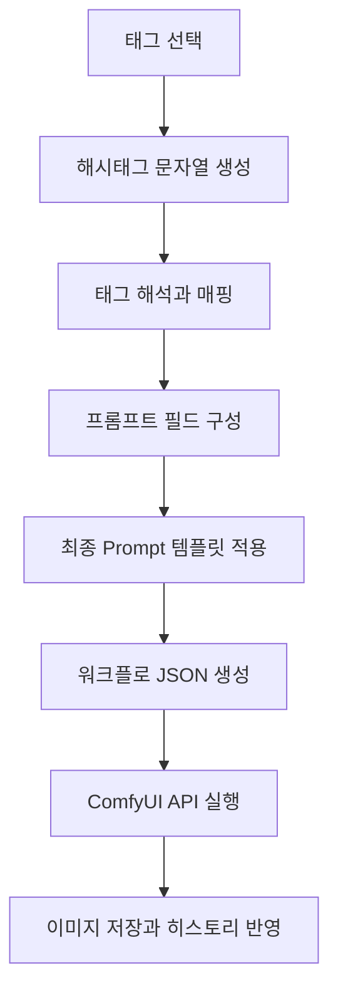
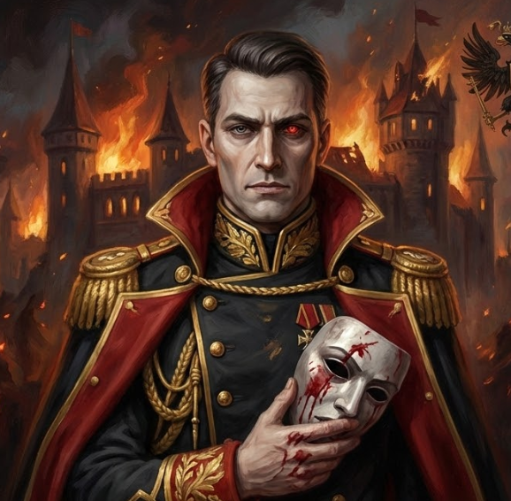
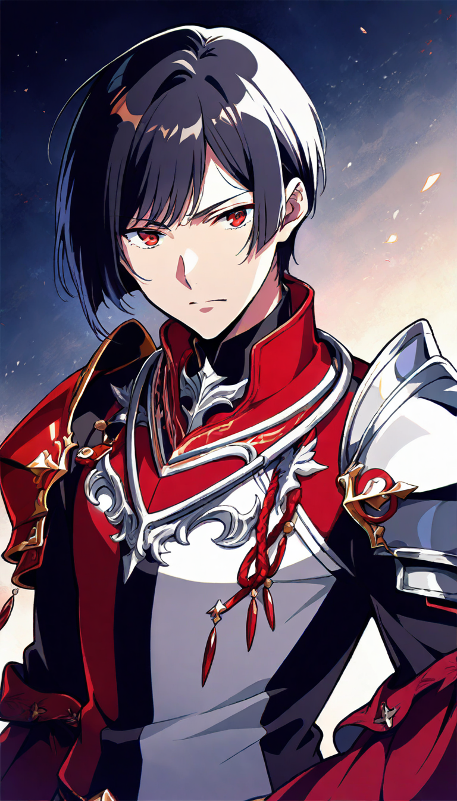

## 만든 이유

Epoch: Unseen용 캐릭터 초상화를 만들다 보니, 먼저 막히는 건 이미지 생성 성능이 아니라 프롬프트 관리였다. 프롬프트를 매번 손으로 만지면 결과가 쉽게 흔들렸고, 어떤 조합이 괜찮았는지 다시 찾는 것도 번거로웠다.

그래서 ComfyUI를 그대로 쓰기보다, 캐릭터 초상화용 입력 체계를 한 겹 감싼 `Character Forge`를 만들었다. 목표는 더 영리한 프롬프트 한 줄을 찾는 게 아니라, 비슷한 조건에서 여러 시도를 빠르게 반복할 수 있는 흐름을 만드는 것이었다.

## 실제 사용 흐름

실제로는 대개 이런 흐름으로 쓴다.

- 캐릭터 설정과 외형 방향을 먼저 잡는다.
- 태그를 골라 한 번에 4장씩 생성한다.
- 마음에 드는 결과가 나올 때까지 5\~6번 정도 반복한다.
- 후보 일러스트는 즐겨찾기에 모은다.
- 최종적으로 고른 이미지를 Epoch: Unseen 초상화에 반영한다.

아직은 세세한 편집보다 `tex2img`로 후보를 빠르게 많이 보는 쪽에 더 가깝다. `img2img`도 만들고 테스트는 해뒀지만, 지금 단계에서는 아직 자주 쓰지 않는다.

## 태그를 어떻게 프롬프트로 바꾸는가

입력 태그는 캐릭터를 만드는 재료처럼 역할별로 나뉘어 있다. 성별, 나이, 직업, 종족처럼 기본 설정을 잡는 태그가 있고, 외형, 특징, 의상, 성격, 모에처럼 캐릭터의 개성을 만드는 태그가 따로 있다. 배경이나 조명 옵션도 있지만, 지금은 초상화 위주라 거의 흰 배경만 쓴다.

핵심은 이걸 바로 프롬프트 문자열로 이어 붙이지 않는다는 점이다. 실제 흐름은 `태그 조합 -> 카테고리별 해석 -> 최종 템플릿 적용`에 더 가깝다.

- UI에서 고른 태그를 카테고리별 고정 순서의 해시태그 문자열로 만든다.
- 서버에서 그 해시태그를 `gender`, `personality`, `appearance`, `outfit` 같은 버킷으로 다시 나눈다.
- 필수 카테고리가 빠지면 생성 자체를 막는다.
- 각 태그를 영어 프롬프트 조각으로 바꾼 뒤 최종 템플릿에 넣는다.

태그마다 복잡한 가중치를 따로 붙이는 구조라기보다, 태그를 한 번 정리된 필드로 바꾼 뒤 마지막 템플릿 단계에서 필요한 규칙만 얹는 방식에 가깝다. 예를 들어 의상은 더 강조하고, 특정 작업 종류에서는 배경이나 카메라 태그를 아예 버린다.

짧게 요약하면 파이프라인은 아래 정도다.

## ComfyUI는 어떻게 붙였나

폴더를 감시하면서 돌리는 식은 쓰지 않았다. 로컬 ComfyUI의 HTTP/WebSocket API를 직접 호출하는 구조다.

- Python이 `POST /prompt`로 워크플로를 넣는다.
- `GET /history/{prompt_id}`로 완료 여부를 본다.
- 가능하면 WebSocket으로 step progress도 받는다.
- 완료되면 `/view`로 결과 이미지를 가져온다.

실제 생성용 워크플로는 코드에서 JSON으로 만들고, 마지막 positive/negative prompt도 Python 쪽 템플릿에서 조립한다. 그래서 UI에서 태그를 고르고 나면, 그다음부터는 초상화 생성용 파이프라인이 비교적 일정한 형태로 돈다.

  
  

## 뭐가 좋아졌나

가장 만족스러운 건 일관성이 좋아졌다는 점이다. 프롬프트를 매번 처음부터 고민하는 대신, 제한된 태그 안에서 빠르게 여러 시도를 돌릴 수 있게 되면서 전체 작업 속도도 함께 올라갔다. 선택지를 줄인 덕분에 오히려 반복은 쉬워졌고, 버튼 몇 번 누르는 정도로 다시 시도할 수 있다는 점이 생각보다 컸다.

로컬 DB에 히스토리를 저장해 두는 것도 실제로 유용했다. 태그와 프롬프트가 같이 남고, 버튼 한 번으로 같은 조건을 다시 돌릴 수 있다. 즐겨찾기 기능도 마음에 드는 결과와 아닌 결과를 나누는 데 꽤 도움이 됐다. 결국 이미지를 많이 뽑는 것보다 `괜찮았던 시도`를 다시 찾을 수 있는 쪽이 더 중요했다.

지금은 맥 미니 64GB에서 SDXL과 ComfyUI를 돌리고 있고, 한 장에 대략 1\~2분 정도 걸린다. 초상화 용도로는 감당 가능한 수준이다.

## 결과가 설정을 바꾸는 순간도 있었다

이 파이프라인을 쓰면서 재미있었던 건, 설정이 이미지를 끌고 가는 경우만 있는 게 아니라 이미지가 설정을 다시 끌고 오기도 했다는 점이다.

예를 들어 주인공 에리히는 처음에는 결벽증 있는 군인, 조금 더 현실적이고 날카로운 인상으로 잡혀 있었다. 그런데 실제로 여러 장을 뽑아 보니 내가 고르게 되는 쪽은 점점 JRPG 주인공에 가까운 톤이었다. 갑옷 형태나 색 대비, 얼굴 인상, 전체 실루엣이 그 방향으로 정리되기 시작했고, 결국 지금 버전의 에리히는 처음 머릿속에 있던 이미지보다 훨씬 만화적이고 정제된 쪽으로 바뀌었다.

아래 세 장만 봐도 그 변화가 꽤 또렷하다. 1차에서는 현실적인 군인 인상이 강했고, 2차에서는 스타일이 한 번 만화적으로 튀었고, 지금 버전에서는 그중 쓸 만한 요소만 남기면서 훨씬 정리된 얼굴과 의상 톤으로 굳어졌다.

  <figure>
    
    <figcaption
      className="mt-3 text-center text-sm"
      style={{ color: "var(--text-secondary)" }}
    >
      1차: 현실적인 군인 톤
    </figcaption>
  </figure>

  <figure>
    
    <figcaption
      className="mt-3 text-center text-sm"
      style={{ color: "var(--text-secondary)" }}
    >
      2차: JRPG 톤이 강해진 중간안
    </figcaption>
  </figure>

  <figure>
    
    <figcaption
      className="mt-3 text-center text-sm"
      style={{ color: "var(--text-secondary)" }}
    >
      현재: 정리된 최종 방향
    </figcaption>
  </figure>

이런 변화는 자유 입력 프롬프트만으로 작업할 때보다 태그 기반 시스템에서 더 빨리 보였다. 조건을 조금씩 바꿔 가며 여러 후보를 연속으로 비교할 수 있으니, 머릿속 설정과 실제로 화면에서 잘 살아나는 설정의 차이가 더 빨리 드러났기 때문이다.

## 아직 남은 한계

물론 아직 완전히 통제되지는 않는다. 흰 배경으로 설정해도 가끔 배경이 딸려 나오는 경우가 있다. 지금은 그냥 다시 돌린다. 초상화만 만들 때는 이 정도로도 버틸 만하지만, 배경이나 이벤트 일러스트까지 넓히면 이야기가 달라질 수 있다.

또 아직은 초상화 파이프라인에서만 검증된 도구라는 점도 한계다. 지금까지는 이 범위 안에서 꽤 만족스럽지만, 더 복잡한 장면에서 일러스트 일관성을 어떻게 유지할지는 아직 본격적으로 부딪혀 보지 않았다. 그 단계에서는 NanoBanana처럼 다른 강점을 가진 도구와 같이 써야 할 수도 있다.

## 정리

Character Forge를 만들면서 가장 크게 느낀 건, AI 이미지 생성에서 중요한 건 좋은 프롬프트 한 줄이 아니라 반복 가능한 입력 체계를 만드는 일이라는 점이었다. 직접 문장을 길게 쓰는 방식은 자유롭지만, 그만큼 결과를 다시 관리하기가 어렵다. 반대로 태그로 선택지를 제한하면 한 번의 시도는 덜 자유롭지만, 여러 번 반복하기는 훨씬 쉬워진다.

지금 Character Forge는 적어도 그 반복을 쉽게 만드는 쪽에서는 꽤 만족스럽다. Epoch: Unseen 초상화 작업 기준으로 보면, `프롬프트 작성`을 `입력 시스템`으로 바꾼 것만으로도 작업 감각이 제법 달라졌다.
