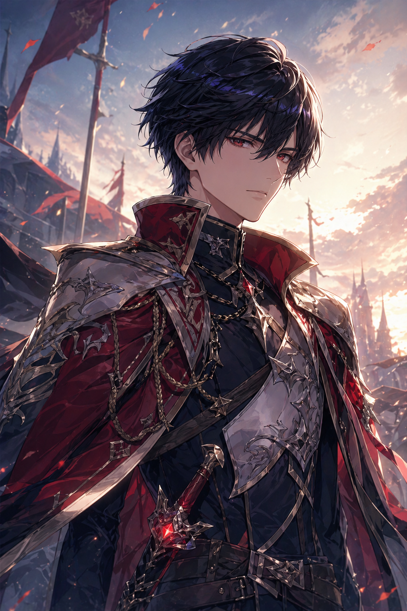

두 달 전에 [Character Forge](/posts/agentic/character-forge)라는 ComfyUI 기반 캐릭터 일러스트 생성기를 직접 만들어 썼다. 태그 입력 체계를 한 겹 감싸고, 로컬 SDXL 워크플로를 API로 묶어서, 후보를 빠르게 반복 생성할 수 있게 한 도구였다. 한 장에 1\~2분, 5\~6번 돌려서 마음에 드는 거 골랐다.

지금은 안 쓴다. 한 달 만에 내가 만든 도구를 내가 죽였다. 자리를 차지한 건 Codex CLI에서 GPT-5.5 xhigh로 호출하는 imagegen 스킬 — 그러니까 GPT Image 2다.

## 한 줄로 끝나는 워크플로

이전 흐름은 이랬다.

1. Character Forge UI 띄운다
2. 태그 조합 고른다
3. 4장 생성, 1\~2분 대기
4. 마음에 안 들면 다시 5\~6번
5. 즐겨찾기 → 후보 골라 저장

지금 흐름은 이렇다.

```bash
codex exec "에리히 후반부 일러스트 생성. 검은 머리 붉은 눈, 붉은 망토와 은빛 갑옷, 노을지는 폐허 도시 배경, 약간 멜랑콜릭하고 결의에 찬 표정"
```

끝이다. Codex가 알아서 imagegen 스킬을 잡고, 프롬프트를 세팅하고, GPT Image 2를 호출하고, 결과 파일을 프로젝트 폴더에 떨궈 놓는다. 내가 한 일은 한 줄 자연어 명령 하나.

이렇게 나왔다.



캐릭터 설정과 분위기를 던지면 거의 한 번에 나온다. 특별히 조정하고 싶은 부위가 있을 때 — "망토가 너무 무거워 보여, 좀 가볍게", "표정 더 차갑게" — 자연어로 피드백 던지면 2\~3번 안에 정리된다. Character Forge에서 5\~6번 돌리던 게 1\~3번으로 줄었다.

## "스타일을 알아듣는다"는 게 진짜다

GPT Image 2의 결정적인 장점은 **내가 원하는 스타일을 이해한다는 점**이다. 단순히 키워드 받아서 그리는 게 아니라, 피드백을 알아듣고 다음 시도에 반영한다.

- "이 캐릭터 톤은 유지하되 의상만 바꿔줘" → 얼굴 일관성 유지하면서 의상만 갈아준다
- "이 부분이 너무 만화적이야, 좀 더 일러스트풍으로" → 디테일 조정 들어간다
- "배경은 빼고 캐릭터만" → 자동 배경 제거. 게다가 머리카락이나 망토 끝처럼 알파 처리가 까다로운 부위는 **여러 제거 알고리즘을 돌려보고**, 잘못 날아간 경우 **스스로 마스킹을 다시 걸어서** 최적의 결과를 내놓는다

이게 가장 충격이었다. Character Forge에서는 "흰 배경 강제" 옵션을 넣어도 가끔 배경이 딸려 나와서 다시 돌리거나 후처리해야 했다. 지금은 "배경 제거" 한 마디면 알아서 끝낸다.

## 라이센스가 거부한 미래

같은 흐름을 픽셀 전투맵에도 써봤다. 원래는 인기 있는 픽셀 타일맵 에셋 팩을 120달러에 사려고 했다. 결제 직전에 라이센스를 다시 봤더니 이런 조항이 박혀 있었다.

> Use in works that incorporate generative AI is prohibited.

내 게임은 캐릭터 일러스트가 생성형 AI 기반이다. 즉 이 에셋을 사도 합법적으로 못 쓴다. 120달러 결제는 접고 GPT Image 2에게 맡겼다.

품질은 "쓸만하다" 정도. 상업 픽셀 에셋 팩 수준의 디테일과 일관성에는 못 미친다. 그런데 **인디 1인 개발자에게는 그 정도면 충분히 굴러간다.** 더구나 라이센스가 깨끗하다. 내 게임의 다른 부분과 충돌하지 않는다.

라이센스가 생성형 AI 작품을 막으려고 만든 조항이, 결과적으로 그 작품이 생성형 AI 에셋을 쓸 수밖에 없게 만들었다. 아이러니하지만, 이게 지금 인디 신의 현실이다.

## 비용 이야기

이게 또 하나 미친 점이다. **GPT 구독료에 포함된다.** 별도 API 비용이 안 든다.

Character Forge는 맥 미니 64GB에서 SDXL 돌리는 구조였다. 전기료와 발열은 일단 제쳐도, 모델 다운로드, ComfyUI 워크플로 관리, 가끔 깨지는 의존성 — 전부 내가 떠안아야 했다. GPT Image 2는 그 모든 인프라가 OpenAI 쪽에 있고, 나는 자연어 한 줄만 던지면 된다.

API 호출이었다면 한 장에 몇 센트씩 누적되는 게 신경 쓰였을 텐데, 그것도 아니다. 구독료 안에서 돌아간다. 1인 인디 개발자 입장에서 비용 구조가 이렇게 깔끔한 적이 없었다.

## Character Forge는 왜 죽었는가

Character Forge를 만들었을 때 핵심 통찰은 "프롬프트가 아니라 입력 체계의 문제"였다. 자유 입력 프롬프트가 아니라 태그 기반 시스템으로 반복 가능성을 확보한다는 것.

지금 보면 그 통찰이 틀린 게 아니라, **그 통찰을 모델이 자체적으로 흡수해버린 것**에 가깝다. GPT-5.5 xhigh는 이미 내 자연어 의도를 알아듣고, 일관성을 스스로 유지하고, 피드백을 다음 시도에 반영한다. 내가 태그 시스템으로 강제했던 일관성과 반복성을 모델이 자연어 안에서 해결해준다.

UI도, 태그 카탈로그도, 워크플로 JSON도 필요 없어졌다. 필요한 건 한 줄짜리 자연어 명령과 Codex CLI 하나.

## 인디 개발자에게 이게 의미하는 것

게임 리소스 외주는 비싸다. 일러스트 한 장 5\~30만원, 픽셀 타일맵 팩 100\~300달러. 1인 개발자가 모든 리소스를 사거나 외주 주는 건 현실적으로 불가능에 가깝다.

지금까지의 대안은 (a) 본인이 그리거나, (b) Stable Diffusion 류 로컬 모델로 우회하거나, (c) ChatGPT/Gemini 채팅 UI로 직접 생성하거나 이미지 API에 비용을 지불하며 쓰는 거였다. (a)는 그림 그리는 사람이 아니면 막히고, (b)는 도구 만드는 데만 한 달 걸린다 (내가 해봤다, Character Forge가 그거였다). (c) 채팅 방식은 캐릭터 일관성과 맥락을 유지하기가 어렵고, API 방식은 결국 장당 비용이 누적된다.

지금은 네 번째 길이 있다. **Codex CLI에서 한 줄 자연어로 게임 리소스를 만든다.** 캐릭터, 배경, 타일맵, UI 아이콘, 컷씬 일러스트 — 전부 같은 인터페이스에서. 게임을 만들면서 코드 짜는 흐름과 리소스 만드는 흐름이 완전히 동일한 셸 안에서 돌아간다.

진짜 미쳤다. 내가 두 달 전에 만든 도구를 한 달 만에 죽일 줄은 몰랐고, 그게 한 줄짜리 명령에 죽을 줄은 더더욱 몰랐다.
