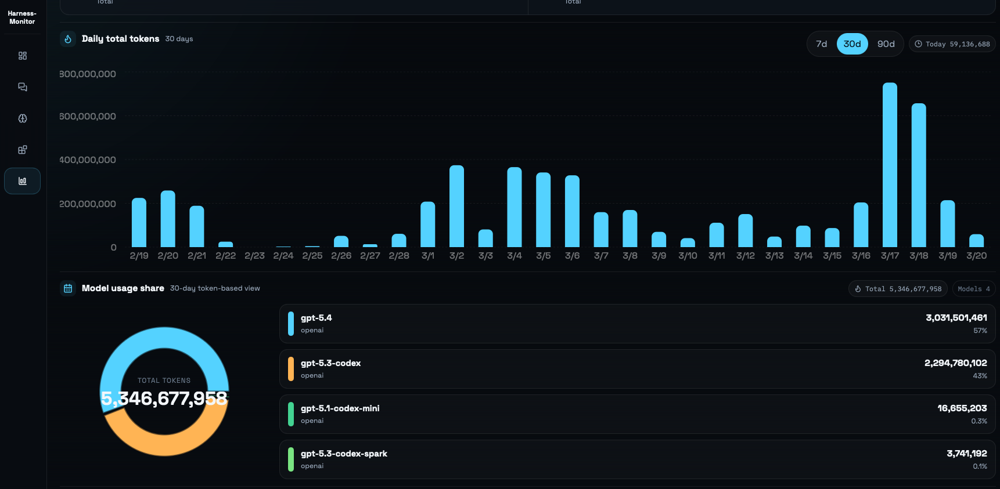
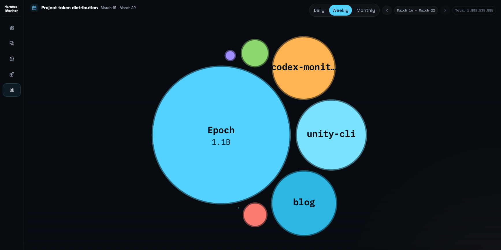
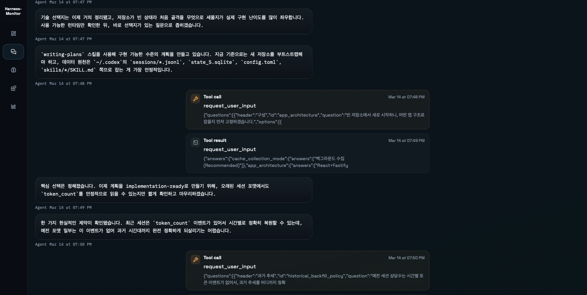
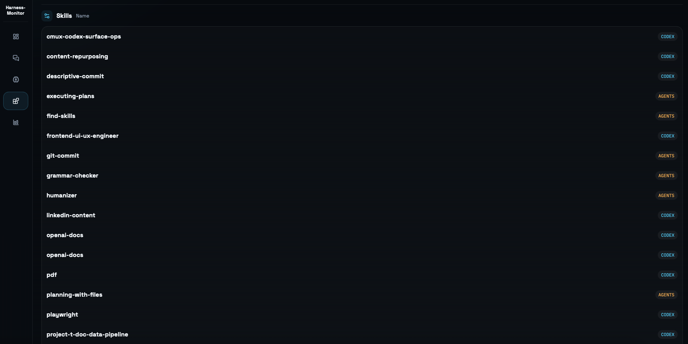

`Harness-Monitor`는 토큰 숫자 구경하려고 만든 프로젝트가 아니다. 내가 매일 쓰는 하네스가 지금 어떤 상태인지, 시간은 어디로 들어가고 있는지, 설정은 꼬이지 않았는지를 한 번에 보려고 만든 로컬 대시보다.

집에서는 Codex를 쓰고, 회사에서는 Claude Code를 쓴다. 회사에서는 이미 비슷한 걸 한 번 만들어 봤다. 집에서는 우선 Codex 기준으로 시작했지만, 이름을 `codex-monitor`로 하지 않은 이유도 여기에 있다. 다음에는 다른 하네스도 같이 붙일 생각이기 때문이다.

내가 보고 싶었던 건 단순히 `오늘 몇 토큰 썼나`가 아니었다. 어떤 프로젝트에 많이 쓰고 있는지, 세션을 어떻게 길게 끌고 가는지, skill이나 memory 설정은 꼬이지 않았는지, 결국 하네스를 잘 쓰고 있는지를 계속 보고 싶었다. 토큰 사용량은 흥미로운 숫자라기보다 그 결과에 가깝다.

## 왜 이런 걸 따로 만들었나

별거 없다. 불편해서 만들었다. 세션, 메모리, skill, MCP, hook, 토큰 이벤트가 다 로컬 어딘가에 흩어져 있는데, 그걸 매번 파일 열어서 보는 건 귀찮다. 지금 돌아가는 하네스를 이해하려면 볼 건 많은데, 한눈에 보이는 화면은 없었다.

그래서 `Harness-Monitor`는 문제 하나만 푸는 도구보다, 하네스를 계속 점검하는 계기판에 가깝다. 하네스를 오래 굴리다 보면 낭비가 줄고, 더 효율적으로 쓰게 되고, 어느 순간 구조도 조금씩 정교해진다. 나는 그 선순환을 만들고 싶었다.

## 가장 먼저 보는 화면은 토큰 페이지다

제일 자주 보는 건 토큰 페이지다. 날짜별 추세를 먼저 보고, 그다음 프로젝트별 사용량과 모델별 분포를 본다. 어느 날 많이 썼는지, 어느 날 이상하게 적게 썼는지, 요즘 어떤 프로젝트에 시간을 밀어 넣고 있는지가 여기서 바로 보인다.

토큰 추세를 보고 있으면 생각보다 감정이 많이 섞인다. 어떤 날은 `오늘 꽤 했네` 싶고, 어떤 날은 `이 정도밖에 안 썼네, 더 해야겠다`는 생각이 든다. 숫자를 보는 것 같지만, 결국 내가 하네스를 얼마나 밀고 있는지 스스로 점검하게 된다.

프로젝트별 사용량도 자주 본다. 머리로는 여러 프로젝트를 같이 보고 있다고 생각해도, 막상 숫자로 보면 어디에 대부분의 시간이 들어갔는지가 금방 드러난다.

## 세션과 설정도 같이 봐야 한다

토큰만 봐서는 하네스를 제대로 이해했다고 말하기 어렵다. 그래서 세션 페이지와 Integrations 페이지도 핵심이다.

세션 페이지에서는 프로젝트별 과거 대화를 다시 볼 수 있다. 굳이 로컬 파일을 하나씩 까 보지 않아도 되고, 예전에 어떤 문제를 어떻게 밀었는지 금방 복기할 수 있다. 오래된 세션을 다시 훑다 보면, 내가 작업을 어떤 식으로 쪼개는지나 특정 프로젝트에서 에이전트를 어떻게 굴렸는지도 같이 보인다.

Integrations 페이지는 더 직접적이다. MCP, hook, skill 상태를 한 화면에서 보게 해 두었는데, 실제로 여기서 설정이 잘못된 걸 발견하고 고친 적이 있다. 특정 skill이 agent 전용으로만 잡혀 있던 걸 이 화면을 보고 뒤늦게 알아챘다. 이런 건 그냥 열심히 쓴다고 해결되지 않는다. 결국 한 번씩 봐야 한다.

## 만들면서 배운 것도 있었다

만들다 보니 로컬 폴더 구조도 많이 익히게 됐다. 세션이 어디에 어떻게 저장되는지, skill과 memory가 어떤 파일로 남는지, `token_count` 이벤트는 어떤 식으로 쌓이는지를 직접 보게 됐다.

대부분은 그냥 Codex나 Claude를 더 잘 써보려고만 하지, 그 하네스가 실제로 어떤 식으로 돌아가는지까지 보려 하진 않는다. 물론 이 과정에서 삽질도 하고, 잘못 이해하는 것도 생길 수 있다. 그래도 누가 정리해 둔 결론만 받아먹는 것보다, 직접 만져 보면서 구조를 배우는 쪽이 남는 게 더 많았다.

Codex와 Claude Code도 이 관점에서 보면 방향 차이가 조금 보인다. 지금 내 체감으로는 Codex가 Claude Code를 쫓아가는 쪽에 가깝고, 기능은 점점 비슷해지는 것 같다. 다만 Codex는 아직 메인 에이전트가 흐름을 잡고, 서브 에이전트는 효율을 위한 보조 인력처럼 쓰는 느낌이 더 강하다. 반면 Claude는 역할별 서브 에이전트를 더 적극적으로 앞세운다. 결국 중요한 건 이름보다, 각 에이전트가 어떤 툴과 스킬을 쓸 수 있게 설계되어 있느냐인 것 같다.

## 다음에 붙일 것들

지금은 Codex만 지원한다. 다음에는 Claude Code도 같이 붙일 생각이다. 그때가 되면 `Harness-Monitor`라는 이름이 더 자연스러워질 것 같다.

그 외에도 몇 가지 생각해 둔 게 있다.

- 과거 세션을 공유하는 기능
- memory와 skill을 화면에서 바로 편집하는 기능
- 토큰 사용량 추세를 공유하는 기능

지금은 사실상 나 혼자 쓰는 도구다. 홍보도 안 했고, 굳이 남에게 보여 주려고 급하게 만들지도 않았다. 그래도 이런 류의 프로젝트는 직접 해 보는 게 중요하다고 생각한다. 이 과도기에는 `어떻게 하면 하네스를 잘 쓸까`를 스스로 고민해 보는 시간이 꽤 큰 차이를 만든다.

내가 이 프로젝트에서 가장 분명하게 확인한 건 하나다. 하네스는 한 번 세팅하고 끝나는 게 아니다. 계속 추적하고, 계속 모니터링해야 하는 대상이다.
