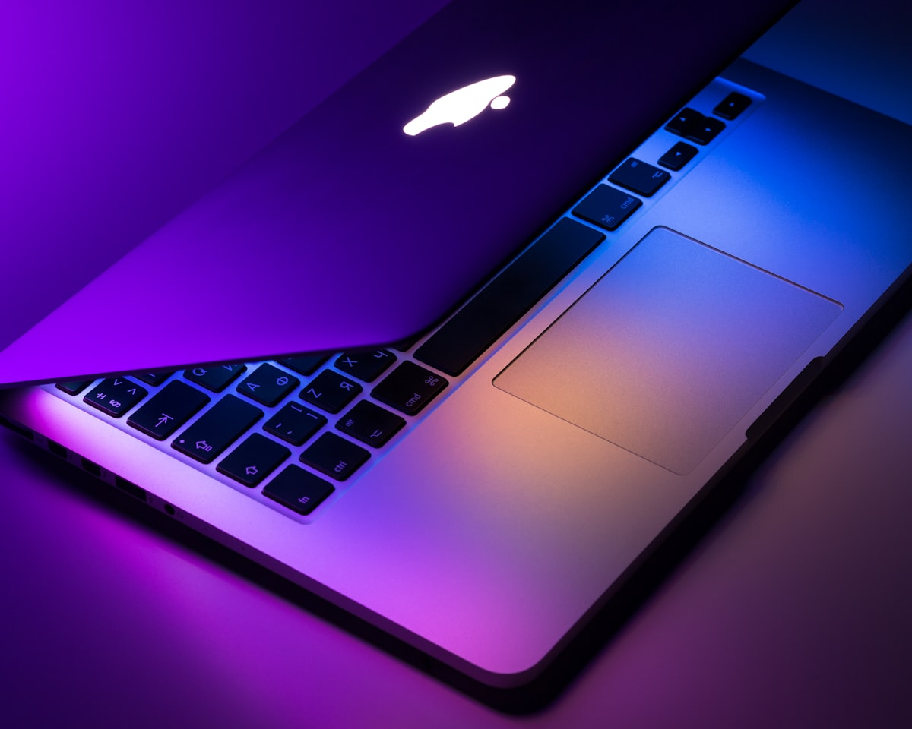

I'd been surviving on a single Mac Mini. Running SDXL while opening Unity and Rider wrecked memory. I always wanted to run LLMs locally too, but reality was tight — SDXL alone pushed things to the edge. LLMs weren't even on the table.

So I bought a MacBook Pro. M5 Pro, 48 GB. About $2,800.

Honestly, I wanted a Mac Studio. 128 GB, 256 GB — run real LLMs locally, the kind that actually matter. But that means spending thousands more, and for side projects and hobby work, the price just didn't make sense.

The reason I went with a MacBook was simpler than expected. The problem wasn't raw performance — it was that roles weren't separated. Cramming AI work and development onto one machine made both worse. One dedicated dev machine would free the Mac Mini to become an AI server.

## After buying it

The first thing I noticed was oddly physical. I can code lying down now. Development used to mean sitting at my desk. Now it works from the couch, from bed. Sounds trivial, but the pressure dropped noticeably. Less "I need to sit down and work" and more "I can just open the lid whenever." I built an automation project within three days of getting the MacBook. I'll write about that separately.

## The Mac Mini is now an AI server

With development off-loaded to the MacBook, the Mac Mini breathes easier. SDXL stays as-is, and I put Gemma 4 on it via MLX. Initially tried wiring it to a Hermes agent, but it still needs tuning so I haven't used it much. Shifting direction — planning to use it more for automation than as an agent.

Before the split, SDXL alone maxed out memory. Now SDXL and an LLM run side by side without trouble. A combination I couldn't have imagined before.

## It's about role separation

Sometimes two decent machines beat one expensive one. A 256 GB Mac Studio solving everything sounds great, but a $2,800 MacBook addition solved the actual problem. MacBook for dev, Mac Mini for AI. The setup works well for now.
