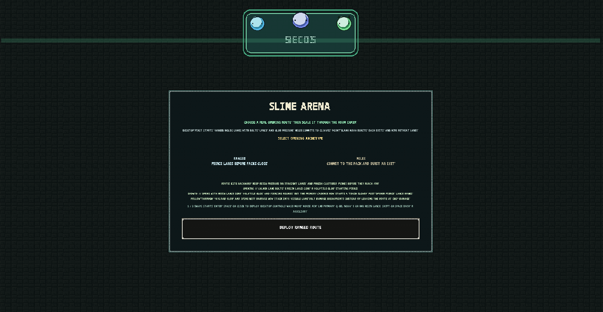
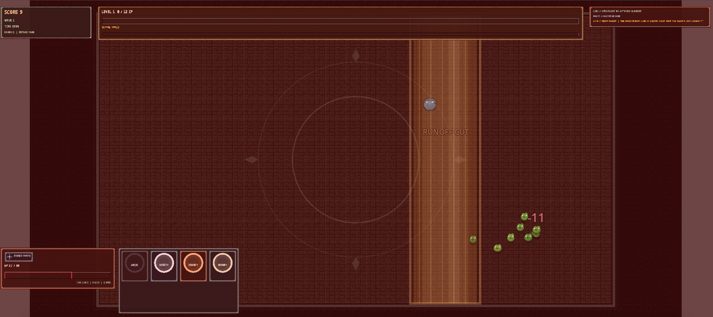
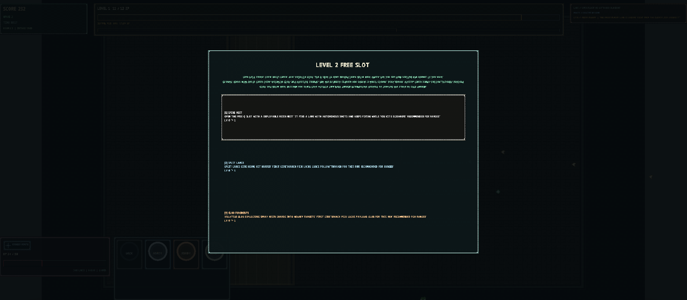
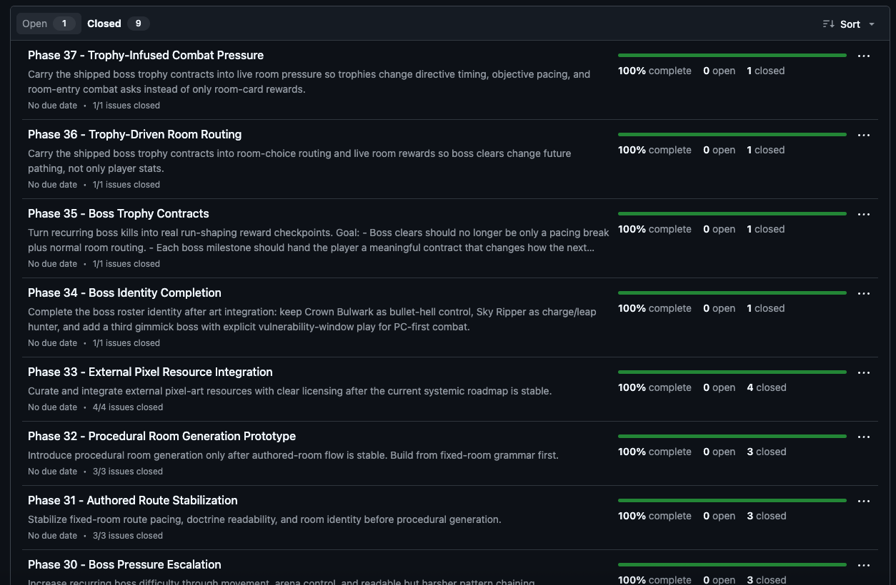
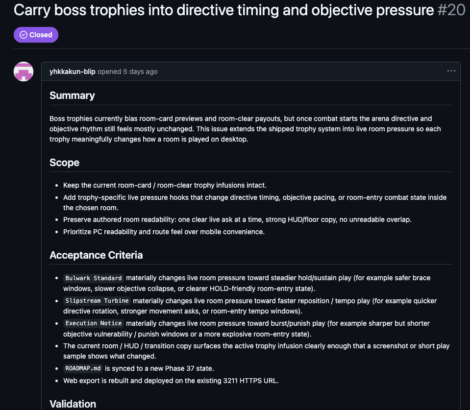

First question was simple. Not quick commands at my desk — could OpenClaw keep working after I leave? Bought a low-spec mini PC, opened all permissions, built a loop where instructions come through Telegram only.

Started with scheduling and errands. Quickly realized that wasn't the point. Real question: does development keep rolling when I'm away? Can `Telegram + OpenClaw + cron + GitHub issues/milestones` operate a real project?

No remote desktop. Minimal interface — push the next task, get results back.

The best-run case was SLIME ARENA, a Godot-based 2D action game.

## How far SLIME ARENA went

SLIME ARENA: pick melee or ranged at the start, survive waves, choose skills on each level-up. Clear all monsters per wave to advance. Bosses included. Somewhere between 2D action defense and Vampire Survivors.

Currently paused at the asset integration stage. The combat loop runs. Difficulty and balance got tweaked repeatedly — and some of it broke in the process. That part needs a human hand.

## Started with markdown, moved to GitHub

Initially, a markdown file checked every two hours for the next task. Problem: I couldn't see intermediate state. Where things stood, what was stuck, what was planned next — none of it was visible at a glance.

Changed the approach. Created a dedicated GitHub account for OpenClaw, invited it as a developer on the repo. From there, milestones and issues drove the loop. OpenClaw sets milestone goals, creates issues for needed work, closes them on completion. I playtest, reopen issues with more specific requirements if something falls short.

Key point: almost all of this ran through Telegram. Implementation orders, revision requests, reopens, priority changes — all via Telegram. GitHub served less as a place to direct development and more as a board for tracking state and recording acceptance criteria.

Issue bodies weren't just to-do notes. Each had summary, scope, and acceptance criteria upfront. After completion, comments recorded which commits handled it, what validation ran, whether redeployment happened. Milestones stacked by phase rather than clumping into one or two. What I needed wasn't "something is in progress" but "what's verified and what isn't."

## The actual operating loop

Roughly:

- I set direction and priorities from Telegram.
- OpenClaw created milestones and split work into issues.
- Issues carried summary, scope, acceptance criteria, validation.
- Cron ran every two hours, pushing to the next task.
- Completed issues closed. When I playtested and found gaps, I reopened with more specific requirements.

I acted almost entirely as director and QA. OpenClaw drove implementation. Telegram reports weren't just pass/fail — current phase, issues handled this pass, blockers, validation commands, redeployment status. What I checked wasn't code. It was state.

## Continuity from anywhere was real

Best part: development didn't stop when I left my desk. Leave a direction in Telegram, and work continues at the next checkpoint.

This pushed me into a director-and-QA role. In SLIME ARENA I never looked at code. I don't know Godot. I playtested and shared impressions. Yet the combat loop, waves, bosses, and level-up choices — the game's skeleton — went surprisingly far.

Milestones and issues also forced small judgment units. Instead of "make a game," the question was always what to verify at this stage. Combat loop, wave progression, boss fights, level-up choices, balance tuning — each ran as a separate workstream. Unlike chat logs, the history stays navigable later.

## Problems were real too

Downsides were clear. First, anywhere-access cuts both ways. I found myself checking during gym breaks. Open means convenient; open also means constant attention.

Second, keeping the cron loop stable was harder than expected. A bad prompt could leave it reporting status instead of advancing. I had to be specific about what counts as done, how to pick the next step, what to fall back to when stuck.

Third, review debt. When code advances without me reading it, deferred review piles up. SLIME ARENA was extreme — I read zero lines. If you could fully trust the AI, maybe that's fine. At this stage, the review load that lands on the human at the end is substantial.

Finally, cost and usage. I bought a dedicated mini PC with full permissions for this experiment. Running it this way burns through usage fast. I hit the full GPT Pro weekly quota and couldn't touch work that mattered more. As of March 15, 2026, the experiment is paused.

## Why the next experiment is a WebGL voxel game

After SLIME ARENA, I started a three.js WebGL voxel game. Following the Minecraft-style structure, but keeping engine and game layers sharply separated — the engine part should be reusable for the next project.

AI tooling trends feel web-native lately. I expect web-based games and web game engines to grow. Not that AAA will collapse — more like polarization intensifies at both ends. Still a hypothesis, but that's why I chose WebGL next.

## It wasn't a toy

OpenClaw through Telegram was closer to operating a remote developer than a quick off-desk tool. Proper operation means designing milestones, issues, cron rules, and acceptance criteria together. Get that right and it goes far.

Management overhead is real. Usage, review debt, constant operational attention — all part of the package. OpenClaw wasn't a toy. Without governance, it quickly outgrows what you can handle.
