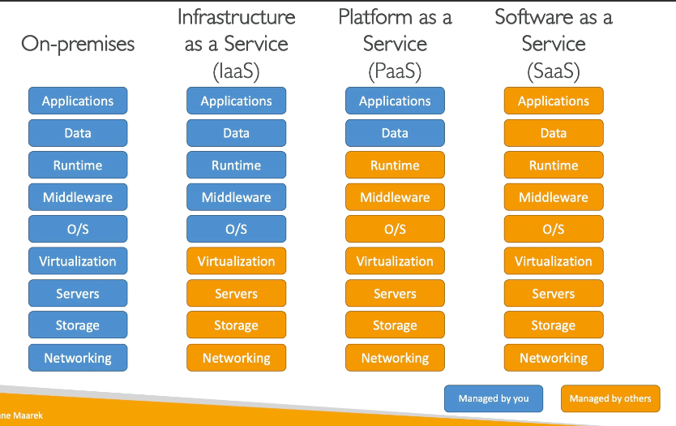

## Cloud란?
- 필요할 때마다 사용. 사용한 만큼 지불.
- Private : 민감한 애플리케이션 보안을 위해 특정 업체를 통해 제공되는 사설 서비스
- Public : 인터넷을 통해 제공되는 third-party 클라우드 서비스
- Hybrid : private (민감한 정보) + public (일부) = 유연함 & 비용 효율성

## Cloud Computing 특징
- On-demand self service : AWS 개입 없이 사용자에 의해 사용 가능
- Broad network access : 광역 네트워크를 통해 리소스 사용 가능
- Multi-tenancy and resource pooling : 공용 클라우드의 다른 사용자와 동일한 인프라, 애플리케이션을 공유하면서 보안과 프라이버시 유지 가능
- Rapid elasticity and scalability : 필요할 때 자동으로 신속하게 원하는 리소스를 획득.
- Measured service : 사용량을 측정하여 사용한 만큼 지불

## Cloud Computing 장점
- 설비 투자 비용을 운영 비용으로 교환 capital expense (CAPEX) → operational expense (OPEX)
- 규모의 경제
- 사용량에 따라 자동으로 확장하기 때문에 용량 예측 불필요
- 속도와 민첩성 향상 (필요할 때 곧바로 뭔가를 생성하고 운영한다)
- 데이터 센터를 운영, 유지 비용 없음
- 쉽게 글로벌 애플리케이션 생성

## Cloud로 해결 가능한 문제
- 융통성(Flexibility) : change resource types
- 비용 효율적(Cost-Effectiveness)
- 확장 가능성(Scalability)
- 탄력성(Elasticity) : scale out and scale in
- 고가용성과 내결함성(High-availability and fault-tolerance) : 데이터센터 필요 없음
- 민첩성(Agility) : 빠르게 개발하고 출시

## Cloud Computing의 종류

- IaaS (Infrastructure as a Service) : 서비스형 인프라
    - 네트워킹, 컴퓨터, 데이터 스토리지를 제공
    - 블록 형태로 조합하여 높은 유연성을 지님
    - Amazon EC2 (AWS)
- PaaS (Platform as a Service) : 서비스형 플랫폼
    - 기본 인프라를 관리할 필요가 없음
    - 배포와 애플리케이션 관리에만 집중
    - Elastic Neanstalk (AWS)
- SaaS (Software as a Service) : 서비스형 소프트웨어
    - 서비스 제공 업체가 완전히 운영하고 관리
    - Many AWS Services (Rekognition for Maching Learning)
    
## 가격 정책 요약
- AWS는 3가지 기준에 따라 사용한 만큼 지불한다.
- Compute : pay for compute time
- Storage : pay for data stored in the Cloud
- Data transfer OUT of the Cloud. Data transfer IN is free

---

## 리전 Regions
- 전 세계에 걸쳐 있는 데이터 센터의 집합. us-east-1, eu-west-3 …
- 대부분의 서비스들은 특정 리전에 연결되고 제한됨.
- **새로운 애플리케이션을 출시할 때 어느 리전을 사용하는게 좋을까?**
    - **각 국가의 법률 준수 : 예) 프랑스의 데이터는 프랑스 내에 있어야 한다.**
    - **지연 시간 : 대부분의 사용자가 미국에 있다면 미국 리전 사용**
    - **특정 서비스를 활용 중이라면 해당 서비스를 제공하는 리전을 사용해야 함.**
    - **요금 : 리전마다 요금이 다름. 서비스 요금 페이지 참고.**

## 가용 영역 Availability Zones
- 리전은 많은 가용 영역을 가지고 있음 (대부분 3, 최소 2, 최대 6)
- **가용영역은 하나 또는 두 개의 개별적인 데이터 센터로 이루어져 있음. 재난 상황 대비.**

## 엣지 로케이션 Edge Location
- 전송 지점. 최소 지연 시간으로 컨텐츠 전송이 가능.