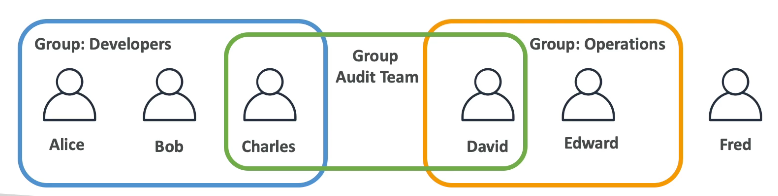
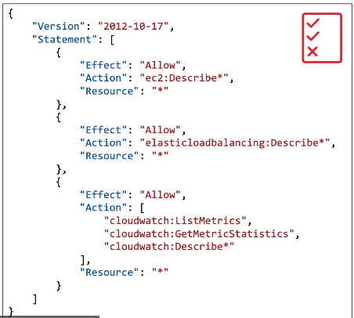
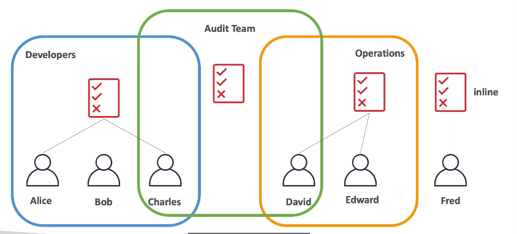
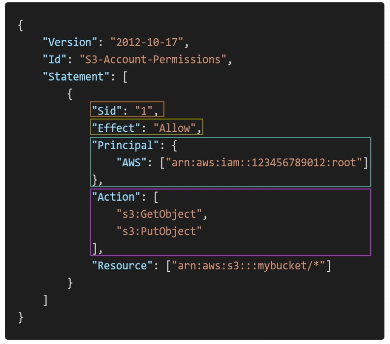

# Users & Groups

- Identity and Access Management.
- Root 계정은 기본적으로 생성되고 오직 계정을 생성할 때만 사용되어야 함.
- Users : 하나의 사용자는 조직 내의 한 사람에 해당한다. 사용자들을 그룹으로 묶을 수 있다.
- Groups : 그룹에는 사용자만 배치할 수 있고 다른 그룹을 포함시킬 순 없다.
- 그룹에 포함되지 않은 사용자도 존재 가능하다.
- 한 사용자가 여러 그룹에 존재할 수 있다.

## Permissions

- 사용자나 그룹은 정책이라 불리는 JSON 문서에 지정 가능하다.
- 특정 사용자, 그룹이 어떤 작업에 권한을 가지고 있는지 설명해 놓은 것.
- 이 정책들을 사용해 사용자의 권한을 정의할 수 있음.
- 최소 권한의 원칙 : 사용자가 꼭 필요로 하는 것 이상의 권한을 주지 않는다.

## Policies

- 그룹, 사용자 단위로 정책 지정 가능

- 구성
    - Version : “2012-10-17”
    - Id : 정책을 식별하는 ID (선택사항)
    - Statement : 하나 또는 그 이상의 설명서 (필수)
        - Sid : 설명서 식별 ID (선택사항)
        - Effect : 허용Allow 또는 거부Deny
        - Principal : 특정 정책이 적용될 account / user / role
        - Action : effect에 기반해 허용 또는 거부되는 API 리스트
        - Resources : 적용될 action의 리소스 리스트
        - Condition : Statement가 언제 적용될 지 조건

## Password Policy
- AWS에서 사용 가능한 비밀번호 정책
    - 최소 비밀번호 길이
    - 특정 유형의 글자 사용 요구 : 대문자, 소문자, 숫자, 특수문자
    - IAM 사용자의 비밀번호 변경을 허용 또는 금지
    - 일정 시간이 지나면 새 비밀번호 설정 요구
    - 비밀번호 재사용 금지

## Multi Factor Authentication - MFA
- 다중 인증. AWS에서는 필수적으로 사용하도록 권장.
- 관리자 유저는 구성을 변경하거나 리소스를 제거할 수 있음.
- 루트 계정과 IAM 사용자들은 무슨 일이 있어도 반드시 보호해야 함.
- MFA = 비밀번호 + 보안장치
- 비밀번호가 누출된 상황이라고 해도 해커에게는 보안장치가 없어 계정을 지킬 수 있음
- 보안장치의 종류
    - Virtual MFA device
        - Google Authenticator,  Authy
        - 한 디바이스에서 여러 토큰을 지원함. 여러 계정을 세팅 가능
    - Universal 2nd Factor (U2F) Security Key
        - 물리적 디바이스 (USB처럼 생김)
        - YubiKey
        - 한 디바이스에서 여러 계정을 지원함.
    - Hardware Key Fob MFA Device
        - Gemalto
    - Hardware Key Fob MFA Device For AWS GovCloud (US)
        - SurePassID

---

## IAM Roles for Services
- 몇몇 AWS 서비스는 우리 계정에서 실행해야 함. 그 과정에서 AWS 서비스에게 권한 부여가 필요함. 이 권한을 IAM Roles를 통해 부여함.
- EC2 인스턴스가 특정 AWS에 접근하려고 할 때 필요한 권한을 IAM Role을 통해 부여
- 일반적인 roles
    - EC2 Instance Roles
    - Lambda Function Roles
    - Roles for CloudFormation
    

## IAM Security Tools
- IAM 자격 증명 보고서 (IAM Credentials Report) - account level
    - 계정에 있는 사용자와 다양한 자격 증명의 상태를 포함.
- IAM 액세스 분석기 (IAM Access Advisor) - user level
    - 사용자에게 부여된 서비스의 권한과 해당 서비스에 마지막으로 액세스한 시간이 보임.
    - 해당 도구를 사용하여 어떤 권한이 사용되지 않는지 볼 수 있음.
    

## IAM Guidelines & Best Practices
- 루트 계정은 AWS 계정을 설정할 때를 제외하고 사용하지 않는다.
- 하나의 AWS 사용자는 한 명의 실제 사용자를 의미한다.
- 사용자를 그룹에 넣어 해당 그룹에 권한을 부여할 수 있다. 그룹 수준에서 보안을 관리할 수 있다.
- 비밀번호 정책을 강력하게 만들어야 한다.
- 다요소인증 (MFA)를 사용할 수 있다면 해커들로부터 계정을 지킬 수 있다.
- AWS서비스에 권한을 부여할 때마다 역할을 만들고 사용해야 한다.
- CLI나 SDK를 사용할 때 AccessKey를 사용한다.
- 계정 권한을 검사할 땐 IAM 자격 증명 보고서와 IAM 액세스 분석기를 사용.
- IAM 사용자와 AccessKey를 절대 공유하지 마라.

---

## AWS와 사용자의 책임 구분
- AWS
    - 인프라 (글로벌 네트워크 보안)
    - Configuration과 취약성 분석 서비스
    - 책임 사항 준수
- 사용자 (You)
    - Users, Groups, Roles, Policies 관리와 모니터링
    - 모든 계정에서 MFA 활성화
    - 키를 자주 교체하는 것
    - IAM 툴을 사용하여 적합한 권한을 적용했는지 확인
    - 액세스 패턴을 분석하고 권한 검토