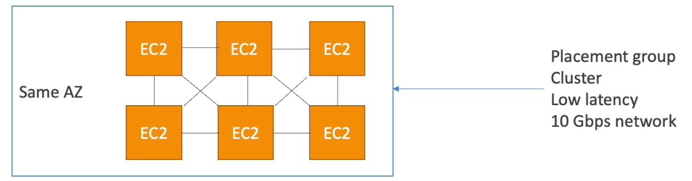
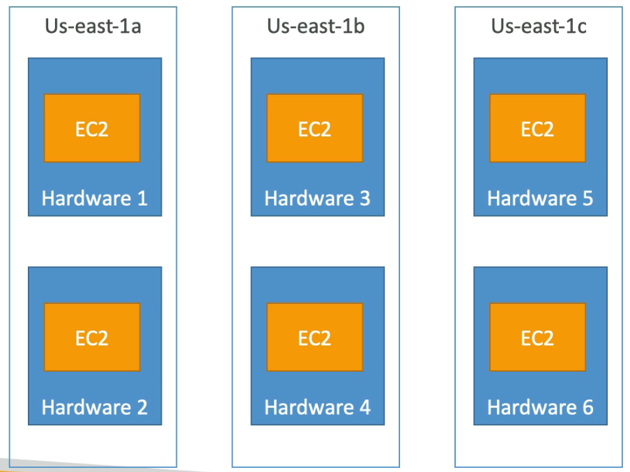
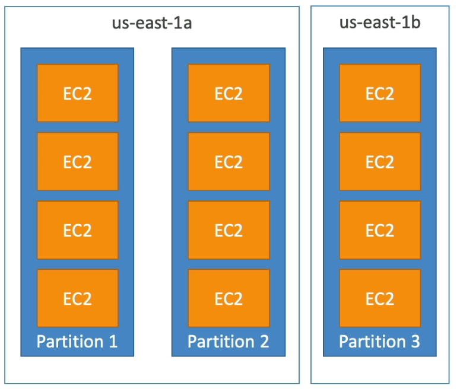

# EC2
- EC2 = Elastic Compute Cloud = **Infrastructure as a Service (IaaS)**
- 주요 구성
    - 가상 머신 임대 (EC2)
    - 데이터를 가상 드라이브에 저장 (EBS)
    - 로드 분산 (ELB - 일래스틱 로드 밸런서)
    - 오토 스케일링 그룹으로 서비스 확장 (ASG)
- EC2 사용 방법을 아는 것은 클라우드 작동 방식을 이해할 때 필수적

### EC2 User Data
- EC2 User data 스크립트를 사용하여 인스턴스를 부트스트래핑 할 수 있다.
- 부트스트래핑이란, 머신이 작동될 때 명령을 시작하는 것.
- 이 스크립트는 처음 시작할 때 한 번만 실행된다.
- 부팅 작업을 자동화한다.
    - 업데이트 설치
    - 소프트웨어 설치
    - 인터넷에서 일반적인 파일 다운로드 등.
- 스크립트는 루트 계정에서 실행한다. 모든 명령문은 sudo로 해야 한다.

### EC2 Instance Type

[컴퓨팅 - Amazon EC2 인스턴스 유형 - AWS](https://aws.amazon.com/ko/ec2/instance-types/)

[Amazon EC2 Instance Comparison](http://instances.vantage.sh/)

- AWS 명명 규칙
    - m5.2xlarge
        - m : 인스턴스 클래스
        - 5 : 세대 (AWS는 계속 하드웨어를 개선한다)
        - 2xlarge : 인스턴스 클래스 내에서의 크기. 클 수록 더 많은 메모리, CPU를 가짐.
- 범용 인스턴스
    - 웹서버나 코드 저장소 같은 다양한 작업에 적합하다.
    - 컴퓨팅, 메모리, 네트워킹 밸런스도 잘 맞음.
- 컴퓨팅 최적화 인스턴스 (C)
    - 고성능 프로세서를 요구하는 컴퓨팅 집약적 작업에 최적화된 인스턴스
        - 일부 데이터의 일괄 처리
        - 미디어 트랜스 코딩
        - 고성능 웹서버
        - 고성능 컴퓨팅 (HPC)
        - 머신러닝
        - 전용 게임 서버
- 메모리 최적화 인스턴스 (R, X, Z..)
    - 메모리에서 대규모 데이터셋을 처리하는 유형의 작업
        - 고성능 관계형, 비관계형 데이터베이스
        - 일래스틱 캐시 같은 분산 웹 스케일 캐시 저장소
        - 비즈니스 인텔리전스 (BI)에 최적화된 인 메모리 데이터베이스
        - 대규모 비정형 데이터의 실시간 처리를 실행하는 애플리케이션
- 스토리지 최적화 인스턴스 (I, G, H1)
    - 로컬 스토리지의 대규모 데이터를 액세스할 때 적합한 인스턴스
        - 고주파 온라인 트랜잭션 처리 (OLTP) 시스템
        - 관계형, NoSQL 데이터베이스
        - Redis 같은 메모리 데이터 베이스의 캐시
        - 데이터 웨어하우징 애플리케이션
        - 분산 파일 시스템

---

## 온디멘드 On Demand
- **사용한 만큼 비용 청구 (Linux - 초당 기준. 최소 60초)**
- 연속적인 단기 워크로드에 적합. 애플리케이션의 동작을 예측할 수 없는 워크로드.

## 예약 인스턴스 Reserved Instances
- 온디멘드에 비해 비용이 약 70% 저렴.
- 예약 기간 : 1년(+) or 3년 (+++)
- 애플리케이션이 안정된 상태로 사용되는 데이터베이스에 적합

## 세이빙 플랜 Savings Plans
- 장기 사용에 따라 할인 (약 70%)
- 시간당 10달러의 비용 청구. 1년 or 3년 약정
- 초과 용량은 온디맨드 가격으로 청구
- 특정 인스턴스 제품군과 유형에 한해 사용 가능

## 스팟 인스턴스 Spot Instances
- **온디멘드에 비해 90% 저렴, 가장 비용 효율적.**
- 서비스가 중단되어도 복구하기 쉬운 워크로드 적합.
    - 배치작업, 데이터분석, 이미지처리, 분산된 워크로드, 시작 종료 시점이 유동적인 워크로드
    - 중요한 작업이나 데이터베이스에는 적합하지 않음.

## Dedicated Hosts
- 사용 목적에 맞춘 EC2 인스턴스 용량을 가진 물리적 서버. 가장 비쌈.
- 규정 준수 요구 사항이 있거나 기존의 서버 결합 소프트웨어 라이선스를 사용해야 하는 경우에 적합.
- 구매 옵션
    - On-demand : 초당 청구
    - Reserved : 1년 혹은 3년 예약

## Dedicated Instances
- 전용 하드웨어에서 실행되는 인스턴스이며, 물리적 서버와는 다름.
- 같은 계정의 다른 인스턴스와 하드웨어를 공유하기도 함.
- 인스턴스 배치를 제어할 수 없음.
- 전용 호스트 vs 전용 인스턴스
    - 전용 인스턴스는 사용자의 하드웨어에 설치되어 고유한 인스턴스를 갖는 것
    - 전용 호스트는 물리적 서버 자체에 액세스하여 저수준 하드웨어에 대한 가시성 제공

## 용량 예약
- 원하는 기간동안 특정한 가용 영역에 온디멘드 인스턴스를 예약
- 시간 약정이 없기 때문에 언제든지 용량을 예약하거나 취소 가능
- 인스턴스 실행 여부와 상관없이 온디맨드 요금이 청구됨.
- 특정 AZ에 위치하는 단기의 연속적인 워크로드에 적합.

---

## 보안 그룹
- 보안 그룹은 AWS에서 네트워크 보안을 실행하는 핵심
- EC2 인스턴스에 들어오고 나가는 트래픽을 제어한다.
- 허용 규칙만 포함한다.
- IP 주소를 참조해 규칙을 만들 수 있다.
- 즉, 보안 그룹은 EC2 인스턴스의 방화벽이다.
    - 포트로 들어오는 액세스를 통제한다.
    - 인증된 IP 주소의 범위를 확인한다. (ipv4, ipv6)
    - 인스턴스로 들어오는 인바운드 네트워크를 통제한다.
    - 인스턴스에서 나가는 아웃바운드 네트워크도 통제한다.

- 보안 그룹은 여러 인스턴스에 연결할 수 있다.
- 지역과 VPC 결합으로 통제되어 있다. 지역을 전환하면 새로운 보안 그룹을 만들거나 다른 VPC를 생성해야 한다.
- 보안 그룹은 EC2 외부에 있다. 트래픽이 차단되면 EC2 인스턴스는 확인할 수 없다.
- SSH 액세스를 위해 하나의 별도 보안 그룹을 유지하는 것이 좋다.
- 타임아웃으로 애플리케이션에 접근할 수 없으면 보안 그룹의 문제다.
- 연결 거부 오류가 발생하면 보안 그룹은 실행되어 트래픽을 통과했지만 애플리케이션에 문제가 생긴 것이다.
- 기본적으로 모든 인바운드 트래픽은 차단되어 있고 아웃바운드 트래픽은 허용된다.

## 클래식 포트
- 22 = SSH (Secure Shell) : 리눅스 인스턴스에 로그인
- 21 = FTP : 파일 업로드
- 22 = SFTP : ssh를 이용하여 파일 업로드. 보안 파일 전송 프로토콜
- 80 = HTTP : 보안되지 않은 사이트에 액세스
- 443 = HTTPS : 보안 사이트에 액세스
- 3389 = RDP : 원격 데스크톱 프로토콜. 윈도우 인스턴스에 로그인

---

## IPv4
- Public IPv4 - 인터넷에서 사용 가능함
    - EC2 인스턴스를 새로 만들거나, 중지후 재시작을 하면 새로운 공용 IPv4를 얻게 된다.
- Private IPv4 - 사용자의 자체 네트워크 내에서 사용할 수 있는 내부 IP (192.168.1.1)
    - EC2 인스턴스 생명 주기에 따라 고정되어 있음. 중지 후 재시작해도 고정임.
- 탄력적(Elastic) IP
    - EC2 인스턴스에 공용 IPv4 주소를 고정시킨다. 비용이 든다.
    - 인스턴스를 연결하지 않거나 인스턴스가 중지되었더라도 비용을 내야 함.
    - 가급적 사용하지 말 것.

## IPv6 
- 모든 IP는 public이다. private 없음.
- 에) 2001:db8:3333:4444:cccc:dddd:eeee:ffff

---

## Placement Group 종류
- Cluster
- Spread
- Partition

## Cluster

- 모든 EC2 인스턴스가 동일한 AZ에 있다
- 모든 인스턴스 간에 초당 약 10기가비트의 대역폭을 확보하여 향상된 네트워킹을 활성화 할 수 있다.
    - 지연 시간이 짧고 처리량이 많은 네트워크를 확보.
- 가용 영역에 장애가 발생하면 모든 인스턴스가 동시에 장애를 일으킨다.
- 매우 빠른 네트워킹으로 매우 빠르게 완료해야 하는 작업에 적합.

## Spread

- 인스턴스를 분산하여 실패 위험을 최소화.
- 모든 EC2 인스턴스가 다른 하드웨어에 위치함.
    - 동시 실패의 위험이 감소한다.
- AZ당 7개의 인스턴스로 제한이 된다 = 배치 그룹의 규모에 제한이 있음.
- 가용성을 극대화하고 위험을 줄여야 하는 애플리케이션에 적합.

## Partition

- AZ 내에서 여러 파티션(서로 다른 랙 세트에 의존함)에 인스턴스를 분산.
- 그룹당 100개의 EC2 인스턴스, AZ당 최대 7개의 파티션.
- 파티션이 많으면 인스턴스가 여러 하드웨어 랙에 분산되어 서로 실패로부터 안전.
- 인스턴스와 파티션은 다른 파티션의 인스턴스와 동일한 하드웨어 물리적 랙을 공유하지 않음 = 각 파티션은 실패로부터 격리됨.
    - 파티션이 하나가 다운되어도 다른 파티션은 정상
- 파티션들 전반에 걸쳐 데이터와 서버를 퍼뜨려 두고 파티션 인식이 가능한 애플리케이션
    - HDFS, HBase, Cassandra, Apache Kafka