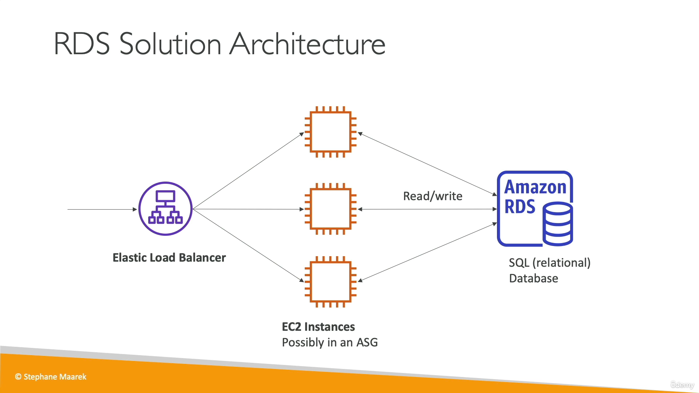

## RDS

- RDS = Relational Database Service
- 관계형 데이터베이스를 위한 서비스
    - Postgres
    - MySQL
    - MariaDB
    - Oracle
    - Microsoft SQL Server
    - Aurora (AWS거)
- 자동 프로비저닝, OS 패치
- 지정 시간 복구가 가능하도록 지속적인 백업, 복원 옵션 존재
- 모니터링 대시보드
- 읽기 전용 복제본을 생성하여 읽기 퍼포먼스 향상
- 다중 AZ로 재해 복구 계획 수립
- 업그레이드에 대한 유지보수 설정
- 수직, 수평 스케일링
- gp2, io1 볼륨 EBS로 구현

## RDS 읽기 전용 복제본
- 데이터베이스의 복제본이 생기고, 애플리케이션이 복제본으로부터 읽기 작업을 할 수 있음
- 읽기 권한을 여러 RDS에 분산시키게 된다. 최대 5개.
- 쓰기 작업은 오직 메인 데이터베이스에서만 이루어진다.

## 다중 AZ
- AZ 운영정지 같은 장애가 발생했을 때 유용하게 쓰임. (높은 가용성)
- 장애가 생겨서 메인 RDS가 멈추면 장애조치가 트리거되고, 애플리케이션은 복제된 개발자 데이터베이스에서 장애조치를 실시함.
- 메인 데이터베이스에서만 읽고 쓸 수 있으며 장애 조치 DB는 수동적 DB로, 메인 데이터베이스에 문제가 생겼을 때만 접근 가능.
- 하나의 AZ만 장애 조치 AZ로 설정 가능.

## 다중 리전
- 읽기 전용 복제본을 여러 리전에 두는 것.
- 각 리전마다 read 가능하지만, write는 메인 RDS에 해야함. 리전간 쓰기 작업 수행.
- 한 리전에 문제가 생겼을 때를 대비한 재해 복구 전략이 필요하기 때문에 사용.
- Read할 때는 각 리전에서 하기 때문에 지연 시간이 짧다는 장점.
- 복제할 때 리전간 네트워크 전송 비용이 든다.

---

## Amazon Aurora
- AWS에서 만든 데이터베이스. 오픈 소스가 아님
- PostgreSQL와 MySQL을 지원함
- 클라우드에 최적화되어 RDS의 MySQL보다 5배, Postgres보다 3배 향상된 성능
- 스토리지가 자동으로 10GB~128TB까지 증가함
- RDS보다 20%정도 비싸지만 더 효율적임
- 프리티어에 없음

## 가용성, 읽기 스케일링링

## Aurora DB Cluster

## Aurora 고급 개념

---

## RDS & Aurora

## RDS Proxy

---

## ElastiCache

- ElastiCache를 이용하여 관리형 Redis나 Memcached를 사용.
- 캐시는 높은 성능과 짧은 지연시간을 자랑하는 인메모리 데이터베이스.
- 읽기 집중적인 워크로드의 데이터베이스로부터 워크로드를 줄일 때 용이함.
- RDS에서 항상 동일한 쿼리를 수행하면 부하가 생기는데 이럴 때 캐시를 활용
- 관리형 데이터베이스이므로 AWS가 모든 운영체제 유지 보수와 패치, 최적화, 구성, 모니터링을 책임짐.

## Memcached

---
<!-- 
## DynamoDB
- 완전 관리형 고가용성 데이터베이스
- 세 개의 가용영역에 걸쳐 복제본을 두고 운영됨.
- NoSQL
- 막대한 작업량 소화 가능, 분산된 **서버리스** 데이터베이스. 서버에 프로비저닝할 필요가 없다.
- 초당 수백만 건의 요청, 조 단위가 넘는 행, 수백 테라바이트 스토리지까지 확장해도 신속하고 한결같은 성능
- **검색 지연 시간이 한 자리수 밀리초**인 성능을 필요로 할 때 적합한 데이터베이스
- 보안, 인증, 관리상 IAM과 통합되어 있음
- 비용이 적고 오토 스케일링 기능 갖추고 있다.
- 비용 절감을 위해 데이터를 분류하는 방식에 따른 Standard & Infrequent Access (IA) 테이블 클래스가 있다.
- key / value 데이터베이스

### DynamoDB Accelerator - DAX

- DynamoDB를 위한 완전 관리형 인메모리 캐시
- DynamoDB 전용. ElastiCache를 사용할 필요는 없다. 성능이 열 배는 향상된다. 마이크로초 지연 시간.
- 보안 완벽, 확장성과 가용성 모두 높다.

### DynamoDB Global Tables

- 짧은 지연시간으로 DynamoDB 테이블에 액세스 할 수 있도록 하는 기능. 여러 리전에서 가능하다.
- Active-Active 복제 (여러 리전에서 read/write가 가능함) -->