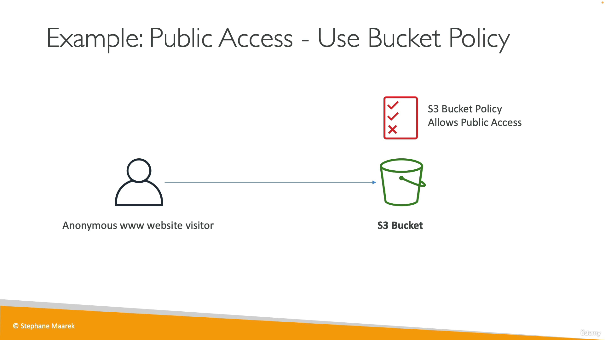
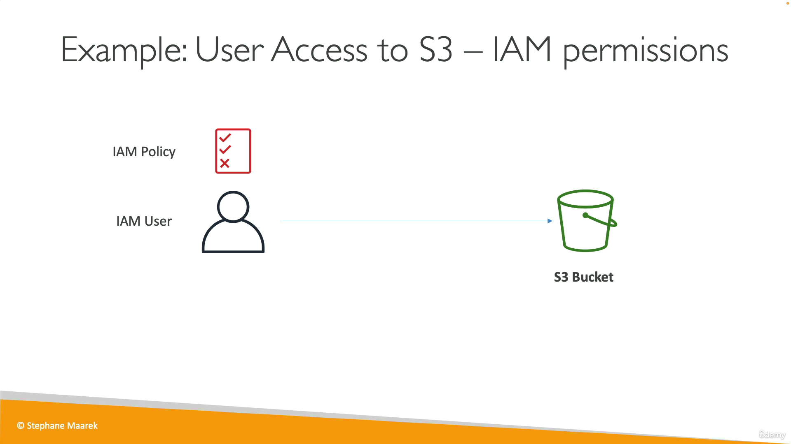
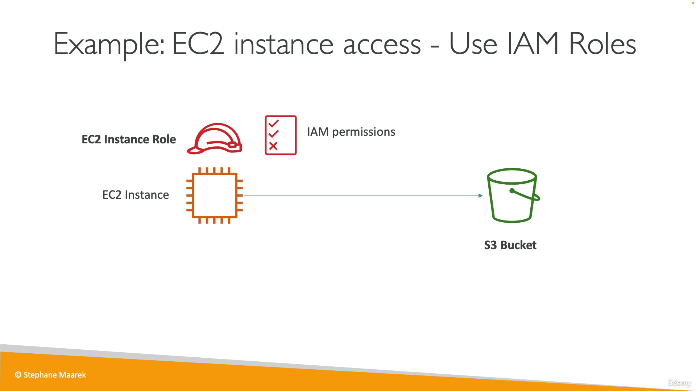
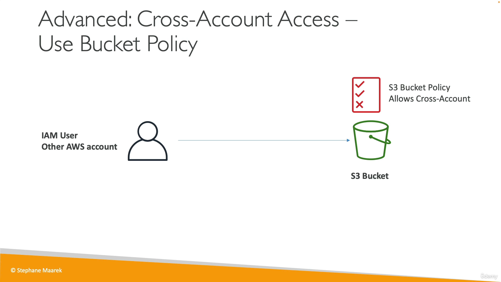
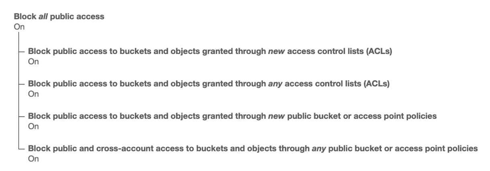
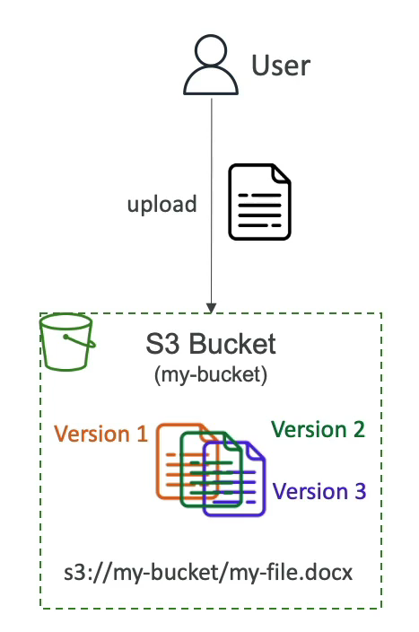
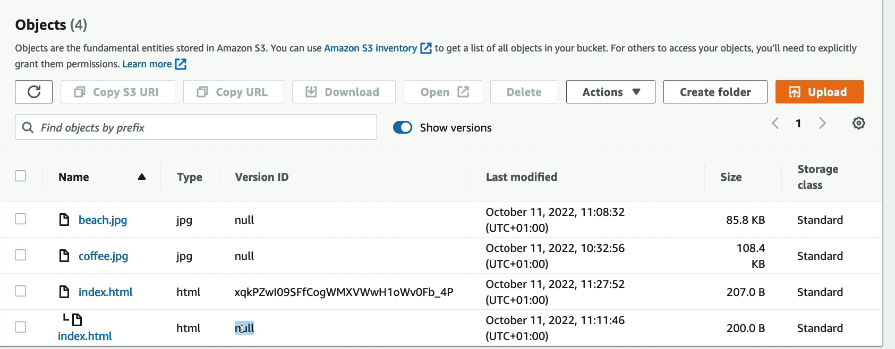
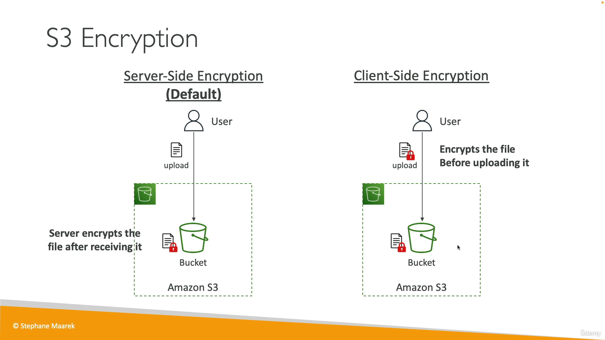

## S3
- AWS에서는 무한 확장 스토리지로 광고함
- 많은 사이트들이 S3를 backbone으로 사용함.
- 많은 AWS 서비스들이 S3를 통합하여 사용함.

## 사용 사례
- 백업과 스토리지
- 재해 복구
- 아카이브
- 하이브리드 클라우드 스토리지
- 애플리케이션 호스팅
- 미디어 호스팅
- 데이터 레이크 & 빅데이터 분석
- 소프트웨어 배포
- 정적 웹사이트

## 버킷
- 아마존은 객체(file)를 버킷(directory)이라는 곳에 저장함.
- 버킷은 전역적으로 고유한 이름을 가져야 함. (모든 리전과 모든 계정에 대해)
- 버킷은 리전 수준에서 정의됨. S3는 글로벌 서비스처럼 보이지만 특정 리전에서 생성됨.
- 명명 규칙
    - 대문자, 밑줄 문자 금지
    - 3~63자 사이
    - IP가 아니여야 함
    - 소문자나 숫자로 시작

## 객체
- 객체를 저장할 때는 **키**가 필요함. 키는 객체의 전체 경로를 나타냄
    - s3://my-bucket/**`my_file.txt`**
    - s3://my-bucket/**`my_folder1/another_folder/my_file.txt`**
- 키는 ***접두사***와 **객체 이름**으로 구성됨.
    - s3://my-bucket/**`my_folder1`/`another_folder/my_file.txt`**
- 실제로 버킷에는 디렉토리라는 개념은 없음. 슬래시(/)는 그냥 이름임.
- 객체 구성
    - 값은 어떤 것이든 담을 수 있음. 최대 크기 5TB.
        - 5GB 이상을 업로드할 때는 multi-part 업로드를 해야함.
    - 메타데이터 (key value pair)
    - 태그(Unicode key value pair) - 보안이나 생명주기 등 태그 지정.
    - 버전ID

---

## S3 보안
- 사용자 기반
    - IAM 정책으로 S3 버킷에 액세스 하도록 세팅.
- 리소스 기반
    - 버킷 정책 - S3 콘솔에서 버킷 룰 지정. 접근 허용 거절.
    - Object Access Control List (ACL) - 객체 수준에서 누가 무엇을 하는지 상세하게 정의
    - Bucket Access Control List - 일반적인 방법은 아님. 시험에서는 제일 중요.
- IAM은 언제 S3 객체에 접근 가능한가?
    - S3 접근에 대한 IAM 권한이 허용된 유저이거나, S3 버킷이 접근을 허용한 경우.
    - 통합 정책에는 명시적 거부가 없음.
- 암호화로 객체를 암호화하여 보안.

## S3 버킷 정책
- S3 버킷 정책으로 버킷에 관한 공용 액세스 권한 부여 가능.

```bash
{
	"Version": "2012-10-17",
	"Statement": [
		{
			"Sid":"PublicRead",
			"Effect":"Allow",
			"Principal":"*",
			"Action":[
				"s3:GetObject"
			],
			"Resource":[
				"anr:aws:s3:::examplebucket/*"
			]
		}
	]
}
```



- 예제 1) public 접근을 모두 허용하는 S3 버켓 정책이 적용되어 있으면 익명의 유저도 S3 버켓을 접근할 수 있다.



- 예제 2) IAM 정책으로 권한을 부여받은 IAM 사용자가 S3 버켓에 접근할 수 있다.



- 예제 3) EC2 인스턴스 롤과 IAM 권한을 부여받은 EC2 인스턴스가 S3 버켓에 접근할 수 있다.



- 예제 4) 다른 계정에 있는 IAM 사용자가 있고 S3 버킷 정책에 해당 계정에게 권한을 허용한다고 정의되어 있다면, 그 유저는 S3 버켓에 접근할 수 있다. (API 등을 통해)

## Public 접근 block 버킷 설정

- 권한 → 퍼블릭 액세스 차단 (버킷 설정)



- S3 버킷 정책에 Public Access를 허용해도 이 설정이 활성화되어 있다면 버킷은 절대 Public에서 접근할 수 없다.
- 데이터 유출을 막기 위해 사용. 실수를 보호해준다.
- account level에서도 설정할 수 있다.

---

## 버전관리 (Versioning)


- Amazon S3 파일 버전을 관리할 수 있음
- 버킷 레벨에서 활성화됨.
- 같은 키를 업데이트할 때마다 새로운 버전을 얻게 됨
- 버킷 버전 관리 사례
    - 의도하지 않은 삭제를 방지 (복원)
    - 파일이 잘못된 경우 이전 버전으로 롤백
- 버전 관리를 활성화하기 전에 버전 관리되지 않는 모든 파일은 버전이 null임
- 버전 관리를 중단하고 이전 버전을 삭제하지 않으면 S3 버킷에 계속 남아 있음



- Versioning을 활성화한 후 Show versions 토글하여 버전 상황을 볼 수 있음
- Version ID가 null인 것은 Versioning 활성화 전에 업로드된 파일.
- 어떤 파일의 최신 버전을 제거해서 이전 버전으로 되돌리는 것이 가능하다.
- 어떤 파일 자체가 삭제될 때는 삭제 마커가 추가되고, 삭제 마커를 제거하면 파일이 다시 복구된다.

## Replication (CRR & SRR)

- 모든 파일이 한 버킷에서 다른 버킷으로 복제되는 것
    - ex) eu-west-1 → us-east-1
- 소스와 대상 버킷에서 Versioning을 활성화 해야 함.
- 다른 두 리전간의 복제 : Cross Region Replication (CRR)
- 동일 리전간의 복제 : Same Region Replication (SRR)
- 버킷은 서로 다른 계정이어도 가능.
- 복제는 비동기식.
- S3로 복제할 수 있는 적합한 IAM 권한을 부여해야 함.
- 사용 사례
    - CRR : 규정 준수, 짧은 지연시간 액세스, 다른 계정간의 복제
    - SRR : 로그 집계, 프로덕션 계정과 테스트 계정간의 실시간 복제

---

## S3 스토리지 클래스
### 내구성(Durability) and 가용성(Availability)

- 내구성
    - Amazon S3로 인해 객체가 손실될 수 있는 확률
    - S3는 내구성이 아주 높음. 99.999999999%
    - 객체 천만개를 저장했을 때, 1만년에 한번 손실되는 확률.
    - 모든 스토리지 클래스의 내구성은 동일함
- 가용성
    - 얼마나 쉽게 서비스를 이용할 수 있는지.
    - 스토리지 클래스마다 다르다.
    - 예) S3 Standard 가용성은 99.99% = 1년에 53분동안 서비스 이용 불가

### Standard - General Purpose

- 99.99% 가용성
- 자주 액세스하는 데이터용. 기본값
- 지연시간이 짧고 처리량이 높음
- 두곳에서 발생하는 동시 기능 장애를 감당할 수 있음
- 빅데이터 분석과 모바일, 게임 애플리케이션, 컨텐츠 배포 등에 사용

### Infrequent Access (IA)

- 자주 액세스하지 않지만 필요할 때 빠르게 액세스 해야 하는 데이터에 적합
- S3 Standard 보다 요금이 저렴하지만 검색 요금이 발생함
- **Standard - Infrequent Access (IA)**
    - 99.9% 낮은 가용성
    - 재해 복구와 백업에 사용.
- **One Zone - Infrequent Access**
    - 가용영역이 파괴되면 데이터가 손실될 수 있음
    - 99.5% 낮은 가용성
    - 다시 생성 가능한 데이터의 보조 백업 복사본에 적합

### Glacier Storage Classes

- 아카이브와 백업에 적합한 저비용 객체 스토리지
- 비용 = 스토리지 비용 + 검색 비용
- **Glacier Instant Retrieval**
    - 밀리초 단위 검색이 가능. 분기에 한번 데이터에 액세스할 때 적합.
    - 최소 스토리지 기간 90일
    - 인스턴트 = 즉각적인 검색
    - 99.9% 가용성
- **Glacier Flexible Retrieval**
    - 유연한 무료 검색 기능 (1~5분 빠른 검색, 3~5시간 표준 검색, 5~12시간 대량 검색)
    - 최소 스토리지 기간 90일
    - 플렉서블 = 최대 12시간까지 기다릴 수도 있다
    - 99.99% 가용성
- **Glacier Deep Archive - 장기 보관 스토리지**
    - 12시간 표준 옵션 , 48시간 대량 옵션
    - 검색 시간이 많이 들지만 가장 저렴하게 이용할 수 있다
    - 최소 스토리지 기간 180일
    - 99.99% 가용성

### Intelligent Tiering

- 사용 패턴을 바탕으로 액세스 계층 간에 객체를 이동시킴.
- 매월 모니터링과 자동화 요금이 발생함. 검색 요금은 없음.
- Frequent Access tier (automatic) : 디폴트 계층
- Infrequent Access tier (automatic) : 30일간 액세스하지 않은 객체
- Archive Instant Access tier (automatic) : 90일간 액세스하지 않은 객체
- Archive Access tier (optional) : 90일~700일간 액세스하지 않은 객체
- Deep Archive Access tier (optional) : 180일~700일간 액세스하지 않은 객체

---

## 수명 주기 규칙

## 요청자 지불

## 이벤트 알림

## S3 퍼포먼스

## S3 Batch Operations

## S3 Storage Lens

## S3 암호화



- Server-side Encryption : S3 버킷에서 파일을 암호화
- Client-side Encryption : 유저가 업로드하기 전에 파일을 암호화
- 두 옵션이 존재하지만 보안 측면에서 Server-side Encryption은 무조건 사용해야 함.

## IAM Access Analyzer for S3

- 의도적으로 접근을 허용한 사람만 S3 버킷에 접근할 수 있는지 모니터링 하는 기능.
- S3 버킷 정책, S3 ACLs, S3 Access Point Policies 등을 분석함.
- 어떤 버킷이 퍼블릭 액세스가 가능한지, 어떤 버킷이 다른 계정과 공유되었는지 봄.

## S3 공동 책임 모델

- AWS
    - 인프라에 대한 모든 책임 (내구성, 가용성, 두 퍼실리티간 손실)
    - 자체적인 내부구성, 취약성 분석
    - 인프라 내부에서 자체적인 규정 준수 검증
- 유저
    - 버전 관리
    - 버킷 정책
    - 복제 작업 설정
    - 로깅, 모니터링
    - 스토리지 클래스
    - 암호화 여부


---

## S3 Snow Family

- 보안성이 높은 휴대용 디바이스
    - 엣지에서 데이터를 수집하고 처리하거나 AWS 안팎으로 데이터를 마이그레이션 할 때 사용
- 데이터 마이그레이션
    - Snowcone, Snowball Edge, Snowmobile
- 엣지 컴퓨팅
    - Snowcone, Snowball Edge

### Data Migration

- 연결성이나 대역폭 제한, 데이터 전송 비용, 속도, 대역폭 공유, 연결 불안정 등의 이유로 Snow Family를 사용한다.
- Snow Family는 데이터 마이그레이션을 할 수 있는 오프라인 디바이스

.png)

- 사용자가 디바이스를 AWS에 요청하면 AWS가 해당 디바이스를 배송해준다. 디바이스에 데이터를 업로드한 후 AWS 퍼실리티로 디바이스를 다시 보낸다. AWS는 디바이스를 받으면 인프라에 디바이스를 연결한다.
- 데이터 전송이 일주일 넘게 걸린다면 SnowFamily를 사용하면 좋음.

### Snowball Edge (for data transfers)

- 테라바이트나 페타바이트 용량의 데이터를 AWS 안팎으로 옮길 수 있음.
- 데이터 전송 작업당 비용이 발생한다.
- 인터페이스는 블록 스토리지 또는 S3 호환 객체 스토리지를 제공한다.
- Snowball Edge Storage Optimized
    - 블록 볼륨 또는 S3 호환 객체 스토리지에 적합한 80TB 하드웨어 디스크 용량.
- Snowball Edge Compute Optimized
    - 블록 볼륨 또는 S3 호환 객체 스토리지에 적합한 42TB 하드웨어 디스크 용량.
- 사용 사례 : 대규모 데이터 클라우드 마이그레이션, 데이터 센터 해체, 재해 복구

### AWS Snowcone

- 작고 휴대성 있음. 견고하고 보안이 뛰어나 험난한 환경도 견뎌낼 수 있음.
- 엣지 컴퓨팅 스토리지, 데이터 전송에 사용.
- 8TB 용량
- Snowball이 적합하지 않은 환경. 공간이 협소한 곳에서 사용.
- 배터리와 케이블은 자체적으로 공급 필요함.
- AWS에 오프라인으로 직접 보내거나, AWS Data Sync를 통해 네트워크에 데이터 재전송 가능

### AWS Snowmobile

- 트럭 (1EB = 1,000PB = 1,000,000TB)
- 각 Snowmobile은 100PB 용량이 있음
- 보안이 뛰어나고 온도 제어 가능, GPS, 24시간 감시 카메라
- 10PB 이상 데이터를 전송할 때는 Snowball보다 유리함

### Snow Family 사용 프로세스

- 콘솔에서 Snowball 배송 신청
- 서버에 Snowball 클라이언트나 AWS OpsHub 설치
- Snowball을 서버에 연결해서 클라이언트를 이용하여 파일 복사
- 작업이 끝나면 디바이스를 다시 보냄
- 그 후 S3 버킷에 데이터가 로드됨
- Snowball 내의 정보가 완전히 삭제됨

### Edge Computing

- 데이터가 엣지 로케이션에서 생성되는 동안 데이터를 처리하는 작업
    - 엣지 로케이션 = 인터넷이 없거나 클라우드로부터 먼 상태의 모든 로케이션
    - 인터넷 연결이 없거나 제한된 상태, 컴퓨터 액세스 불가
- Snowball Edge, Snowcone을 주문해서 사용 가능
- 사용 사례 : 데이터 전처리, 엣지에서 머신러닝, 미디어 스트림 트랜스코딩

### Snow Family - Edge Computing

- Snowcone & Snowcone SSD (smaller)
    - 2 CPU, 4GB memory, 유선 혹은 와이파이 연결 가능
    - USB-C, 보조배터리로 충전
- Snowball Edge - Compute Optimized
    - 104 vCPUs, 416GiB of RAM
    - Optional GPU (동영상 처리나 머신러닝 수행 가능)
    - 28TB NVMe or 42TB HDD storage
- Storage Optimized
    - 40 vCPUs, 80GiB of RAM, 80TB storage
    - 객체 스토리지 클러스터 기능
- 모든 디바이스는 EC2 인스턴스나 AWS IoT Greengrass를 이용한 AWS Lambda functions에서 사용 가능
    - 람다 함수 실행은 AWS IoT Greengrass라는 서비스를 이
- 장기간 배포 옵션 : 1~3년 저렴한 비용으로 대여 가능

### AWS OpsHub

- 사용자 컴퓨터에 설치하는 소프트웨어
- Snow 디바이스에 연결하여 디바이스를 구성하고 사용할 수 있음.
    - 잠금을 해제하거나 구성 가능
    - 파일 전송
    - Snow Family 디바이스가 실행 중인 인스턴스의 실행, 관리 가능
    - 디바이스 지표 모니터링, 호환되는 AWS 서비스 실행 가능.

### Snowball Edge Pricing

- AWS에 있는 데이터를 Snowball Edge로 옮기고 기기를 수령하면 비용 지불 (IN)
- Snowball Edge에 데이터를 넣고 S3로 옮기는 것은 무료 (OUT)
- On-Demand
    - 작업 1회당 비용이 발생.
        - 이용기간 10일 & Snowball Edge Storage Optimized 80TB
        - 이용기간 15일 & Snowball Edge Storage Optimized 210TB
    - 배송기간은 이용기간에 포함되지 않음.
    - 이용기간 추가될 때마다 비용 발생
- Committed Upfront
    - 월간, 연간, 3년 단위 이용을 위해 선불로 지불 (Edge Computing)
    - 할인율 62%

---

## Hybrid Cloud for Storage

- 온프레미스에 인프라 일부를 나머지는 클라우드에 둠.
- 너무 긴 클라우드 마이그레이션 시간이나 보안 요건, 컴플라이언스 요건, 정책 등이 있을 때 사용할 수 있음.
- S3는 독점 스토리지 기술로 EFS, NFS와 다름. 온프레미스에서 S3 스토리지를 보려면 Storage Gateway를 사용해야 함.

## AWS Storage Cloud Native Options

- Block : EBS, EC2 Instance Store
- File : EFS
- Object : S3, Glacier

## AWS Storage Gateway

- AWS 내 사용자의 온프레미스 데이터와 클라우드 데이터를 연결해준다.
- 하이브리드 스토리지를 사용하여 온프레미스 시스템에서도 문제없이 클라우드를 이용할 수 있도록 스토리지 기능을 확장함.
- 사용 사례 : 재해 복구, 백업, 복원, 스토리지 계층
- 종류 : File Gateway, Volume Gateway, Tape Gateway