## Computer Vision

컴퓨터 비전 문제

- 이미지 구분 (고양이인가? 0 or 1)
- 물체 감지 (자율주행)
- 신경 스타일 전달 (컨텐츠 이미지 + 스타일 이미지 → 새로운 스타일의 컨텐츠 이미지)

이미지는 입력의 크기가 크다. 64 x 64 크기의 이미지는 64 x 64 x 3 = 12288 바이트이다. (RGB 채널 3바이트)

1000 x 1000 사이즈를 학습시키면 입력의 크기는 3,000,000 바이트가 된다. 은닉 계층 Layer1의 사이즈가 1,000 이라고 하면 Layer 0 → Layer 1의 매개변수는 3,000,000,000 개가 된다. 매개변수 30억인 신경망을 훈련하기 위해 계산적, 물리적 요구사항은 실행 불가능하다.

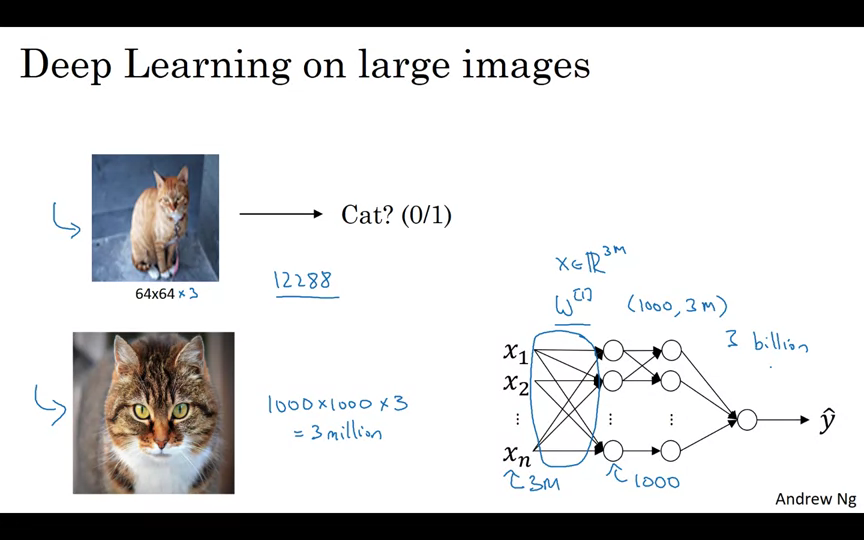

이를 해결하기 위해서는 CNN(합성곱 신경망)의 기본 구성 요소 중 하나인 합성곱 연산을 잘 구현해야 한다.

---

## Edge Detection Example

엣지 탐지 예제를 통해 합성곱 연산이 어떻게 작동하는지 살펴보자.

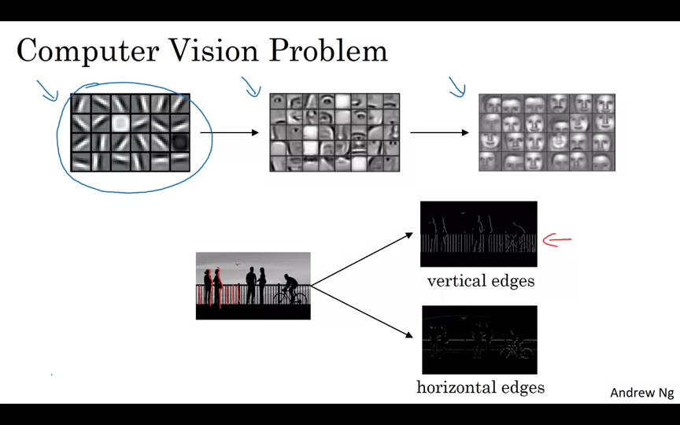

이미지의 Vertical Edge와 Horizontal Edge를 검출한다. 검출할 때는 필터라는 매트릭스를 곱한다.

6x6 이미지를 예로 들어보자. 필터의 크기는 3x3이고 결과물의 크기는 4x4가 된다. 각 요소들을 곱한 후 더해주는 아다마르 곱을 실행한다.

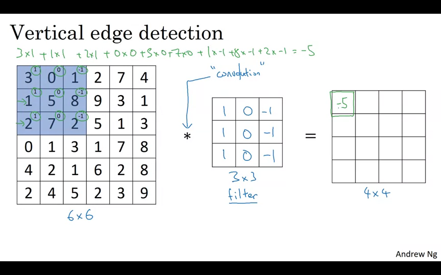

6x6 입력을 3x3으로 쪼갠 후 필터와 곱한 모든 값을 더하면 아다마르 곱이 된다.

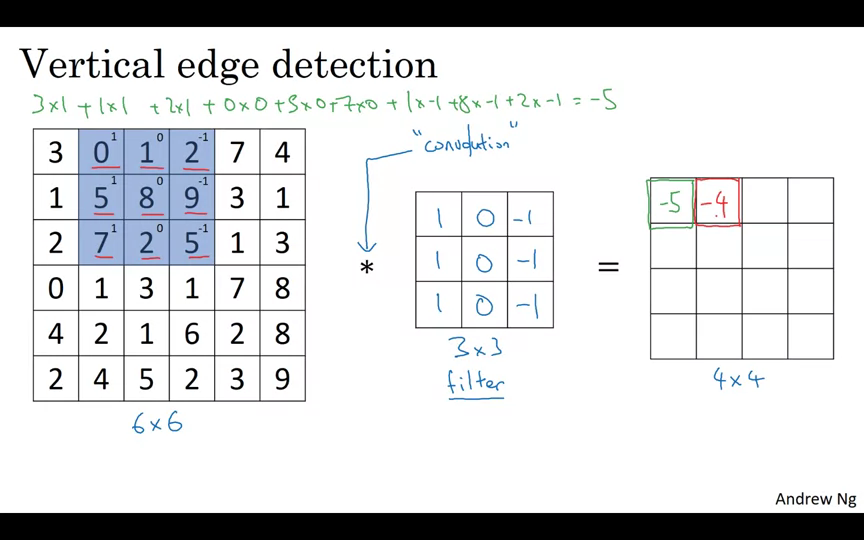

다음 요소는 오른쪽으로 한칸 이동한 후에 아다마르 곱을 행한다.

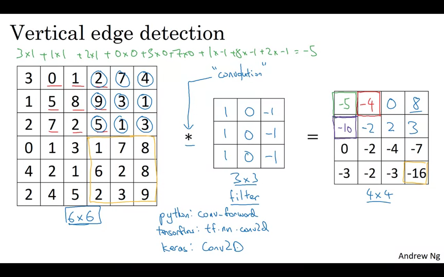

끝까지 모두 행해준다.

Vertical Edge Detection은 무슨 의미일까?

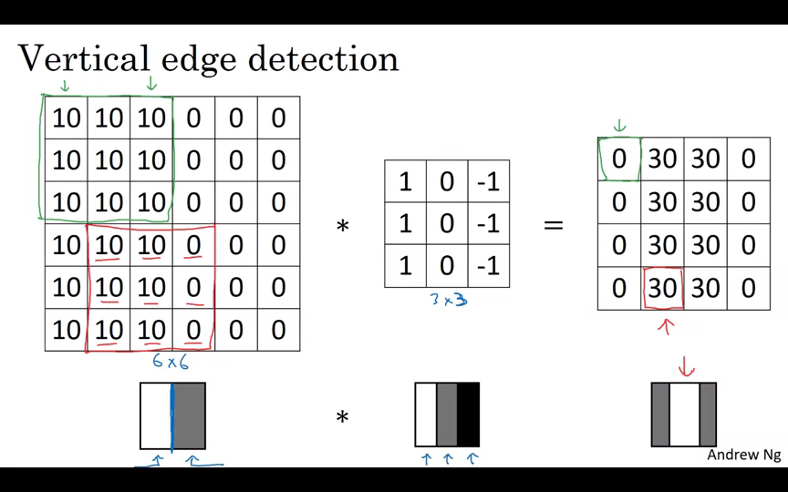

바로 이미지의 경계 부분을 검출하는 것이다.

---

## More Edge Detection

밝은색 → 어두운색으로 바뀌는 것과 어두운색→밝은색으로 바뀌는 것이 구분된다. 구분되지 않으려면 절대값을 씌운다.

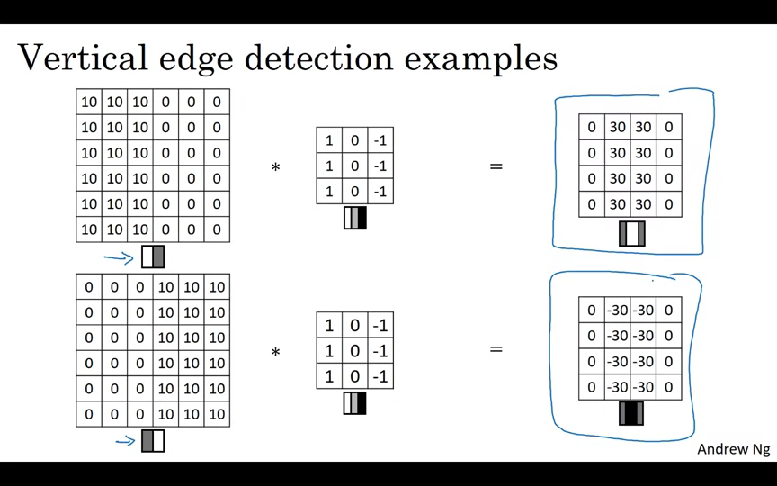

Vertical Edge

| 1 | 0 | -1 |
| --- | --- | --- |
| 1 | 0 | -1 |
| 1 | 0 | -1 |

Horizontal Edge

| 1 | 1 | 1 |
| --- | --- | --- |
| 0 | 0 | 0 |
| -1 | -1 | -1 |

아다마르 곱의 절대값이 클 수록, 명암의 변화가 크다는 뜻이다.

다양한 필터를 사용해서 엣지를 찾을 수 있다.

Sobel Filter

| 1 | 0 | -1 |
| --- | --- | --- |
| 2 | 0 | -2 |
| 1 | 0 | -1 |

Scharr Filter

| 3 | 0 | -3 |
| --- | --- | --- |
| 10 | 0 | -10 |
| 3 | 0 | -3 |

딥러닝에서는 역전파를 통해 적합한 필터를 찾아서 사용한다.

---

## Padding

n x n 이미지를 f x f 필터와 컨볼루션하면 (n-f+1) x (n-f+1) 결과물이 나온다. 그런데 다음과 같은 단점이 있다.

- 합성곱 연산을 할 때마다 이미지가 줄어든다.
- 가장자리의 픽셀은 결과의 일부에만 사용된다. 중간에 있는 픽셀은 겹치는 영역이 많이 있기 때문에 더 많이 사용된다. 가장자리에서 많은 정보가 버려지는 것이다.

이를 해결하기 위해 패딩을 한다.

- 6 x 6 이미지에 1픽셀씩 패딩을 하면 8 x 8 이미지가 된다.
- (8 x 8) * (3 x 3) = (6 x 6) 이 된다.
- n x n 이미지를 p 만큼 패딩하고 f x f 필터에 컨볼루션하면 (n + (2 * p) - f) x (n + (2 * p) - f)

Valid와 Same 컨볼루션

- Valid : no padding
    - (n x n) * (f x f) = (n-f+1) x (n-f+1)
- Same : 결과물 크기를 입력 크기와 같게 하기 위해 padding을 한다.
    - (n x n) * (f x f) = (n + (2 * p) - f) x (n + (2 * p) - f)
    - p의 크기는 (f - 1) / 2
    - 컴퓨터 비전계에서 f는 대부분 홀수이며 짝수로 된 필터는 보기도 어렵다.

---

## Strided Convolutions

스트라이드 컨볼루션은 컨볼루션의 기본 구성 요소 중 하나. 넘어가는 칸 수. Stride가 2라면 두칸씩 넘어간다. (7 x 7) * (3 x 3) = (3 x 3)

- (n x n) * (f x f) = ((n + 2p - f) / s + 1) x  ((n + 2p - f) / s + 1)
- (n + 2p - f) / s + 1이 정수가 아닌 경우는 반올림하는 것이 좋음.

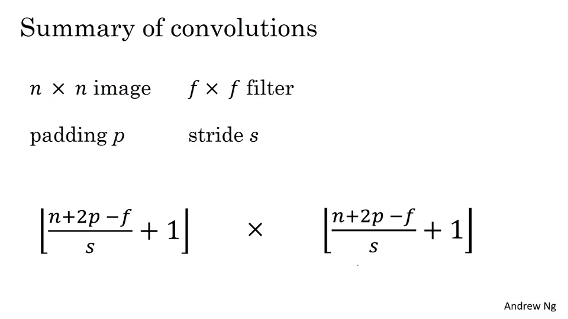

(A * B) * C = A * (B * C)가 성립한다.

---

## Convolutions Over Volume

RGB 이미지는 3개의 채널이 있다. 6 x 6 이미지의 크기는 6 x 6 x 3이 된다. 필터 또한 3개의 채널로 3 x 3 x 3을 사용한다. 채널의 수는 반드시 동일해야 한다. 결과물에는 채널이 없다.

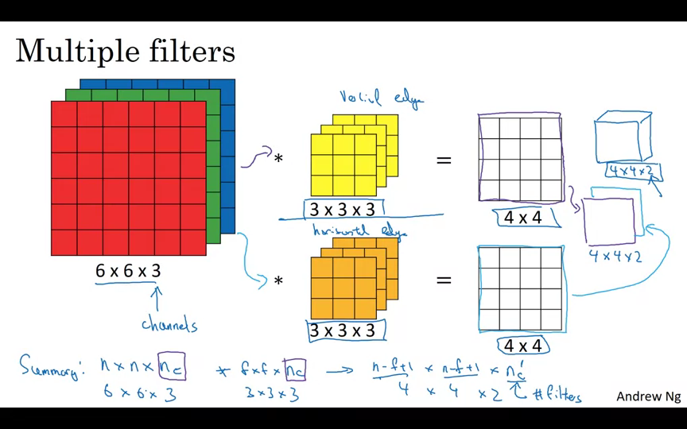

여러 개의 필터를 중첩하면 그 수 만큼 결과물의 레이어가 생긴다.

---

## One Layer of a Convolutional Network

합성곱을 치루고 나온 결과물에 편향(bias)을 더해야 함

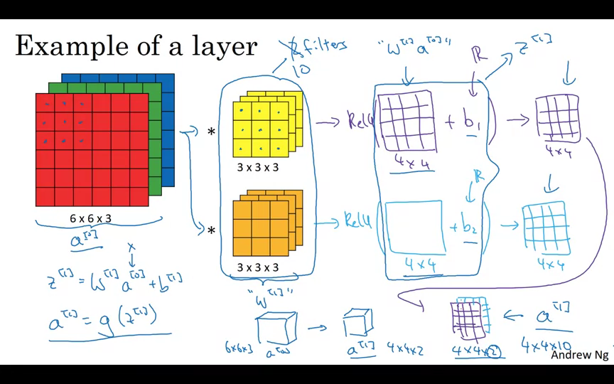

신경망 한 레이어에 3 x 3 x 3 크기의 필터를 10개가 있다면 이 레이어는 몇 개의 매개변수를 가질까요?

- 3 x 3 x 3 = 27개
- bias = 1개
- 즉, 한 필터당 28개
- 필터 10개이므로 280개.

---

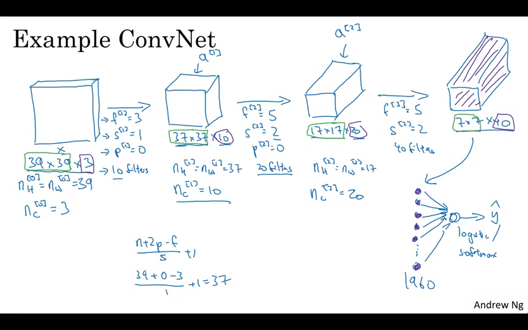

Convolutional network의 레이어 타입들

- Convolution
- Pooling
- Fully connected

---

## Pooling Layer

Pooling을 사용하여 표현 크기를 줄여 계산 속도를 높이고 특성을 더 잘 검출할 수 있다.

Max pooling은 각 구역에서 최대값을 고르는 것. 특성이 강하면 큰 값이 남을 것이다.

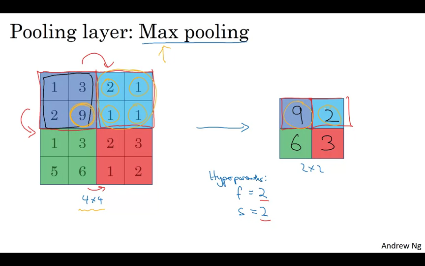

Average Pooling은 평균값을 고른다.

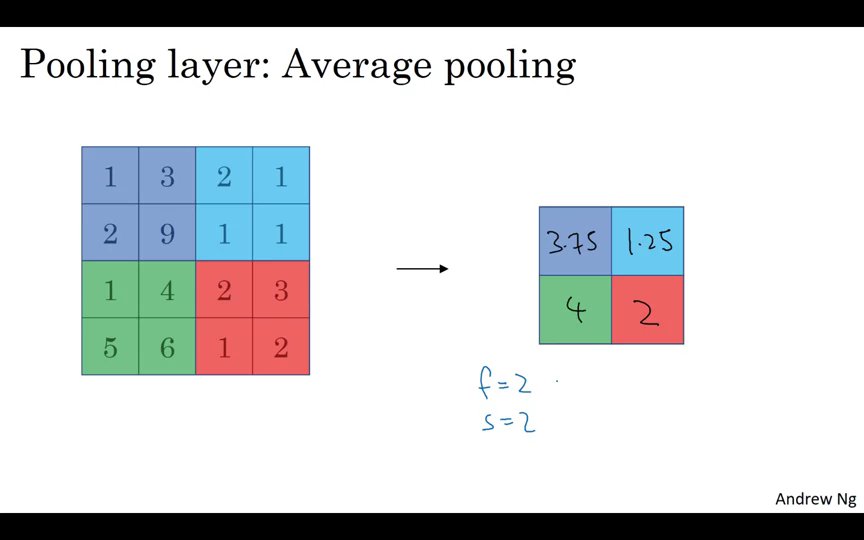

---

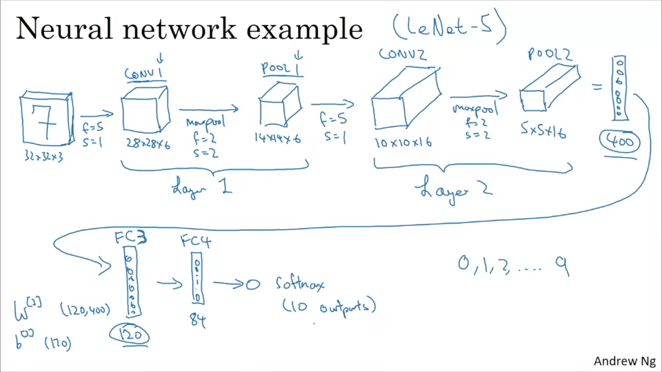

---

## Wht Convolutions?

- 파라메터 공유 : 이미지 한 부분의 특징 탐지기(필터)는 다른 부분에서도 유용할 수 있다.
- 연결 희소성 : 각 레이어의 출력값은 소수의 입력값에 의존한다.

---

## 참고 자료
- [Coursera - Convolution Neural Networks](https://www.coursera.org/learn/convolutional-neural-networks)