아래와 같은 모델을 예시로 보면서 공부한다.

- Classic Networks
    - LeNet-5
    - AlexNet
    - VGG-16
- ResNet
- Inception

---

## Classic Networks

### LeNet-5
- 논문 작성 당시에는 ReLU를 사용하지 않는 분위기라 Sigmoid와 tanh만 사용함.

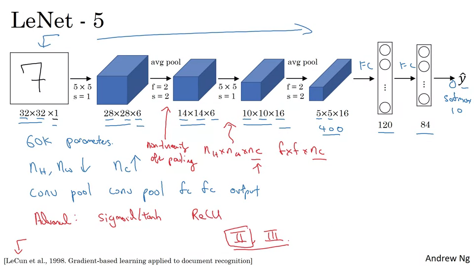

### AlexNet
- LeNet과 비슷하지만 더 커졌다. (6만개 파라메터 → 6천만개 파라매터)
- ReLU를 사용한다.
    
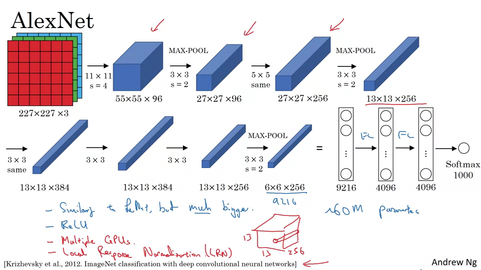

### VGG-16
- 많은 파라메터를 갖고 있지만 더 간단한 네트워크를 사용해서 convolution layer에만 집중한다.

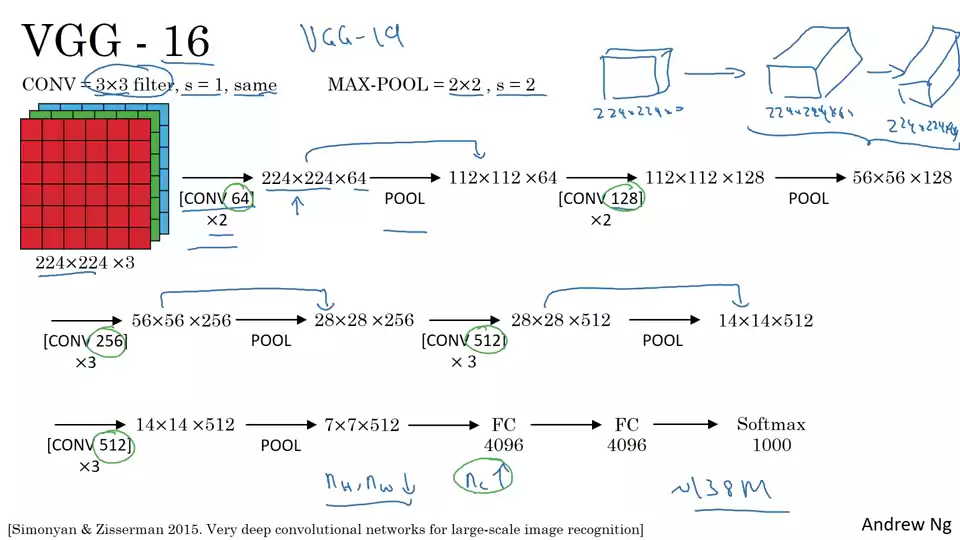

---

## ResNet

아주 깊은 신경망은 훈련시키기 어렵다. (기울기 소실, 폭발 유형의 문제)

한 계층에서 activation을 가져와서 깊은 다른 계층으로 갑자기 전달할 수 있는 건너뛰기 연결을 배운다. 그리고 이를 이용해서 ResNet을 구축한다.

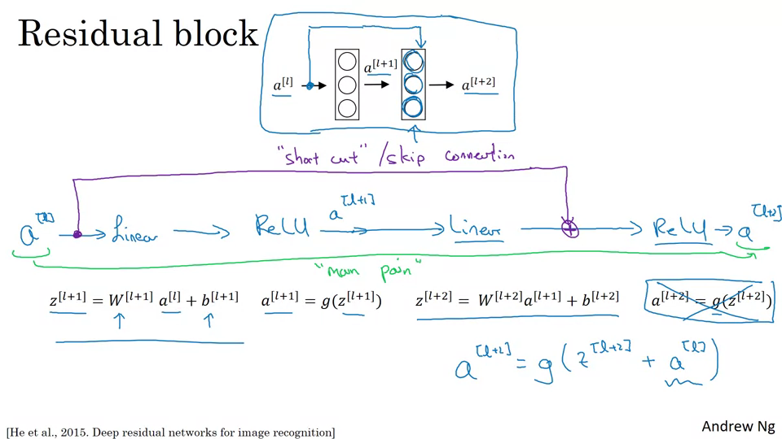

ResNet은 잔류블록이라는 것으로 만들어져있다.

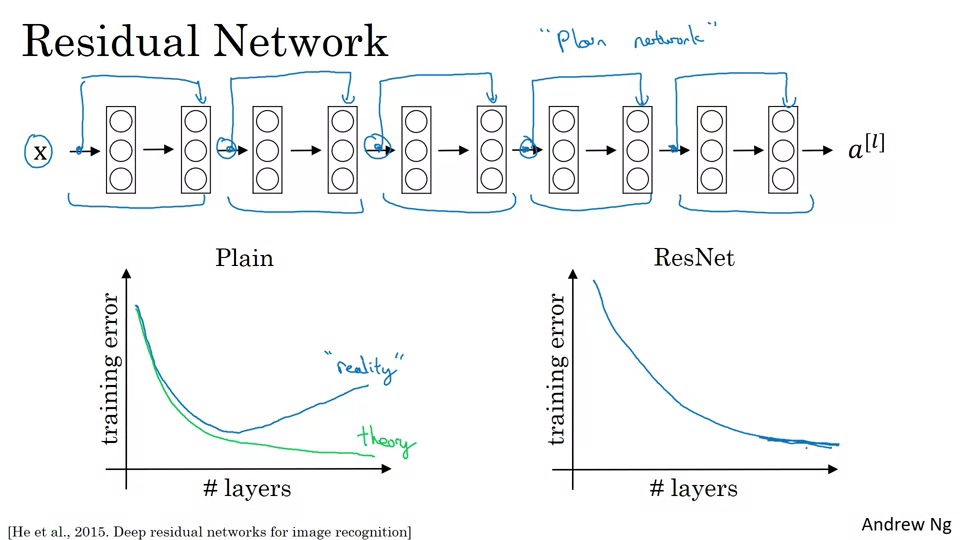

위는 5개의 잔류블록으로 구성된 ResNet이다. 일반적으로 모델이 거대해질 수록 훈련의 효율이 떨어지는데, ResNet은 훈련 오류의 성능이 계속 낮아질 수 있다.

ResNet은 왜 잘 작동할까?

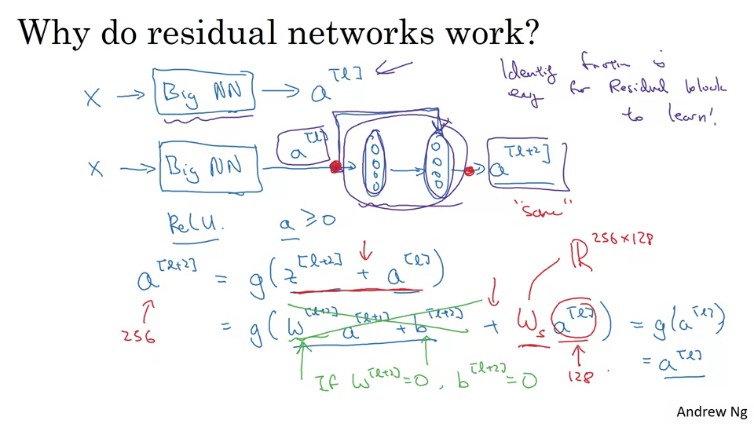

a[l+2] = a[l]이라는 항등식이 도출되므로 잔류블록을 학습하기 쉽기 때문.

---

## Networks in Networks and 1x1 Convolutions

1 x 1 컨볼루션을 왜 사용할까?

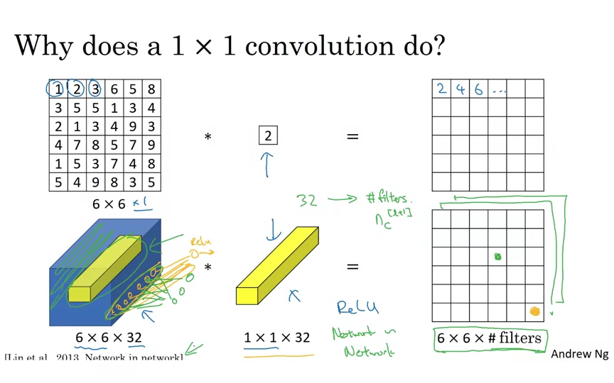

input이 하나의 채널일 때에는 의미가  없다. 단순히 곱한 값이 된다. 하지만 채널이 여러개라면, 여러 채널에 대해 연산을 처리할 수 있다. network in network 라고 부른다.

1 x 1 컨볼루션은 채널의 크기를 축소하거나 원하는 채널 수로 늘리거나 유지하는데 사용할 수 있다. 파라메터 수를 줄여서 계산량을 감소시킨다.

---

## Inception Network Motivation

특정 필터나 풀링을 선택하는 것이 아니라 여러 작업을 수행하고 출력을 연결하는 개념.

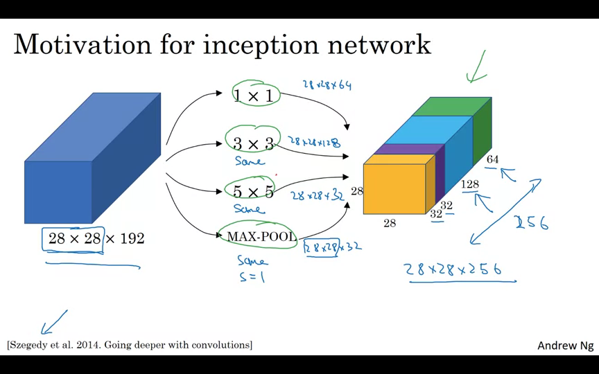

계산 비용에 문제가 있다.

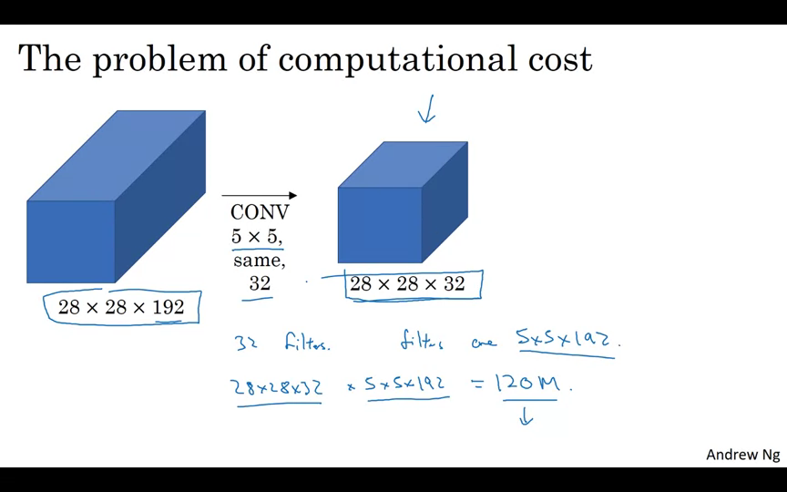

28 x 28 x 192 input을 5 x 5 same 32으로 CONV하여 28 x 28 x 32의 결과를 얻으려고 한다면, 계산 비용은 28 * 28 * 32 * 5 * 5 * 192 = 120M

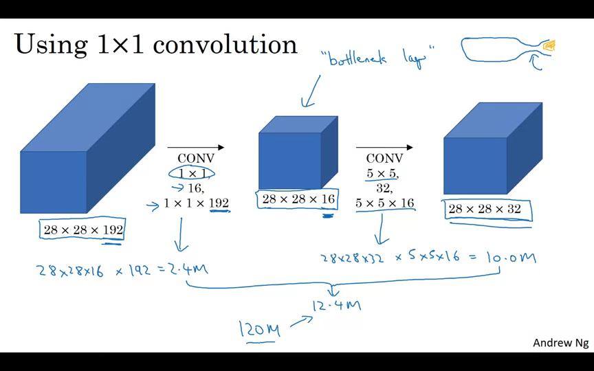

중간에 1 x 1 CONV을 추가하면 계산 비용을 줄일 수 있다. 이를 병목현상 레이어라고 한다.

- 28 x 28 x 16 x 192 = 2.4M
- 28 x 28 x 32 x 5 x 5 x 16 = 10.0M
- 총 12.4M

---

## Inception Network

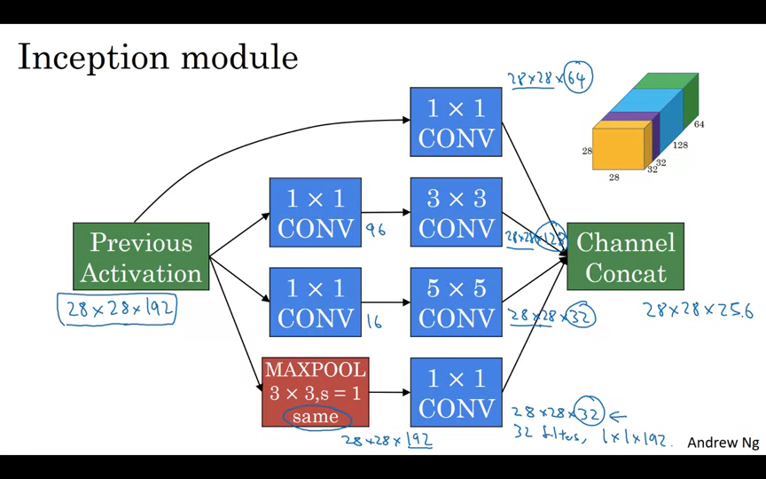

---

## MobileNet

낮은 계산 환경에서도 작동하는 네트워크를 만들 수 있게 해준다.

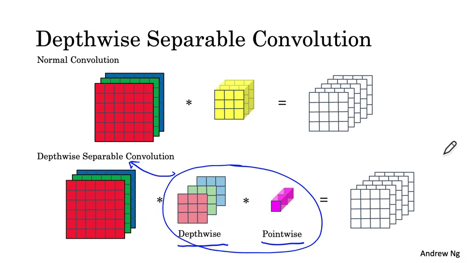

### Depthwise Convolution
- 6 x 6 x3 * 3 x 3 = 4 x 4 x 3
- 총 계산량 = filter params(3 * 3 )* filter positions(4 * 4) * num of filters(3) = 432

### Pointwise Convolution
- 4 x 4 x 3 * 1 x 1 x 3 = 4 x 4
- nc` filter로 4 x 4 x 5
- 총 계산량 = filter params(1 * 1 * 3) * filter positions(4 * 4) * num of filters(5) = 240

그러므로,

### Depthwise separable convolution
- 총 계산량 = 432 + 240 = 672

### Normal Convolution
- 총 계산량 = 2160

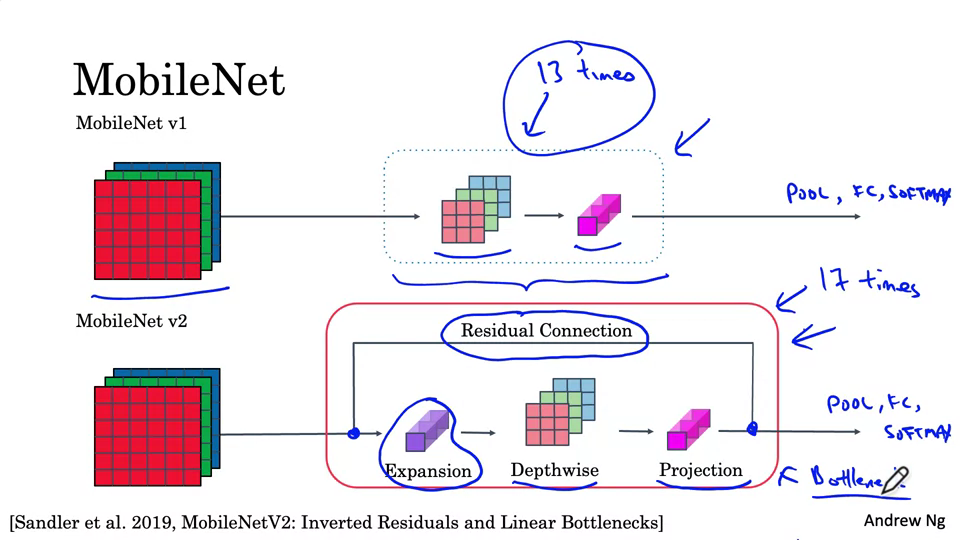

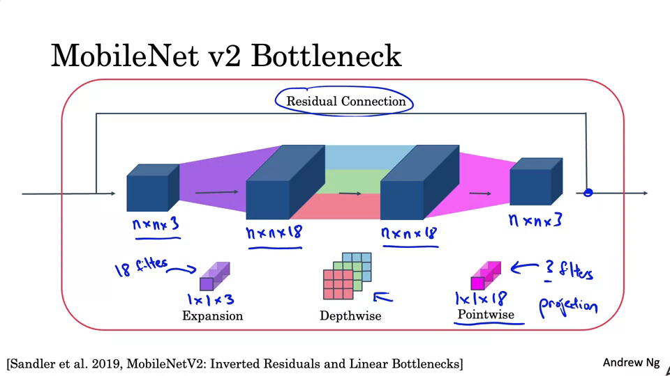

---

## EfficientNet

특정 장치의 신경망을 자동으로 확장하거나 축소하는 기능을 제공함.

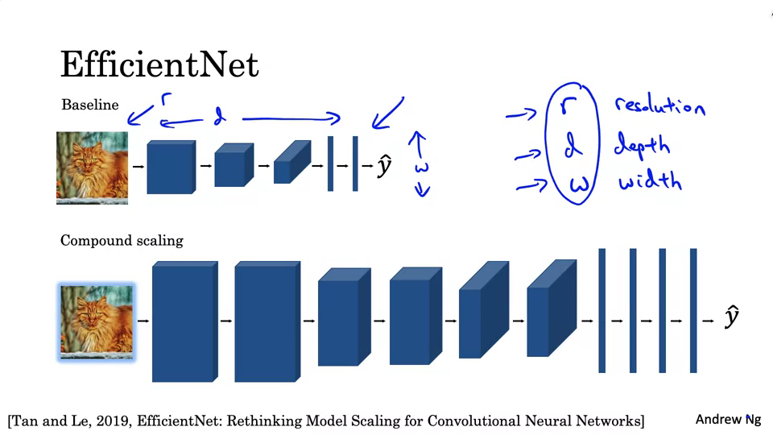

---

## 참고 자료
- [Coursera - Convolution Neural Networks](https://www.coursera.org/learn/convolutional-neural-networks)
- [1x1 convolution이란,](https://hwiyong.tistory.com/45)
- [ResNet의 이해](https://velog.io/@lighthouse97/ResNet의-이해)
- [[ML] ResNet & Inception Network란?](https://techblog-history-younghunjo1.tistory.com/132)
