## Object Localization

객체 감지를 하려면 먼저 객체 현지화에 대해 알아야 한다.

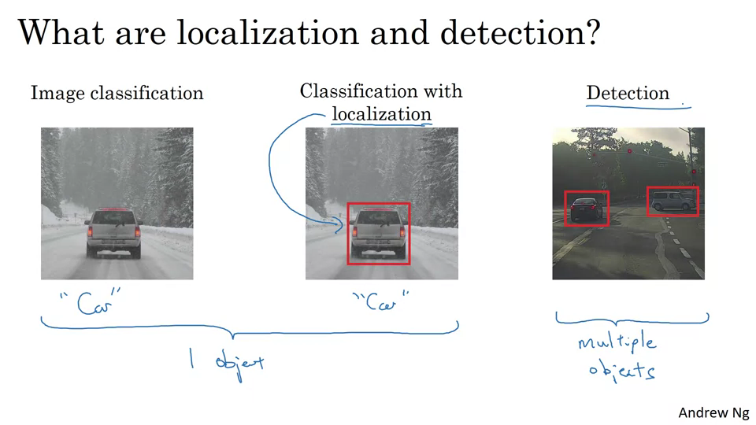

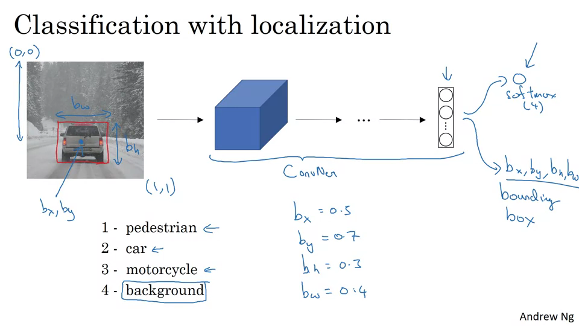

자동차를 구분하는 것뿐만 아니라, 박스를 그리기 위해 bx, by, bh, bw를 출력값으로 갖는다.

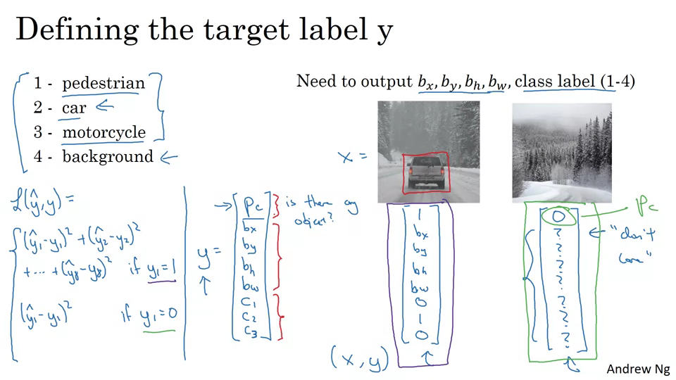

손실함수 주목.

---

## Landmark detection

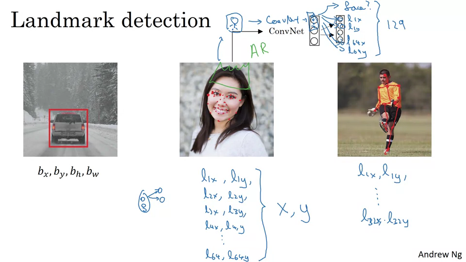

랜드마크(점)을 여러개 탐지해서 표정을 보고 감정을 유추할 수 있다.

동작을 보고 뼈대를 만들어서 동작을 인지할 수 있다.

---

## Object detection

슬라이딩 윈도우 감지 알고리즘이라는 것을 사용한다.

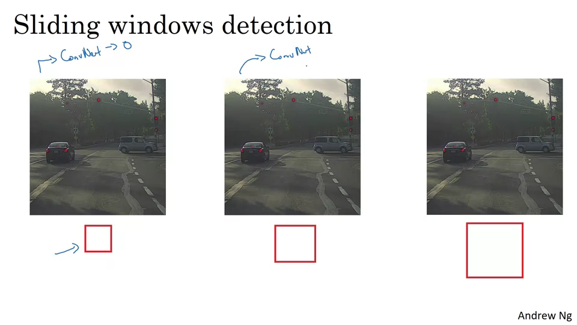

자동차가 있으면 1, 없으면 0이다. 전체 이미지에서 작은 사각형 크기만큼 잘라서 ConvNet에 입력하고 출력값을 본다.

더 큰 사각형으로 동일하게 반복한다. 사각형이 너무 작으면 계산 비용이 커진다.

---

## Convolutional Implementation of Sliding Windows

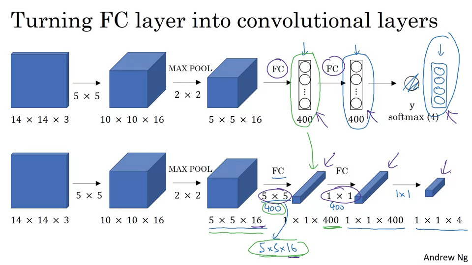

FC를 Convolutional Layer로 표현할 수 있다.

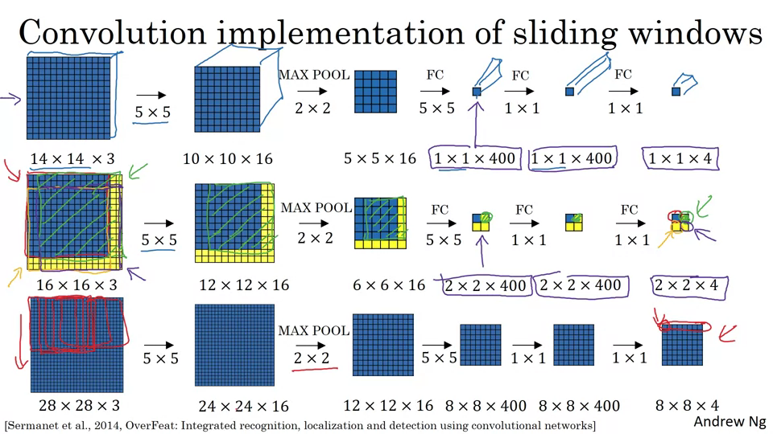

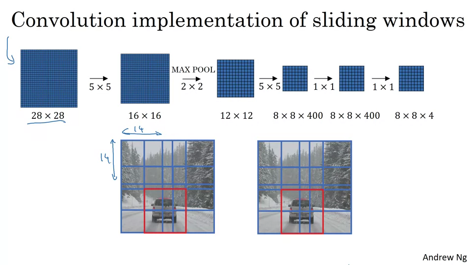

이 방법은 바운딩 박스가 정확하지 않다는 단점이 있다.

---

## Bounding box predictions

슬라이딩 윈도우로 순회하는 박스들이 자동차에 정확히 맞지 않음. 정확하게 박스를 예측하는 방법은 YOLO 알고리즘을 사용하는 것이다. (You Only Look Once)

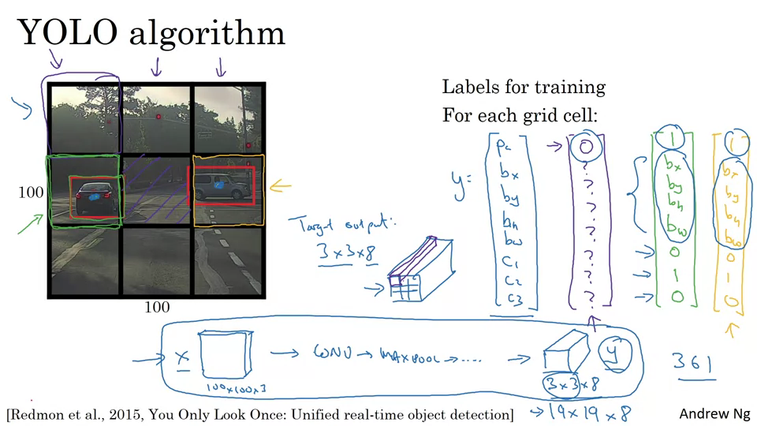

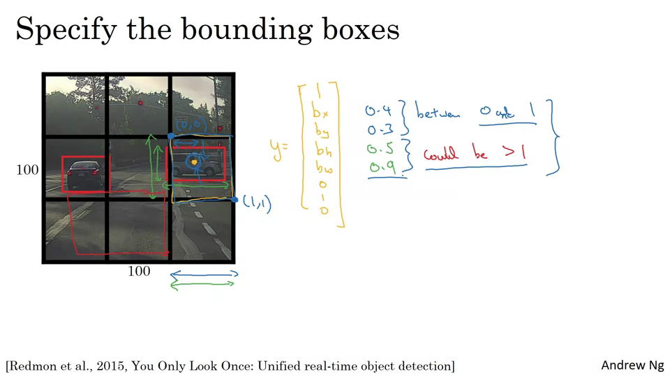

---

## Intersection Over Union

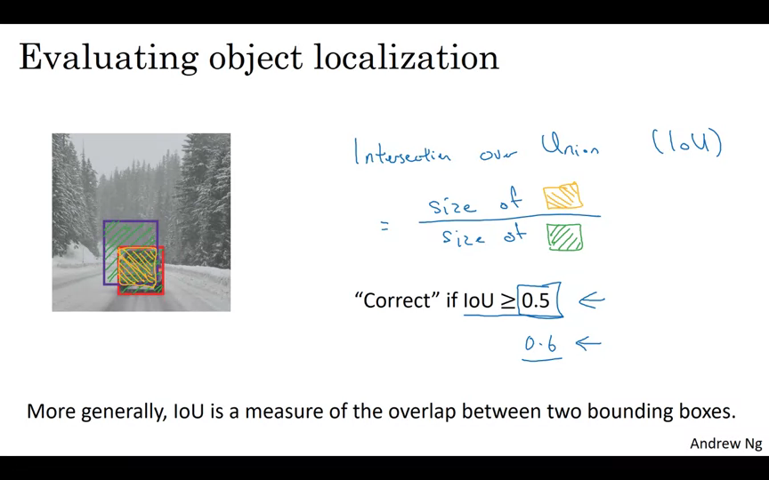

예측된 경계 상자와 실측된 경계 상자. 두 개의 경계 상자의 합집합에 대한 교집합 비율을 계산

0.5 이상이면 정답으로 판단한다.

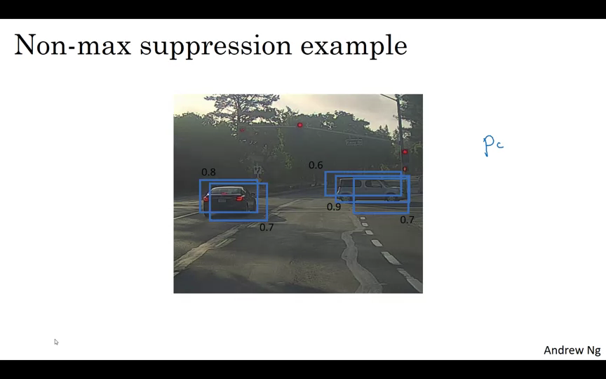

알고리즘이 객체를 여러번 탐지하게 된다. Non-max Suppression을 이용해 객체를 한번만 탐지하는지 확인할 수 있다. IOU가 최대치인 것만 남겨두고 나머지는 다 제거한다. 출력 클래스당 1회씩 실행한다.

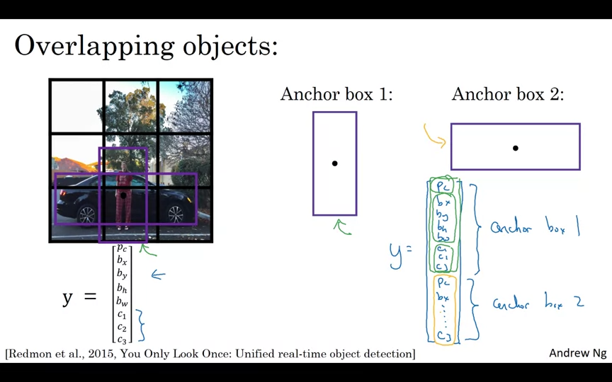

격자판 셀이 여러 객체를 탐지하려면 Anchor Boxes를 사용한다.

여러 Anchor Box가 생기면 Ouput이 달라진다.

- 기존 → 3 x 3 x 8
- 2개의 Anchor Box → 3 x 3 x 16

그리드 셀에 객체가 3개 몰려있다면 정상적으로 처리할 수 없다.

두 Anchor Box가 동일한 모양이라면 정상적으로 처리할 수 없다.

---

## Semantic Segmentation with U-Net

탐지된 객체 주위에 면밀한 경계를 그리는 것

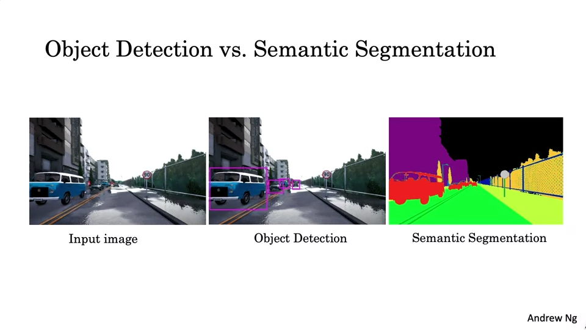

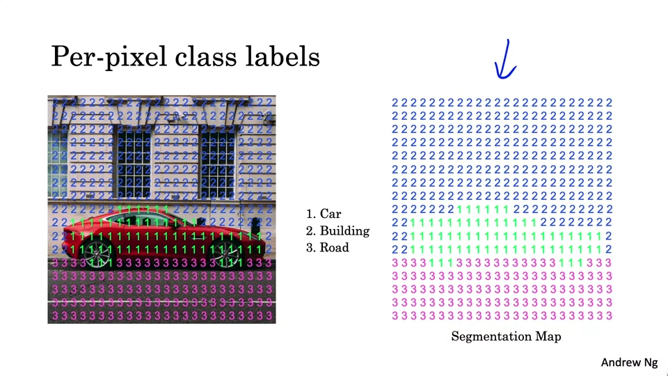

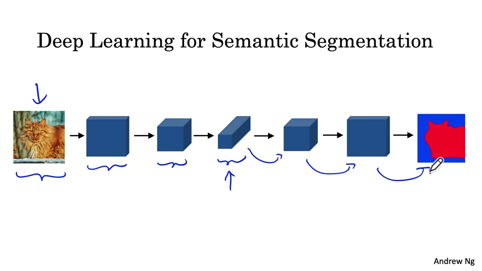

모델 크기가 점점 작아지다가, 출력을 위해 다시 키워줘야 한다. 이를 위해서는 Transpose Convolution을 사용한다.

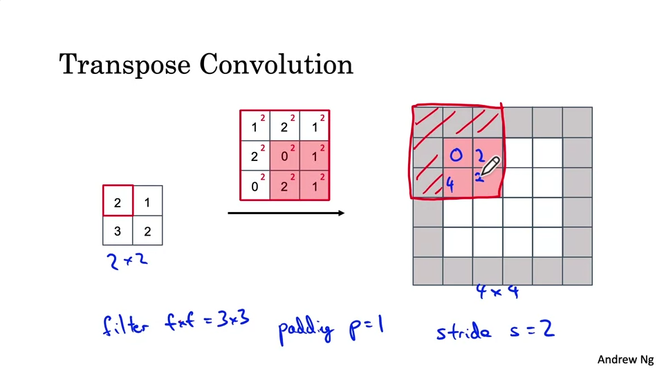

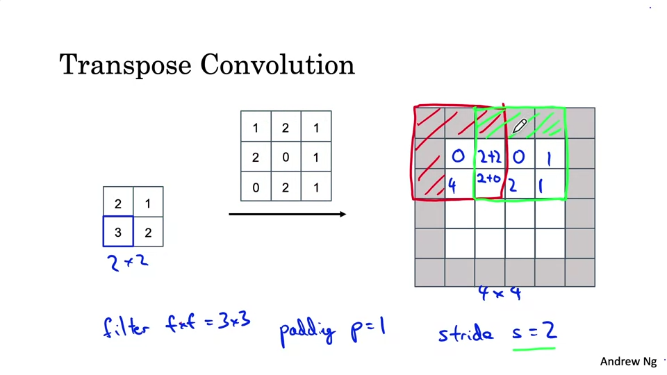

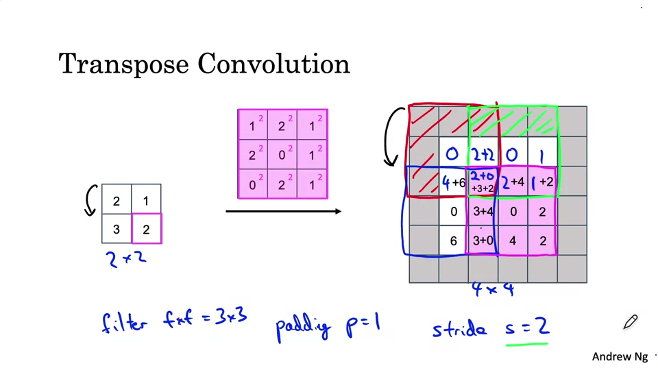

---

## U-Net Architecture

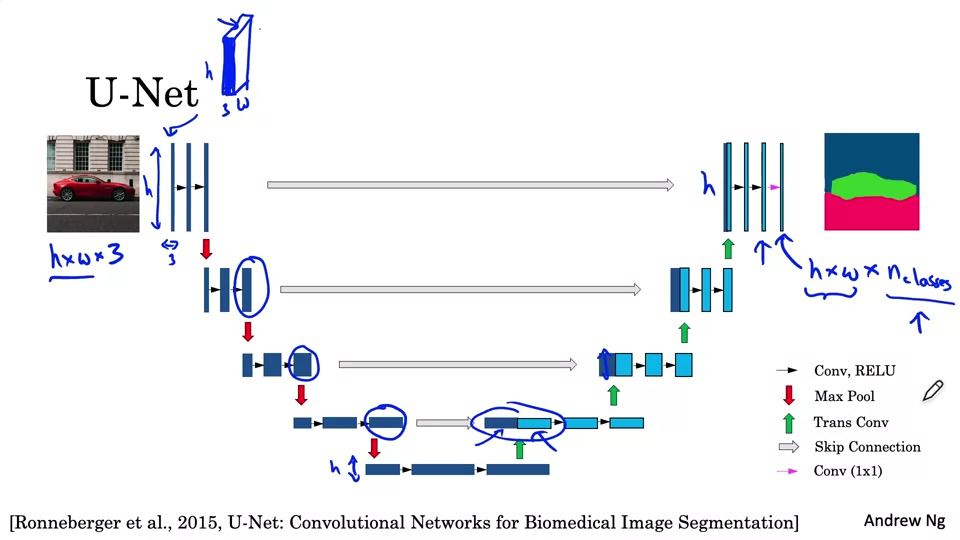

---

## 참고 자료
- [Coursera - Convolution Neural Networks](https://www.coursera.org/learn/convolutional-neural-networks)
- [YOLO(You Only Look Once) 모델 소개](https://brunch.co.kr/@aischool/11)
