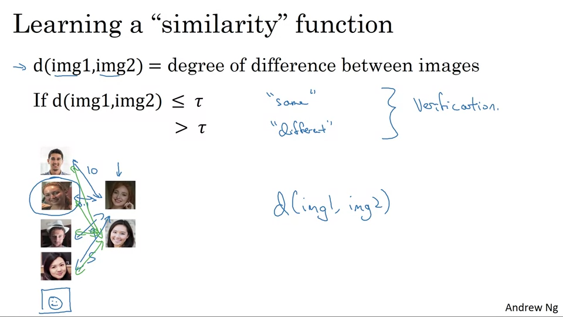
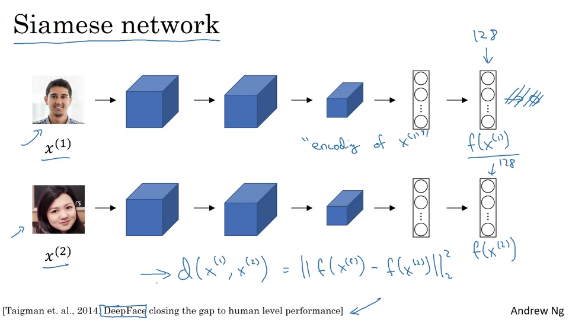
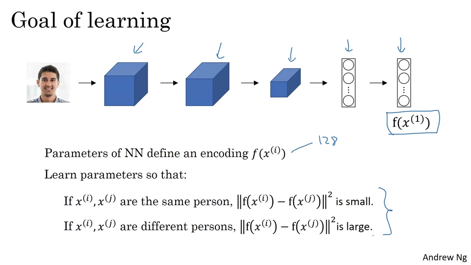
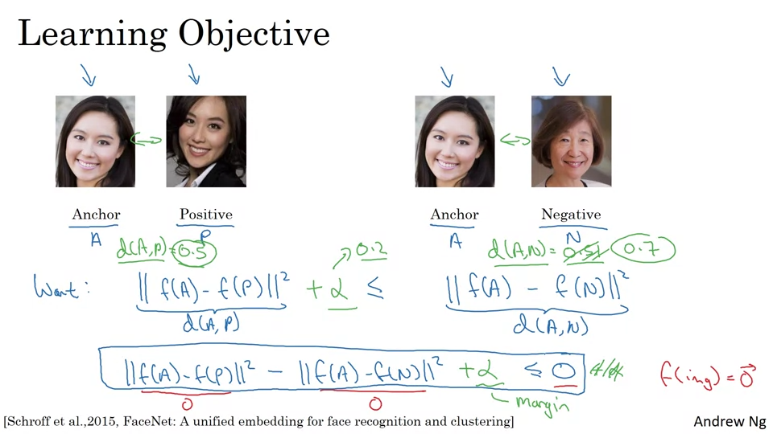
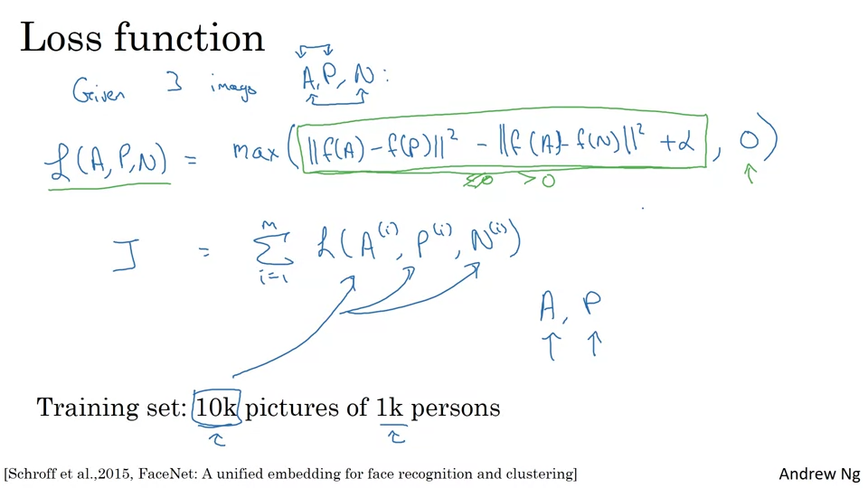
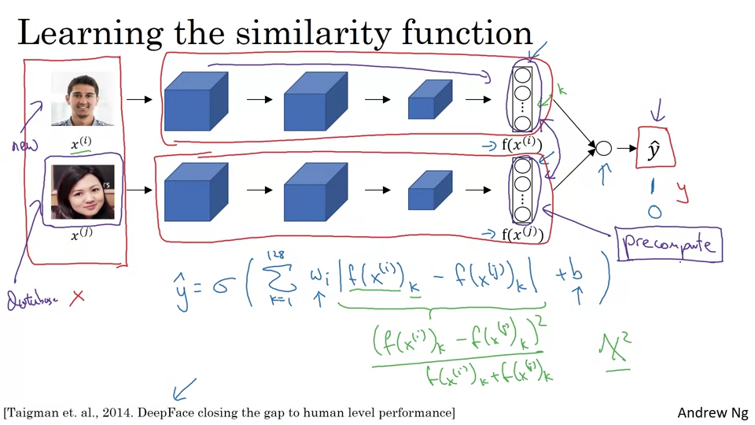

## Face verification vs Face recognition

- Verification
    - Input = 이미지, 이름/ID
    - Output = 권한이 있는 사람인가?
    - 1 : 1 대응
- Recognition
    - Input = 이미지
    - Output = 이미지에 있는 K명의 ID
    - K명의 데이터베이스를 가지고 있음. 1: K

---

## One-shot Learning

단 하나의 이미지나 사진만 제시해도 그 사람을 알아차릴 수 있어야 한다.

팀원 5명을 인식하는 모델을 만들었다고 하자. Output이 5개이다. 새로운 팀원 1명이 합류하면 Output을 6개로 늘이기 위해 새로 학습을 해야하는가? 비효율적이다. 이럴 때 유사함수를 사용한다.

두 얼굴을 입력해서 얼마나 닮았는지, 얼마나 다른지 알려주는 함수 d

d를 만들기 위해서 Siamese Network를 사욯한다.

---

## Triple Loss

Anchor 이미지를 보고 Positive, Negative 예제를 짝지어 학습시킨다. 동시에 3가지 이미지를 보기 때문에 삼중항 손실이라고 부름.

알파는 positive와 negative 기준값의 차이.

삼중항을 찾기 위해서는 경사하강을 통해 낮은 L을 찾아야 한다.

삼중항 A,P,N을 선택하는 방법

- 훈련 중에는 A,P,N이 랜덤하게 선택된다면 d(A,P) + a ≤ d(A,N)이 쉽게 만족된다.
- 훈련하기 어려운 삼중항을 골라라. d(A,P)가 d(A,N)과 거의 같은 값,

---

## Face Verification and Binary Classification

---

## 참고 자료
- [Coursera - Convolution Neural Networks](https://www.coursera.org/learn/convolutional-neural-networks)
- [YOLO(You Only Look Once) 모델 소개](https://brunch.co.kr/@aischool/11)
