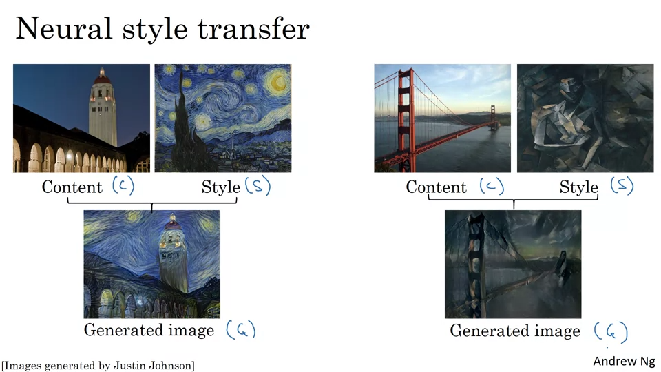
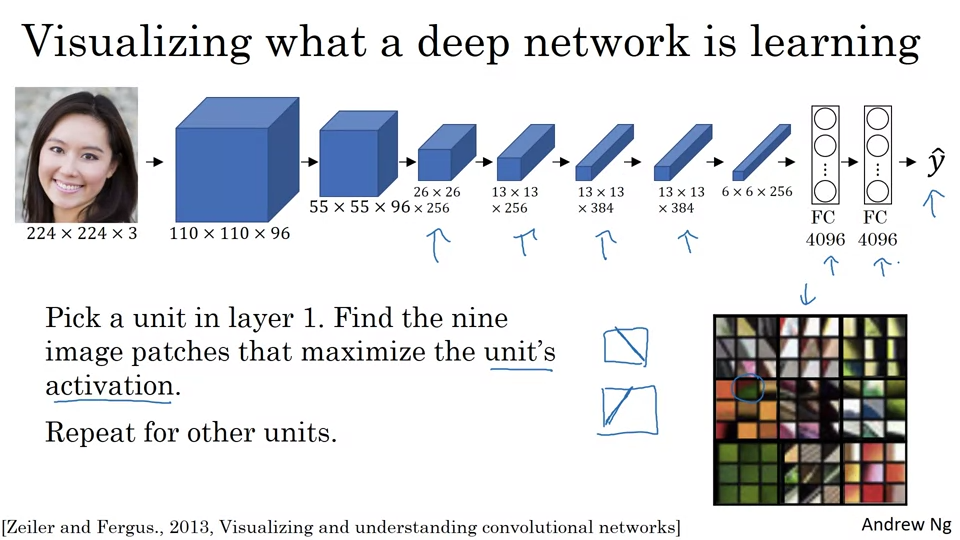
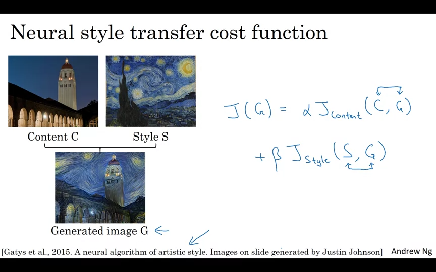
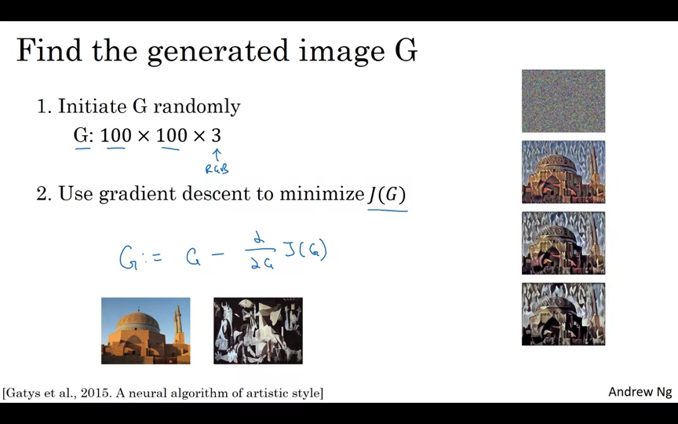
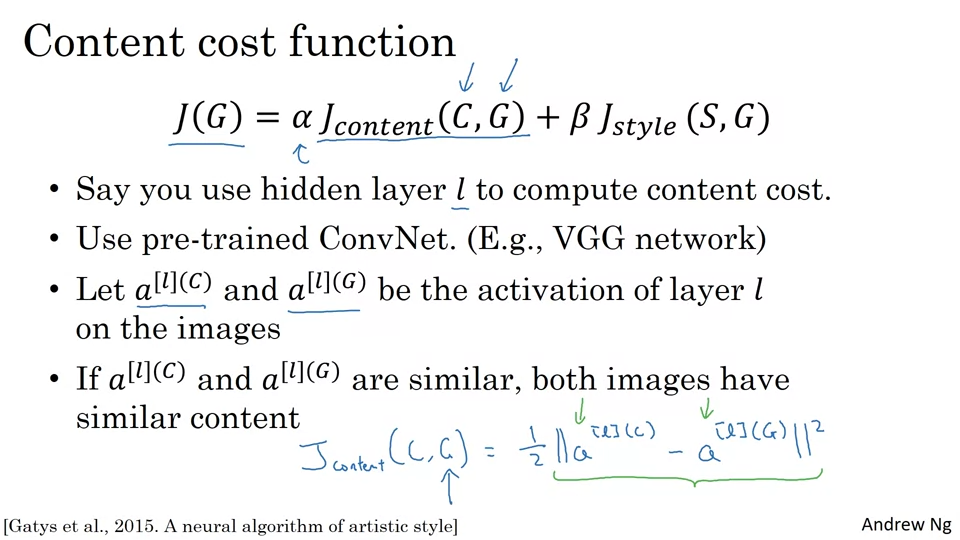

### What is Neural Style Transfer

이미지 화풍을 바꿔준다. Content + Style → Generated Image

---

### What are deep ConvNets learning?

---

## 참고 자료
- [Coursera - Convolution Neural Networks](https://www.coursera.org/learn/convolutional-neural-networks)
- [YOLO(You Only Look Once) 모델 소개](https://brunch.co.kr/@aischool/11)

---

- 후반으로 갈 수록 강의 듣다가 너무 지쳐서 정리를 제대로 못한 부분이 있다. 다시 들으면서 재정리를 해보려고 한다...
