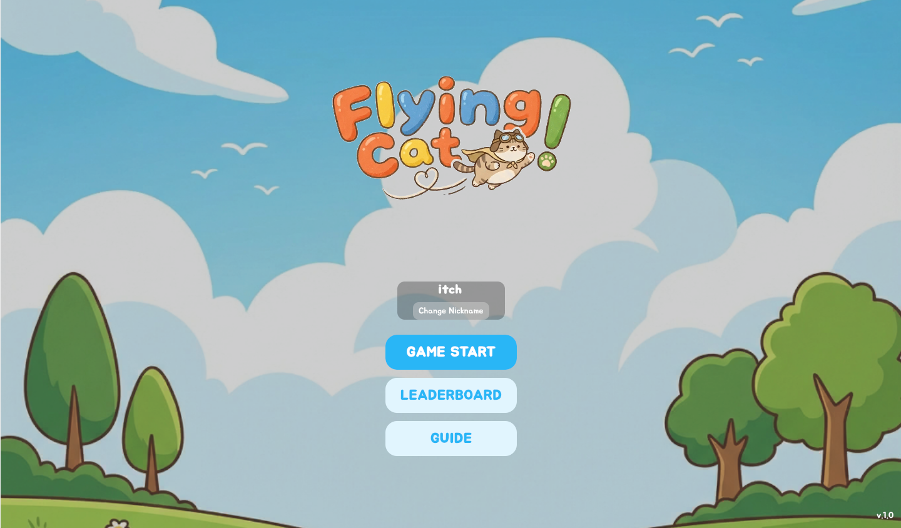
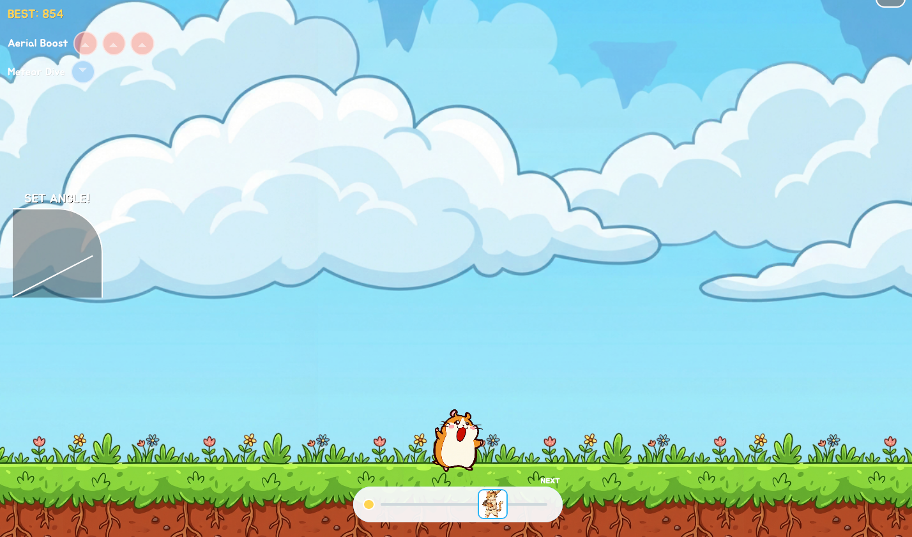
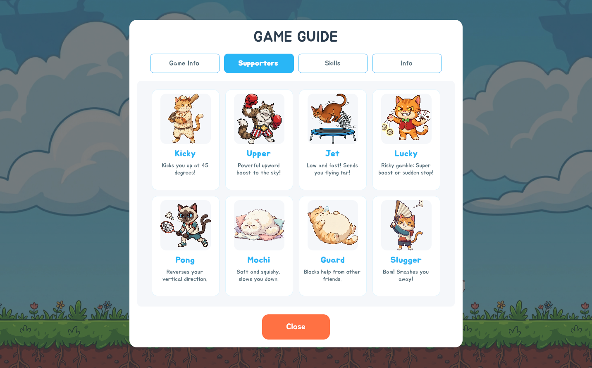
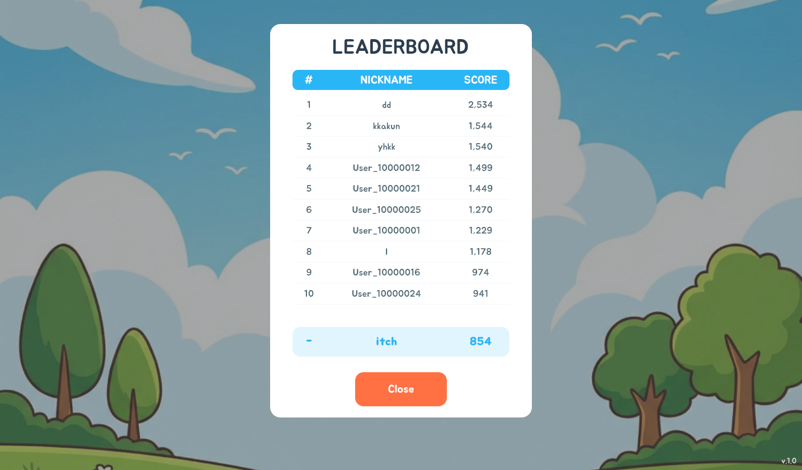

FlyingCat made me take vibe coding seriously. This post is about why it changed my standards.

Last summer, vibe coding disappointed. Same request, inconsistent results, too risky for production. Months later the feeling shifted. Running a small project end-to-end felt worth trying.

## Why FlyingCat

The reference was NANACA CRASH, a flash game where you set angle and power to launch a character, bouncing off obstacles and supporters to maximize distance. A friend suggested the genre. I twisted it into a cat-and-hamster theme.

Good experiment material because there's more to verify than it looks. Angle and power control, mid-flight state transitions, obstacle effects, UI, WebGL build, leaderboards — plenty of surface area for a small game. Better than a button-heavy app for seeing vibe coding's strengths and limits.

## What I delegated, and how far

One tool: Antigravity. One model: Gemini 3.0 Pro. Engine: Unity. UI: UIToolkit. I had a hunch that Gemini's frontend affinity would extend to USS-based layouts. That turned out correct. Image assets came from NanoBanana.

The important part: I deliberately took my hands off the code. The goal wasn't finishing a game fast — it was experiencing agentic coding firsthand. I'd started building manually, then connected Antigravity. After that, I resisted the urge to touch code and intervened only through plans and line-level comments.

Roughly 3–4 days of AI implementation, then 3–4 days of me reviewing changes and adjusting direction. Not full automation, but pushing a project forward without writing code myself — that feeling was significant.

## The actual game

The game loop:

- Set angle.
- Set power.
- Launch the hamster.
- Use up/down skills mid-flight to change direction.
- Hit cats, obstacles, supporters along the way for maximum distance.
- Full stop means game over.

Mid-flight effects were varied: relaunch at 45° or 60°, horizontal push, speed reduction, temporary invincibility. Looks simple, but implementation requires physics and state transitions meshing constantly.

The result was a playable WebGL game uploaded to itch.io. About 10 people played with zero promotion. Beyond that, I added a leaderboard using AWS Cognito and Lambda. I had almost no AWS experience beyond studying for a certification — Gemini walked me through it.

## It went further than expected

Speed hit first. What I'd struggled with for a month after work, AI pushed further in a day. Partly because I'm slow, but AI doesn't stop because it's tired.

UI surprised me. UIToolkit was especially impressive. At the time, opinions were mixed on UIToolkit for in-game UI. Antigravity with Gemini 3.0 Pro handled USS layouts better than expected. Later attempts with Claude or Codex were less satisfying — Gemini happened to fit well there.

This was the first time I felt "small games can be meaningfully delegated to AI." Not just receiving a few code snippets — deploying a mini-game to WebGL with a leaderboard is closer to production than to a demo.

## A human still steered

Didn't mean I could just hand it off. Hallucinated code, incorrect guides, insecure suggestions appeared throughout. It worked because I kept watching and correcting. Trust-and-go would have been dangerous.

The biggest tangle was where physics and state transitions met. FlyingCat needed physics on and off at precise game steps. One-frame misapplication broke the flight flow. Started with Unity's default physics, but as development progressed, intentionally non-physical handling became necessary. Ended up replacing the default with custom physics.

AWS integration was similar. Helpful for getting the feature attached, but guides were outdated or overly abbreviated — actual console menus were hard to locate. AI pointed the direction; final verification needed a human.

## Standards after FlyingCat

After this, vibe coding stopped being a novelty. At least at the mini-game scale, the possibility was real. Moving to a bigger project felt plausible.

Standards sharpened too. AI can handle implementation, but directing and QA stay human. Especially in areas where one wrong step compounds — state transitions, physics, security, external service integration.

Takeaway is simple. Vibe coding stopped being a toy. It also wasn't something you hand off and walk away from. Deploying one small game made both visible at once.
