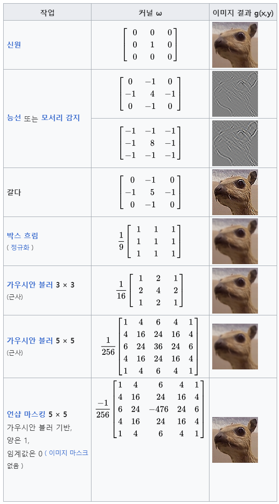
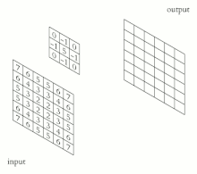
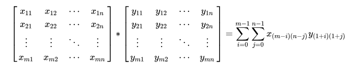
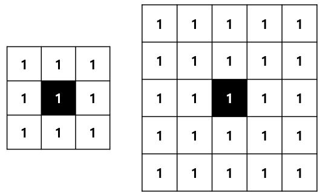
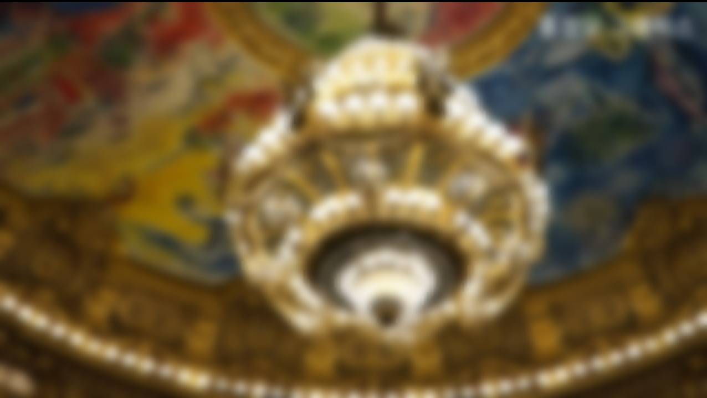
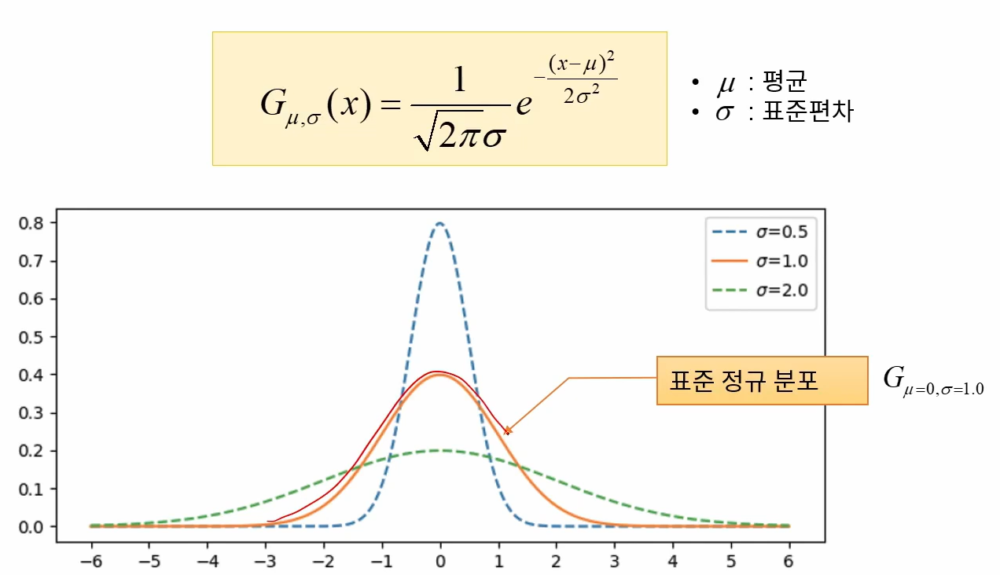
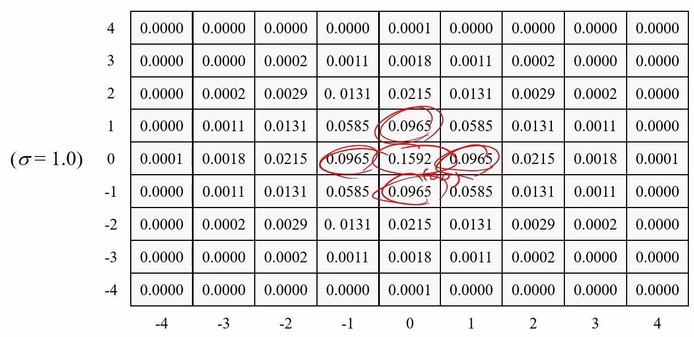

## Kernel

- 이미지에 특정한 행렬 연산을 함으로써, 흐려짐, 선명해짐, 엠보싱, 에지 감지 등의 특수한 효과를 줄 수 있다.
- 이미지를 행렬로 표현하고, 위의 커널을 참고하여 합성 행렬 간의 합성곱 연산을 하면 효과가 적용된다.

---

## Convolution

- 합성곱이란 위 이미지처럼 각 요소에 해당하는 요소들을 곱 연산 후 더해준다.



---

## 평균값 필터 (Mean Filter)

- 단순히 주변 픽셀에 대해 동일한 가중치로 합성곱 연산을 수행하는 방법이다.
- 픽셀 값의 변화가 줄어들고, 날카로운 에지가 무뎌지며, 노이즈의 영향이 크게 사라지는 효과가 있다.
- 마스크의 크기가 크면 클 수록 부드러운 느낌이 강해지나, 연산량이 크게 증가할 수 있다.
    - 3 x 3 크기의 필터 마스크는 9개 요소로, 모든 원소가 1/9로 설정된 행렬이이다.
    - 5 x 5 크기의 필터 마스크는 25개 요소로, 모든 원소가 1/25로 설정된 행렬이이다.

### Code
```cpp
for (int j = 0; j < height; j++)
{
    for (int i = 0; i < width; i++)
    {
        Vector3 resultColor{ 0.0f, 0.0f, 0.0f };
        for (int si = 0; si < 5; si++) {
            Vector3 neighborColor = GetPixel(i + si - 2, j);
            resultColor.r += neighborColor.r;
            resultColor.g += neighborColor.g;
            resultColor.b += neighborColor.b;
        }

        pixels[i + width * j].r = resultColor.r * 0.2f;
        pixels[i + width * j].g = resultColor.g * 0.2f;
        pixels[i + width * j].b = resultColor.b * 0.2f;
    }
}
//

for (int j = 0; j < height; j++)
{
    for (int i = 0; i < width; i++)
    {
        Vector3 resultColor{ 0.0f, 0.0f, 0.0f };
        for (int si = 0; si < 5; si++) {
            Vector3 neighborColor = GetPixel(i, j + si - 2);
            resultColor.r += neighborColor.r;
            resultColor.g += neighborColor.g;
            resultColor.b += neighborColor.b;
        }

        pixels[i + width * j].r = resultColor.r * 0.2f;
        pixels[i + width * j].g = resultColor.g * 0.2f;
        pixels[i + width * j].b = resultColor.b * 0.2f;
    }
}
```

### Result


---

## 가우시안 필터 (Gaussian Filter)

- 평균값 필터는 대상에 가까이 있는 픽셀과 멀리 있는 픽셀이 모두 같은 가중치를 사용하고 있다.
- 멀리 있는 픽셀은 멀리 있음에도 불구하고 많은 영향을 끼치게 된다.
- 가우시안 필터는 가중치를 통해 멀리 있는 픽셀의 영향을 낮춘다.



### Code
```cpp
const float weights[5] = { 0.0545f, 0.2442f, 0.4026f, 0.2442f, 0.0545f };

for (int j = 0; j < height; j++)
{
    for (int i = 0; i < width; i++)
    {
        Vector3 resultColor{ 0.0f, 0.0f, 0.0f };
        for (int si = 0; si < 5; si++) {
            Vec4 neighborColor = this->GetPixel(i + si - 2, j);
            resultColor.r += neighborColor.r * weights[si];
            resultColor.g += neighborColor.g * weights[si];
            resultColor.b += neighborColor.b * weights[si];
        }

        pixels[i + width * j].r = resultColor.r;
        pixels[i + width * j].g = resultColor.g;
        pixels[i + width * j].b = resultColor.b;
    }
}

for (int j = 0; j < height; j++)
{
    for (int i = 0; i < width; i++)
    {
        Vector3 resultColor{ 0.0f, 0.0f, 0.0f };
        for (int si = 0; si < 5; si++) {
            Vec4 neighborColor = this->GetPixel(i, j + si - 2);
            resultColor.r += neighborColor.r * weights[si];
            resultColor.g += neighborColor.g * weights[si];
            resultColor.b += neighborColor.b * weights[si];
        }

        pixels[i + width * j].r = resultColor.r;
        pixels[i + width * j].g = resultColor.g;
        pixels[i + width * j].b = resultColor.b;
    }
}
```

### Result


---

## 참고 자료
- [홍정모 그래픽스 강의 - 파트1](https://www.honglab.ai/courses/graphicspt1)
- [Wikipedia - Kernel (image processing)](https://en.wikipedia.org/wiki/Kernel_(image_processing))
- [[OpenCV] 블러링 기법과 가우시안 필터](https://blog.naver.com/sees111/222366804864)
- [가우시안 블러](https://velog.io/@jeonjw25/%EA%B0%80%EC%9A%B0%EC%8B%9C%EC%95%88-%EB%B8%94%EB%9F%AC)