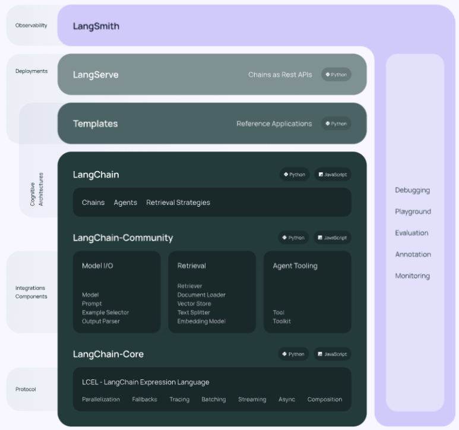
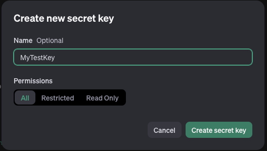
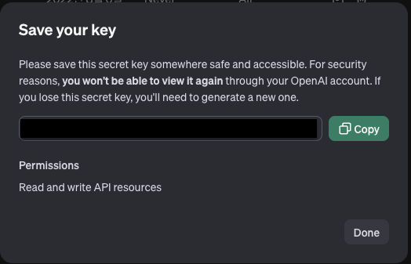

## 랭체인


언어 모델로 구동되는 애플리케이션을 개발하기 위한 프레임워크.

문맥 인식: 언어 모델을 문맥 소스(프롬프트 지침, 몇 가지 예시, 응답의 근거가 되는 콘텐츠 등)에 연결.

추론: 언어 모델에 의존하여 추론(제공된 컨텍스트에 따라 답변하는 방법, 취해야 할 조치 등)


## 구성

LangChain 라이브러리: 파이썬과 자바스크립트 라이브러리.

LangChain 템플릿: 다양한 작업을 위해 쉽게 배포할 수 있는 참조 아키텍처 모음.

LangServe: LangChain 체인을 REST API로 배포하기 위한 라이브러리.

LangSmith: 모든 LLM 프레임워크에 구축된 체인을 디버그, 테스트, 평가, 모니터링할 수 있는 개발자 플랫폼

LangGraph: 상태 저장, 멀티액터 애플리케이션을 구축하기 위한 라이브러리로, LangChain 위에 구축되어, 함께 사용하도록 고안되었음. 여러 계산 단계에 걸쳐 여러 체인(또는 액터)을 주기적으로 조정할 수 있는 기능으로 LangChain 표현 언어를 확장함.

[LangChain Github](https://github.com/langchain-ai/langchain)

---

## 환경 세팅
OpenAI의 GPT API를 사용해본다.


### 랭체인 설치
```shell
pip install langchain
```

### OpenAI 의존성 패키지 설치
```shell
pip install langchain-openai
pip install tiktoken
```

---

## OpenAI API Key 세팅
[OpenAI API](https://platform.openai.com/api-keys)에서 API Key를 발급받는다.

해당 페이지에서 **[Create new secret key]** 버튼을 누르면



적당한 Name 입력하고 **[Create secret key]**를 누른다.



API key가 나오는데 잘 적어둔다. 다른 사람에게 공유되면 안 되니 주의.

```python3
import os
os.environ['OPENAI_API_KEY'] = '발급 받은 API-KEY를 입력한다'
```

---

## GPT에게 간단한 질의하기

프롬프트 입력 -> LLM에게 전달 -> 응답 대기 -> 응답의 순서로 진행된다.

아래는 ChatGPT의 gpt-3.5-turbo에게 질의하는 예제.

```python3
from langchain_openai import ChatOpenAI

# model
llm = ChatOpenAI(model="gpt-3.5-turbo-0125")

# chain 실행
question = "너의 이름은 뭐지?"
print("Q. " + question)

answer = llm.invoke(question)
print("A. " + answer.content)
```
```shell
Q. 너의 이름은 뭐지?
A. 저는 AI 어시스턴트이므로 이름이 따로 없습니다. 단지 "어시스턴트"로 불러주세요.
```

토큰 단위로 요금이 부과되는데, 일반적으로 질의나 답변이 길어질수록 토큰을 많이 사용하게 된다.

`tiktoken`을 통해 토큰 수를 예상할 수 있다.

```python3
import tiktoken
encoding = tiktoken.encoding_for_model("gpt-3.5-turbo-0125")
print(len(encoding.encode("너의 이름은 뭐지?")))
```
```shell
9
```

지원모델과 비용은 아래 링크에서 확인하자

- [지원 모델 종류 확인](https://platform.openai.com/docs/models)

- ​[모델별 비용 확인](https://openai.com/pricing)

- [현재 사용한 토큰 비용 확인하기](https://platform.openai.com/usage)

---