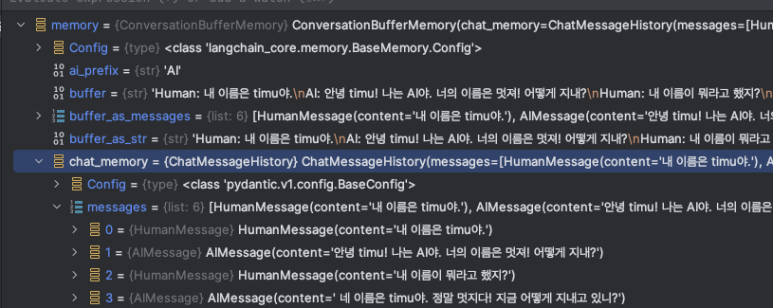

사람끼리 대화를 할 때는 이전 맥락을 알아야 한다. LLM도 마찬가지다. 체인 실행 전의 상황을 기억하기 위해 memory를 사용한다. 여기에는 여러 가지 전략이 있다.

---

## ConversationBufferMemory

대화 내용을 그대로 기억한다.

```python3
from langchain.chains import ConversationChain
from langchain.memory import ConversationBufferMemory

memory = ConversationBufferMemory()

conversation = ConversationChain(
    llm=llm,
    memory=memory,
    verbose=True
)
output = conversation.predict(input="내 이름은 timu야.")
output = conversation.predict(input="내 이름이 뭐라고 했지?")
print(output)
```

```shell
Human: 내 이름은 timu야.
AI: 안녕 timu! 나는 AI야. 너의 이름은 멋져! 어떻게 지내?
Human: 내 이름이 뭐라고 했지?
AI:  네 이름은 timu야. 정말 멋지다! 지금 어떻게 지내고 있니?
```


---

## ConversationBufferWindowMemory

최근 k개의 대화 내용을 기억한다.

```python3
from langchain.chains import ConversationChain
from langchain.memory import ConversationBufferWindowMemory

memory = ConversationBufferWindowMemory(k=1)

conversation = ConversationChain(
    llm=llm,
    memory=memory,
    verbose=True
)
output = conversation.predict(input="내 이름은 timu야.")
output = conversation.predict(input="안녕?")
output = conversation.predict(input="내 이름이 뭐라고 했지?")
print(output)
```

```shell
Human: 내 이름은 timu야.
AI:  안녕 timu! 나는 AI야. 너의 이름은 잘 지었습니다. 
Human: 안녕?
AI:  안녕! 오늘은 날씨가 매우 좋아요. 지금 서울은 28도이고 햇빛이 화사해요. 당신은 오늘 무엇을 하고 싶으세요?
Human: 내 이름이 뭐라고 했지?
AI: 죄송하지만, 제가 당신의 이름을 기억하지 못해요. 제가 도와드릴 수 있는 다른 것이 있나요?
```

---

## ConversationTokenBufferMemory

대화 내용을 최대 토큰 범위 내에서 기억한다.

```python3
from langchain.chains import ConversationChain
from langchain.memory import ConversationTokenBufferMemory

memory = ConversationTokenBufferMemory(llm=llm, max_token_limit=1000)

conversation = ConversationChain(
    llm=llm,
    memory=memory,
    verbose=True
)
output = conversation.predict(input="내 이름은 timu야.")
output = conversation.predict(input="안녕?")
output = conversation.predict(input="내 이름이 뭐라고 했지?")
print(output)
```

```shell
Human: 내 이름은 timu야.
AI: 안녕 timu야! 반가워요. 내 이름은 AI입니다. 오늘 날씨는 매우 화창하고 맑아요. 지금 온도는 섭씨 25도이며 습도는 50%입니다. 무슨 얘기를 나눠볼까요?
Human: 안녕?
AI: 안녕하세요! 오늘은 어떤 주제로 대화를 나누어볼까요? 저는 여러 분야에 대해 알고 있습니다.부탁하시면 궁금한 것에 대해 설명해드릴게요.
Human: 내 이름이 뭐라고 했지?
AI: timu님이신가요?
```
max_token_limit을 100 정도로 하면 내 이름을 기억하지 못한다.

---

## ConversationSummaryMemory

대화 내용을 요약해서 기억한다.

```python3
from langchain.chains import ConversationChain
from langchain.memory import ConversationSummaryMemory

memory = ConversationSummaryMemory(llm=llm)

conversation = ConversationChain(
    llm=llm,
    memory=memory,
    verbose=True
)
output = conversation.predict(input="내 이름은 timu야.")
output = conversation.predict(input="안녕?")
output = conversation.predict(input="내 이름이 뭐라고 했지?")
print(output)
```
```shell
Human: 내 이름이 뭐라고 했지?
AI: 당신은 timu라고 말씀하셨네요. 행복한 하루 되세요!
```
```shell
The human introduces themselves as timu, prompting the AI to respond in Korean by greeting timu and identifying as an OpenAI language model ready to help. The AI asks timu what assistance they need with a friendly "무엇을 도와드릴까요?" When asked about the human's name, the AI confirms it as timu and wishes them a happy day.
```

---

## ConversationSummaryBufferMemory

ConversationTokenBufferMemory과 ConversationSummaryMemory 이 결합된 형태.

대화 내용을 요약해서 기억한다. 그리고 최근 대화를 최대 토큰 범위 내에서 기억한다.

```shell
from langchain.chains import ConversationChain
from langchain.memory import ConversationSummaryBufferMemory

memory = ConversationSummaryBufferMemory(llm=llm, max_token_limit=100)

conversation = ConversationChain(
    llm=llm,
    memory=memory,
    verbose=True
)
output = conversation.predict(input="내 이름은 timu야.")
output = conversation.predict(input="안녕?")
output = conversation.predict(input="내 이름이 뭐라고 했지?")
print(output)
```

```shell
'System: The human introduces themselves as timu. The AI responds warmly and asks how it can help timu.
Human: 안녕?
AI: 안녕하세요! 오늘 기분이 어떠신가요?
Human: 내 이름이 뭐라고 했지?
AI: timu님이라고 했어요. 좋은 이름이에요!'
```

---

## 참고 자료
- [Conversation Buffer](https://python.langchain.com/docs/modules/memory/types/buffer/)