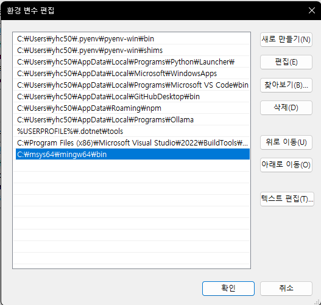

개발 환경은 Windows & VSCode에서 진행하였다.

## VSCode에서 C++ 환경을 구성하기 위한 플러그인 및 프로그램
- VSCode Plugins 설치
    - C/C++
    - C/C++ Extension Pack
    - C/C++ Themes
- [MSYS2](https://www.msys2.org/) 설치
    - MSY2 Terminal에서 아래 명령어를 입력하여 추가 설치 진행
```shell
pacman -S mingw-w64-ucrt-x86_64-gcc

Packages (16) mingw-w64-ucrt-x86_64-binutils-2.43.1-1
              mingw-w64-ucrt-x86_64-crt-git-12.0.0.r423.g8bcd5fc1a-1
              mingw-w64-ucrt-x86_64-gcc-libs-14.2.0-2
              mingw-w64-ucrt-x86_64-gettext-runtime-0.22.5-2  mingw-w64-ucrt-x86_64-gmp-6.3.0-2
              mingw-w64-ucrt-x86_64-headers-git-12.0.0.r423.g8bcd5fc1a-1
              mingw-w64-ucrt-x86_64-isl-0.27-1  mingw-w64-ucrt-x86_64-libiconv-1.17-4
              mingw-w64-ucrt-x86_64-libwinpthread-git-12.0.0.r423.g8bcd5fc1a-1
              mingw-w64-ucrt-x86_64-mpc-1.3.1-2  mingw-w64-ucrt-x86_64-mpfr-4.2.1-2
              mingw-w64-ucrt-x86_64-windows-default-manifest-6.4-4
              mingw-w64-ucrt-x86_64-winpthreads-git-12.0.0.r423.g8bcd5fc1a-1
              mingw-w64-ucrt-x86_64-zlib-1.3.1-1  mingw-w64-ucrt-x86_64-zstd-1.5.6-2
              mingw-w64-ucrt-x86_64-gcc-14.2.0-2

Total Download Size:    65.75 MiB
Total Installed Size:  517.33 MiB

:: Proceed with installation? [Y/n]

```

- MSYS2 환경 변수 세팅


- VSCode 단축키 설정
    - Ctrl + K + S를 눌러 keymap 설정 창을 연다.
    - `Tasks: Run Task` => Ctrl + Shift + B
    - 컴파일 (`Tasks: Run Build Task`) => Ctrl + Alt + C
    - 실행 (`Tasks: Run Test Task`) => Ctrl + Alt + B


## 폴더 구성
- `builds` / `dependencies` / `resources` / `src` 폴더 추가

---

## GLFW
- Window, Context, Input 등 플랫폼 관련 처리를 돕는 라이브러리
- [[GLFW]](https://www.glfw.org/)
    - 3.4 버전
- `include`, `lib-mingw-w64`를 `dependencies` 폴더로 복사
- `lib-static-ucrt/glfw3.dll`을 `builds` 폴더로 복사

## GLAD
- 함수 포인터 처리를 도와주는 라이브러리
- [[GLAD]](https://glad.dav1d.de/)
    - API GL : 4.6 / Profile : Core / Generate a loader 체크 -> Generate
- `include`, `src`을 `dependencies` 폴더로 복사

## GLM
- 벡터, 행렬 등 수학 라이브러리
- [[GLM]](https://glm.g-truc.net/0.9.9/index.html)
    - Downloads -> 1.0.1 
- `glm`를 `dependencies`폴더로 복사

---

## vscode 설정

- c_cpp_properties.json
```json
{
    "configurations": [
        {
            "name": "Win32",
            "includePath": [
                "${workspaceFolder}",
                "${workspaceFolder}/dependencies/GLFW/include",
                "${workspaceFolder}/dependencies/GLAD/include",
                "${workspaceFolder}/dependencies/GLM"
            ],
            "defines": [
                "_DEBUG",
                "UNICODE",
                "_UNICODE"
            ],
            "compilerPath": "C:\\msys64\\mingw64\\bin\\g++.exe",
            "cStandard": "gnu11",
            "cppStandard": "gnu++14",
            "intelliSenseMode": "gcc-x64"
        }
    ],
    "version": 4
}
```

- launch.json
```json
{
    "version": "0.2.0",
    "configurations": [
        {
            "name": "g++.exe - 활성 파일 빌드 및 디버그",
            "type": "cppdbg",
            "request": "launch",
            "program": "${workspaceRoot}/builds/main",
            "args": [],
            "stopAtEntry": false,
            "cwd": "${workspaceFolder}",
            "environment": [],
            "externalConsole": false,
            "MIMode": "gdb",
            "miDebuggerPath": "C:\\msys64\\mingw64\\bin\\gdb.exe",
            "setupCommands": [
                {
                    "description": "gdb에 자동 서식 지정 사용",
                    "text": "-enable-pretty-printing",
                    "ignoreFailures": true
                }
            ],
            "preLaunchTask": "C/C++: g++.exe build active file"
        },
    ]
}
```

- task.json
```json
{
    "version": "2.0.0",
    "runner": "terminal",
    "type": "shell",
    "echoCommand": true,
    "presentation": {
        "reveal": "always"
    },
    "tasks": [
        {
            "label": "save and compile for C++",
            "command": "g++",
            "args": [
                "${workspaceRoot}/src/main.cpp",
                "${workspaceRoot}/dependencies/GLAD/src/glad.c",
                "-g",
                "-I${workspaceRoot}/dependencies/GLFW/include",
                "-I${workspaceFolder}/dependencies/GLAD/include",
                "-I${workspaceFolder}/dependencies/GLM",
                "-lopengl32",
                "-L${workspaceRoot}/dependencies/GLFW/lib-mingw-w64",
                "-static",
                "-lglfw3dll",
                "-o",
                "${workspaceRoot}/builds/main"
            ],
            "group": {
                "kind": "build",
                "isDefault": true
            },
            "problemMatcher": {
                "fileLocation": [
                    "relative",
                    "${workspaceRoot}"
                ],
                "pattern": {
                    "regexp": "^(.*):(\\d+):(\\d+):\\s+(warning error):\\s+(.*)$",
                    "file": 1,
                    "line": 2,
                    "column": 3,
                    "severity": 4,
                    "message": 5
                }
            }
        },
        {
            "label": "execute",
            "command": "cmd",
            "group": "test",
            "args": [
                "/C",
                "${workspaceRoot}/builds\\${fileBasenameNoExtension}"
            ]
        },
        {
            "type": "cppbuild",
            "label": "C/C++: g++.exe build active file",
            "command": "C:\\msys64\\mingw64\\bin\\g++.exe",
            "args": [
                "-fdiagnostics-color=always",
                "-g",
                "${file}",
                "-o",
                "${fileDirname}\\${fileBasenameNoExtension}.exe"
            ],
            "options": {
                "cwd": "${fileDirname}"
            },
            "problemMatcher": [
                "$gcc"
            ],
            "group": "build",
            "detail": "Task generated by Debugger."
        }
    ]
}
```

---

## main.cpp
- `src`폴더 안에 `main.cpp` 코드 작성
```cpp
#include <glad/glad.h>
#include <GLFW/glfw3.h>

#include <iostream>

int main()
{
    std::cout << "Hello world!" << std::endl;
    return 0;
}
```

---

## Build & Run
- Build : `Terminal - Run Task - save and compile for C++`
- Run : `Terminal - Run Task - execute`
- Compile Error가 발생하지 않고 빌드가 잘 되어서 Hello World! 라는 텍스트가 정상적으로 출력되는 것을 확인.
---

## 참고 자료
- [VScode C++ 환경 구성하기](https://pasongsong.tistory.com/543)
- [Code OpenGL 개발 환경 설정](https://songsmir.tistory.com/5)
- [OpenGL Course](https://rinthel.github.io/opengl_course/)