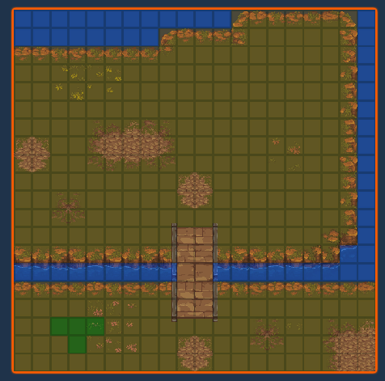
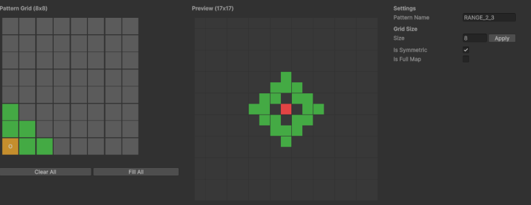
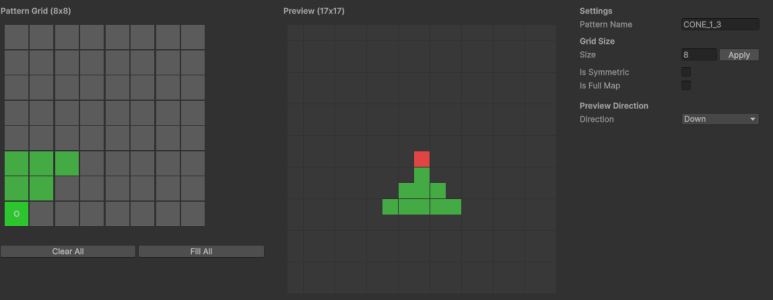
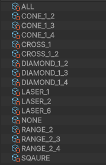
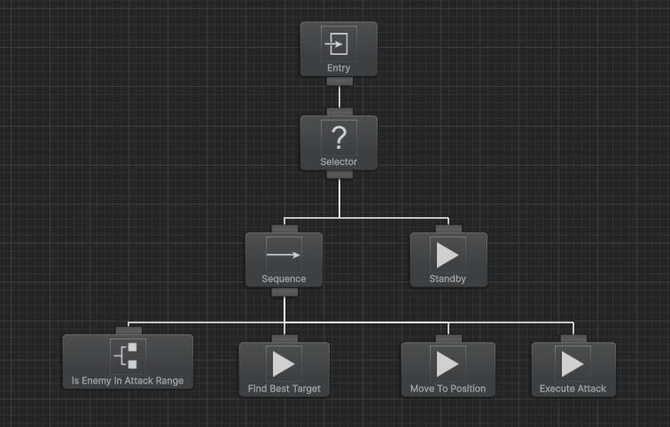

Dropped custom editing tools and hardcoded logic, switched to Unity built-ins and third-party assets. Tilemap, range setting, AI — reorganized everything that'll need constant attention going forward.

## Unity Tilemap

Development mindset shifted. Used to build everything myself. Now: use what's available, ship faster.

Scrapped the custom tilemap tool, adopted Unity Tilemap. Coordinate system aligned to Unity — origin moved from top-left `(0,0)` to bottom-left `(0,0)`.

The tilemap asset choice was a mistake, though. Not happy with it after using it. Sticking with it for now, likely replacing later.

## Attack Range / Effect Range Unification

Attack range and effect range (spreading from a target) were handled separately. Both are fundamentally the same range logic, so I unified them. Replaced all hardcoded containment checks with a visual setting tool.

Ranges are defined by painting quadrants around a target:

- No direction: all four quadrants (symmetrical).
- Directional: two quadrants only (left-right symmetry, facing down).

- ALL — full area
- CONE — fan shape
- CROSS — cross pattern
- DIAMOND — diamond / rhombus
- LASER — piercing line
- NONE — no range
- RANGE — ranged (archers)
- SQUARE — 8-directional

## Behavior Designer for Unit AI

AI logic was too hardcoded to manage. Stripped it all and introduced Behavior Trees. Visual decision structure is the big win. Some learning curve.

Screenshot shows the simplest tree: if an enemy is within attack range, move and attack.

Expecting 5–6 tree variants per class type, plus 3–4 per combat policy. Key enemy bosses get dedicated trees.

Plan: establish per-class base trees first, then add scenario-specific variants.
