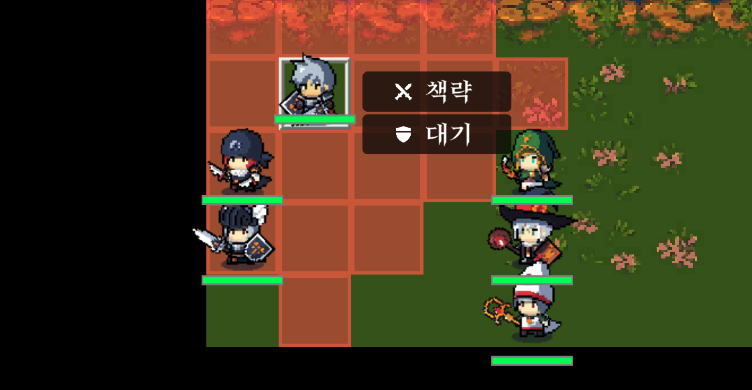
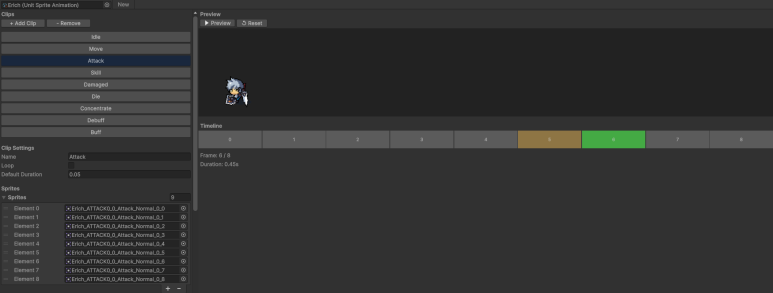
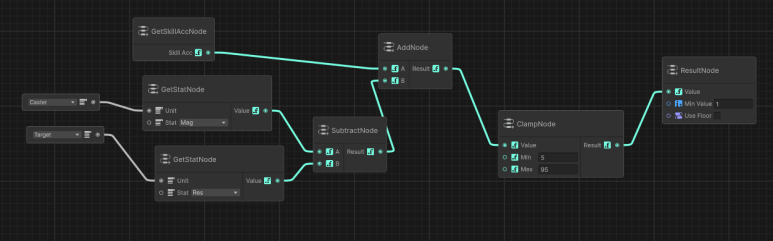
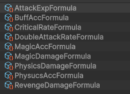

## 유닛 스프라이트

유닛 스프라이트는 SPUM을 쓰기로 했다. 개인적으로는 레트로한 픽셀 아트를 더 좋아해서 SPUM 그림체가 완전히 취향인 건 아니다. 그래도 편의성과 생산성을 생각하면 꽤 합리적인 선택이다. 인디 개발자들이 많이 고르는 데는 이유가 있더라.

예전에는 최적화 때문에 별도 시트 작업이 필요했는데, 지금은 정식 기능으로 지원돼서 훨씬 편하다. 딸깍하면 바로 나온다는 게 정말 크다.

흰머리 용사처럼 생긴 캐릭터만 조금 손봤고, 나머지는 거의 기본 프리셋을 그대로 썼다. 지금 단계에서는 완성도보다 속도가 더 중요하다.

## 전투 애니메이션

여기서 시간이 꽤 걸렸다. 그래도 이 작업을 지나고 나니 레거시 코드는 거의 남지 않았다. 예전 코드를 억지로 이어 붙이기보다, 필요한 부분은 버리고 구조부터 다시 잡는 쪽으로 갔다.

애니메이션 에디터도 지금은 너무 편하다. 이런 부분까지 AI와 에셋의 도움을 받다 보니, 예전에는 대체 어떻게 다 직접 만들었나 싶을 정도다.

## 스탯 타입

현재 생각 중인 기본 스탯은 아래와 같다.

- 체력 : HP
- 기력 : MP
- 공격 : 물리 공격력
- 방어 : 물리 방어력
- 마력 : 마법 공격력
- 저항 : 마법 방어력
- 속도 : 명중률, 회피, 연속공격
- 행운 : 크리티컬

대체로는 이 방향이다. 다만 스탯 이름은 아직 완전히 확정하지 않았다.

SRPG 중에는 스탯을 이원화하는 경우도 많다. 예를 들면 `무력 -> 공격력`, `통솔 -> 방어력`처럼 어떤 스탯이 바로 쓰이지 않고 한 단계 변환을 거쳐 실제 수치에 반영되는 방식이다.

처음에는 이 프로젝트도 비슷한 구조였지만 결국 폐기했다. 지금 형태가 더 직관적이고, 육성 공식도 훨씬 단순하게 가져갈 수 있어서다.

나중에 `사령관 시스템`을 붙이게 되면 `지휘` 같은 스탯이 추가될 수도 있겠다. 아직은 구상 단계다.

## 전투 공식

전투 공식은 GraphToolkit으로 에셋화했다. 위 스크린샷은 마법 명중률 공식이다.

물리 피해량, 마법 피해량, 물리 명중률, 마법 명중률, 크리티컬 확률처럼 전투 전반에 공통으로 쓰이는 공식이 있는 반면, 특정 마법이나 스킬만 따로 쓰는 특수 공식도 필요할 것 같다.

결국 공식 종류가 엄청 많아질 게 뻔하다.

이걸 전부 코드 기반으로만 관리하면 나중에 손대기 너무 힘들어진다. 그래서 공식 자체를 데이터 자산으로 분리할 필요가 있었다.

그 과정에서 고른 게 GraphToolkit이다. 공식도 결국 사람이 읽고 수정해야 하니, 시각적으로 보이는 쪽이 낫다고 판단했다.
