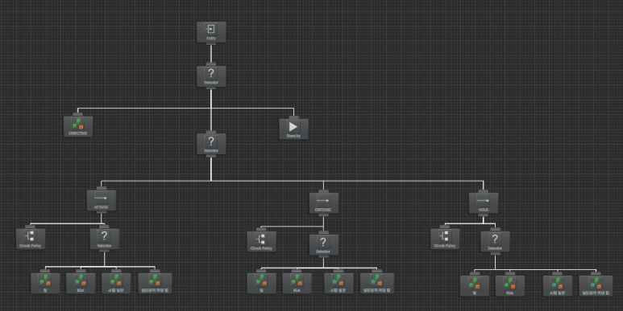
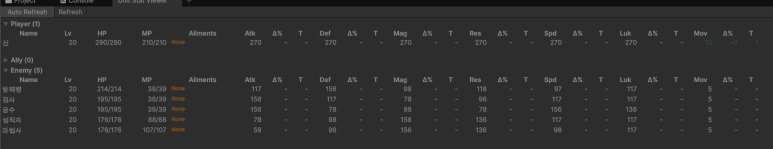
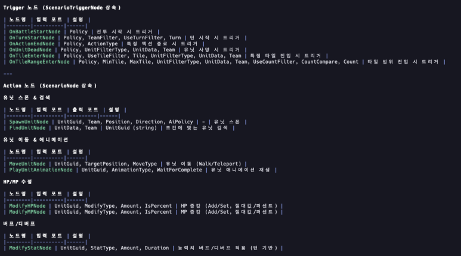
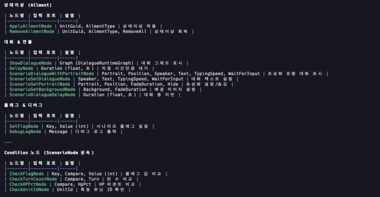
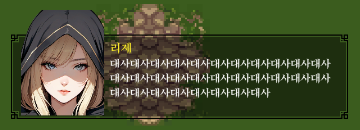
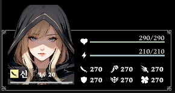

Combat AI, scenario graph, and combat UI draft — all tackled at once. Not content-rich yet, but the combat prototype skeleton came together here.

## AI System

After committing to Behavior Designer, this round was about finalizing the decision logic and implementing the trees.

Recurring patterns emerged quickly. Extracted shared logic into separate trees and linked them. Common approach, noticeably easier.

First, evaluate the battlefield-level directive:

- Attack a specific unit
- Move to a specific position
- Follow a specific unit

These are top-priority actions for special battlefield situations.

Without a directive, each unit acts according to its class type (Force):

- Healer: heal skills, buff skills
- Melee DPS: physical attacks, attack skills
- Ranged DPS: physical attacks, attack skills, kiting
- Magic DPS: attack skills, debuff skills
- Tank: attack skills, blocking, holding chokepoints

Within each class tree, a policy layer decides:

- Attack: move toward enemy, engage
- Defense: engage if enemy enters my range
- Hold: stay in place, act from current position

Took nearly a week. But the base is set — from here it's content on top and bug-hunting.

## Skill Refactoring

Building AI trees immediately exposed incomplete or un-refactored skill code. Buff skills not applying, attack skills dealing zero damage. Found and fixed all of them.

## Combat Unit Viewer

UI wasn't ready enough to confirm buff/debuff application at a glance. Built a quick combat unit viewer.

## Scenario Graph

Commands for combat scenarios keep growing.

Added the immediately necessary ones. More will come once real scenario authoring starts.

## UI Work

Now entering the tedious zone. First major hurdle by my standards.

Dialogue

Unit info (compact version)

Counter system will follow Super Robot Wars / Fire Emblem style: `Counter / Evade / Defend` selection. Want the player to stay engaged even during enemy turns.

Next: counter phase UI.

UI implementation order: `Counter phase → Unit info (detail) → Skill info → Battlefield info → Menu`.

Once those are in, should be enough for a first prototype. Items and traits push to the second round.
