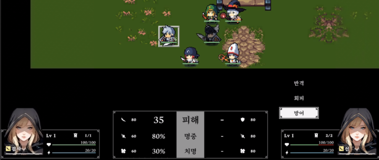

이번 회차는 전투 규칙을 묶고, 전투 페이즈 마무리에 필요한 정리를 계속 진행했다.

## 응전 시스템 고도화 및 전투 시스템 정비

공격을 받았을 때 `반격 / 회피 / 방어`를 고를 수 있는, 슈로대 스타일 응전 시스템을 작업했다.

AI가 어떤 선택을 할지 계산하는 공식도 같이 만들었다. 이 부분은 GPT 도움을 많이 받았는데 생각보다 꽤 복잡했다.

밸런스 테스트 때 손볼 수 있도록 조절 가능한 변수는 최대한 밖으로 빼두었다.

## AP 시스템

AP(Action Point) 개념도 넣었다. 공격, 스킬, 아이템 사용 시 소모된다.

대부분의 유닛은 1~3 AP 정도를 쓰게 하고, 보스급이거나 의도적으로 강하게 설계한 유닛은 4~5까지 줄 수도 있을 것 같다.

어쩌면 MP를 완전히 대체할 수도 있는데, 이건 조금 더 굴려 보고 결정할 생각이다.

## 리팩토링

개발을 계속 밀다 보니 코드가 다시 지저분해진 느낌이 들어 한 차례 정리를 했다.

과한 최적화나 오버엔지니어링 성격의 코드는 걷어냈다.

## 다음 작업

개발한 지 대략 두 달 정도 지났다. 회사 다니면서 병행하니 속도가 느린 건 어쩔 수 없다.

유닛 상세 정보 팝업과 일시정지 팝업만 만들면 전투 페이즈는 얼추 마무리될 것 같다.

이제 시나리오와 정비 페이즈 준비도 슬슬 시작해야겠다.
