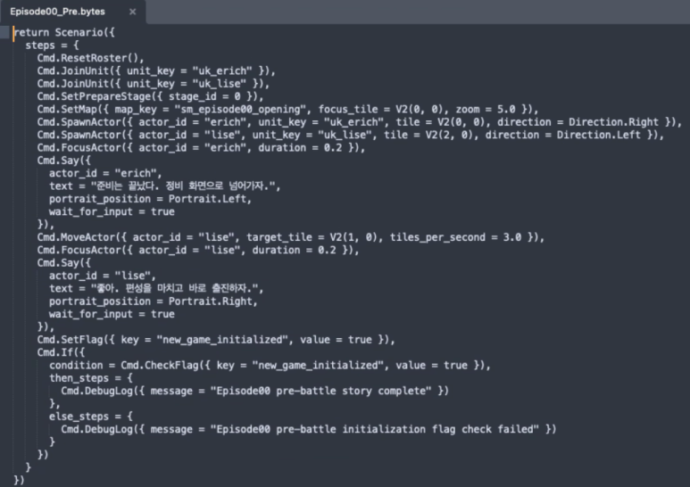
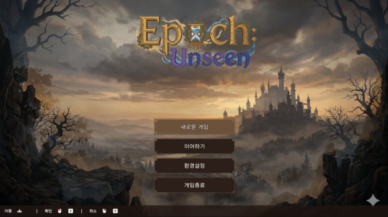
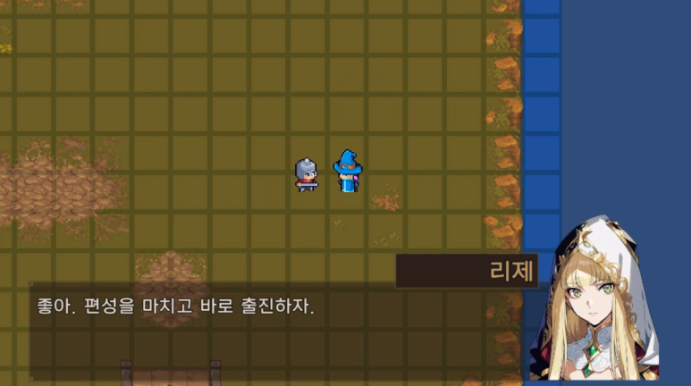
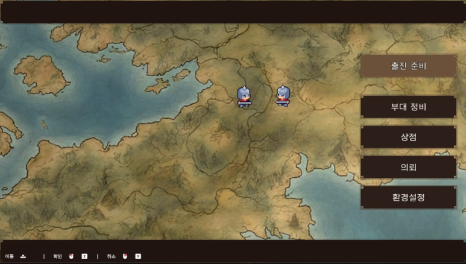
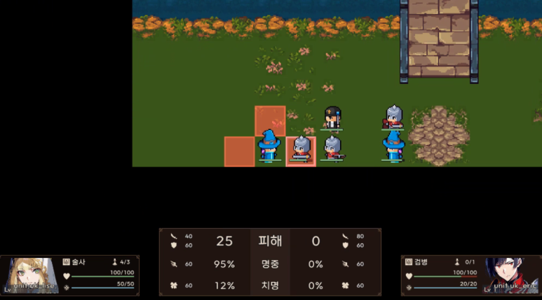
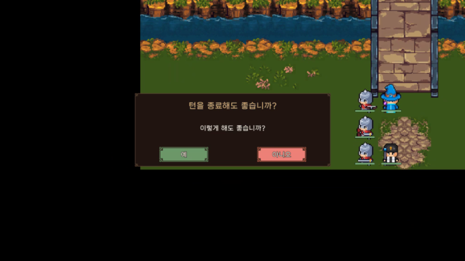
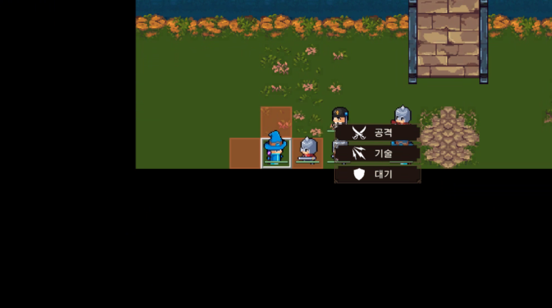

Major direction change: dropped Graph asset structure, reverted to text-based data. Also finalized the class tree, title screen, and maintenance UI in one push.

## Data Structure Change

Devlog 3 chose Graph format for battle formulas. Devlog 4 chose Graph for scenario scripts. Turns out Graph Assets aren't AI-friendly. AI can't edit them directly — humans have to do it by hand.

In hindsight, a wrong call. Trial and error.

Battle formulas went back to code. Scenario scripts switched to Lua.

Story script (R scene) written in Lua.

What I wanted was text-based: easy for both AI and humans to manage, easy to patch. Lua fits that purpose best right now.

## Class Tree

| Swordsman ├─ Duelist │ ├─ Blade Dancer │ └─ Executioner └─ Saber ├─ Sword Saint └─ Gale Blade | Lancer ├─ Crusher │ ├─ Destroyer │ ├─ Armor Breaker └─ Spearmaster ├─ Dragoon └─ Spear Saint | Shieldbearer ├─ Bulwark │ ├─ Fortress │ └─ Guardian └─ Ironclad ├─ Pavise └─ Phalanx |
| --- | --- | --- |
| Archer ├─ Sniper │ ├─ Tracker │ └─ Hawk Eye └─ Bowman ├─ Marksman └─ Bow Saint | Mage ├─ Elementalist │ ├─ Witch │ └─ Sage └─ Hexer ├─ Necromancer ├─ Inscriber └─ Arcanist | Cleric ├─ Inquisitor │ ├─ Enforcer │ └─ Penitent └─ Savior ├─ Saint └─ Martyr |

<video src="./img/devlog-7-02.mp4" controls loop muted playsInline />

Six base class trees, excluding special classes.

Swapped unit sprites within SPUM to something closer to my taste. Only placeholder mob animations for now — faction colors need more work. Using this as-is for a while.

Problem: mounted cavalry is hard to represent. Dropped the independent cavalry branch from this tree. Might attempt it later if time allows.

## Title and Maintenance Phase

Starting to look like a game. Haven't reached a full combat playthrough cycle yet.

UI is genuinely hard. Picked a color palette and applied it, but it still looks rough.

Gemini artifacts are too visible. Need to clean those up with a watermark removal tool later.

Placeholder story scene. The square grid shouldn't be visible.

Pre-sortie maintenance scene. Still deciding between field exploration and menu-driven approach.

This UI was the biggest headache. Got it cleaned up enough to feel satisfied.

## Alpha 1 Build Scope

Chapter 1 story is in rough draft. Rough means it'll keep changing through development. Incremental progress and revision beats trying to get it right in one shot.

Alpha 1 covers through mid-Chapter 1.

What happens when Alpha 1 ships?

Nothing. It's a self-imposed deadline and a goal.
