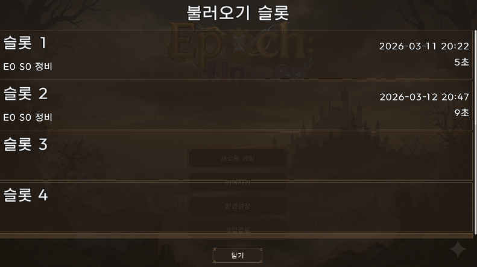
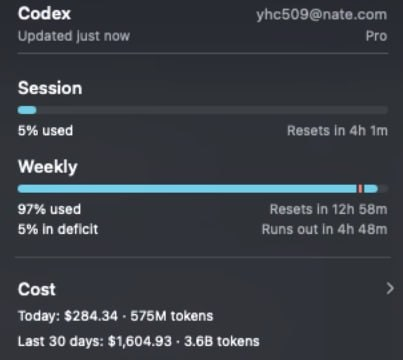

몇 주 동안 진도를 많이 뽑았다. 세이브 시스템, UI, 리팩토링, 시나리오까지 한꺼번에 진행했는데, 그 대가로 Codex 주간 사용량을 100% 찍었다.

## 세이브-로드

세이브 파일은 EasySave3를 사용했다. 파일 하나에 메타데이터와 본 데이터 두 계층으로 나눈다. 메타에는 세이브 버전, 빌드 버전, 플레이 시간, 현재 에피소드/스테이지 같은 가벼운 정보만 들어가고, 본 데이터에는 캠페인 진행 상태, 편성, 플래그, 전투 스냅샷이 들어간다. 슬롯 목록을 보여줄 때 전체 데이터를 로드하지 않아도 되게 하려는 의도다.

핵심은 버전 마이그레이션 파이프라인이다. 세이브 파일에 버전 번호를 기록해 두고, 로드 시점에 현재 버전과 다르면 자동 변환을 돌린다. V1에서는 캠페인, 로스터, 플래그, 전투를 별도 키로 저장했는데 V2에서 하나로 통합했다. `SaveVersionConverter1To2`가 V1 데이터를 읽어서 V2 구조로 조립한다. 나중에 V3가 필요하면 변환기 하나만 추가하면 된다.

쓰기는 임시 파일에 먼저 쓰고 성공하면 원본과 교체하는 atomic write 방식이다. 쓰다가 크래시가 나도 원본 세이브가 날아가지 않는다.

개발 초중반에 이걸 먼저 잡아 둔 건, 나중에 데이터 구조가 바뀔 때마다 "세이브 다 날려야 합니다"를 피하고 싶어서다.

## UI

UI는 계속 개선하고 있다. 끝이 없는 작업이다. 한 번 손대면 다른 곳도 눈에 들어오고, 그걸 또 고치면 옆에 있는 것도 거슬린다. 당분간은 기능 구현에 필요한 만큼만 잡고 넘어가는 게 맞겠다.

## 리팩토링 및 코드 규약 재정리

진도를 열심히 달렸더니 코드가 엉망이었다. Codex에게 규약을 제대로 정립시키지 않은 상태로 달린 패착이다.

바이브 코딩의 전형적인 함정이다. AI는 일관된 규약 없이도 돌아가는 코드를 잘 만들어 낸다. 잘 돌아가니까 문제를 못 느낀다. 그러다 쌓이면 한꺼번에 터진다.

가장 심했던 건 UI 바인딩이다. `OnValidate()`에서 바인딩하는 곳, `Init()`에서 하는 곳, `??=`로 지연 바인딩하는 곳이 파일마다 달랐다. Codex가 파일마다 제각각의 패턴으로 만들어 놓은 것이다.

규약을 새로 잡았다. UI 레퍼런스 바인딩은 전부 `SerializeData()`에서만 한다. 이벤트 연결은 `Init()`에서만 한다. 한 스크립트는 한 프리팹 형태만 책임진다. `Resources.Load` 호출도 `ResourceLoader`로 일원화했다. 이 규약을 39개 이상 파일에 걸쳐 적용하는 대규모 리팩토링을 거쳤다. 가장 큰 커밋은 파일 80개, 변경 2,800줄이었다.

처음부터 잡고 갔으면 이 시간을 아낄 수 있었다. 교훈이라면, AI에게 코드를 맡기기 전에 규약 문서를 먼저 만들어야 한다는 것이다. 코드 규약 문서와 코드베이스 리뷰 문서를 정리해서 Epoch-Docs에 넣어 뒀다.

## 시나리오

알파1 빌드의 시나리오를 구체적으로 작성했다. 주요 아군과 적군, 전투 컨셉도 정했다. 시스템 몇 가지를 구상해 뒀지만 이번 스펙에는 포함시키지 않아서, 조금 건조한 전투가 될 수도 있겠다. 밸런스 테스트는 이번엔 하지 않고, 사이클이 작동하는 것만 확인할 것이다.

## Codex 주간 사용량 초과

Epoch 작업을 하면서 사이드 프로젝트들이 계속 탄생한다. Codex 혼자 감당이 안 됐다. 이번 주에 Codex Pro($200/월) 주간 사용량 100%를 찍었다.

## Claude 귀환

Codex가 바닥나서 Claude($100/월)를 구원투수로 등판시켰다. 예전에 쓰던 OpenCode는 정책 위반 이슈가 있어서 사용하지 않고, Claude Code만 사용한다.

역할 분담은 이렇다. Claude Code가 커뮤니케이션과 디렉팅을 맡고, 코드 작업은 전부 Codex에게 위임한다. 이렇게 하면 Claude 사용량은 아슬아슬하고, Codex 사용량은 여유가 생긴다. GPT Plus($20/월)와 조합해도 될 것 같다.

카카오 GPT Pro 기간이 3개월 정도 남았다. 그 이후부터 AI 월 구독료는 $130. 지금 환율 기준 약 20만 원. 달러 현금흐름을 만들 필요성을 느낀다.

