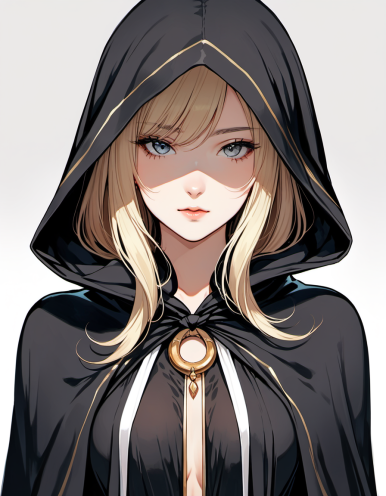

## 오래된 설정

지금으로부터 13년 전쯤, `천하`라는 모드를 만든 적이 있었다.

입대 전에 뭐라도 하나 완성해 보겠다고 2~3개월 정도 몰아서 만들었지만, 완성작이라고 하기는 민망한 상태로 끝났다.

제대하면 2부를 이어 만들 생각이었지만, 전역 뒤에는 그대로 취업 준비로 넘어갔다. 결국 그 설정은 그대로 덮였다.

## 다시 잡은 방향

이번에는 그 오래된 설정을 원안처럼만 가져와 새로 스토리를 쓰고 있다. 자료는 이미 전부 버려서 참고할 만한 것도 없고, 결국 머릿속에 남아 있는 기억을 토대로 다시 세우는 중이다.

배경도 삼국지에서 중세 판타지로 완전히 바뀌었다. 예전 것을 그대로 복원하는 게 아니라, 남아 있는 핵심만 가져와 Epoch: Unseen에 맞게 다시 정리하는 쪽에 가깝다.

## 임시 비주얼

에리히(Erich)와 리제(Lise) 비주얼도 임시로 잡았다. 일러스트는 SDXL로 뽑았고, 몇 번 돌려 본 뒤 당장 쓸 만한 결과를 골랐다.
