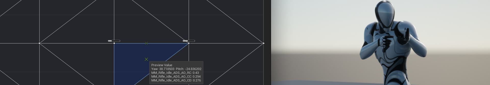
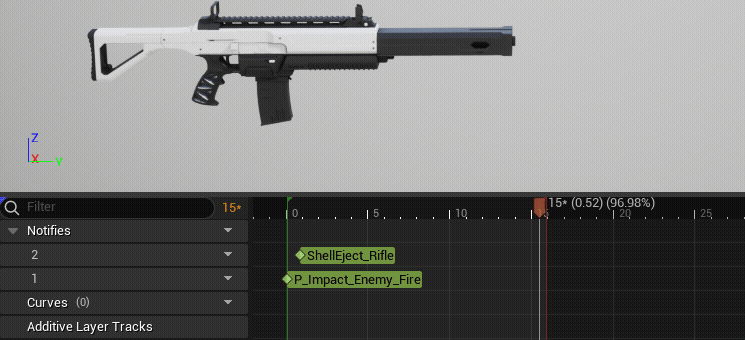
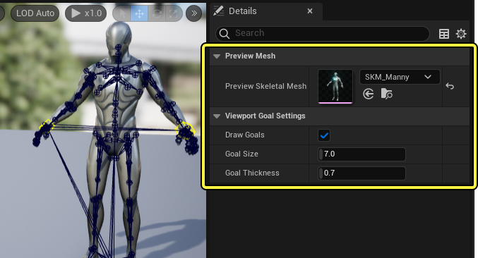
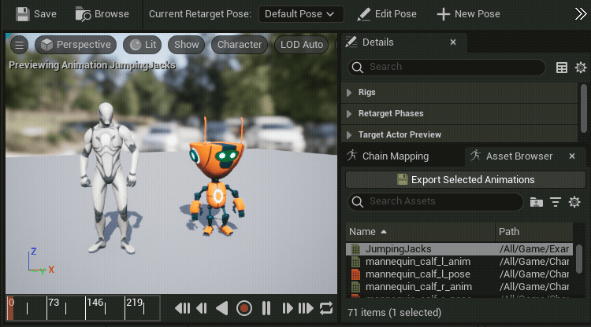

Kept putting off Unreal Engine. Finally started. Blueprints and Paper2D first, then 3D via a TPS sample. First wall: animation feature names. Heard all of them, couldn't tell where each fits.

Wrote down the ones I kept bumping into. Not a docs rewrite — how I distinguished them on first contact.

### Animation Montage

Montage clicked first. Not the looping locomotion side — this is for "play this action now." Attacks, skills, explicit playback.

In the TPS sample, attack combos and weapon swaps come to mind. Multiple sequences in one asset, with Blueprint controlling play timing and section jumps.

- [UE5 Documentation](https://dev.epicgames.com/documentation/en-us/unreal-engine/animation-montage-in-unreal-engine)

### Blend Space

Blend Space felt the opposite — less "play" and more "mix." Takes continuously changing values like speed or direction and blends poses accordingly.

Walk to run transitions, directional strafing — that's where it shows up. Initially confused with montages. The rule "if the value keeps changing, it's a blend space" cleared things up.

- [UE5 Documentation](https://dev.epicgames.com/documentation/en-us/unreal-engine/blend-spaces-in-unreal-engine)

### Aim Offset

The name felt intimidating, but in practice it's roughly "a blend space for aiming." Base pose stays, upper body aim layers on top.

Obvious why TPS needs it. Character moves continuously while the gun direction tracks up/down and left/right. Different use case from full-body locomotion blending.

- [UE5 Documentation](https://dev.epicgames.com/documentation/en-us/unreal-engine/aim-offset-in-unreal-engine)

### Animation Notify

Notify made more sense by usage than by name. Pin an event onto the animation timeline. More intuitive than computing timing in code.

Hit detection, footsteps, VFX, camera shake — immediately clear why notifies exist. At the beginner stage, being able to set timing while looking at frames mattered a lot.

- [UE5 Documentation](https://dev.epicgames.com/documentation/en-us/unreal-engine/animation-notifies-in-unreal-engine)

### IK Rig & IK Rig Retargeting

Most unfamiliar of the five. Hard to know where to start. For now I understand it as "preparation for reusing another character's animations."

As I understand it: IK Rig sets up a bone hierarchy for IK Solver use. Retargeting transfers motion to a different skeleton based on that setup. Makes sense when you think about reusing external animations or swapping characters.

- [UE5 Documentation](https://dev.epicgames.com/documentation/en-us/unreal-engine/unreal-engine-ik-rig)

---

### Summary

UE5 animation felt more complex than it is because of the number of named features. My current split: explicit playback → Montage. Value-driven blending → Blend Space. Aim-only overlay → Aim Offset. Timeline events → Notify. Cross-skeleton motion transfer → IK Rig + Retargeting.

Still a beginner. But connecting each feature to its role in the TPS sample was far faster than memorizing definitions.
