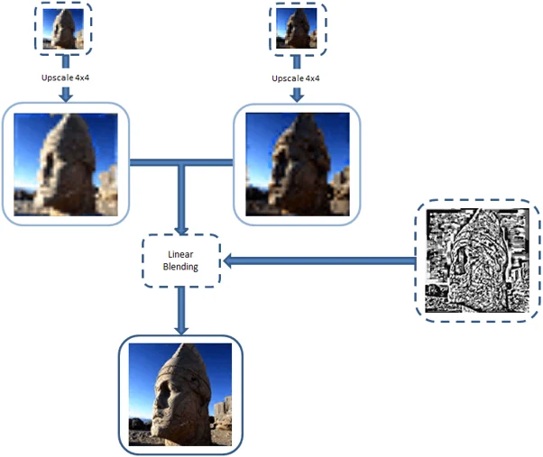
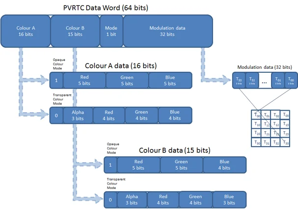
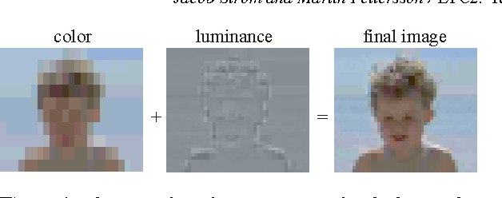

## Texture
- 텍스쳐 병목은 주로 메모리 대역폭에 의해 발생
    - 모바일은 대역폭이 상당히 적게 되어 있음
    - 발열이 심해지면 자동으로 성능을 낮추는 쓰로틀링도 적용되어 있어서 까다로움
    - 높은 해상도 = 큰 용량 = 대역폭 병목의 원인이 될 수 있다
    - Edit - Project Settings - Quality - Rendering 에서 전체 텍스쳐 해상도를 줄일 수 있음
- 텍스처는 블럭 형태의 손실 압축 기법을 사용
- Bit Per Pixel = 1픽셀에 들어가는 비트
- bpp를 반으로 줄이면 퀄리티는 그 이상으로 줄어든다
    - 8bpp = 한 색상에 256색 = 256 * 256 * 256 = 16,777,216색 표현 가능
    - 4bpp = 한 색상에 16색 = 16 * 16 * 16 = 4096색 표현 가능
- JPG, PNG 같은 포맷은 텍스쳐 압축 포맷으로 사용할 수 없음
    - GPU가 읽을 수 있도록 메모리에 올리는 순간 압축을 풀기 때문.
    - GPU가 읽을 수 있는 방식의 압축 포맷을 사용해야 한다.
- 하드웨어마다 지원하는 압축 포맷이 다름.
- GPU는 특정 위치의 텍셀을 바로 읽어와야 한다 = 랜덤 액세스가 필수적
    - PNG에서 사용하는 가변 비율 방식의 인코딩은 적합하지 않음!
    - 가변 비율이란 "AAAAAAAAABBBBBBBCCCC" => "9A7B4C" 같은 방식
    - 그렇기 때문에 고정 비율로 블록 방식의 인코딩 방식을 사용
- 인코딩 시간은 상관없지만 디코딩이 오래 걸리면 안 된다.
    - 퀄리티는 떨어지지 않고 압축 효율이 높으면서 디코딩이 복잡하지 않으려면 -> 어쩔 수 없이 원본 데이터에서 손실을 발생하더라도 감수한다.

---

## PVRTC (PowerVR Texture Compression)
- 2004년 발표된 텍스처 손실 압축 포맷.
- PowerVR 칩에서만 지원한다. 주로 아이폰, 아이패드 등 iOS 기기에서 쓰임.
- 2bpp / 4bpp 정밀도
- PVRTC1 / PVRTC2 버전
    - PVRTC2는 아이폰, 아이패드에서 지원하지 않고, 유니티도 지원하지 않음.
- 알파 채널이 없는 텍스쳐, 있는 텍스쳐 모두 지원
    - 알파 채널이 없는 텍스처는 알파 영역이 없는 만큼 RGB 데이터의 정밀도가 향상된다.

- 두 개의 저해상도 이미지 + 보정 정보 데이터로 이루어짐
- 원본 이미지를 4 x 4 (혹은 8 x 4) 블럭으로 나누고, 블럭마다 64비트 데이터를 사용하도록 압축시킴

- 데이터를 블럭 단위로 인코딩 / 디코딩하기 때문에 블럭 단위가 드러날 수 있음
    - 인접한 블럭의 대표 컬러 간에 선형 보간을 하여 블럭화 현상을 완화
- DXT와 비슷하지만, DXT에는 블럭 대표 컬러에 대한 선형 보간이 없다.
- 만화풍의 스프라이트나 아이콘, UI에는 좋지 않은 결과를 보여줌.

---

## ETC (Ericsson Texture Compression)
- Ericsson에서 PACKMAN이라는 압축 포맷을 개량하여 2005년에 발표한 손실 압축 포맷
- 크로노스 그룹에 의해 OpenGL ES 표준으로 지정됨.
- 안드로이드 기기에서는 거의 모든 하드웨어가 ETC 포맷을 지원함.
- ETC1 / ETC2 버전
    - ETC2는 ETC1에서 처리할 수 없었던 알파 채널을 지원. 퀄리티 보완을 위한 데이터가 추가됨.
    - ETC2는 OpenGL ES 3.0 이상부터 지원
- 사람의 눈이 색차보다 휘도에 더 민감하다는 사실에 기인하여 만들어진 알고리즘
    - 인코딩할 때 데이터를 색상 정보와 휘도 정보로 나누어 저장 -> 디코딩할 때 조합.
    - 색상 정보는 텍셀을 묶어서 압축, 휘도는 텍셀마다 저장.

---

## ASTC (Adaptive Scalable Texture Compression)
- ARM에서 개발. 2012년에 크로노스 그룹에서 OpenGL ES 표준으로 지정.
- 품질을 8bpp ~ 0.86bpp 까지 조절할 수 있다.
    - 가변 블록 사이즈 : 4x4 ~ 12x12
    - 퀄리티가 중요하면 4x4 / 뭉게져도 되면 12x12
- 인코딩 과정이 ETC에 비해 복잡하지만 일반적으로 품질이 더 좋다.
- 안드로이드와 iOS 모두 지원
    - 안드로이드 : OpenGL ES 3.2 / OpenGL ES 3.1 + AEP 지원하는 기기
    - iOS Metal 지원하는 A8 이상 기기.
    - 현 시점에서는 사실상 모두 다 지원한다고 봐도 됨.

---

## 16비트 디더링
- RGBA32를 그대로 사용하는 것은 비추. RGBA16으로 내리고 디더링을 사용하기도 함.
- 손실 압축으로 인한 퀄리티 열화를 완화시켜주는 기법
- 인접한 픽셀을 섞어서 배치하여 최대한 경계를 줄인다.

---

## 밉맵 (Mipmap)
- Mipmap을 쓰면 런타임 성능은 향상되지만 메모리가 약 33% 증가함
- 텍스처가 매우 작은 영역으로 그려져서 큰 텍스쳐가 필요 없다 -> 밉맵 끄자
- UI 텍스쳐 -> 밉맵 끄자
- 텍스쳐의 Generate Mip Maps 체크 해제.

---

## 그 외
- 텍스쳐 사이즈는 2의 n승으로 잡자.
- Max Size를 잘 조절하자.
- Read/Write Enable 옵션이 켜져있으면 CPU 메모리에도 상주하니 필요 없으면 끄자.

---

## 참고 자료
- [유니티 에반젤리스트의 유니티 그래픽스 최적화 스타트업](https://www.yes24.com/Product/Goods/67305196)
- [PVRTC: the most efficient texture compression standard for the mobile graphics world](https://blog.imaginationtech.com/pvrtc-the-most-efficient-texture-compression-standard-for-the-mobile-graphics-world/)
