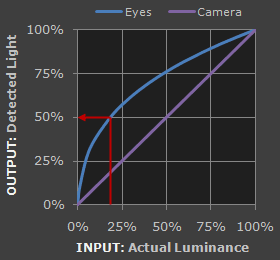
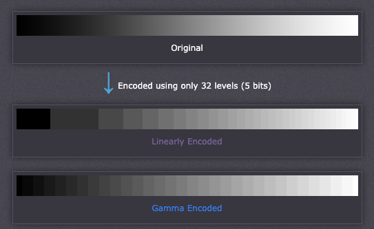
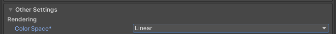
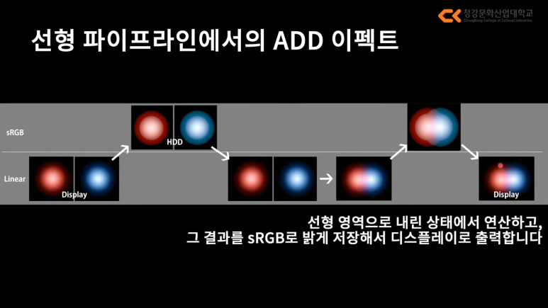
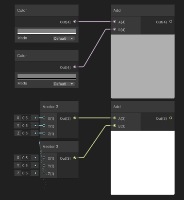
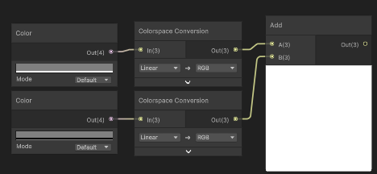

### 감마 보정
> 비디오 카메라, 컴퓨터 그래픽 등에서 비선형 전달 함수를 사용하여 빛의 강도 신호를 비선형적으로 변형하는 것을 말한다.
> 
> 인간의 시각은 **베버의 법칙**에 따라 밝기에 대해 비선형적으로 반응한다.
> 이 때문에 예를 들어 채널 당 8 bit와 같이 한정된 정보표현량안에서 선형적으로 빛의 밝기를 기록하면,
> 사람의 눈이 민감하게 반응하는 어두운 부분의 경우 밝기가 변할 때 부드럽게 느껴지지 않고 단절되어 보이는 현상이 발생한다.

### 베버의 법칙
> 어떤 자극에 대하여 자극의 세기가 변했다는 것을 느끼려면 처음 주어진 자극과 일정한 크기 이상의 차이가 나는 자극이 주어져야 합니다. 자극의 변화를 느낄 수 있는 최소 변화량은 처음 자극의 세기에 비례하는데, 이를 베버의 법칙이라 하지요.

사람의 눈은 빛의 세기에 대하여 숫자의 선형적 변화를 그대로 받아들이지 못한다. 사람이 느끼기에 "선형적으로 보이게" 보정이 필요한데, 이 때 하는 것이 **감마 보정**이다.

카메라에 비해 우리의 눈은 어두운 것의 변화에 더 민감하게 반응한다. 실제 어두운 것보다 밝게 느끼며, 조금만 변해도 단절된 것으로 느끼게 된다.

컴퓨터 모니터는 기본적으로 우리의 눈에 "선형적으로 보이게" 하기 위해서 일종의 보정을 통해 더 어둡게 만들어 주고 있다.

`y = x^2.2`

사진, 텍스쳐 같은 이미지들이 원본 상태로 저장된다면 모니터가 보정을 하여 어둡게 되는데, 우리 눈에는 원본보다 더 어둡게 보여야 할 것이다. 하지만 실제로는 그렇지 않다.
 이미지가 저장될 때 애시당초 원본보다 밝게 보정한 상태로 저장하기 때문이다.

따라서 모니터가 어둡게 보정을 하더라도, 이미 밝게 저장되어 있기 때문에, 어두워지더라도 사람 눈에는 원본 그대로인 것처럼 보인다.

이 보정 방법에는 여러가지가 있는데 표준으로 많이 쓰는 것이 바로 **sRGB Color Space** 이다.

`y = x^0.45`

### sRGB
> sRGB는 1996년에 미국의 컴퓨터 기업인 마이크로소프트와 HP가 협력하여 만든 모니터 및 프린터 표준 RGB 색 공간이다. IEC에 의해 IEC 61966-2-1:1999로 최종 표준화되었다. 색 공간 정보가 없는 이미지에 대한 기본 색 공간으로 종종 사용된다.

---

## 유니티에서의 감마 보정

URP 기본 Color Space 옵션은 Linear와 Gamma가 있는데, 기본 세팅은 Linear이다.

옛날에는 선형(Linear) 파이프라인을 지원하지 않는 디바이스가 많았는데 이제는 신경쓰지 않아도 된다.

선형 파이프라인에서 감마 보정은 아래와 같은 순서에 따라 이루어진다.

1. 밝게 저장된 이미지들을 원본 상태로 복구 시킨다. (sRGB -> Linear)

2. 계산을 한다.

3. 다시 밝게 만든다. (Linear -> sRGB)

4. 모니터에 디스플레이된다 (sRGB -> Linear)

그러므로 셰이더에서 Color를 다룰 때 조심해야한다. 아래의 예제를 보자.

Color(0.5, 0.5, 0.5)는 딱 중간의 회색이다.

Color(0.5, 0.5, 0.5) + Color(0.5, 0.5, 0.5) = Color(1.0, 1.0, 1.0) 이기에 흰색이 나와야할 것 같지만, 어중간한 회색이 나온다.

반면에 Vector로 넣을 때는 기대한 대로 흰색이 나온다.

프로젝트의 Color Space가 Linear이기 때문에 올바른 계산을 위해서는 **Color Conversion**을 시켜주어야 한다.

유니티 내부 구현 방식이 어떻게 되어 있는지 정확히는 모르겠으나, 추측해보면 이렇다.

- 셰이더 그래프의 색은 우리 눈에 보이는 것보다 더 어두운 색이 밝게 보정된 결과다.

- 어두운 회색을 더해도 실제로는 흰색이 될 수 없다.

- 색상을 sRGB 영역으로 보정한 후 계산식에 들어가야 한다.

---

## 참고 자료
- [Cambridge In Colour](https://www.cambridgeincolour.com/tutorials/gamma-correction.htm)
- [Gamma가 어디 Gamma - Unity Korea Youtube](https://youtu.be/Xwlm5V-bnBc?si=mE10FiL2s3nmuMIn)

---