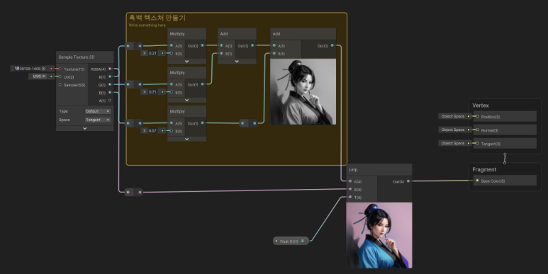

셰이더 공부를 하고 있다.

[대마왕의 유니티 URP 셰이더 그래프 스타트업 - Yes24](https://www.yes24.com/Product/Goods/117747780)

아티스트를 위해 쓴 책이라고 하는데 그래픽에 관심 있는 프로그래머가 봐도 도움이 된다.

이 책의 7-3 챕터에 있는 문제를 풀어보자.

---

> 텍스쳐 한 장만 받아서, lerp를 이용해 텍스쳐가 컬러에서 흑백으로 변하는 기능을 만들려면 어떻게 해야할까요? **Saturation 노드를 사용하지 않고 만들어 보도록 합시다**
>
> 대마왕의 유니티 URP 셰이더 그래프 스타트업 - 191P

- Float 입력값에 따라 텍스쳐가 컬러에서 흑백으로, 흑백에서 컬러로 바뀌어야 한다.

- 그럼 일단 텍스쳐를 두 종류로 쪼개보자.
    - 흑백은 R*0.21 , G*0.71, B*0.07을 곱하면 흑백 텍스쳐가 된다. (책 내용 참고)

    - 컬러는 입력받은 것 그대로 가면 된다.

- 두 텍스쳐를 Lerp로 입력받는다. A에 흑백, B에 컬러, T에 Float (0~1 Slider)

    - Lerp(A,B,T)는 T의 값에 따라 A~B를 보간한다. (선형보간)

- Slider를 조절해본다. 완료.

---