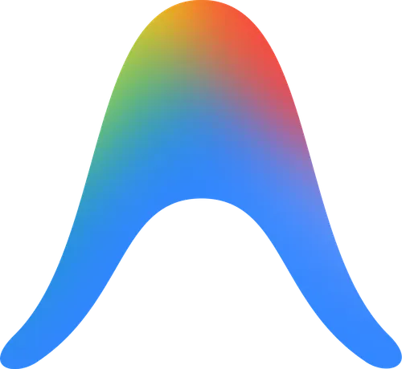

### Antigravity
- 구글에서 2025년 11월 18일 공개한 AI Agent 기반 IDE.
- [Antigravity](https://antigravity.google/)

### Blog Renewal
- Antigravity를 사용하여 Blog를 리뉴얼하였다. 기존의 코드는 버리고 처음부터 완전히 다시 작성했다.
- 코드 한 줄도 직접 작성하지 않았고, 모든 것을 Antigravity에게 맡겼다. (Gemini 3 Pro)
- Gemini 3 Pro는 처음에는 똑똑하고 신기했지만, 요구사항이 변경될 수록 조금 아쉬운 모습을 보여줬다.
- 하지만 VibeCoding에 대해서는 긍정적인 시선을 갖게 되었다. 원래는 회의적이었는데 생각이 바뀌었다.
- 1년 뒤, 2년 뒤가 두려우면서도 기대가 된다.