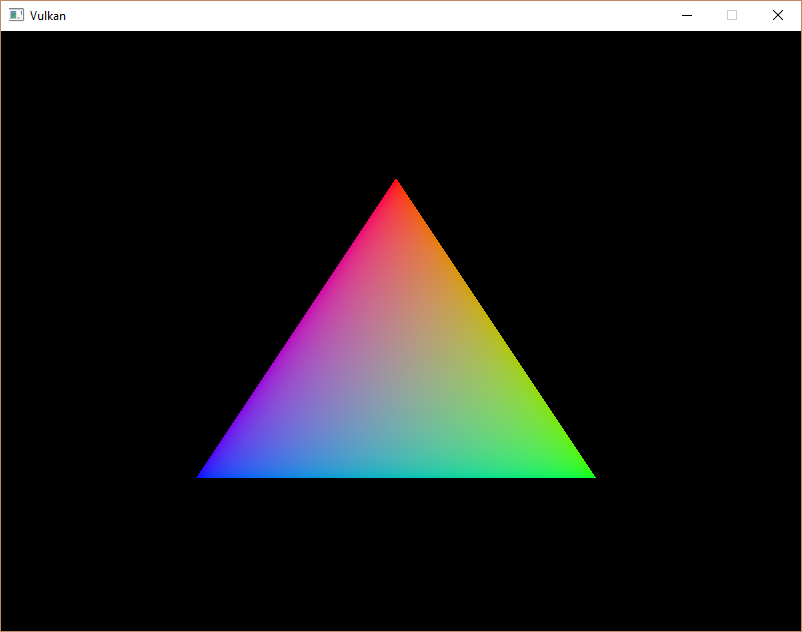
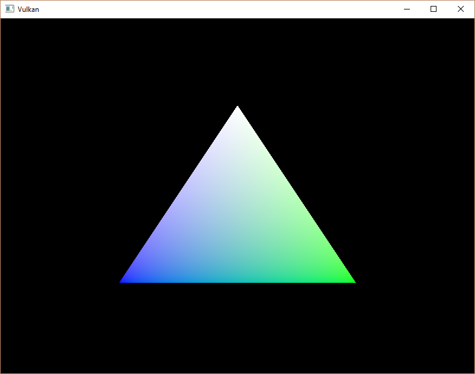

-[Khronos Vulkan Tutorial](https://docs.vulkan.org/tutorial/latest/00_Introduction.html)

# 소개
Vulkan의 버퍼는 그래픽 카드에서 읽을 수 있는 임의의 데이터를 저장하는데 사용되는 메모리 영역입니다. 이것들은 우리가 이 챕터에서 할 정점 데이터를 저장하는데 사용할 수 있지만, 향후 챕터에서 탐색할 다른 많은 목적들에도 사용할 수 있습니다. 지금까지 다루었던 Vulkan 객체와 다르게, 버퍼는 자동으로 메모리를 할당하지 않습니다. 이전 챕터의 작업은 Vulkan API가 프로그래머로 하여금 거의 모든 것을 제어할 수 있도록 하며, 메모리 관리가 그 중 하나라는 것을 보여주었습니다.

# 버퍼 생성

`createVertexBuffer` 함수를 만들고 `initVulkan`에서 `createCommandBuffers` 전에 호출하도록 합니다.

```cpp
void initVulkan() {
    createInstance();
    setupDebugMessenger();
    createSurface();
    pickPhysicalDevice();
    createLogicalDevice();
    createSwapChain();
    createImageViews();
    createRenderPass();
    createGraphicsPipeline();
    createFramebuffers();
    createCommandPool();
    createVertexBuffer();
    createCommandBuffers();
    createSyncObjects();
}

...

void createVertexBuffer() {

}
```

버퍼를 생성하려면 [`VkBufferCreateInfo`](https://www.notion.so/Vertex-buffers-Vertex-buffer-creation-9c6f9fab5b234167b7fecf25297b4c0b?pvs=21) 구조체를 채워야 합니다.

```cpp
VkBufferCreateInfo bufferInfo{};
bufferInfo.sType = VK_STRUCTURE_TYPE_BUFFER_CREATE_INFO;
bufferInfo.size = sizeof(vertices[0]) * vertices.size();
```

첫번째 필드는 구조체의 `size`입니다. 바이트 단위로 버퍼의 크기를 지정합니다. 정점 데이터의 바이트 크기를 계산하는 것은 `sizeof`로 간단히 할 수 있습니다.

```cpp
bufferInfo.usage = VK_BUFFER_USAGE_VERTEX_BUFFER_BIT;
```

두번째 필드는 `usage`입니다. 버퍼의 데이터가 사용되는 목적을 나타냅니다. 비트 or연산으로 다양한 목적을 지정할 수 있습니다. 우리의 경우 정점 버퍼가 될 것이며, 향후 챕터에서 다른 유형을 살펴보겠습니다.

```cpp
bufferInfo.sharingMode = VK_SHARING_MODE_EXCLUSIVE;
```

스왑체인의 이미지와 마찬가지로, 버퍼는 특정 큐 패밀리가 소유하거나 여러 큐에서 동시에 소유할 수 있습니다. 버퍼는 그래픽 큐에서만 사용될 것이므로 독점 엑세스를 유지할 수 있습니다.

`flags` 매개변수는 지금은 관련이 없는 희소 버퍼 메모리를 구성하는데 사용됩니다. 기본값 `0`으로 두겠습니다.

이제 vkCreateBuffer로 버퍼르 생성할 수 있습니다. 버퍼 핸들을 보유하고 호출할 클래스 멤버 `vertexBuffer`를 정의하세요.

```cpp
VkBuffer vertexBuffer;

...

void createVertexBuffer() {
    VkBufferCreateInfo bufferInfo{};
    bufferInfo.sType = VK_STRUCTURE_TYPE_BUFFER_CREATE_INFO;
    bufferInfo.size = sizeof(vertices[0]) * vertices.size();
    bufferInfo.usage = VK_BUFFER_USAGE_VERTEX_BUFFER_BIT;
    bufferInfo.sharingMode = VK_SHARING_MODE_EXCLUSIVE;

    if (vkCreateBuffer(device, &bufferInfo, nullptr, &vertexBuffer) != VK_SUCCESS) {
        throw std::runtime_error("failed to create vertex buffer!");
    }
}
```

버퍼는 프로그램이 끝날 때까지 명령을 렌더링하는데 사용할 수 있어야 하며 스왑체인에 의존하지 않으므로, `cleanup` 함수에서 정리합니다.

```cpp
void cleanup() {
    cleanupSwapChain();

    vkDestroyBuffer(device, vertexBuffer, nullptr);

    ...
}
```

# 메모리 요구사항

버퍼가 생성되었지만, 아직 실제로 할당된 메모리가 없습니다. 버퍼에 메모리를 할당하는 첫번째 단계는 [`vkGetBufferMemoryRequirements`](https://www.notion.so/Vertex-buffers-Vertex-buffer-creation-9c6f9fab5b234167b7fecf25297b4c0b?pvs=21)라는 함수를 사용하여 메모리 요구사항을 쿼리하는 것입니다.

```cpp
VkMemoryRequirements memRequirements;
vkGetBufferMemoryRequirements(device, vertexBuffer, &memRequirements);
```

[`VkMemoryRequirements`](https://www.notion.so/Vertex-buffers-Vertex-buffer-creation-9c6f9fab5b234167b7fecf25297b4c0b?pvs=21) 구조체는 세 개의 필드를 가지고 있습니다:

- `size`: 필요한 메모리 바이트 크기는 `bufferInfo.size`와 다를 수 있습니다.
- `alignment`: 버퍼가 할당된 메모리 영역에서 시작하는 오프셋은 `bufferInfo.usage`와 `bufferInfo.flags`에 따라 다릅니다.
- `memoryTypeBits`: 버퍼에 적합한 메모리 타입의 비트 필드.

그래픽 카드는 할당할 다양한 유형의 메모리를 제공할 수 있습니다. 각 메모리 유형은 허용되는 작업 및 성능 특성측면에서 다릅니다. 사용할 올바른 유형의 메모리를 찾으려면 버퍼 요구 사항과 어플리케이션 요구 사항을 결합해야 합니다. 이를 위해 새 함수 `findMemoryType`을 만듭시다.

```cpp
uint32_t findMemoryType(uint32_t typeFilter, VkMemoryPropertyFlags properties) {

}
```

먼저 사용 가능한 메모리 유형에 대한 정보를 [`vkGetPhysicalDeviceMemoryProperties`](https://www.notion.so/Vertex-buffers-Vertex-buffer-creation-9c6f9fab5b234167b7fecf25297b4c0b?pvs=21)를 사용하여 쿼리합니다.

```cpp
VkPhysicalDeviceMemoryProperties memProperties;
vkGetPhysicalDeviceMemoryProperties(physicalDevice, &memProperties);
```

[`VkPhysicalDeviceMemoryProperties`](https://www.notion.so/Vertex-buffers-Vertex-buffer-creation-9c6f9fab5b234167b7fecf25297b4c0b?pvs=21) 구조체는 두개의 배열 `memoryTypes`와 `memoryHeaps`가 있습니다. 메모리 힙은 전용 VRAM과 VRAM이 부족할 때 RAM의 스왑 공간과 같은 고유한 메모리 리소스입니다. 이러한 힙에는 다양한 유형의 메모리가 있습니다. 지금은 메모리 유형에만 관심이 있고 메모리가 가져온 힙에는 관심이 없지만 이것이 성능에 영향을 미칠 수 있다고 상상할 수 있습니다.

먼저 버퍼 자체에 적합한 메모리 유형을 찾아보겠습니다:

```cpp
for (uint32_t i = 0; i < memProperties.memoryTypeCount; i++) {
    if (typeFilter & (1 << i)) {
        return i;
    }
}

throw std::runtime_error("failed to find suitable memory type!");
```

`typeFilter` 매개변수는 적합한 메모리 유형의 비트 필드를 지정하는데 사용됩니다. 즉, 단순히 반복하면서 해당 비트가 `1`로 설정되어있는지 확인하여 적절한 메모리 유형의 인덱스를 찾을 수 있습니다.

그러나 정점 버퍼에 적합한 메모리 유형에만 관심이 있는 것은 아닙니다. 또한 정점 데이터를 해당 메모리에 쓸 수 있어야 합니다. `memoryTypes` 배열은 각 메모리 타입의 힙과 속성을 지정하는 [`VkMemoryType`](https://www.khronos.org/registry/vulkan/specs/1.0/man/html/VkMemoryType.html) 구조체로 구성됩니다. 속성은 CPU에서 메모리에 쓸 수 있도록 매핑할 수 있는 메모리 특수 기능을 정의합니다. 이 속성은 `VK_MEMORY_PROPERTY_HOST_VISIBLE_BIT`로 표시되지만 `VK_MEMORY_PROPERTY_HOST_COHERENT_BIT`속성도 사용해야 합니다. 메모리를 매핑할 때 그 이유를 알 것입니다.

이제 루프를 수정하여 이 속성의 지원도 체크할 수 있습니다:

```cpp
for (uint32_t i = 0; i < memProperties.memoryTypeCount; i++) {
    if ((typeFilter & (1 << i)) && (memProperties.memoryTypes[i].propertyFlags & properties) == properties) {
        return i;
    }
}
```

하나 이상의 원하는 속성이 있을 수 있으므로, 비트 AND의 결과가 0이 아니라 원하는 속성의 필드와 같은지 확인해야 합니다. 필요한 모든 속성을 포함하는 버퍼에 적합한 메모리 유형이 있으면, 해당 인덱스를 반환하고 그렇지 않으면 예외를 throw합니다.

# 메모리 할당

이제 올바른 메모리 타입을 결정할 수 있는 방법이 있으므로, [`VkMemoryAllocateInfo`](https://www.khronos.org/registry/vulkan/specs/1.0/man/html/VkMemoryAllocateInfo.html) 구조체를 채워서 실제로 메모리를 할당할 수 있습니다.

```cpp
VkMemoryAllocateInfo allocInfo{};
allocInfo.sType = VK_STRUCTURE_TYPE_MEMORY_ALLOCATE_INFO;
allocInfo.allocationSize = memRequirements.size;
allocInfo.memoryTypeIndex = findMemoryType(memRequirements.memoryTypeBits, VK_MEMORY_PROPERTY_HOST_VISIBLE_BIT | VK_MEMORY_PROPERTY_HOST_COHERENT_BIT);
```

메모리 할당은 이제 정점 버퍼의 메모리 요구 사항과 원하는 속성에서 파생된 크기와 타입을 지정하는 것 만큼 간단합니다. 핸들을 메모리에 저장하고 할당할 [`vkAllocateMemory`](https://www.khronos.org/registry/vulkan/specs/1.0/man/html/vkAllocateMemory.html) 클래스 멤버를 만듭니다.

```cpp
VkBuffer vertexBuffer;
VkDeviceMemory vertexBufferMemory;

...

if (vkAllocateMemory(device, &allocInfo, nullptr, &vertexBufferMemory) != VK_SUCCESS) {
    throw std::runtime_error("failed to allocate vertex buffer memory!");
}
```

메모리 할당이 성공했다면, 이제 [`vkBindBufferMemory`](https://www.khronos.org/registry/vulkan/specs/1.0/man/html/vkBindBufferMemory.html)를 사용하여 메모리를 버퍼에 연결할 수 있습니다:

```cpp
vkBindBufferMemory(device, vertexBuffer, vertexBufferMemory, 0);
```

처음 세 개의 매개변수는 그 자체로 설명이 되고, 네번째 매개변수는 메모리 영역 내의 오프셋입니다. 이 메모리는 정점 버퍼를 위해 특별히 할당되었기 때문에, 오프셋은 간단하게 `0`입니다. 만약 오프셋이 0이 아니면 `memRequiremets.alignment`로 나눌 수 있어야 합니다.

물론 C++의 동적 메모리 할당과 마찬가지로, 메모리는 어느 시점에 해제되어야 합니다. 버퍼 객체에 바인딩된 메모리는 버퍼가 더 이상 사용되지 않으면 해제될 수 있으므로, 버퍼가 파괴된 후에 해제합니다.

```cpp
void cleanup() {
    cleanupSwapChain();

    vkDestroyBuffer(device, vertexBuffer, nullptr);
    vkFreeMemory(device, vertexBufferMemory, nullptr);
```

# 정점 버퍼 채우기

이제 정점 데이터를 버퍼에 복사할 시간입니다. [`vkMapMemory`](https://www.khronos.org/registry/vulkan/specs/1.0/man/html/vkMapMemory.html)로 버퍼 메모리를 CPU 접근 가능 메모리에 매핑하여 수행됩니다.

```cpp

void* data;
vkMapMemory(device, vertexBufferMemory, 0, bufferInfo.size, 0, &data);
```

이 함수를 사용하면 오프셋의 크기로 지정된 메모리 리소스 영역에 엑세스할 수 있습니다. 오프셋과 크기는 각각 `0`과 `bufferInfo.size`입니다. 모든 메모리를 매핑하는 특별한 값 `VK_WHOLE_SIZE`를 지정하는 것도 가능합니다. 마지막에서 두번째 변수는 플래그를 지정할 수 있지만 현재 API에서는 아직 사용할 수 없습니다. 이 값은 `0`이여야만 합니다. 마지막 매개변수는 매핑된 메모리에 대한 포인터를 출력합니다.

```cpp
void* data;
vkMapMemory(device, vertexBufferMemory, 0, bufferInfo.size, 0, &data);
    memcpy(data, vertices.data(), (size_t) bufferInfo.size);
vkUnmapMemory(device, vertexBufferMemory);
```

이제 정점 데이터를 매핑된 메모리에 `memcpy`하고 [`vkUnmapMemory`](https://www.notion.so/Vertex-buffers-Vertex-buffer-creation-9c6f9fab5b234167b7fecf25297b4c0b?pvs=21)를 사용하여 다시 매핑을 해제할 수 있습니다. 불행히도 드라이버는 데이터를 버퍼에 즉시 복사하지 않을 수 있습니다. 예를 들면 캐싱 때문입니다. 버퍼에 대한 쓰기가 아직 매핑된 메모리에 나타나지 않을 수도 있습니다. 이 문제를 해결하는데 두 가지 방법이 있습니다: 

- `VK_MEMORY_PROPERTY_HOST_COHERENT_BIT`로 호스트 일관성 있는 메모리 힙 사용
- 매핑된 메모리 작성 후 [`vkFlushMappedMemoryRanges`](https://www.khronos.org/registry/vulkan/specs/1.0/man/html/vkFlushMappedMemoryRanges.html) 호출을 하고,  매핑된 메모리 읽기 전에 [`vkInvalidateMappedMemoryRanges`](https://www.notion.so/Vertex-buffers-Vertex-buffer-creation-9c6f9fab5b234167b7fecf25297b4c0b?pvs=21)를 호출하기

우리는 첫번째 방법을 선택했습니다. 매핑된 메모리가 할당된  메모리와 일치하도록 합니다. 이것은 명시적인 플러시보다 약간 성능이 나빠질 수 있다는 것을 기억하세요. 하지만 이것이 중요하지 않은 이유를 다음 챕터에서 보겠습니다.

메모리 영역을 플러시하거나 일관된 메모리 힙을 사용하는 것은 드라이버가 버퍼에 대한 쓰기를 인식한다는 것을 의미합니다. 하지만 아직 GPU에서 실제로 볼 수 있다는 것은 아닙니다. GPU로 데이터 전송은 백그라운드에서 발생하는 작업이며 사양은 다음 [`vkQueueSubmit`](https://www.notion.so/Vertex-buffers-Vertex-buffer-creation-9c6f9fab5b234167b7fecf25297b4c0b?pvs=21) 호출 시점에 완료가 보장된다는 것을 의미합니다.

# 정점 버퍼 바인딩

이제 남은 것은 렌더링 작업 동안 정점 버퍼를 바인딩하는 것입니다. `recordCommandBuffer` 함수를 확장하겠습니다.

```cpp
vkCmdBindPipeline(commandBuffer, VK_PIPELINE_BIND_POINT_GRAPHICS, graphicsPipeline);

VkBuffer vertexBuffers[] = {vertexBuffer};
VkDeviceSize offsets[] = {0};
vkCmdBindVertexBuffers(commandBuffer, 0, 1, vertexBuffers, offsets);

vkCmdDraw(commandBuffer, static_cast<uint32_t>(vertices.size()), 1, 0, 0);
```

[`vkCmdBindVertexBuffers`](https://www.notion.so/Vertex-buffers-Vertex-buffer-creation-9c6f9fab5b234167b7fecf25297b4c0b?pvs=21) 함수는 이전 챕터에서 설정한 것 같이 정점 버퍼를 바인딩하는데 사용합니다. commandBuffer를 제외한 처음의 두 매개변수는 정점 버퍼를 지정할 오프셋과 바인드 수를 지정합니다. 마지막 두 매개변수는 바인딩할 정점 버퍼의 배열과 정점 데이터 읽기를 시작할 바이트 오프셋을 지정합니다. 또한 [`vkCmdDraw`](https://www.notion.so/Vertex-buffers-Vertex-buffer-creation-9c6f9fab5b234167b7fecf25297b4c0b?pvs=21)를 하드 코딩된 숫자 `3`이 아닌 버퍼의 정점 수를 전달하도록 변경해야 합니다.

이제 프로그램을 실행하면 익숙한 삼각형이 다시 표시됩니다:



`vertices` 배열을 수정하여 상단 정점의 색을 흰색으로 바꿔보세요:

```cpp
const std::vector<Vertex> vertices = {
    {{0.0f, -0.5f}, {1.0f, 1.0f, 1.0f}},
    {{0.5f, 0.5f}, {0.0f, 1.0f, 0.0f}},
    {{-0.5f, 0.5f}, {0.0f, 0.0f, 1.0f}}
};
```

프로그램을 다시 실행하면 다음과 같이 표시됩니다:



다음 챕터에서는 정점 데이터를 정점 버퍼에 복사하는 다른 방법을 살펴봅니다. 이는 성능이 더 향상되지만 많은 작업이 필요합니다.

[C++ code](https://vulkan-tutorial.com/code/19_vertex_buffer.cpp) / [Vertex shader](https://vulkan-tutorial.com/code/18_shader_vertexbuffer.vert) / [Fragment shader](https://vulkan-tutorial.com/code/18_shader_vertexbuffer.frag)