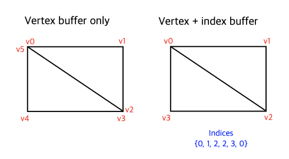
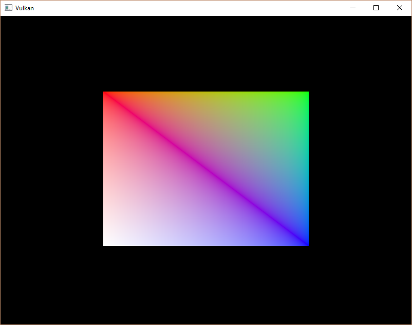

-[Khronos Vulkan Tutorial](https://docs.vulkan.org/tutorial/latest/00_Introduction.html)

# 소개

실제 어플리케이션에서 렌더링할 3D 메시는 종종 여러 삼각형 간에 정점을 공유합니다. 이는 사각형을 그리는 간단한 작업에서도 이미 발생합니다.



사각형을 그리려면 두 개의 삼각형이 필요합니다. 그 말은 즉 6개의 정점이 있는 정점 버퍼가 필요하다는 것입니다. 문제는 두 정점의 데이터를 복제하여 50%의 중복성이 발생한다는 것입니다. 좀 더 복잡한 메시에서는 평균적으로 재사용되는 정점이 3개정도 되어 더 안 좋습니다. 이 문제에 대한 해결 방법은 *인덱스 버퍼*를 사용하는 것입니다.

인덱스 버퍼는 본질적으로 정점 버퍼에 대한 포인터의 배열입니다. 정점 데이터를 재정렬하고 여러 정점에 대해 기존 데이터를 재사용할 수 있습니다. 위 그림은 4개의 고유한 정점 각각을 포함하는 정점 버퍼가 있는 경우, 사각형에 대한 인덱스 버퍼를 보여줍니다. 처음 세 개의 인덱스는 오른쪽 위 삼각형을 정의하고, 마지막 세 개의 인덱스는 왼쪽 아래 삼각형을 정의합니다.

# 인덱스 버퍼 생성

이 챕터에서 우리는 정점 데이터를 수정하고 인덱스 데이터를 추가하여 그림과 같은 사각형을 그릴 겁니다. 정점 데이터를 수정하여 네 모서리를 나타내도록 합니다:

```cpp
const std::vector<Vertex> vertices = {
    {{-0.5f, -0.5f}, {1.0f, 0.0f, 0.0f}},
    {{0.5f, -0.5f}, {0.0f, 1.0f, 0.0f}},
    {{0.5f, 0.5f}, {0.0f, 0.0f, 1.0f}},
    {{-0.5f, 0.5f}, {1.0f, 1.0f, 1.0f}}
};
```

왼쪽 상단은 빨간색, 오른쪽 상단은 초록색, 오른쪽 하단은 파란색, 왼쪽 하단은 흰색입니다. 새로운 배열 `indices`를 추가하여 인덱스 버퍼의 내용을 나타냅니다. 오른쪽 위 삼각형과 왼쪽 아래 삼각형을 그리려면 그림의 인덱스와 일치해야 합니다.

```cpp
const std::vector<uint16_t> indices = {
    0, 1, 2, 2, 3, 0
};
```

vertices의 항목 수에 따라 인덱스 버퍼에 `uint16_t`나 `uint32_t`를 사용할 수 있습니다. 우리는 `uint16_t`를 쓰겠습니다. 유니크한 정점 수가 65535개보다 적기 때문입니다.

정점 데이터와 마찬가지로, 인덱스들은 GPU가 접근하기 위해서 `VkBuffer`를 통해 업로드 되어야 합니다. 새로운 클래스 멤버 두 개를 정의하여 인덱스 버퍼의 리소스를 보유하도록 합니다.

```cpp
VkBuffer vertexBuffer;
VkDeviceMemory vertexBufferMemory;
VkBuffer indexBuffer;
VkDeviceMemory indexBufferMemory;
```

우리가 추가할 `createIndexBuffer` 함수는 `createVertexBuffer`와 거의 비슷합니다.

```cpp
void initVulkan() {
    ...
    createVertexBuffer();
    createIndexBuffer();
    ...
}

void createIndexBuffer() {
    VkDeviceSize bufferSize = sizeof(indices[0]) * indices.size();

    VkBuffer stagingBuffer;
    VkDeviceMemory stagingBufferMemory;
    createBuffer(bufferSize, VK_BUFFER_USAGE_TRANSFER_SRC_BIT, VK_MEMORY_PROPERTY_HOST_VISIBLE_BIT | VK_MEMORY_PROPERTY_HOST_COHERENT_BIT, stagingBuffer, stagingBufferMemory);

    void* data;
    vkMapMemory(device, stagingBufferMemory, 0, bufferSize, 0, &data);
    memcpy(data, indices.data(), (size_t) bufferSize);
    vkUnmapMemory(device, stagingBufferMemory);

    createBuffer(bufferSize, VK_BUFFER_USAGE_TRANSFER_DST_BIT | VK_BUFFER_USAGE_INDEX_BUFFER_BIT, VK_MEMORY_PROPERTY_DEVICE_LOCAL_BIT, indexBuffer, indexBufferMemory);

    copyBuffer(stagingBuffer, indexBuffer, bufferSize);

    vkDestroyBuffer(device, stagingBuffer, nullptr);
    vkFreeMemory(device, stagingBufferMemory, nullptr);
}
```

주목할 만한 것은 두 가지 정도 밖에 없습니다. bufferSize는 인덱스의 수에 인덱스 타입의 사이즈(`uint16_t`또는 `uint32_t`)를 곱한 것과 같습니다. `indexBuffer`는 `VK_BUFFER_USAGE_INDEX_BUFFER_BIT`가 아닌 `VK_BUFFER_USAGE_IN_DEX_BUFFER_BIT`이여야 합니다. 그 외에 다른 프로세스는 완전히 동일합니다. 스테이징 버퍼를 생성하고 `indices`의 내용을 복사한 다음, 최종 디바이스 로컬 인덱스 버퍼로 복사합니다.

인덱스 버퍼는 정점 버퍼와 마찬가지로, 프로그램이 종료될 때 정리해야 합니다.

```cpp
void cleanup() {
    cleanupSwapChain();

    vkDestroyBuffer(device, indexBuffer, nullptr);
    vkFreeMemory(device, indexBufferMemory, nullptr);

    vkDestroyBuffer(device, vertexBuffer, nullptr);
    vkFreeMemory(device, vertexBufferMemory, nullptr);

    ...
}
```

# 인덱스 버퍼 사용

그리기에 인덱스 버퍼를 사용하면 `recordCommandBuffer`에 두 변경점이 생깁니다. 정점 버퍼에 했던 것처럼, 먼저 인덱스 버퍼를 바인딩해야 합니다. 다른점은 단일 인덱스 버퍼만 가질 수 있다는 것입니다. 불행하게도 각 정점 속성에 대해 다른 인덱스를 사용하는 것은 불가능하므로, 하나의 속성만 변하더라도 정점 데이터를 완전히 복제해야 합니다.

```cpp
vkCmdBindVertexBuffers(commandBuffer, 0, 1, vertexBuffers, offsets);

vkCmdBindIndexBuffer(commandBuffer, indexBuffer, 0, VK_INDEX_TYPE_UINT16);
```

인덱스 버퍼, 바이트 오프셋 및 인덱스 데이터 타입을 매개변수로 하는 `vkCmdBindIndexBuffer`를 사용하여 인덱스 버퍼를 바인딩합니다. 앞서 언급했듯이, `VK_INDEX_TYPE_UINT16`과 `VK_INDEX_TYPE_UINT32`이 가능합니다.

인덱스 버퍼를 바인딩하는 것만으로는 아직 아무 것도 변경되지 않습니다. Vulkan에게 인덱스 버퍼를 사용하도록 그리기 명령이 필요합니다. [`vkCmdDraw`](https://www.khronos.org/registry/vulkan/specs/1.0/man/html/vkCmdDraw.html) 줄을 지우고 [`vkCmdDrawIndexed`](https://www.khronos.org/registry/vulkan/specs/1.0/man/html/vkCmdDrawIndexed.html)로 바꿉니다.

```cpp
vkCmdDrawIndexed(commandBuffer, static_cast<uint32_t>(indices.size()), 1, 0, 0, 0);
```

이 함수에 대한 호출은 [`vkCmdDraw`](https://www.khronos.org/registry/vulkan/specs/1.0/man/html/vkCmdDraw.html)와 매우 비슷합니다. 처음 두 매개변수는 인덱스의 수와 인스턴스의 수를 지정합니다. 우리는 인스턴싱을 사용하지 않으므로 그냥 `1` 인스턴스를 지정합니다. 인덱스의 수는 정점 셰이더에 전달될 정점의 수를 나타냅니다. 다음 매개변수는 인덱스 버퍼의 오프셋을 지정합니다. `1`을 사용하면 그래픽 카드가 두번째 인덱스부터 읽기 시작합니다. 마지막에서 두번째 매개변수는 인덱스 버퍼에서 인덱스에 추가할 오프셋을 지정합니다. 마지막 매개변수는 인스턴싱을 위한 오프셋을 지정하는데, 우리는 사용하지 않습니다.

이제 프로그램을 실행하면 이렇게 보일 것입니다:



이제 인덱스 버퍼가 있는 정점을 재사용하여 메모리를 절약하는 방법을 알게 되었습니다. 이것은 우리가 복잡한 3D 모델을 로드할 이후 챕터에서 특히 중요해질 것입니다.

이전 챕터에서 이미 단일 메모리 할당에서 버퍼 등의 여러 리소스를 할당해야 한다고 언급했지만, 실제로는 한 단계 더 나아가야 합니다. [드라이버 개발자](https://developer.nvidia.com/vulkan-memory-management)는 정점과 인덱스 버퍼 등의 여러 버퍼를 단일 [`VkBuffer`](https://www.khronos.org/registry/vulkan/specs/1.0/man/html/VkBuffer.html)에 저장하고, [`vkCmdBindVertexBuffers`](https://www.khronos.org/registry/vulkan/specs/1.0/man/html/vkCmdBindVertexBuffers.html) 같은 명령어에서 오프셋을 사용하는 것이 좋습니다. 이것의 장점은 데이터가 더 가깝기 때문에 캐시 친화적이라는 것입니다. 데이터가 새로 고쳐질 때, 동일한 렌더링 작업 중에 사용되지 않았다면 여러 리소스에 대한 메모리의 같은 청크를 재사용할 수 있습니다. 이를 *앨리어싱*이라고 하여 일부 Vulkan 함수에서는 명시적인 플래그로 지정합니다.

[C++ code](https://vulkan-tutorial.com/code/21_index_buffer.cpp) / [Vertex shader](https://vulkan-tutorial.com/code/18_shader_vertexbuffer.vert) / [Fragment shader](https://vulkan-tutorial.com/code/18_shader_vertexbuffer.frag)