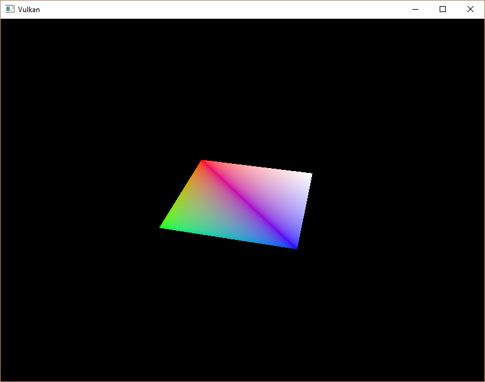

-[Khronos Vulkan Tutorial](https://docs.vulkan.org/tutorial/latest/00_Introduction.html)

# 소개

이전 챕터의 decsriptor 레이아웃은 바인딩할 수 있는 descriptor유형을 설명합니다. 이 챕터에서는 각 [`VkBuffer`](https://www.khronos.org/registry/vulkan/specs/1.0/man/html/VkBuffer.html) 리소스에 대한 descriptor set를 만들어 이를 uniform buffer descriptor에 바인딩하겠습니다.

# Descriptor pool

descriptor set는 직접 만들 수 없으며, 명령 버퍼와 같은 풀에서 할당해야 합니다. descriptor set에 해당하는 것을 descriptor pool 이라고 하는 것은 당연합니다. 이를 설정하기 위해 새 함수 `createDescriptorPool`을 작성합니다.

```cpp
void initVulkan() {
    ...
    createUniformBuffers();
    createDescriptorPool();
    ...
}

...

void createDescriptorPool() {

}
```

먼저 [`VkDescriptorPoolSize`](https://www.khronos.org/registry/vulkan/specs/1.0/man/html/VkDescriptorPoolSize.html) 구조체를 사용하여 descriptor set에 포함될 descriptor 유형과 몇 개가 있는지를 설명해야 합니다.

```cpp
VkDescriptorPoolSize poolSize{};
poolSize.type = VK_DESCRIPTOR_TYPE_UNIFORM_BUFFER;
poolSize.descriptorCount = static_cast<uint32_t>(MAX_FRAMES_IN_FLIGHT);
```

모든 프레임에 대해 이러한 descriptor 중 하나를 할당합니다. 이 풀 크기 구조는 기본[`VkDescriptorPoolCreateInfo`](https://www.khronos.org/registry/vulkan/specs/1.0/man/html/VkDescriptorPoolCreateInfo.html) 에서 참조합니다.

```cpp
VkDescriptorPoolCreateInfo poolInfo{};
poolInfo.sType = VK_STRUCTURE_TYPE_DESCRIPTOR_POOL_CREATE_INFO;
poolInfo.poolSizeCount = 1;
poolInfo.pPoolSizes = &poolSize;
```

사용 가능한 최대 descriptor 수 외에도 할당할 수 있는 descriptor set의 최대 수도 지정해야 합니다:

```cpp
poolInfo.maxSets = static_cast<uint32_t>(MAX_FRAMES_IN_FLIGHT);
```

구조에는 개별 descriptor set를 해제할 수 있는지 여부를 결정하는 명령 풀과 유사한 선택적 플래그가 있습니다: `VK_DESCRIPTOR_POOL_CREATE_FREE_DESCRIPTOR_SET_BIT`. descriptor set를 생성한 후에는 건드리지 않을 것이므로 이 플래그는 필요없습니다. `flags`를 기본 값인 `0`으로 둘 수 있습니다.

```cpp
VkDescriptorPool descriptorPool;

...

if (vkCreateDescriptorPool(device, &poolInfo, nullptr, &descriptorPool) != VK_SUCCESS) {
    throw std::runtime_error("failed to create descriptor pool!");
}
```

descriptor pool에 핸들을 저장할 새 클래스 구성원을 추가하고 [`vkCraeteDescriptorPool`](https://www.khronos.org/registry/vulkan/specs/1.0/man/html/vkCreateDescriptorPool.html)을 호출하여 생성합니다.

# Descriptor set

이제 descriptor set 자체를 할당할 수 있습니다. 이를 위해 `createDescriptorSets` 함수를 추가합니다.

```cpp
void initVulkan() {
    ...
    createDescriptorPool();
    createDescriptorSets();
    ...
}

...

void createDescriptorSets() {

}
```

descriptor set은 [`VkDescriptorSetAllocateInfo`](https://www.khronos.org/registry/vulkan/specs/1.0/man/html/VkDescriptorSetAllocateInfo.html) 구조체로 설명됩니다. 할당할 descriptor pool와 할당할 descriptor set 수, 그리고 기반으로 할 descriptor 레이아웃을 지정해야 합니다:

```cpp
std::vector<VkDescriptorSetLayout> layouts(MAX_FRAMES_IN_FLIGHT, descriptorSetLayout);
VkDescriptorSetAllocateInfo allocInfo{};
allocInfo.sType = VK_STRUCTURE_TYPE_DESCRIPTOR_SET_ALLOCATE_INFO;
allocInfo.descriptorPool = descriptorPool;
allocInfo.descriptorSetCount = static_cast<uint32_t>(MAX_FRAMES_IN_FLIGHT);
allocInfo.pSetLayouts = layouts.data();
```

우리의 경우 flight 중인 각 프레임에 대해 하나의 descriptor set를 만들고, 모두 동일한 레이아웃을 사용합니다. 불행하게도 다음 함수는 set 수와 일치하는 배열을 기대하기 때문에 레이아웃의 모든 복사본이 필요합니다.

[`vkAllocateDescriptorSets`](https://www.khronos.org/registry/vulkan/specs/1.0/man/html/vkAllocateDescriptorSets.html)를 할당하고 descriptor set 핸들을 보관해둘 클래스 멤버를 추가합니다:

```cpp
VkDescriptorPool descriptorPool;
std::vector<VkDescriptorSet> descriptorSets;

...

descriptorSets.resize(MAX_FRAMES_IN_FLIGHT);
if (vkAllocateDescriptorSets(device, &allocInfo, descriptorSets.data()) != VK_SUCCESS) {
    throw std::runtime_error("failed to allocate descriptor sets!");
}
```

descriptor set를 명시적으로 정리할 필요는 없습니다. descriptor pool 이 파괴되면 자동으로 해제되기 때문입니다. [`vkAllocateDescriptorSets`](https://www.khronos.org/registry/vulkan/specs/1.0/man/html/vkAllocateDescriptorSets.html)를 호출하면 각각 하나의 uniform buffer descriptor가 있는 descriptor set가 할당됩니다.

```cpp
void cleanup() {
    ...
    vkDestroyDescriptorPool(device, descriptorPool, nullptr);

    vkDestroyDescriptorSetLayout(device, descriptorSetLayout, nullptr);
    ...
}
```

descriptor set가 지금 할당되었지만, 그 안에 있는 descriptor는 여전히 구성해야 합니다. 이제 모든 descriptor를 채우는 루프를 추가합니다:

```cpp
for (size_t i = 0; i < MAX_FRAMES_IN_FLIGHT; i++) {

}
```

uniform buffer descriptor 같이 버퍼를 참조하는 descriptor는 [`VkDescriptorBufferInfo`](https://www.khronos.org/registry/vulkan/specs/1.0/man/html/VkDescriptorBufferInfo.html) 구조체로 구성됩니다. 이 구조는 descriptor에 대한 데이터를 포함하는 버퍼와 버퍼 내의 영역을 지정합니다.

```cpp
for (size_t i = 0; i < MAX_FRAMES_IN_FLIGHT; i++) {
    VkDescriptorBufferInfo bufferInfo{};
    bufferInfo.buffer = uniformBuffers[i];
    bufferInfo.offset = 0;
    bufferInfo.range = sizeof(UniformBufferObject);
}
```

이 경우와 같이 전체 버퍼를 덮어쓰는 경우, 범위에 대해 `VK_WHOLE_SIZE` 값을 사용할 수도 있습니다. descriptor의 구성은 [`VkWriteDescriptorSet`](https://www.khronos.org/registry/vulkan/specs/1.0/man/html/VkWriteDescriptorSet.html) 구조체의 배열을 매개변수로 사용하는 [`vkUpdateDescriptorSets`](https://www.notion.so/Uniform-buffers-Descriptor-pool-and-sets-862ce64415ef4dd28e6df74618a0c240?pvs=21) 함수를 사용하여 업데이트 됩니다.

```cpp
VkWriteDescriptorSet descriptorWrite{};
descriptorWrite.sType = VK_STRUCTURE_TYPE_WRITE_DESCRIPTOR_SET;
descriptorWrite.dstSet = descriptorSets[i];
descriptorWrite.dstBinding = 0;
descriptorWrite.dstArrayElement = 0;
```

처음 두 필드는 업데이트할 descriptor set와 바인딩을 지정합니다. uniform buffer 바인딩 인덱스를 `0`으로 지정했습니다. descriptor는 배열일 수 있다는 것을 기억하세요. 그러므로 업데이트하려는 배열의 첫번째 인덱스도 지정해야 합니다. 우리는 배열을 사용하지 않으므로, 인덱스는 단순히 `0`입니다.

```cpp
descriptorWrite.descriptorType = VK_DESCRIPTOR_TYPE_UNIFORM_BUFFER;
descriptorWrite.descriptorCount = 1;
```

descriptor 유형을 다시 지정해야 합니다. 인덱스 `dstArrayElement`에서 시작하여 배열에서 한번에 여러 descriptor를 업데이트할 수 있습니다. `descriptorCount` 필드는 업데이트하려는 배열 요소 수를 지정합니다.

```cpp
descriptorWrite.pBufferInfo = &bufferInfo;
descriptorWrite.pImageInfo = nullptr; // Optional
descriptorWrite.pTexelBufferView = nullptr; // Optional
```

마지막 필드는 실제로 descriptor를 구성하는 descriptorCount 구조가 있는 배열을 참조합니다. 이 세 개는 실제로 사용하는 descriptor 유형에 따라 다릅니다. `pBufferInfo` 필드는 버퍼 데이터를 참조하는 descriptor에 사용됩니다. pImageInfo는 이미지 데이터를 참조하는 descriptor에 사용됩니다. `pTexelBufferView`는 버퍼 뷰를 참조하는 descriptor에 사용됩니다. 우리의 descriptor는 버퍼에 기반하므로, `pBufferInfo`를 사용합니다.

```cpp
vkUpdateDescriptorSets(device, 1, &descriptorWrite, 0, nullptr);
```

업데이트는 [`vkUpdateDescriptorSets`](https://www.khronos.org/registry/vulkan/specs/1.0/man/html/vkUpdateDescriptorSets.html)를 사용하여 적용됩니다. 두 가지 배열을 매개변수로 받아들입니다: [`VkWriteDescriptorSet`](https://www.khronos.org/registry/vulkan/specs/1.0/man/html/VkWriteDescriptorSet.html) 배열과 [`VkCopyDescriptorSet`](https://www.khronos.org/registry/vulkan/specs/1.0/man/html/VkCopyDescriptorSet.html) 배열입니다. 후자는 이름에서 알 수 있듯이 descriptor를 서로 복사하는데 사용할 수 있습니다.

# descriptor set 사용하기

이제 각 프레임에 대해 올바른 descriptor set를 [`vkCmdBindDescriptorSets`](https://www.khronos.org/registry/vulkan/specs/1.0/man/html/vkCmdBindDescriptorSets.html)를 사용하여 셰이더의 descriptor에 실제로 바인딩하도록, `recordCommandBuffer` 함수를 업데이트해야 합니다. 이 작업은 [`vkCmdDrawIndexed`](https://www.khronos.org/registry/vulkan/specs/1.0/man/html/vkCmdDrawIndexed.html) 호출 전에 수행되어야 합니다.

```cpp
vkCmdBindDescriptorSets(commandBuffer, VK_PIPELINE_BIND_POINT_GRAPHICS, pipelineLayout, 0, 1, &descriptorSets[currentFrame], 0, nullptr);
vkCmdDrawIndexed(commandBuffer, static_cast<uint32_t>(indices.size()), 1, 0, 0, 0);
```

정점, 인덱스 버퍼와는 달리 descriptor set는 그래픽 파이프라인에 고유하지 않습니다. 따라서 descriptor set를 그래픽 또는 컴퓨팅 파이프라인에 바인딩할지 여부를 지정해야 합니다. 다음 매개변수는 descriptor의 기반이 되는 레이아웃입니다. 다음 세 개의 매개변수는 첫번째 descriptor set의 인덱스, 바인딩할 set 수, 바인딩할 set 배열을 지정합니다. 잠시 후 다시 이 문제로 돌아가겠습니다. 마지막 두 매개변수는 동적 descriptor에 사용되는 offset 배열을 지정합니다. 이것들은 다음 챕터에서 살펴볼 것입니다.

지금 프로그램을 실행하면 불행하게도 아무것도 표시되지 않습니다. 문제는 투영 행렬에서 수행한 Y-flip으로 인해 정점이 이제 시계 방향 대신 반시계 방향으로 그려지고 있다는 것입니다. 이로 인해 뒷면 컬링이 시작되어 그려지지 않습니다. `createGraphicsPipeline` 함수로 이동하여 [`VkPipelineRasterizationStateCreateInfo`](https://www.khronos.org/registry/vulkan/specs/1.0/man/html/VkPipelineRasterizationStateCreateInfo.html)에서 `frontFace`를 다음과 같이 수정합니다:

```cpp
rasterizer.cullMode = VK_CULL_MODE_BACK_BIT;
rasterizer.frontFace = VK_FRONT_FACE_COUNTER_CLOCKWISE;
```

프로그램을 다시 실행하면 이렇게 보입니다:



이제 투영 행렬이 종횡비를 수정하기 때문에 직사각형이 정사각형으로 바뀌었습니다. `updateUniformBuffer`는 화면 크기 조정을 처리하므로, `recreateSwapChain`에 설정된 descriptor를 다시 만들 필요가 없습니다.

# 정렬 요구사항

지금까지 우리가 간과한 한가지는 C++ 구조의 데이터가 셰이더의 uniform 정의와 일치하는 방법입니다. 두 가지 모두에서 동일한 유형을 단순히 사용하는 것이 명백해보입니다.

```cpp
struct UniformBufferObject {
    glm::mat4 model;
    glm::mat4 view;
    glm::mat4 proj;
};

layout(binding = 0) uniform UniformBufferObject {
    mat4 model;
    mat4 view;
    mat4 proj;
} ubo;
```

그러나 이것이 전부는 아닙니다. 예를 들어 구조체와 셰이더를 다음과 같이 수정해보세요.

```cpp
struct UniformBufferObject {
    glm::vec2 foo;
    glm::mat4 model;
    glm::mat4 view;
    glm::mat4 proj;
};

layout(binding = 0) uniform UniformBufferObject {
    vec2 foo;
    mat4 model;
    mat4 view;
    mat4 proj;
} ubo;
```

셰이더와 프로그램을 다시 컴파일하고 실행하면, 지금까지 작업한 멋진 사각형이 사라진 것을 볼 수 있습니다! 정려 ㄹ요구사항을 고려하지 ㅇ낳았기 때문입니다.

Vulkan은 구조의 데이터가 특정 방식으로 메모리에 정렬될 것을 예상합니다. 예를 들면 다음과 같습니다:

- 스칼라는 N으로 정렬되어야 합니다 (= 32비트 부동소수점인 경우 4바이트).
- `vec2`는 2N으로 정렬되어야 합니다. (= 8 바이트)
- `vec3`, `vec4`는 4N으로 정렬되어야 합니다. (= 16 bytes)
- 중첩된 구조는 16배수로 반올림된 해당 구성원의 기본 정렬로 정렬되어야 합니다.
- `mat4` 행렬은 `vec4` 정렬과 동일해야 합니다.

[사양](https://www.khronos.org/registry/vulkan/specs/1.3-extensions/html/chap15.html#interfaces-resources-layout)에서 정렬 요구사항에 대한 전체 목록을 볼 수 있습니다.

`mat4` 필드가 3개뿐인 우리의 원본 셰이더는 요구사항을 충족합니다. `mat4` 크기는 4 * 4 * 4 = 64바이트이고 `model`의 오프셋은 0, `view` 오프셋은 64,  `proj` 오프셋은 128입니다. 이 모든 항목은 16배수이무로 제대로 작동합니다.

새 구조는 8바이트에 불과한 `vec2`로 시작하므로 모든 오프셋을 제거합니다. 이제 `model`의 오프셋이 8이고 `view` 오프셋이 72이고 `proj` 오프셋이 136이며, 모두 16배수가 아닙니다. 이 문제를 해결하기 위해 C++ 11에 도입된 [`aligns`](https://en.cppreference.com/w/cpp/language/alignas) 지정자를 사용할 수 있습니다.

```cpp
struct UniformBufferObject {
    glm::vec2 foo;
    alignas(16) glm::mat4 model;
    glm::mat4 view;
    glm::mat4 proj;
};
```

이제 프로그램을 다시 컴파일하고 실행하면 셰이더가 행렬 값을 올바르게 수신하는 것을 볼 수 있습니다.

다행스럽게도 이러한 정렬 요구사항에 대해 생각하지 않아도 되는 방법이 있습니다. GLM을 포합하기 전에 `GLM_FORCE_DEFAULT_ALIGNED_GENTYPES`를 정의할 수 있습니다.

```cpp
#define GLM_FORCE_RADIANS
#define GLM_FORCE_DEFAULT_ALIGNED_GENTYPES
#include <glm/glm.hpp>
```

이렇게하면 GLM에서 정렬 요구사항이 이미 지정된 `vec2`, `mat4` 버전을 사용하게 됩니다. 이 정의를 추가하면 `alignas` 지정자를 제거할 수 있으며 프로그램을 계속 작동합니다.

불행히도 이 방법은 중첩 구조를 사용하기 시작하면 고장날 수 있습니다. C++ 코드에서 다음 정의를 고려하세요:

```cpp
struct Foo {
    glm::vec2 v;
};

struct UniformBufferObject {
    Foo f1;
    Foo f2;
};
```

그리고 다음 셰이더 정의:

```cpp
struct Foo {
    vec2 v;
};

layout(binding = 0) uniform UniformBufferObject {
    Foo f1;
    Foo f2;
} ubo;
```

이 경우 `f2`는 오프셋이 `8`인 반면, 중첩된 구조이므로 오프셋 `16`이 되어야 합니다. 이 경우 정렬을 직접 지정해야 합니다.

```cpp
struct UniformBufferObject {
    Foo f1;
    alignas(16) Foo f2;
};
```

이러한 문제때문에 항상 정렬에 대해 명시하는 것이 좋습니다. 그러면 정렬 오류 같은 이상한 증상에 당황하지 않을 것입니다.

```cpp
struct UniformBufferObject {
    alignas(16) glm::mat4 model;
    alignas(16) glm::mat4 view;
    alignas(16) glm::mat4 proj;
};
```

`foo` 필드를 지우고 다시 컴파일하는 것을 잊지마십시오.

# 다중 descriptor sets

일부 구조 및 함수 호출에서 힌트를 얻었듯이 실제로 여러 descriptor set를 동시에 바인딩하는 것이 가능합니다. 파이프라인 레이아웃을 생성할 때 각 descriptor set에 대한 descriptor 레이아웃을 지정해야 합니다. 셰이더는 다음과 같이 특정 descriptor set를 참조할 수 있습니다.

```cpp
layout(set = 0, binding = 0) uniform UniformBufferObject { ... }
```

이 기능을 사용하여 객체별로 달라지는 descriptor와, 공유되는 descriptor를 별도의 descriptor set에 넣을 수 있습니다. 이 경우 잠재적으로 더 효율적인 드로잉 호출에서 대부분의 descriptor를 다시 바인딩하지 않도록 피할 수 있습니다.

[C++ code](https://vulkan-tutorial.com/code/23_descriptor_sets.cpp) / [Vertex shader](https://vulkan-tutorial.com/code/22_shader_ubo.vert) / [Fragment shader](https://vulkan-tutorial.com/code/22_shader_ubo.frag)