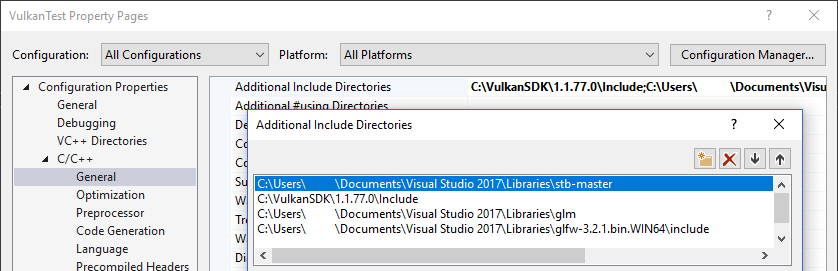

-[Khronos Vulkan Tutorial](https://docs.vulkan.org/tutorial/latest/00_Introduction.html)

# 소개

기하학은 지금까지 정점별 색상을 사용하여 색상이 지정되었는데, 이것은 다소 제한된 접근 방식입니다. 이 튜토리얼 파트에서는 지오메트리를 더 흥미롭게 보이도록 텍스쳐 매핑을 구현합니다. 이것은 또한 다음 챕터에서 기본 3D 모델을 로드하고 그릴 수 있게 해 줄  것입니다.

어플리케이션에 텍스쳐를 추가하려면 다음 단계가 필요합니다.

- 디바이스 메모리가 지원하는 이미지 객체 생성
- 이미지 파일의 픽셀로 채우기
- 이미지 샘플러 만들기
- 텍스쳐에서 색상을 샘플링하기 위해 결합된 이미지 샘플러 descriptor 추가

우리는 이미 이미지 객체로 작업했지만 스왑체인 확장에 의해 자동적으로 생성되었습니다. 이번에는 우리가 직접 만들 시간입니다. 이미지를 생성하고 데이터로 채우는 것은 정점 버퍼 생성과 비슷합니다. 스테이징 리소스를 만드는 것을 시작으로, 픽셀 데이터를 채운 다음, 렌더링에 사용할 최종 이미지 객체에 복사합니다. 이 목적을 위해 스테이징 이미지를 생성하는 것이 가능하지만 Vulkan을 사용하면 [`VkBuffer`](https://www.khronos.org/registry/vulkan/specs/1.0/man/html/VkBuffer.html)에서 이미지로 픽셀을 복사를 할 수 있으며, 이에 대한 API는 [일부 하드웨어에서 더 빠릅니다](https://developer.nvidia.com/vulkan-memory-management). 우리는 먼저 버퍼를 만들고 픽셀 값으로 채운 다음, 픽셀을 복사할 이미지를 만들 것입니다. 이미지 생성은 버퍼 생성과 크게 다르지 않습니다. 이전에 본 것처럼 메모리 요구 사항을 쿼리하고 장치 메모리를 할당 후 바인딩하는 작업이 포함됩니다.

그러나 이미지로 작업할 때 처리해야 할 추가 사항이 있습니다. 이미지는 메모리에서 픽셀이 구성되는 방식에 영향을 주는 다양한 레이아웃이 있을 수 있습니다. 그래픽 하드웨어가 작동하는 방식으로 인해 단순히 행 단위로 픽셀을 저장하는 것으로는 최상의 성능을 내지 못할 수 있습니다. 예를 들어, 이미지에 대한 작업을 수행할 때 해당 작업에 사용하기에 최적인 레이아웃이 있는지 확인해야 합니다. 렌더패스를 지정할 때 실제로 이러한 레이아웃 중 일부를 이미 보았습니다:

- `VK_IMAGE_LAYOUT_PRESENT_SRC_KHR`: 프레젠테이션에 최적
- `VK_IMAGE_LAYOUT_COLOR_ATTACHMENT_OPTIMAL`: 조각 셰이더에서 색상을 쓰기 위한 attachment로 최적
- `VK_IMAGE_LAYOUT_TRANSFER_SRC_OPTIMAL`: [`vkCmdCopyImageToBuffer`](https://www.khronos.org/registry/vulkan/specs/1.0/man/html/vkCmdCopyImageToBuffer.html) 같은 전송 작업 소스로 최적
- `VK_IMAGE_LAYOUT_TRANSFER_DST_OPTIMAL`: [`vkCmdCopyBufferToImage`](https://www.khronos.org/registry/vulkan/specs/1.0/man/html/vkCmdCopyBufferToImage.html) 같은 전송 작업 대상으로 최적
- `VK_IMAGE_LAYOUT_SHADER_READ_ONLY_OPTIMAL`: 셰이더 샘플링에 최적

이미지 레이아웃을 트랜지션하는 가장 일반적인 방법 중 하나는 파이프라인 배리어입니다. 파이프라인 배리어는 주로 이미지를 읽기 전에 기록했는지 확인하는 것 같이, 리소스에 대한 접근을 동기화하는데 사용되지만 레이아웃을 트랜지션하는데 사용할 수도 있습니다. 이 챕터에서는 파이프라인 배리어가 이런 목적으로 사용되는 방법을 볼 것입니다. `VK_SHARING_MODE_EXCLUSIVE`를 사용할 때 배리어를 사용하여 큐 패밀리 소유권을 이전할 수 있습니다.

# 이미지 라이브러리

이미지를 로드하는데 사용할 수 있는 라이브러리가 많이 있으며, BMP나 PPM같은 간단한 형싱을 로드하는 코드를 작성할 수도 있습니다. 이 튜토리얼에서는 [stb collection](https://github.com/nothings/stb)의 stb_image 라이브러리를 사용하겠습니다. 이 방법의 장점은 모든 코드가 단일 파일에 있으므로 까다로운 빌드 구성이 필요하지 않다는 것입니다. `stb_image.h`를 다운로드하여 GLFW 및 GLM을 저장한 디렉토리와 같은 편한 경로에 저장합니다. include path에 경로를 추가합니다.

**Visual Studio**

`Additional Include Directories`에 `stb_image.h` 경로를 추가합니다.



**Makefile**

GCC용 include directories에 `stb_image.h`가 있는 디렉토리를 추가합니다.

```makefile
VULKAN_SDK_PATH = /home/user/VulkanSDK/x.x.x.x/x86_64
STB_INCLUDE_PATH = /home/user/libraries/stb

...

CFLAGS = -std=c++17 -I$(VULKAN_SDK_PATH)/include -I$(STB_INCLUDE_PATH)
```

# Loading an image

다음과 같이 이미지 라이브러리를 include 합니다:

```cpp
#define STB_IMAGE_IMPLEMENTATION
#include <stb_image.h>
```

헤더는 기본적으로 함수의 프로토타입만 정의합니다. 함수 본문을 포함하려면 하나의 코드 파일에 `STB_IMAGE_IMPLEMENTATION` 정의가 있는 헤더를 포함해야 합니다. 그렇지 않으면 linking 오류가 발생합니다.

```cpp
void initVulkan() {
    ...
    createCommandPool();
    createTextureImage();
    createVertexBuffer();
    ...
}

...

void createTextureImage() {

}
```

이미지를 로드하고 Vulkan 이미지 객체에 업로드할 새 함수 `createTextureImage`를 만듭니다. 명령 버퍼를 사용할 것이므로 `createCommandPool` 후에 호출해야 합니다.

텍스쳐 이미지를 저장할 `shaders` 디렉토리 옆에 새 디렉토리 `textures`를 만듭니다. 이 디렉토리에서 `texture.jpg`라는 이미지를 로드하겠습니다. 다음과 같이 512*512 픽셀로 크기가 조정된 [CC0 라이센스 이미지](https://pixabay.com/en/statue-sculpture-fig-historically-1275469/)를 사용하기로 선택했습니다. 여러분은 원하는 이미지를 자유롭게 선택하세요. 라이브러리는 JPEG, PNG, BMP 및 GIF 같은 일반적인 이미지 파일 형식을 지원합니다.


이 라이브러리로 이미지를 로드하는 것은 정말 쉽습니다.

```cpp
void createTextureImage() {
    int texWidth, texHeight, texChannels;
    stbi_uc* pixels = stbi_load("textures/texture.jpg", &texWidth, &texHeight, &texChannels, STBI_rgb_alpha);
    VkDeviceSize imageSize = texWidth * texHeight * 4;

    if (!pixels) {
        throw std::runtime_error("failed to load texture image!");
    }
}
```

`stbi_load` 함수는 로드할 파일 경로와 채널 수를 매개변수로 사용합니다. STBI_rgb_alpha 값은 알파 채널이 없는 경우에도 이미지를 강제로 로드하므로, 추후 다른 텍스쳐와의 일관성에 좋습니다. 가운데 세 개의 매개변수는 이미지의 width, height, 실제 채널 수에 대한 출력입니다. 반환되는 포인터는 픽셀 값 배열의 첫번째 요소입니다. 픽셀은 총 `texWidth * texHeight * 4` 값에 대해 `STBI_rgb_alpha`의 경우 픽셀당 4바이트로 행마다 배치됩니다.

# 스테이징 버퍼

[`vkMapMemory`](https://www.khronos.org/registry/vulkan/specs/1.0/man/html/vkMapMemory.html)를 사용하고 픽셀을 복사할 수 있도록 호스트 표시 메모리에 버퍼를 만들 것입니다. 이 임시 버퍼에 대한 변수를 `createTexutreImage` 함수에 추가합니다.

```cpp
VkBuffer stagingBuffer;
VkDeviceMemory stagingBufferMemory;
```

버퍼는 매핑할 수 있도록 호스트에서 볼 수 있는 메모리에 있어야 하며, 나중에 이미지를 복사할 수 있도록 전송 소스로 사용할 수 있어야 합니다.

```cpp
createBuffer(imageSize, VK_BUFFER_USAGE_TRANSFER_SRC_BIT, VK_MEMORY_PROPERTY_HOST_VISIBLE_BIT | VK_MEMORY_PROPERTY_HOST_COHERENT_BIT, stagingBuffer, stagingBufferMemory);
```

그 다음 이미지 로딩 라이브러리에서 가져온 픽셀 값을 버퍼로 직접 복사할 수 있습니다.

```cpp
void* data;
vkMapMemory(device, stagingBufferMemory, 0, imageSize, 0, &data);
    memcpy(data, pixels, static_cast<size_t>(imageSize));
vkUnmapMemory(device, stagingBufferMemory);
```

원본 픽셀 배열을 정리하는 것을 잊지 마세요.

```cpp
stbi_image_free(pixels);
```

# 텍스쳐 이미지

버퍼의 픽셀 값에 접근하도록 셰이더를 설정할 수 있지만 이 목적을 위해 Vulkan에서 이미지 객체를 사용하는 것이 좋습니다. 이미지 객체를 사용하면 2D 좌표를 사용할 수 있으므로 색상을 더 쉽고 빠르게 검색할 수 있습니다. 이미지 객체 내의 픽셀은 텍셀로 알려져 있으며, 지금부터 그렇게 부르겠습니다. 다음 새 클래스 멤버를 추가합니다.

```cpp
VkImage textureImage;
VkDeviceMemory textureImageMemory;
```

이미지 매개변수는 [`VkImageCreateInfo`](https://www.khronos.org/registry/vulkan/specs/1.0/man/html/VkImageCreateInfo.html)에 지정됩니다:

```cpp
VkImageCreateInfo imageInfo{};
imageInfo.sType = VK_STRUCTURE_TYPE_IMAGE_CREATE_INFO;
imageInfo.imageType = VK_IMAGE_TYPE_2D;
imageInfo.extent.width = static_cast<uint32_t>(texWidth);
imageInfo.extent.height = static_cast<uint32_t>(texHeight);
imageInfo.extent.depth = 1;
imageInfo.mipLevels = 1;
imageInfo.arrayLayers = 1;
```

`imageType` 필드에 지정된 이미지 타입은 Vulkan에 이미지 텍셀이 처리될 좌표계 종류를 알려줍니다. 1D, 2D, 3D 이미지 생성이 가능합니다. 1차원 이미지는 데이터 또는 그라디언트 배열을 저장하는데 사용할 수 있고, 2차원 이미지는 주로 텍스쳐에 사용되며, 3차원 이미지는 복셀 볼륨을 저장하는데 사용할 수 있습니다. `extent` 필드는 기본적으로 각 축에 있는 이미지의 크기를 지정합니다. 이는 텍셀 수입니다. 그렇기 때문에 `depth`는 `0`이 아닌 `1`이어야 합니다. 텍스쳐는 배열이 아니며, 지금은 밉매핑을 사용하지 않습니다.

```cpp
imageInfo.format = VK_FORMAT_R8G8B8A8_SRGB;
```

Vulkan은 가능한 많은 이미지 형식을 지원하지만 버퍼의 픽셀과 동일한 형식을 텍셀에 사용해야 합니다. 그렇지 않으면 복사 작업이 실패합니다.

```cpp
imageInfo.tiling = VK_IMAGE_TILING_OPTIMAL;
```

`tiling` 필드는 다음 두 값을 가질 수 있습니다:

- `VK_IMAGE_TILING_LINEAR`: 텍셀은 `pixels` 배열과 같이 행 중심의 순서로 배치됩니다.
- `VK_IMAGE_TILING_OPTIMAL`: 텍셀은 최적의 접근을 위해 정의된 구현 순서대로 배치됩니다.

이미지의 레이아웃과는 다르게, 타일링 모드는 나중에 변경할 수 없습니다. 이미지 메모리의 텍셀에 직접 접근하려면 `VK_IMAGE_TILING_LINEAR`을 사용해야 합니다. 스테이징 이미지 대신 스테이징 버퍼를 사용할 것이므로 필요하지 않습니다. 셰이더에서 효율적인 엑세스를 위해 `VK_IMAGE_TILING_OPTIMAL`을 사용합니다.

```cpp
imageInfo.initialLayout = VK_IMAGE_LAYOUT_UNDEFINED;
```

이미지의 `initialLayout`에는 다음 두 값만 사용할 수 있습니다:

- `VK_IMAGE_LAYOUT_UNDEFINED`: GPU에서 사용할 수 없으며 첫번째 트랜지션은 텍셀을 버립니다.
- `VK_IMAGE_LAYOUT_PREINITIALIZED`: GPU에서는 사용할 수 없지만, 첫번째 트랜지션은 텍셀을 유지합니다.

첫번째 트랜지션 동안 텍셀을 보존해야 하는 상황은 거의 없습니다. 그러나 한가지 예를 들자면, 이미지를 `VK_IMAGE_TILING_LINEAR` 레이아웃과 함께 스테이징 이미지로 사용하려는 경우가 있겠습니다. 이 경우에는 텍셀 데이터를 업로드한 다음, 데이터 손실 없이 이미지를 전송 소스로 트랜지션하고 싶을 것입니다. 그러나 우리의 경우 먼저 이미지를 전송 대상으로 트랜지션한 다음, 버퍼 객체에서 텍셀 데이터를 복사하므로 이 속성이 필요하지 않습니다. 안전하게 `VK_IMAGE_LAYOUT_UNDEFINED`를 사용할 수 있습니다.

```cpp
imageInfo.usage = VK_IMAGE_USAGE_TRANSFER_DST_BIT | VK_IMAGE_USAGE_SAMPLED_BIT;
```

`usage` 필드는 버퍼 생성시의 의미와 동일합니다. 이미지는 버퍼 복사의 대상에 사용되므로 전송 대상으로 설정해야 합니다. 또한 셰이더에서 이미지에 접근하여 메시에 색상을 지정할 수 있기를 원하므로, usage에는 `VK_IMAGE_USAGE_SAMPLED_BIT`이 포함되어야 합니다.

```cpp
imageInfo.sharingMode = VK_SHARING_MODE_EXCLUSIVE;
```

이미지는 그래픽 전송 작업을 지원하는 하나의 큐 패밀리에서만 사용됩니다.

```cpp
imageInfo.samples = VK_SAMPLE_COUNT_1_BIT;
imageInfo.flags = 0; // Optional
```

`samples` 플래그는 멀티 샘플링과 관련있습니다. 이는 attachment로 사용할 이미지에만 해당되므로, 하나의 샘플을 사용하겠습니다. sparse 이미지에 관련된 이미지에 대한 몇가지 선택적 플래그가 있습니다. sparse 이미지는 특정 영역만 실제로 메모리에 의해 지원되는 이미지입니다. 예를 들어, 복셀 지형에 3D 텍스쳐를 사용하는 경우, 이를 사용하여 대량의 “air” 값을 저장하기 위해 메모리를 할당하는 것을 방지할 수 있습니다. 이 튜토리얼에서는 사용하지 않으므로 기본값 `0`으로 하겠습니다.

```cpp
if (vkCreateImage(device, &imageInfo, nullptr, &textureImage) != VK_SUCCESS) {
    throw std::runtime_error("failed to create image!");
}
```

이미지는 [`vkCreateImage`](https://www.khronos.org/registry/vulkan/specs/1.0/man/html/vkCreateImage.html)를 사용해서 생성합니다. 특별히 주목할 매개변수는 없습니다. `VK_FORMAT_R8G8B8A8_SRGB` 형식이 그래픽 하드웨어에서 지원되지 않을 수 있습니다. 허용 가능한 대안 목록이 있어야 하며 최상의 대안을 선택해야 합니다. 그러나 이 특정 형식에 대한 지원은 매우 광범위하므로 이 단계를 건너뛸 것입니다. 다른 형식을 사용하려면 성가신 변환이 필요합니다. 우리는 이러한 시스템을 구현할 깊이 버퍼 챕터에서 다시 다룰 것입니다.

```cpp
VkMemoryRequirements memRequirements;
vkGetImageMemoryRequirements(device, textureImage, &memRequirements);

VkMemoryAllocateInfo allocInfo{};
allocInfo.sType = VK_STRUCTURE_TYPE_MEMORY_ALLOCATE_INFO;
allocInfo.allocationSize = memRequirements.size;
allocInfo.memoryTypeIndex = findMemoryType(memRequirements.memoryTypeBits, VK_MEMORY_PROPERTY_DEVICE_LOCAL_BIT);

if (vkAllocateMemory(device, &allocInfo, nullptr, &textureImageMemory) != VK_SUCCESS) {
    throw std::runtime_error("failed to allocate image memory!");
}

vkBindImageMemory(device, textureImage, textureImageMemory, 0);
```

이미지에 메모리를 할당하는 것은 버퍼에 메모리를 할당하는 것과 정확히 같은 방식으로 작동합니다. [`vkGetBufferMemoryRequirements`](https://www.khronos.org/registry/vulkan/specs/1.0/man/html/vkGetBufferMemoryRequirements.html) 대신 [`vkGetImageMemoryRequirements`](https://www.khronos.org/registry/vulkan/specs/1.0/man/html/vkGetImageMemoryRequirements.html)를, [`vkBindBufferMemory`](https://www.khronos.org/registry/vulkan/specs/1.0/man/html/vkBindBufferMemory.html) 대신 [`vkBindImageMemory`](https://www.khronos.org/registry/vulkan/specs/1.0/man/html/vkBindImageMemory.html)를 사용하세요.

이 함수는 이미 충분히 커지고 있으며 이후 챕터에서 더 많은 이미지를 생성할 필요가 있을 것이므로 버퍼에서 했던 것처럼 이미지 생성을 위한 `createImage` 함수로 추상화해야 합니다. 함수를 만든 후 이미지 객체 생성 및 메모리 할당과 관련된 부분을 이 함수로 옮기세요.

```cpp
void createImage(uint32_t width, uint32_t height, VkFormat format, VkImageTiling tiling, VkImageUsageFlags usage, VkMemoryPropertyFlags properties, VkImage& image, VkDeviceMemory& imageMemory) {
    VkImageCreateInfo imageInfo{};
    imageInfo.sType = VK_STRUCTURE_TYPE_IMAGE_CREATE_INFO;
    imageInfo.imageType = VK_IMAGE_TYPE_2D;
    imageInfo.extent.width = width;
    imageInfo.extent.height = height;
    imageInfo.extent.depth = 1;
    imageInfo.mipLevels = 1;
    imageInfo.arrayLayers = 1;
    imageInfo.format = format;
    imageInfo.tiling = tiling;
    imageInfo.initialLayout = VK_IMAGE_LAYOUT_UNDEFINED;
    imageInfo.usage = usage;
    imageInfo.samples = VK_SAMPLE_COUNT_1_BIT;
    imageInfo.sharingMode = VK_SHARING_MODE_EXCLUSIVE;

    if (vkCreateImage(device, &imageInfo, nullptr, &image) != VK_SUCCESS) {
        throw std::runtime_error("failed to create image!");
    }

    VkMemoryRequirements memRequirements;
    vkGetImageMemoryRequirements(device, image, &memRequirements);

    VkMemoryAllocateInfo allocInfo{};
    allocInfo.sType = VK_STRUCTURE_TYPE_MEMORY_ALLOCATE_INFO;
    allocInfo.allocationSize = memRequirements.size;
    allocInfo.memoryTypeIndex = findMemoryType(memRequirements.memoryTypeBits, properties);

    if (vkAllocateMemory(device, &allocInfo, nullptr, &imageMemory) != VK_SUCCESS) {
        throw std::runtime_error("failed to allocate image memory!");
    }

    vkBindImageMemory(device, image, imageMemory, 0);
}
```

width, height, format, tiling mode, usage, memory property 매개변수를 만들었습니다. 이 매개변수들은 모두 이미지마다 다르기 때문입니다.

이제 `createTextureImage` 함수를 다음과 같이 단순화할 수 있습니다.

```cpp
void createTextureImage() {
    int texWidth, texHeight, texChannels;
    stbi_uc* pixels = stbi_load("textures/texture.jpg", &texWidth, &texHeight, &texChannels, STBI_rgb_alpha);
    VkDeviceSize imageSize = texWidth * texHeight * 4;

    if (!pixels) {
        throw std::runtime_error("failed to load texture image!");
    }

    VkBuffer stagingBuffer;
    VkDeviceMemory stagingBufferMemory;
    createBuffer(imageSize, VK_BUFFER_USAGE_TRANSFER_SRC_BIT, VK_MEMORY_PROPERTY_HOST_VISIBLE_BIT | VK_MEMORY_PROPERTY_HOST_COHERENT_BIT, stagingBuffer, stagingBufferMemory);

    void* data;
    vkMapMemory(device, stagingBufferMemory, 0, imageSize, 0, &data);
        memcpy(data, pixels, static_cast<size_t>(imageSize));
    vkUnmapMemory(device, stagingBufferMemory);

    stbi_image_free(pixels);

    createImage(texWidth, texHeight, VK_FORMAT_R8G8B8A8_SRGB, VK_IMAGE_TILING_OPTIMAL, VK_IMAGE_USAGE_TRANSFER_DST_BIT | VK_IMAGE_USAGE_SAMPLED_BIT, VK_MEMORY_PROPERTY_DEVICE_LOCAL_BIT, textureImage, textureImageMemory);
}
```

# 레이아웃 트랜지션

이제 우리가 작성하려는 함수는 명령 버퍼를 다시 기록하고 실행하는 것과 관련이 있으므로 이제 해당 논리를 helper 함수에 옮기기 좋은 때입니다.

```cpp
VkCommandBuffer beginSingleTimeCommands() {
    VkCommandBufferAllocateInfo allocInfo{};
    allocInfo.sType = VK_STRUCTURE_TYPE_COMMAND_BUFFER_ALLOCATE_INFO;
    allocInfo.level = VK_COMMAND_BUFFER_LEVEL_PRIMARY;
    allocInfo.commandPool = commandPool;
    allocInfo.commandBufferCount = 1;

    VkCommandBuffer commandBuffer;
    vkAllocateCommandBuffers(device, &allocInfo, &commandBuffer);

    VkCommandBufferBeginInfo beginInfo{};
    beginInfo.sType = VK_STRUCTURE_TYPE_COMMAND_BUFFER_BEGIN_INFO;
    beginInfo.flags = VK_COMMAND_BUFFER_USAGE_ONE_TIME_SUBMIT_BIT;

    vkBeginCommandBuffer(commandBuffer, &beginInfo);

    return commandBuffer;
}

void endSingleTimeCommands(VkCommandBuffer commandBuffer) {
    vkEndCommandBuffer(commandBuffer);

    VkSubmitInfo submitInfo{};
    submitInfo.sType = VK_STRUCTURE_TYPE_SUBMIT_INFO;
    submitInfo.commandBufferCount = 1;
    submitInfo.pCommandBuffers = &commandBuffer;

    vkQueueSubmit(graphicsQueue, 1, &submitInfo, VK_NULL_HANDLE);
    vkQueueWaitIdle(graphicsQueue);

    vkFreeCommandBuffers(device, commandPool, 1, &commandBuffer);
}
```

이러한 함수의 코드는 `copyBuffer`의 기존 코드를 기반으로 합니다. 이제 해당 기능을 다음과 같이 단순화할 수 있습니다.

```cpp
void copyBuffer(VkBuffer srcBuffer, VkBuffer dstBuffer, VkDeviceSize size) {
    VkCommandBuffer commandBuffer = beginSingleTimeCommands();

    VkBufferCopy copyRegion{};
    copyRegion.size = size;
    vkCmdCopyBuffer(commandBuffer, srcBuffer, dstBuffer, 1, &copyRegion);

    endSingleTimeCommands(commandBuffer);
}
```

여전히 버퍼를 사용하고 있었다면 이제 [`vkCmdCopyBufferToImage`](https://www.khronos.org/registry/vulkan/specs/1.0/man/html/vkCmdCopyBufferToImage.html)를 기록하고 실행하여 작업을 완료하는 함수를 작성할 수 있지만, 이 명령을 사용하려면 먼저 이미지가 올바른 레이아웃에 있어야 합니다. 레이아웃 트랜지션을 처리하는 새 함수를 만듭니다.

```cpp
void transitionImageLayout(VkImage image, VkFormat format, VkImageLayout oldLayout, VkImageLayout newLayout) {
    VkCommandBuffer commandBuffer = beginSingleTimeCommands();

    endSingleTimeCommands(commandBuffer);
}
```

레이아웃 트랜지션을 하는 가장 일반적인 방법 중 하나는 *이미지 메모리 배리어*를 사용하는 것입니다. 이러한 파이프라인 배리어는 일반적으로 버퍼에서 읽기 전에 쓰기가 완료되도록 하는 것과 같이, 리소스에 대한 접근을 동기화하는데 사용됩니다. 하지만 `VK_SHARING_MODE_EXCLUSIVE`가 사용될 때 이미지 레이아웃을 트랜지션하고 큐 패밀리 소유권을 이전하는데 사용할 수도 있습니다. 버퍼에 이를 수행하는 동등한 *버퍼 메모리 배리어*가 있습니다.

```cpp
VkImageMemoryBarrier barrier{};
barrier.sType = VK_STRUCTURE_TYPE_IMAGE_MEMORY_BARRIER;
barrier.oldLayout = oldLayout;
barrier.newLayout = newLayout;
```

처음 두 필드는 레이아웃 트랜지션을 지정합니다. 이미지의 기존 컨텐츠가 중요하지 않은 경우에 `oldLayout`을 `VK_IMAGE_LAYOUT_UNDEFINED`를 사용할 수 있습니다.

```cpp
barrier.srcQueueFamilyIndex = VK_QUEUE_FAMILY_IGNORED;
barrier.dstQueueFamilyIndex = VK_QUEUE_FAMILY_IGNORED;
```

큐 패밀리 소유권을 이전하기 위해 배리어를 사용하는 경우, 이 두 필드는 큐 패밀리의 인덱스여야 합니다. 그렇게 하지 않으려면 `VK_QUEUE_FAMILITY_IGNORED`로 설정해야 합니다. 이는 기본값이 아닙니다.

```cpp
barrier.image = image;
barrier.subresourceRange.aspectMask = VK_IMAGE_ASPECT_COLOR_BIT;
barrier.subresourceRange.baseMipLevel = 0;
barrier.subresourceRange.levelCount = 1;
barrier.subresourceRange.baseArrayLayer = 0;
barrier.subresourceRange.layerCount = 1;
```

`image`와 `subresourceRange`는 영향을 받는 이미지와 이미지의 특정 부분을 지정합니다. 우리의 이미지는 배열이 아니며 밉매핑 레벨이 없으므로 하나의 레벨과 레이어만 지정됩니다.

```cpp
barrier.srcAccessMask = 0; // TODO
barrier.dstAccessMask = 0; // TODO
```

배리어는 주로 동기화 목적으로 사용되므로 배리어보다 먼저 발생해야 하는 리소스와 관련된 작업 타입과, 배리어에서 기다려야 하는 리소스와 관련된 작업을 지정해야 합니다. 이미 [`vkQueueWaitIdle`](https://www.khronos.org/registry/vulkan/specs/1.0/man/html/vkQueueWaitIdle.html)을 사용하여 수동으로 동기화를 했음에도 불구하고 이를 수행해야 합니다. 올바른 값은 이전 레이아웃과 새 레이아웃에 따라 다르므로 사용할 트랜지션을 파악한 후 다시 이 값으로 돌아가야 합니다.

```cpp
vkCmdPipelineBarrier(
    commandBuffer,
    0 /* TODO */, 0 /* TODO */,
    0,
    0, nullptr,
    0, nullptr,
    1, &barrier
);
```

모든 유형의 파이프라인 배리어는 동일한 기능을 사용하여 제출됩니다. 명령 버퍼 뒤의 첫번째 매개변수는 배리어 이전에 발생해야 하는 작업이 어느 파이프라인 단계에서 발생하는지 지정합니다. 두번째 매개변수는 작업이 배리어에서 대기하는 파이프라인 단계를 지정합니다. 배리어 전후에 지정할 수 있는 파이프라인 단계는 배리어 전후에 리소스를 사용하는 방법에 따라 다릅니다. 허용되는 값은 사양의 [이 테이블](https://www.khronos.org/registry/vulkan/specs/1.3-extensions/html/chap7.html#synchronization-access-types-supported)에 나와 있습니다. 예를 들어, 배리어 이후의 uniform에서 읽으려는 경우 `VK_ACCESS_UNIFORM_READ_BIT`이나, `VK_PIPELINE_STAGE_FRAGMENT_SHADER_BIT`으로 파이프라인 단계로 uniform에서 읽을 가장 빠른 셰이더를 지정합니다. 이러한 유형의 사용에 대해 비셰이더 파이프라인 단계를 지정하는 것은 의미가 없으며, 사용 유형과 일치하지 않는 파이프라인 단계를 지정할 때 유효성 검사 계층에서 경고합니다.

세번째 매개변수는 `0` 또는 `VK_DEPENDENCY_BY_REGION_BIT`입니다. 후자는 배리어를 지역별 조건으로 바꿉니다. 이는 예를 들어, 지금까지 작성된 리소스 부분에서 구현이 이미 읽기를 시작할 수 있음을 의미합니다.

마지막 세 쌍의 매개변수는 파이프라인 배리어 배열을 참조합니다: 메모리 배리어, 버퍼 메모리 배리어, 그리고 이미지 메모리 배리어 같은 것들 말이죠. [`VkFormat`](https://www.khronos.org/registry/vulkan/specs/1.0/man/html/VkFormat.html) 매개변수를 사용하지 않고 있지만, 깊이 버퍼 챕터에서 특별한 트랜지션을 위해 이 매개변수를 사용할 것입니다.

# 버퍼를 이미지로 복사

`createTextureImage`로 돌아가기 전에, `copyBufferToImage` 함수를 작성하겠습니다.

```cpp
void copyBufferToImage(VkBuffer buffer, VkImage image, uint32_t width, uint32_t height) {
    VkCommandBuffer commandBuffer = beginSingleTimeCommands();

    endSingleTimeCommands(commandBuffer);
}
```

버퍼 복사와 마찬가지로 버퍼의 어느 부분을 이미지의 어느 부분으로 복사할지 정해야 합니다. 이는 [`VkBufferImageCopy`](https://www.khronos.org/registry/vulkan/specs/1.0/man/html/VkBufferImageCopy.html) 구조체를 통해 일어납니다.

```cpp
VkBufferImageCopy region{};
region.bufferOffset = 0;
region.bufferRowLength = 0;
region.bufferImageHeight = 0;

region.imageSubresource.aspectMask = VK_IMAGE_ASPECT_COLOR_BIT;
region.imageSubresource.mipLevel = 0;
region.imageSubresource.baseArrayLayer = 0;
region.imageSubresource.layerCount = 1;

region.imageOffset = {0, 0, 0};
region.imageExtent = {
    width,
    height,
    1
};
```

이 필드의 대부분은 설명이 필요없습니다. `bufferOffeset`은 픽셀 값이 시작되는 버퍼 바이트 오프셋을 지정합니다. `bufferRowLength`와 `bufferImageHeight` 필드는 픽셀이 메모리에 배치되는 방식을 지정합니다. 예를들어 이미지 행 사이에 패딩 바이트가 있을 수 있습니다. 둘 다 `0`을 지정하면 픽셀이 우리의 경우처럼 단순하게 빽뺵히 채워져있음을 나타냅니다.

`imageSubresource`, `imageOffset`, `imageExtent` 필드는 픽셀을 복사할 이미지 부분을 나타냅니다.

버퍼에서 이미지 복사 작업은 [`vkCmdCopyBufferToImage`](https://www.khronos.org/registry/vulkan/specs/1.0/man/html/vkCmdCopyBufferToImage.html) 함수를 이용해 큐에 추가합니다.

```cpp
vkCmdCopyBufferToImage(
    commandBuffer,
    buffer,
    image,
    VK_IMAGE_LAYOUT_TRANSFER_DST_OPTIMAL,
    1,
    &region
);
```

네번째 매개변수는 이미지가 현재 사용 중인 레이아웃을 나타냅니다. 여기에서는 이미지가 이미 픽셀을 복사하는데 최적인 레이아웃으로 트랜지션되었다고 가정합니다. 지금은 픽셀의 한 청크만 전체 이미지에 복사하고 있지만, [`VkBufferImageCopy`](https://www.khronos.org/registry/vulkan/specs/1.0/man/html/VkBufferImageCopy.html) 배열을 지정하여 한 번의 작업으로 이 버퍼에서 이미지로 다양한 복사를 수행할 수 있습니다.

# 텍스쳐 이미지 준비

이제 텍스쳐 이미지 설정을 완료하는데 필요한 모든 도구가 있으므로 `createTextureImage` 함수로 돌아갑니다. 마지막으로 우리가 한 것은 텍스쳐 이미지를 만드는 것이었습니다. 다음 순서는 스테이징 버퍼를 텍스쳐 이미지에 복사하는 것입니다. 여기에는 두 단계가 있습니다.

- 텍스쳐 이미지를 `VK_IMAGE_LAYOUT_TRANSFER_DST_OPTIMAL`로 트랜지션
- 버퍼에서 이미지 복사 작업 실행

이것은 방금 만든 함수로 쉽게 수행할 수 있습니다.

```cpp
transitionImageLayout(textureImage, VK_FORMAT_R8G8B8A8_SRGB, VK_IMAGE_LAYOUT_UNDEFINED, VK_IMAGE_LAYOUT_TRANSFER_DST_OPTIMAL);
copyBufferToImage(stagingBuffer, textureImage, static_cast<uint32_t>(texWidth), static_cast<uint32_t>(texHeight));
```

이미지는 `VK_IMAGE_LAYOUT_UNDEFINED` 레이아웃으로 생성되었으므로, `textureImage`를 트랜지션할 때 이전 레이아웃으로 지정해야 합니다. 복사 작업을 수행하기 전에 내용에 신경쓰지 않기 때문에 이 작업을 수행할 수 있다는 것을 기억하세요.

셰이더의 텍스쳐 이미지에서 샘플링을 시작하려면 셰이더 엑세스를 준비하기 위해 마지막 트랜지션이 하나 필요합니다.

```cpp
transitionImageLayout(textureImage, VK_FORMAT_R8G8B8A8_SRGB, VK_IMAGE_LAYOUT_TRANSFER_DST_OPTIMAL, VK_IMAGE_LAYOUT_SHADER_READ_ONLY_OPTIMAL);
```

# 트랜지션 배리어 마스크

지금 유효성 검사 레이어를 활성화한 상태에서 어플리케이션을 실행하면, `transitionImageLayout`의 엑세스 마스크 및 파이프라인 단계가 유효하지 않다는 것을 볼 수 있습니다. 트랜지션의 레이아웃을 기반으로 설정해야합니다.

처리해야 하는 두 가지 트랜지션이 있습니다:

- 정의되지 않음 → 전송 대상: 아무것도 기다릴 필요가 없는 전송 쓰기
- 전송 대상 → 셰이더 읽기: 셰이더 읽기는 전송 쓰기를 기다려야 합니다. 특히 셰이더는 조각 셰이더에서 읽어야 합니다. 그곳에 텍스쳐를 사용할 것이기 때문입니다.

이러한 규칙은 다음 엑세스 마스크 및 파이프라인 단계를 사용하여 지정됩니다.

```cpp
VkPipelineStageFlags sourceStage;
VkPipelineStageFlags destinationStage;

if (oldLayout == VK_IMAGE_LAYOUT_UNDEFINED && newLayout == VK_IMAGE_LAYOUT_TRANSFER_DST_OPTIMAL) {
    barrier.srcAccessMask = 0;
    barrier.dstAccessMask = VK_ACCESS_TRANSFER_WRITE_BIT;

    sourceStage = VK_PIPELINE_STAGE_TOP_OF_PIPE_BIT;
    destinationStage = VK_PIPELINE_STAGE_TRANSFER_BIT;
} else if (oldLayout == VK_IMAGE_LAYOUT_TRANSFER_DST_OPTIMAL && newLayout == VK_IMAGE_LAYOUT_SHADER_READ_ONLY_OPTIMAL) {
    barrier.srcAccessMask = VK_ACCESS_TRANSFER_WRITE_BIT;
    barrier.dstAccessMask = VK_ACCESS_SHADER_READ_BIT;

    sourceStage = VK_PIPELINE_STAGE_TRANSFER_BIT;
    destinationStage = VK_PIPELINE_STAGE_FRAGMENT_SHADER_BIT;
} else {
    throw std::invalid_argument("unsupported layout transition!");
}

vkCmdPipelineBarrier(
    commandBuffer,
    sourceStage, destinationStage,
    0,
    0, nullptr,
    0, nullptr,
    1, &barrier
);
```

앞서 언급한 표에서 볼 수 있듯이 전송 쓰기는 파이프라인 전송 단계에서 발생해야 합니다. 쓰기는 아무 것도 기다릴 필요가 없으므로, 사전 차단 작업에 대해 빈 엑세스 마스크와 가능한 가장 빠른 파이프라인 단계인 `VK_PIPELINE_STAGE_TOP_OF_PIPE_BIT`을 지정할 수 있습니다. `VK_PIPELINE_STAGE_TRANSFER_BIT`은 그래픽 및 컴퓨팅 파이프라인 내의 실제 단계가 아닙니다. 전송이 발생하는 의사 단계에 가깝습니다. 의사 단계에 대한 자세한 정보는 [문서](https://www.khronos.org/registry/vulkan/specs/1.3-extensions/html/chap7.html#VkPipelineStageFlagBits)를 참고하세요.

이미지는 동일한 파이프라인 단계에서 작성되고 이후에 조각 셰이더에 의해 읽히므로 조각 셰이더 파이프라인 단계에서 셰이더 읽기 엑세스를 지정합니다.

앞으로 더 많은 트랜지션을 수행해야 하는 경우 기능을 확장할 것입니다. 물론 아직 시각적인 변경 사항은 없지만, 어플리케이션이 성공적으로 실행되어야 합니다.

한 가지 주의해야 할 점은 명령 버퍼 제출로 인해 처음에 암시적 `VK_ACCESS_HOST_WRITE_BIT` 동기화가 발생한다는 것입니다. `transitionImageLayout` 함수는 단일 명령으로 명령 버퍼를 실행하므로, 레이아웃 전환해서 `VK_ACCESS_HOST_WRITE_BIT` 종속성이 필요한 경우 이 암시적 동기화를 사용하고 `srcAccessMask`를 `0`으로 설정할 수 있습니다. 그것에 대해 명시적으로 원하는지 여부는 사용자에게 달려있지만, 저는 개인적으로 이렇게 OpenGL 스타일의 “숨겨진” 작업에 의존하는 것을 좋아하지 않습니다.

실제로 모든 작업을 지원하는 특수한 유형의 이미지 레이아웃인 `VK_IMAGE_LAYOUT_GENERAL`이 있습니다. 물론 문제는 모든 작업에 대해 반드시 최상의 성능을 제공하지는 않는다는 것입니다. 이미지를 입력, 출력으로 사용하거나 미리 초기화된 레이아웃을 떠난 후 이미지를 읽는 것과 같은 몇가지 특별한 케이스에 필요합니다.

지금까지 명령을 제출하는 모든 헬퍼 함수는 큐가 idle 상태가 될때까지 대기하여 동기적으로 실행되게끔 되어있습니다. 실제 어플리케이션의 경우, 이러한 작업을 단일 명령 버퍼에 결합하고 더 높은 처리량, 특히 `createTextureImage` 함수의 트랜지션과 복사를 위해 비동기적으로 실행하는 것이 좋습니다. 명령을 기록하는 `setupCommandBuffer` 헬퍼 함수를 만들어 실험해보고 지금까지 기록된 명령을 실행하기 위해 `flushSetupCommands`를 추가해보세요. 텍스쳐 매핑이 작동하면서 텍스쳐 리소스가 여전히 올바르게 설정되어 있는지 확인하기 위해서는 이 작업을 수행하는 것이 가장 좋습니다.

# Cleanup

마지막에 스테이징 버퍼와 메모리를 정리하면서 `createTextureImage` 함수를 마무리합니다.

```cpp

transitionImageLayout(textureImage, VK_FORMAT_R8G8B8A8_SRGB, VK_IMAGE_LAYOUT_TRANSFER_DST_OPTIMAL, VK_IMAGE_LAYOUT_SHADER_READ_ONLY_OPTIMAL);

    vkDestroyBuffer(device, stagingBuffer, nullptr);
    vkFreeMemory(device, stagingBufferMemory, nullptr);
}
```

기본 텍스쳐 이미지는 프로그램이 끝날 때까지 사용됩니다.

```cpp
void cleanup() {
    cleanupSwapChain();

    vkDestroyImage(device, textureImage, nullptr);
    vkFreeMemory(device, textureImageMemory, nullptr);

    ...
}
```

이제 이미지에 텍스쳐가 포함되지만 그래픽 파이프라인에서 접근할 수 있는 방법이 여전히 필요합니다. 다음 챕터에서 알아보겠습니다.

[C++ code](https://vulkan-tutorial.com/code/24_texture_image.cpp) / [Vertex shader](https://vulkan-tutorial.com/code/22_shader_ubo.vert) / [Fragment shader](https://vulkan-tutorial.com/code/22_shader_ubo.frag)