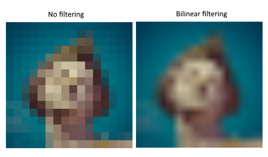
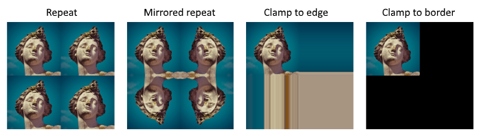

-[Khronos Vulkan Tutorial](https://docs.vulkan.org/tutorial/latest/00_Introduction.html)


이 챕터에서는 그래픽 파이프라인이 이미지를 샘플링하는데 필요한 리소스를 두개 더 만들 것입니다. 첫번째 리소스는 이전에 스왑체인 이미지로 작업하는 동안 본 것이지만, 두번째 리소스는 새로운 것입니다. 그것은 셰이더가 이미지에서 텍셀을 읽는 방법과 관련이 있습니다.

# 텍스쳐 이미지 뷰

이전에 스왑체인 이미지와 프레임 버퍼를 사용하여 이미지에 직접 접근하지 않고 이미지 뷰를 통해 접근하는 것을 봤습니다. 우리는 또한 텍스쳐 이미지에 대해 이러한 이미지 뷰를 생성해야 합니다.

텍스쳐 이미지에 대한 [`VkImageView`](https://www.khronos.org/registry/vulkan/specs/1.0/man/html/VkImageView.html)를 보유할 클래스 멤버를 추가하고, 이를 생성할 새 함수 `createTextureImageView`를 만듭니다.

```cpp
VkImageView textureImageView;

...

void initVulkan() {
    ...
    createTextureImage();
    createTextureImageView();
    createVertexBuffer();
    ...
}

...

void createTextureImageView() {

}
```

이 함수의 코드는 `createImageViews`를 기반으로 할 수 있습니다. `format`과 `image`만 바꾸면 됩니다.

```cpp
VkImageViewCreateInfo viewInfo{};
viewInfo.sType = VK_STRUCTURE_TYPE_IMAGE_VIEW_CREATE_INFO;
viewInfo.image = textureImage;
viewInfo.viewType = VK_IMAGE_VIEW_TYPE_2D;
viewInfo.format = VK_FORMAT_R8G8B8A8_SRGB;
viewInfo.subresourceRange.aspectMask = VK_IMAGE_ASPECT_COLOR_BIT;
viewInfo.subresourceRange.baseMipLevel = 0;
viewInfo.subresourceRange.levelCount = 1;
viewInfo.subresourceRange.baseArrayLayer = 0;
viewInfo.subresourceRange.layerCount = 1;
```

명시적인 `viewInfo.components` 초기화를 생략했습니다. `Vk_COMPONENT_SWIZZLE_IDENTITY`가 `0`으로 정의되기 때문입니다. [`vkCreateImageView`](https://www.khronos.org/registry/vulkan/specs/1.0/man/html/vkCreateImageView.html)를 호출하여 이미지 뷰 생성을 끝냅니다.

```cpp
if (vkCreateImageView(device, &viewInfo, nullptr, &textureImageView) != VK_SUCCESS) {
    throw std::runtime_error("failed to create texture image view!");
}
```

많은 로직이 `createImageViews`에서 복제되므로, 새 `createImageView` 함수로 추상화하기를 원합니다.

```cpp
VkImageView createImageView(VkImage image, VkFormat format) {
    VkImageViewCreateInfo viewInfo{};
    viewInfo.sType = VK_STRUCTURE_TYPE_IMAGE_VIEW_CREATE_INFO;
    viewInfo.image = image;
    viewInfo.viewType = VK_IMAGE_VIEW_TYPE_2D;
    viewInfo.format = format;
    viewInfo.subresourceRange.aspectMask = VK_IMAGE_ASPECT_COLOR_BIT;
    viewInfo.subresourceRange.baseMipLevel = 0;
    viewInfo.subresourceRange.levelCount = 1;
    viewInfo.subresourceRange.baseArrayLayer = 0;
    viewInfo.subresourceRange.layerCount = 1;

    VkImageView imageView;
    if (vkCreateImageView(device, &viewInfo, nullptr, &imageView) != VK_SUCCESS) {
        throw std::runtime_error("failed to create texture image view!");
    }

    return imageView;
}
```

`createTextureImageView` 함수는 다음과 같이 간소화할 수 있습니다.

```cpp
void createTextureImageView() {
    textureImageView = createImageView(textureImage, VK_FORMAT_R8G8B8A8_SRGB);
}
```

그리고 `createImageViews`는 이렇게 간소화할 수 있습니다.

```cpp
void createImageViews() {
    swapChainImageViews.resize(swapChainImages.size());

    for (uint32_t i = 0; i < swapChainImages.size(); i++) {
        swapChainImageViews[i] = createImageView(swapChainImages[i], swapChainImageFormat);
    }
}
```

이미지 자체를 파괴하기 직전에 프로그램 끝에서 이미지 뷰를 파괴해야 합니다.

```cpp
void cleanup() {
    cleanupSwapChain();

    vkDestroyImageView(device, textureImageView, nullptr);

    vkDestroyImage(device, textureImage, nullptr);
    vkFreeMemory(device, textureImageMemory, nullptr);
```

# 샘플러 (Samplers)

셰이더가 이미지에서 직접 텍셀을 읽는 것이 가능하지만, 텍스쳐로 사용될 때는 일반적이지 않습니다. 텍스쳐는 일반적으로 검색되는 마지막 색상을 계산하기 위해 필더링이나 변환을 적용하는 샘플러를 통해 접근됩니다.

이러한 필터는 오버샘플링 같은 문제를 처리하는데 유용합니다. 텍셀보다 조각이 더 많은 지오메트리에 매핑되는 텍스쳐를 생각해봅시다. 각 조각의 텍스쳐 좌표에 대해 가장 가까운 텍셀을 취하기만 하면 첫번째 이미지 같은 결과를 얻게 됩니다.



선형 보간을 통해 가장 가까운 4개의 텍셀을 결합하면 오른쪽 같이 더 부드러운 결과를 얻을 수 있습니다. 물론 어플리케이션에 따라서는 왼쪽 스타일이 더 적합할 수 있습니다. 마인크래프트 같은 것 말이죠. 보통 그래픽 어플리케이션에서는 오른쪽이 선호됩니다. 샘플러 객체는 텍스쳐에서 색상을 읽을 때 자동으로 이 필터링을 적용합니다.

언더샘플링은 조각보다 텍셀이 더 많은 반대의 경우입니다. 예리한 각도에서 바둑판 텍스쳐 같은 고주파수 패턴을 샘플링할 때 아티팩트를 발생시킵니다. 


왼쪽 이미지 같이 텍스쳐가 멀리서 흐릿하게 변합니다. 이에 대한 해결 방법은 샘플러에 의해 자동으로 적용될 수 있는 [이방성 필터링](https://en.wikipedia.org/wiki/Anisotropic_filtering)입니다.

이러한 필터 외에도 샘플러는 변환을 처리할 수 있습니다. 주소 지정 모드를 통해 이미지 외부의 텍셀을 읽으려고 할 때 결과를 결정합니다. 아래 이미지는 몇가지 케이스를 보여줍니다.



새로운 함수 `createTextureSampler`를 만들어서 샘플러 객체를 설정하겠습니다. 나중에 샘플러를 사용해서 셰이더의 텍스쳐에서 색상을 읽을 것입니다.

```cpp
void initVulkan() {
    ...
    createTextureImage();
    createTextureImageView();
    createTextureSampler();
    ...
}

...

void createTextureSampler() {

}
```

샘플러는 적용해야 하는 모든 필터와 변환을 지정하는 [`VkSamplerCreateInfo`](https://www.khronos.org/registry/vulkan/specs/1.0/man/html/VkSamplerCreateInfo.html) 구조체를 통해 구성됩니다.

```cpp
VkSamplerCreateInfo samplerInfo{};
samplerInfo.sType = VK_STRUCTURE_TYPE_SAMPLER_CREATE_INFO;
samplerInfo.magFilter = VK_FILTER_LINEAR;
samplerInfo.minFilter = VK_FILTER_LINEAR;
```

`magFilter`와 `minFilter` 필드는 확대 또는 축소된 텍셀을 보간하는 방법을 지정합니다. 확대는 위에서 설명한 오버샘플링 문제, 축소는 언더샘플링 문제와 관련됩니다. 위의 이미지에 표시된 모드에 해당하는 `VK_FILTER_NEAREST`나 `VK_FILTER_LINEAR` 중에 선택할 수 있습니다.

```cpp
samplerInfo.addressModeU = VK_SAMPLER_ADDRESS_MODE_REPEAT;
samplerInfo.addressModeV = VK_SAMPLER_ADDRESS_MODE_REPEAT;
samplerInfo.addressModeW = VK_SAMPLER_ADDRESS_MODE_REPEAT;
```

`addressMode` 필드를 사용하여 축마다 주소 지정 모드를 지정할 수 있습니다. 사용 가능한 값은 아래에 나열되어 있습니다. 이들 대부분은 위의 이미지에 나와있습니다. 축은 X,Y,Z 대신 U,V,W로 부릅니다. 이것은 텍스쳐 공간 좌표에 대한 규칙입니다.

- `VK_SAMPLER_ADDRESS_MODE_REPEAT`: 이미지 치수를 초과할 때 텍스쳐를 반복합니다.
- `VK_SAMPLER_ADDRESS_MODE_MIRRORED_REPEAT`: repeat와 비슷하지만, 차원을 넘어갈 때 이미지를 미러링하기 위해 좌표를 반전합니다.
- `VK_SAMPLER_ADDRESS_MODE_CLAMP_TO_EDGE`: 이미지 치수를 넘어서면 가장자리의 색상을 가져옵니다.
- `VK_SAMPLER_ADDRESS_MODE_MIRROR_CLAMP_TO_EDGE`: clamp to edge와 비슷하지만 가장 가까운 가장자리의 반대쪽 가장자리를 사용합니다.
- `VK_SAMPLER_ADDRESS_MODE_CLAMP_TO_BORDER`: 이미지 크기 이상으로 샘플링할 때 단색을 반환합니다.

여기서 사용하는 주소 지정 모드는 중요하지 않습니다. 이 튜토리얼에서는 이미지 외부를 샘플링하지 않을 것이기 때문입니다. 그러나 반복 모드는 바닥, 벽 같은 질감을 타일링하는데 사용할 수 있기 때문에 제일 일반적인 모드일 것입니다.

```cpp
samplerInfo.anisotropyEnable = VK_TRUE;
samplerInfo.maxAnisotropy = ???;
```

이 두 필드는 등방성 필터링을 사용해야 하는지 여부를 지정합니다. 성능이 문제가 되지 않는 한 이것을 사용하지 않을 이유는 없습니다. `maxAnisotropy` 필드는 최종 색상을 계산하는데 사용할 수 있는 텍셀 샘플의 양을 제한합니다. 값이 낮을 수록 성능은 향상되지만 품질은 낮아집니다. 어떤 값을 사용할 수 있는지 알아내려면 다음과 같이 물리적 장치의 속성을 검색해야 합니다.

```cpp
VkPhysicalDeviceProperties properties{};
vkGetPhysicalDeviceProperties(physicalDevice, &properties);
```

[`VkPhysicalDeviceProperties`](https://www.khronos.org/registry/vulkan/specs/1.0/man/html/VkPhysicalDeviceProperties.html) 구조에 대한 문서를 보면 `limits`라는 [`VkPhysicalDeviceLimits`](https://www.khronos.org/registry/vulkan/specs/1.0/man/html/VkPhysicalDeviceLimits.html) 멤버가 있습니다. 이 구조체에는 `maxSamplerAnisotropy`라는 멤버가 있으며, `maxAnisotropy`에 대해 지정할 수 있는 최대 값입니다. 최대 품질을 원하면 해당 값을 직접 사용할 수 있습니다.

```cpp
samplerInfo.maxAnisotropy = properties.limits.maxSamplerAnisotropy;
```

프로그램 시작 부분에서 속성을 쿼리하고 속성을 필요로 하는 함수에 전달하거나, `createTextureSampler` 함수 자체에서 쿼리할 수 있습니다.

```cpp
samplerInfo.borderColor = VK_BORDER_COLOR_INT_OPAQUE_BLACK;
```

`borderColor` 필드는 테두리 주소 지정 모드로 clamp를 사용하여 이미지 너머를 샘플링할 때 반환되는 색상을 지정합니다. float, int 형식으로 검정 또는 흰색, 투명을 반환하는 것이 가능합니다. 임의의 색상을 지정할 수는 없습니다.

```cpp
samplerInfo.unnormalizedCoordinates = VK_FALSE;
```

`unnormalizedCoordinates` 필드는 이미지의 텍셀을 처리하는데 사용할 좌표계를 지정합니다. 이 필드가 `VK_TRUE`이면 간단히 `[0, texWidth)`, `[0, texHieght)` 범위 내에서 좌표를 사용할 수 있습니다. `VK_FALSE`이면 모든 축에서 `[0, 1)` 범위를 사용하여 텍셀의 주소가 지정됩니다. 실제 어플리케이션은 거의 항상 정규화된 좌표를 사용합니다. 그러면 정확히 동일한 좌표로 다양한 해상도의 텍스쳐를 사용할 수 있기 때문입니다.

```cpp
samplerInfo.compareEnable = VK_FALSE;
samplerInfo.compareOp = VK_COMPARE_OP_ALWAYS;
```

비교 기능이 활성화되면 텍셀이 먼저 값과 비교되고 해당 비교 결과가 필터링 작업에 사용됩니다. 이는 그림자 맵에서 주로 [근접한 비율 필터링](https://developer.nvidia.com/gpugems/GPUGems/gpugems_ch11.html)에 사용됩니다. 이에 대해서는 다음 챕터에서 살펴보겠습니다.

```cpp
samplerInfo.mipmapMode = VK_SAMPLER_MIPMAP_MODE_LINEAR;
samplerInfo.mipLodBias = 0.0f;
samplerInfo.minLod = 0.0f;
samplerInfo.maxLod = 0.0f;
```

이 모든 필드는 밉매핑에 적용됩니다. [이후 챕터](https://vulkan-tutorial.com/Generating_Mipmaps)에서 밉매핑을 볼 것인데, 기본적으로 적용할 수 있는 또 다른 유형의 필터일 것입니다.

이제 샘플러의 기능이 완전히 정의되었습니다. 샘플러 객체의 핸들을 보유할 클래스 멤버를 추가하고 [`vkCreateSampler`](https://www.khronos.org/registry/vulkan/specs/1.0/man/html/vkCreateSampler.html)로 샘플러를 만듭시다.

```cpp
VkImageView textureImageView;
VkSampler textureSampler;

...

void createTextureSampler() {
    ...

    if (vkCreateSampler(device, &samplerInfo, nullptr, &textureSampler) != VK_SUCCESS) {
        throw std::runtime_error("failed to create texture sampler!");
    }
}
```

샘플러는 어디에서나 [`VkImage`](https://www.khronos.org/registry/vulkan/specs/1.0/man/html/VkImage.html)를 참조하지 않습니다. 샘플러는 텍스쳐에서 색상을 추출하는 인터페이스를 제공하는 별개의 객체입니다. 1D, 2D, 3D 등 원하는 모든 이미지에 적용할 수 있습니다. 이는 텍스쳐 이미지와 필터링을 단일 상태로 결합한 이전 API 들과는 다릅니다.

```cpp
void cleanup() {
    cleanupSwapChain();

    vkDestroySampler(device, textureSampler, nullptr);
    vkDestroyImageView(device, textureImageView, nullptr);

    ...
}
```

# 이방성 장치 기능 (Anisotropy device feature)

지금 프로그램을 실행하면 다음과 같은 유효성 검사 레이어 메세지가 표시됩니다.


이는 이방성 필터링이 실제로 선택적 장치 기능이기 때문입니다. 요청하려면 `createLogicalDevice` 함수를 수정해야 합니다.

```cpp
VkPhysicalDeviceFeatures deviceFeatures{};
deviceFeatures.samplerAnisotropy = VK_TRUE;
```

최신 그래픽 카드가 지원하지 않을 가능성은 거의 없지만 `isDeviceSuitable`을 수정하여 사용 가능한지 확인해야 합니다.

```cpp
bool isDeviceSuitable(VkPhysicalDevice device) {
    ...

    VkPhysicalDeviceFeatures supportedFeatures;
    vkGetPhysicalDeviceFeatures(device, &supportedFeatures);

    return indices.isComplete() && extensionsSupported && swapChainAdequate && supportedFeatures.samplerAnisotropy;
}
```

[`vkGetPhysicalDeviceFeatures`](https://www.khronos.org/registry/vulkan/specs/1.0/man/html/vkGetPhysicalDeviceFeatures.html)는 boolean 값을 설정하여 요청하지 않고, 지원되는 기능을 나타내기 위해 [`VkPhysicalDeviceFeatures`](https://www.khronos.org/registry/vulkan/specs/1.0/man/html/VkPhysicalDeviceFeatures.html) 구조체를 변경합니다.

등방성 필터링의 가용성을 적용하는 대신, 조건부로 설정하여 단순히 사용하지 않을 수도 있습니다.

```cpp
samplerInfo.anisotropyEnable = VK_FALSE;
samplerInfo.maxAnisotropy = 1.0f;
```

다음 챕터에서는 이미지와 샘플러 객체를 셰이더에 노출시켜 정사각형에 텍스쳐를 그릴 것입니다.

[C++ code](https://vulkan-tutorial.com/code/25_sampler.cpp) / [Vertex shader](https://vulkan-tutorial.com/code/22_shader_ubo.vert) / [Fragment shader](https://vulkan-tutorial.com/code/22_shader_ubo.frag)