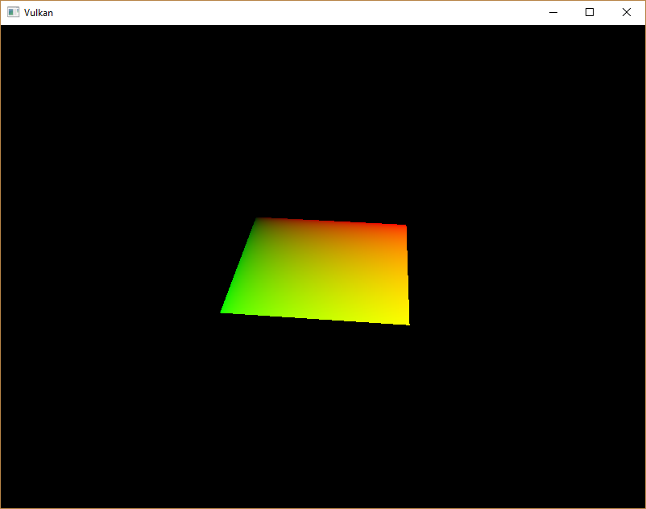
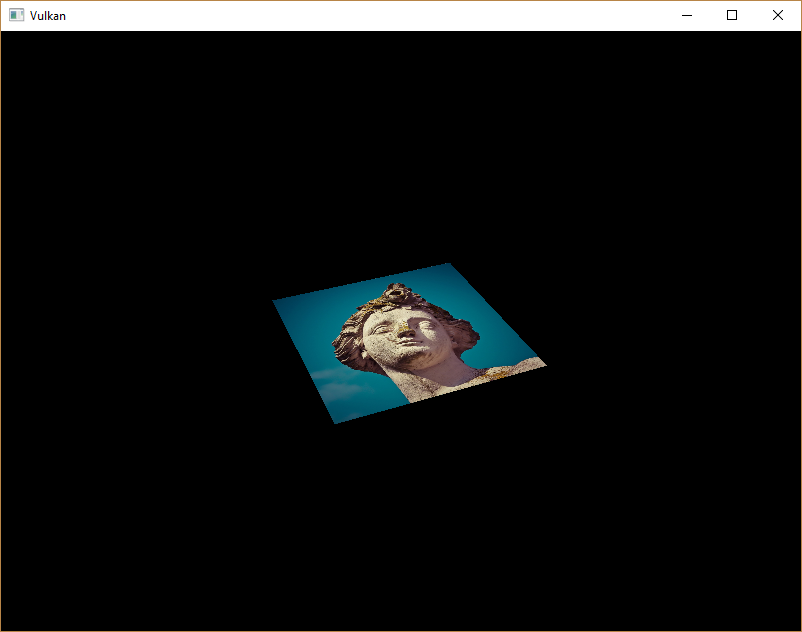
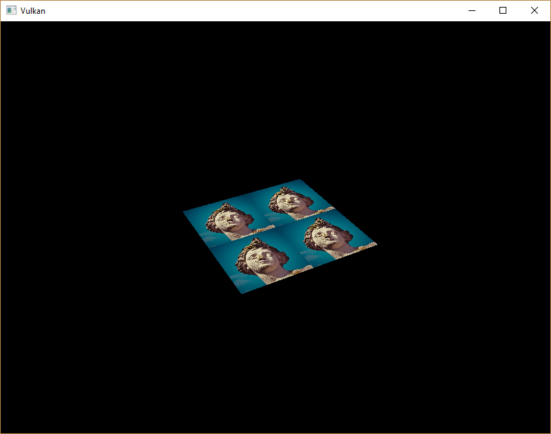
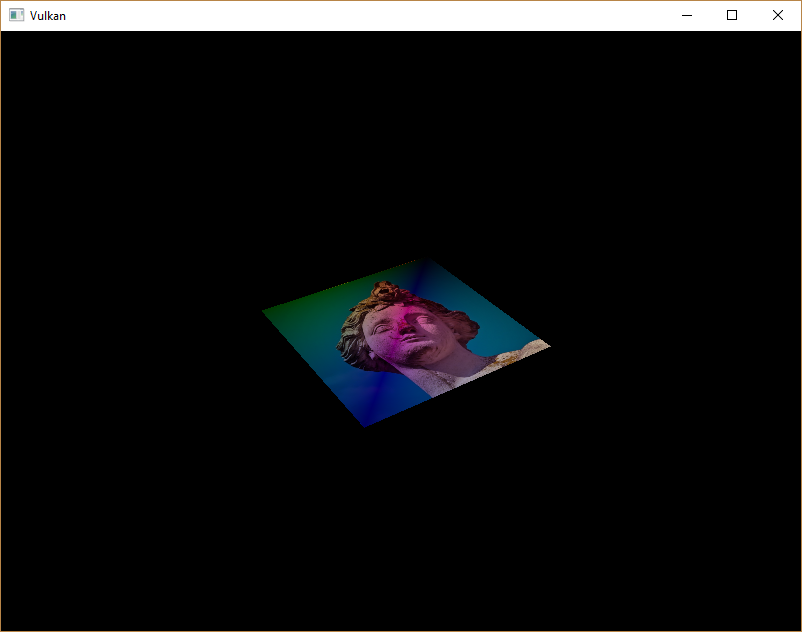

-[Khronos Vulkan Tutorial](https://docs.vulkan.org/tutorial/latest/00_Introduction.html)


# 소개

튜토리얼의 uniform buffer 파트부터 처음으로 descriptor에 대해 봤습니다. 이 챕터에서는 새로운 타입의 descriptor를 보겠습니다:결합된 이미지 샘플러(combined image sampler) 입니다. 이 descriptor는 셰이더가 이전 챕터에서 만든 것과 같이 같은 샘플러 객체를 통해 이미지 리소스에 엑세스할 수 있도록 해줍니다.

이러한 결합된 이미지 샘플러 descriptor를 포함하도록 descriptor layout, descriptor pool, descriptor set를 수정하는 것으로 시작하겠습니다. 그 다음, `정점`에 텍스쳐 좌표를 추가하고 정점 색상을 보간하는 대신, 텍스쳐에서 색상을 읽도록 조각 셰이더를 수정합니다.

# descriptor 갱신

`createDescriptorSetLayout` 함수로 이동해서 결합된 이미지 샘플러 descriptor에 대해 [`VkDescriptorSetLayoutBinding`](https://www.khronos.org/registry/vulkan/specs/1.0/man/html/VkDescriptorSetLayoutBinding.html)에 추가합니다. 우리는 그것을 다음에 uniform buffer 바인딩에 넣을 것입니다.

```cpp
VkDescriptorSetLayoutBinding samplerLayoutBinding{};
samplerLayoutBinding.binding = 1;
samplerLayoutBinding.descriptorCount = 1;
samplerLayoutBinding.descriptorType = VK_DESCRIPTOR_TYPE_COMBINED_IMAGE_SAMPLER;
samplerLayoutBinding.pImmutableSamplers = nullptr;
samplerLayoutBinding.stageFlags = VK_SHADER_STAGE_FRAGMENT_BIT;

std::array<VkDescriptorSetLayoutBinding, 2> bindings = {uboLayoutBinding, samplerLayoutBinding};
VkDescriptorSetLayoutCreateInfo layoutInfo{};
layoutInfo.sType = VK_STRUCTURE_TYPE_DESCRIPTOR_SET_LAYOUT_CREATE_INFO;
layoutInfo.bindingCount = static_cast<uint32_t>(bindings.size());
layoutInfo.pBindings = bindings.data();
```

조각 셰이더에서 결합된 이미지 샘플러 descriptor를 사용한다는 것을 `stageFlags`를 설정하여 나타내야 합니다. 그것은 조각의 색상이 결정되는 곳입니다. 정점 셰이더에서 텍스쳐 샘플링을 사용할 수 있습니다. 예를 들어 [높이 맵](https://en.wikipedia.org/wiki/Heightmap)을 통해 정점 그리드를 동적으로 변형할 수 있습니다.

또한 `VK_DESCRIPTOR_TYPE_COMBINED_IMAEGE_SAMPLER` 타입의 다른 [`VkPoolSize`](https://www.khronos.org/registry/vulkan/specs/1.0/man/html/VkPoolSize.html)를 [`VkDescriptorPoolCreateInfo`](https://www.khronos.org/registry/vulkan/specs/1.0/man/html/VkDescriptorPoolCreateInfo.html)에 추가하여 결합된 이미지 샘플러 할당을 위한 공간을 만들 것이고, 이를 위해 더 큰 descriptor pool을 만들어야 합니다. `createDescriptorPool` 함수로 이동해서 이 descriptor에 대한 [`VkDescriptorPoolSize`](https://www.khronos.org/registry/vulkan/specs/1.0/man/html/VkDescriptorPoolSize.html)를 포함하도록 수정합니다.

```cpp
std::array<VkDescriptorPoolSize, 2> poolSizes{};
poolSizes[0].type = VK_DESCRIPTOR_TYPE_UNIFORM_BUFFER;
poolSizes[0].descriptorCount = static_cast<uint32_t>(MAX_FRAMES_IN_FLIGHT);
poolSizes[1].type = VK_DESCRIPTOR_TYPE_COMBINED_IMAGE_SAMPLER;
poolSizes[1].descriptorCount = static_cast<uint32_t>(MAX_FRAMES_IN_FLIGHT);

VkDescriptorPoolCreateInfo poolInfo{};
poolInfo.sType = VK_STRUCTURE_TYPE_DESCRIPTOR_POOL_CREATE_INFO;
poolInfo.poolSizeCount = static_cast<uint32_t>(poolSizes.size());
poolInfo.pPoolSizes = poolSizes.data();
poolInfo.maxSets = static_cast<uint32_t>(MAX_FRAMES_IN_FLIGHT);
```

부적절한 descriptor pool은 유효성 검사 레이어가 탐지하지 못하는 문제의 좋은 사례입니다: Vulkan 1.1 부터는 풀이 충분히 크지 않으면 [`vkAllocateDescriptorSets`](https://www.khronos.org/registry/vulkan/specs/1.0/man/html/vkAllocateDescriptorSets.html)가 `VK_ERROR_POOL_OUT_OF_MEMORY` 에러를 내며 실패할 수 있지만, 드라이버가 내부적으로 문제를 해결할 수도 있습니다. 이것은 때때로 (하드웨어, 풀 크기와 할당 크기에 따라) 드라이버가 descriptor pool의 한계를 초과하는 할당으로 벗어날 수 있다는 것을 의미합니다. 다른 경우에는 [`vkAllocateDescriptorSets`](https://www.khronos.org/registry/vulkan/specs/1.0/man/html/vkAllocateDescriptorSets.html)가 실패하고 `VK_ERROR_POOL_OUT_OF_MEMORY`를 반환합니다. 할당이 일부 시스템에서는 성공하지만, 다른 시스템에서는 실패한다면 실망스러울 수 있습니다.

Vulkan은 할당에 대한 책임을 드라이버로 전가하므로 더 이상 descriptor pool 생성을 위해 해당 `descriptorCount` 멤버가 지정한 특정 타입 (`VK_DESCRIPTOR_TYPE_COMBINED_IMAGE_SAMPLER` 등)의 descriptor 수만큼 할당해야 하는 엄격한 요구사항이 아닙니다. 하지만 그렇게 하는 것이 모범 사례로 있으며, 향후 [모범 사례 유효성 검사](https://vulkan.lunarg.com/doc/view/1.1.126.0/windows/best_practices.html)를 활성화 하면 `VK_LAYER_KHRONOS_validation`에서 이러한 유형의 문제에 대해 경고할 것입니다.

마지막 단계는 실제 이미지와 샘플러 리소스를 descriptor set의 descriptor에 바인딩하는 것입니다. `createDescriptorSets` 함수로 이동합니다.

```cpp
for (size_t i = 0; i < MAX_FRAMES_IN_FLIGHT; i++) {
    VkDescriptorBufferInfo bufferInfo{};
    bufferInfo.buffer = uniformBuffers[i];
    bufferInfo.offset = 0;
    bufferInfo.range = sizeof(UniformBufferObject);

    VkDescriptorImageInfo imageInfo{};
    imageInfo.imageLayout = VK_IMAGE_LAYOUT_SHADER_READ_ONLY_OPTIMAL;
    imageInfo.imageView = textureImageView;
    imageInfo.sampler = textureSampler;

    ...
}
```

결합된 이미지 샘플러 구조체에 대한 리소스는 [`VkDescriptorBufferInfo`](https://www.khronos.org/registry/vulkan/specs/1.0/man/html/VkDescriptorBufferInfo.html) 구조체에 uniform buffer descriptor의 버퍼 리소스가 지정되는 것과 같이, [`VkDescriptorImageInfo`](https://www.khronos.org/registry/vulkan/specs/1.0/man/html/VkDescriptorImageInfo.html) 구조체에 지정되어야 합니다. 이전 챕터의 객체가 다 모이는 곳입니다.

```cpp
std::array<VkWriteDescriptorSet, 2> descriptorWrites{};

descriptorWrites[0].sType = VK_STRUCTURE_TYPE_WRITE_DESCRIPTOR_SET;
descriptorWrites[0].dstSet = descriptorSets[i];
descriptorWrites[0].dstBinding = 0;
descriptorWrites[0].dstArrayElement = 0;
descriptorWrites[0].descriptorType = VK_DESCRIPTOR_TYPE_UNIFORM_BUFFER;
descriptorWrites[0].descriptorCount = 1;
descriptorWrites[0].pBufferInfo = &bufferInfo;

descriptorWrites[1].sType = VK_STRUCTURE_TYPE_WRITE_DESCRIPTOR_SET;
descriptorWrites[1].dstSet = descriptorSets[i];
descriptorWrites[1].dstBinding = 1;
descriptorWrites[1].dstArrayElement = 0;
descriptorWrites[1].descriptorType = VK_DESCRIPTOR_TYPE_COMBINED_IMAGE_SAMPLER;
descriptorWrites[1].descriptorCount = 1;
descriptorWrites[1].pImageInfo = &imageInfo;

vkUpdateDescriptorSets(device, static_cast<uint32_t>(descriptorWrites.size()), descriptorWrites.data(), 0, nullptr);
```

descriptor는 버퍼와 마찬가지로 이 이미지 정보로 업데이트되어야 합니다. 이번에는 `pBufferInfo` 대신 `pImageInfo` 배열을 사용합니다. descriptor는 이제 셰이더에서 사용할 준비가 되었습니다!

# 텍스쳐 좌표 (Texture coordinates)

텍스쳐 매핑을 위한 한가지 중요한 요소가 아직 남아있으며, 이는 각 정점의 실제 좌표입니다. 좌표는 이미지가 실제 지오메트리에 매핑되는 방식을 결정합니다.

```cpp
struct Vertex {
    glm::vec2 pos;
    glm::vec3 color;
    glm::vec2 texCoord;

    static VkVertexInputBindingDescription getBindingDescription() {
        VkVertexInputBindingDescription bindingDescription{};
        bindingDescription.binding = 0;
        bindingDescription.stride = sizeof(Vertex);
        bindingDescription.inputRate = VK_VERTEX_INPUT_RATE_VERTEX;

        return bindingDescription;
    }

    static std::array<VkVertexInputAttributeDescription, 3> getAttributeDescriptions() {
        std::array<VkVertexInputAttributeDescription, 3> attributeDescriptions{};

        attributeDescriptions[0].binding = 0;
        attributeDescriptions[0].location = 0;
        attributeDescriptions[0].format = VK_FORMAT_R32G32_SFLOAT;
        attributeDescriptions[0].offset = offsetof(Vertex, pos);

        attributeDescriptions[1].binding = 0;
        attributeDescriptions[1].location = 1;
        attributeDescriptions[1].format = VK_FORMAT_R32G32B32_SFLOAT;
        attributeDescriptions[1].offset = offsetof(Vertex, color);

        attributeDescriptions[2].binding = 0;
        attributeDescriptions[2].location = 2;
        attributeDescriptions[2].format = VK_FORMAT_R32G32_SFLOAT;
        attributeDescriptions[2].offset = offsetof(Vertex, texCoord);

        return attributeDescriptions;
    }
};
```

`Vertex` 구조체를 수정하여 텍스쳐 좌표를 위한 `vec2`를 포함하도록 합니다. 정점 셰이더에서 엑세스 텍스쳐 좌표를 입력으로 사용할 수 있도록 [`VkVertexInputAttributeDescription`](https://www.khronos.org/registry/vulkan/specs/1.0/man/html/VkVertexInputAttributeDescription.html)도 추가해야 합니다. 정사각형 표면을 가로지르는 보간을 위해 조각 셰이더에 전달할 수 있어야 합니다.

```cpp
const std::vector<Vertex> vertices = {
    {{-0.5f, -0.5f}, {1.0f, 0.0f, 0.0f}, {1.0f, 0.0f}},
    {{0.5f, -0.5f}, {0.0f, 1.0f, 0.0f}, {0.0f, 0.0f}},
    {{0.5f, 0.5f}, {0.0f, 0.0f, 1.0f}, {0.0f, 1.0f}},
    {{-0.5f, 0.5f}, {1.0f, 1.0f, 1.0f}, {1.0f, 1.0f}}
};
```

이 튜토리얼에서는 왼쪽 상단 모서리 `0,0`에서 오른쪽 하단 모서리 `1,1`까지의 좌표를 사용하여 사각형을 텍스쳐로 채울 것입니다. 다양한 좌표로 자유롭게 실험해보세요. 작동 중인 주소 지정 모드를 보려면 `0` 미만 `1` 이상의 좌표를 사용해보세요!

# 셰이더 (Shaders)

마지막 단계는 텍스쳐에서 색상을 샘플링하도록 셰이더를 수정하는 것입니다. 먼저 텍스쳐 좌표를 통해 조각 셰이더로 전달하도록 정점 셰이더를 수정해야 합니다.

```cpp
layout(location = 0) in vec2 inPosition;
layout(location = 1) in vec3 inColor;
layout(location = 2) in vec2 inTexCoord;

layout(location = 0) out vec3 fragColor;
layout(location = 1) out vec2 fragTexCoord;

void main() {
    gl_Position = ubo.proj * ubo.view * ubo.model * vec4(inPosition, 0.0, 1.0);
    fragColor = inColor;
    fragTexCoord = inTexCoord;
}
```

정점별 색상과 마찬가지로, `fragTexCoord` 값은 래스터라이저에 의해 정사각형 영역에 걸쳐 부드럽게 보간됩니다. 조각 셰이더가 텍스쳐 좌표를 색상으로 출력하도록 하여, 이것을 시각화할 수 있습니다.

```cpp
#version 450

layout(location = 0) in vec3 fragColor;
layout(location = 1) in vec2 fragTexCoord;

layout(location = 0) out vec4 outColor;

void main() {
    outColor = vec4(fragTexCoord, 0.0, 1.0);
}
```

아래 이미지와 같이 표시되어야 합니다. 셰이더를 다시 컴파일하는 것을 잊지 마세요.



녹색 채널은 수평 좌표를 나타내고 빨간 채널은 수직 좌표를 나타냅니다. 검은색과 노란색 모서리는 텍스쳐 좌표가 정사각형을 가로질러 `0,0`에서 `1,1`로 올바르게 보간되었다는 것을 나타냅니다. 색상을 사용하여 데이터를 시각화하는 것은 더 나은 옵션이 없기 때문에, `printf`로 디버깅하는 것과 같이 동일한 셰이더 프로그래밍입니다.

결합된 이미지 샘플러 descriptor는 GLSL에서 샘플러 유니폼으로 표현됩니다. 조각 셰이더에서 참조를 추가합니다.

```cpp
layout(binding = 1) uniform sampler2D texSampler;
```

다른 유형의 이미지에 대해 동등한 `sampler1D`, `sampler3D` 유형이 있습니다. 여기에서 올바른 바인딩을 사용 해야 합니다.

```cpp
void main() {
    outColor = texture(texSampler, fragTexCoord);
}
```

텍스쳐는 내장된 `texture` 기능을 사용하여 샘플링됩니다. `sampler`를 사용하고 인수로 조정합니다. 샘플러는 백그라운드에서 필터링 및 변환을 자동으로 처리합니다. 이제 어플리케이션을 실행할 때 사각형에 텍스쳐가 표시되어야 합니다.



텍스쳐 좌표를 `1`보다 큰 값으로 바꿔서 주소 지정 모드를 실험해보세요. 예를 들어 다음 조각 셰이더는 `VK_SAMPLER_ADDRESS_MODE_REPEAT`를 사용할 때 아래 이미지 결과를 생성합니다.

```cpp
void main() {
    outColor = texture(texSampler, fragTexCoord * 2.0);
}
```



정점 색상을 사용하여 텍스쳐 색상을 조작할 수도 있습니다.

```cpp
void main() {
    outColor = vec4(fragColor * texture(texSampler, fragTexCoord).rgb, 1.0);
}
```

알파 채널의 크기를 조정하지 않기 위해 여기서 RGB와 알파채널을 분리했습니다.



이제 셰이더에서 이미지에 접근하는 방법을 알게 되었습니다. 이것은 프레임 버퍼에서도 기록되는 이미지와 결합할 때 매우 강력한 기술입니다. 이러한 이미지를 입력으로 사용하여 3D 세계 내에서 후처리 및 카메라 디스플레이와 같은 멋진 효과를 구현할 수 있습니다.

[C++ code](https://vulkan-tutorial.com/code/26_texture_mapping.cpp) / [Vertex shader](https://vulkan-tutorial.com/code/26_shader_textures.vert) / [Fragment shader](https://vulkan-tutorial.com/code/26_shader_textures.frag)