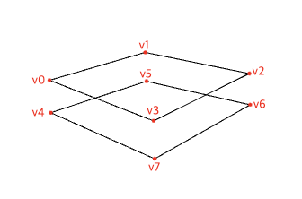
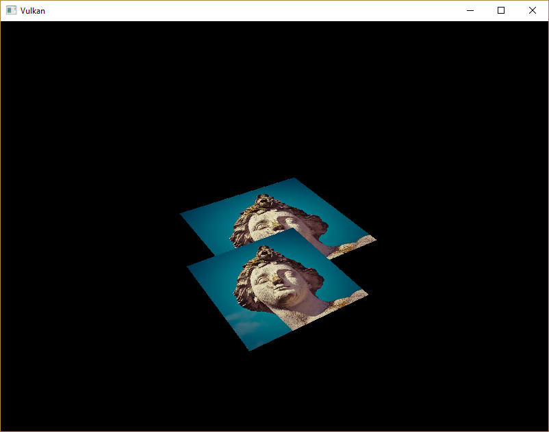
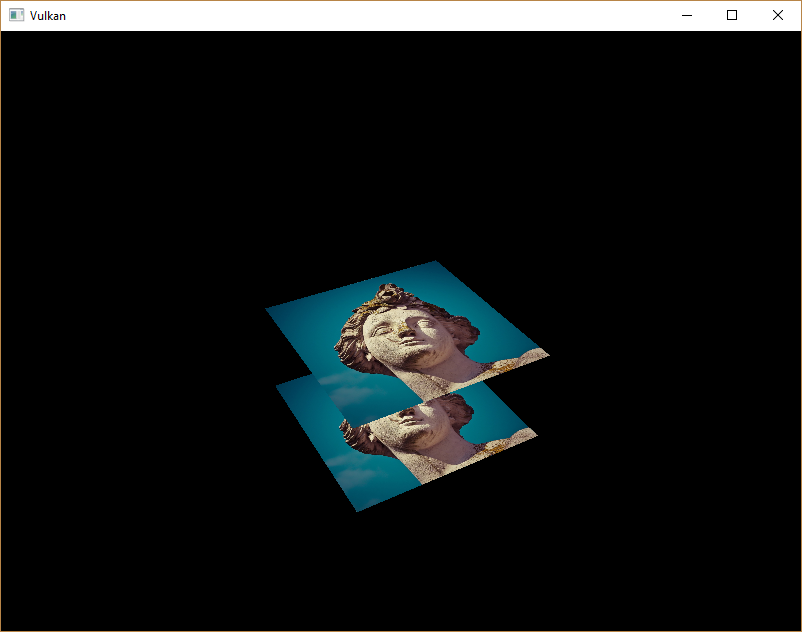

-[Khronos Vulkan Tutorial](https://docs.vulkan.org/tutorial/latest/00_Introduction.html)

# 소개

지금까지 작업한 지오메트리는 3D로 투영되지만 여전히 완전히 평평합니다. 이 챕터에서는 3D 메쉬를 준비하기 위해 위치에 Z 좌표를 추가해줄 것입니다. 기하학이 깊이별로 정렬되지 않을 때 발생하는 문제를 보기 위해, 이 세번째 좌표를 사용하여 현재 정사각형 위에 정사각형을 배치하겠습니다.

# 3D 지오메트리

`Vertex` 구조체를 수정하여 position에 3D vector를 사용하도록 하고, [`VkVertexInputAttributeDescription`](https://www.khronos.org/registry/vulkan/specs/1.0/man/html/VkVertexInputAttributeDescription.html)에서 `format`을 업데이트 합니다.

```cpp
struct Vertex {
    glm::vec3 pos;
    glm::vec3 color;
    glm::vec2 texCoord;

    ...

    static std::array<VkVertexInputAttributeDescription, 3> getAttributeDescriptions() {
        std::array<VkVertexInputAttributeDescription, 3> attributeDescriptions{};

        attributeDescriptions[0].binding = 0;
        attributeDescriptions[0].location = 0;
        attributeDescriptions[0].format = VK_FORMAT_R32G32B32_SFLOAT;
        attributeDescriptions[0].offset = offsetof(Vertex, pos);

        ...
    }
};
```

다음으로, 정점 셰이더를 업데이트하여 3D 좌표를 입력으로 받아들이도록 합니다. 다시 컴파일하는 것을 잊지 마세요!

```cpp
layout(location = 0) in vec3 inPosition;

...

void main() {
    gl_Position = ubo.proj * ubo.view * ubo.model * vec4(inPosition, 1.0);
    fragColor = inColor;
    fragTexCoord = inTexCoord;
}
```

마지막으로 Z 좌표를 포함하도록 `vertices`를 업데이트합니다.

```cpp
const std::vector<Vertex> vertices = {
    {{-0.5f, -0.5f, 0.0f}, {1.0f, 0.0f, 0.0f}, {0.0f, 0.0f}},
    {{0.5f, -0.5f, 0.0f}, {0.0f, 1.0f, 0.0f}, {1.0f, 0.0f}},
    {{0.5f, 0.5f, 0.0f}, {0.0f, 0.0f, 1.0f}, {1.0f, 1.0f}},
    {{-0.5f, 0.5f, 0.0f}, {1.0f, 1.0f, 1.0f}, {0.0f, 1.0f}}
};
```

지금 어플리케이션을 실행하면 이전과 정확히 동일한 결과를 볼 수 있습니다. 장면을 더 흥미롭게 만들고, 이 챕터에서 다룰 문제를 보여주기 위해 몇가지 지오메트리를 추가할 때입니다. 정점을 복제하여 다음과 같이 현재 사각형 바로 아래에 있는 사각형의 위치를 정의합니다.



`-0.5f`의 Z좌표를 사용하고 정사각형에 적절한 인덱스를 추가합니다.

```cpp
const std::vector<Vertex> vertices = {
    {{-0.5f, -0.5f, 0.0f}, {1.0f, 0.0f, 0.0f}, {0.0f, 0.0f}},
    {{0.5f, -0.5f, 0.0f}, {0.0f, 1.0f, 0.0f}, {1.0f, 0.0f}},
    {{0.5f, 0.5f, 0.0f}, {0.0f, 0.0f, 1.0f}, {1.0f, 1.0f}},
    {{-0.5f, 0.5f, 0.0f}, {1.0f, 1.0f, 1.0f}, {0.0f, 1.0f}},

    {{-0.5f, -0.5f, -0.5f}, {1.0f, 0.0f, 0.0f}, {0.0f, 0.0f}},
    {{0.5f, -0.5f, -0.5f}, {0.0f, 1.0f, 0.0f}, {1.0f, 0.0f}},
    {{0.5f, 0.5f, -0.5f}, {0.0f, 0.0f, 1.0f}, {1.0f, 1.0f}},
    {{-0.5f, 0.5f, -0.5f}, {1.0f, 1.0f, 1.0f}, {0.0f, 1.0f}}
};

const std::vector<uint16_t> indices = {
    0, 1, 2, 2, 3, 0,
    4, 5, 6, 6, 7, 4
};
```

프로그램을 실행하면 아래와 같이 보입니다.



문제는 아래쪽의 사각형 조각이 위쪽 사각형 조각 위에 그려지는 것입니다. 단순히 인덱스 배열이 나중에 오기 때문입니다. 이 문제를 해결하는 두가지 방법이 있습니다.

- 모든 드로우콜을 뒤에서 앞으로 깊이에 따라 정렬
- 깊이 버퍼로 깊이 테스트 사용

첫번째 접근 방식은 일반적으로 투명 객체를 그리는데 사용됩니다. 순서 독립적 투명도는 해결하기 어려운 문제이기 때문입니다. 그러나 깊이별로 조각을 정렬하는 문제는 깊이 버퍼를 사용하여 훨씬 더 일반적으로 해결됩니다. 깊이 버퍼는 색상 attachment가 모든 위치의 색상을 저장하는 것처럼, 모든 위치에 대한 깊이를 저장하는 추가 attachment입니다. 래스터라이저가 조각을 생성할 때마다 깊이 테스트는 새 조각이 이전 조각보다 가까운지 확인합니다. 그렇지 않은 경우, 새 조각이 삭제됩니다. 깊이 테스트를 통과한 조각은 자체 깊이를 깊이 버퍼에 씁니다. 색상 출력을 조작할 수 있는 것처럼, 조각 셰이더에서 이 값을 조작할 수 있습니다.

```cpp
#define GLM_FORCE_RADIANS
#define GLM_FORCE_DEPTH_ZERO_TO_ONE
#include <glm/glm.hpp>
#include <glm/gtc/matrix_transform.hpp>
```

GLM에서 생성된 원근 투영 행렬은 기본적으로 `-1.0 ~ 1.0`의 OpenGL 깊이 범위를 사용합니다. `GLM_FORCE_DEPTH_ZERO_TO_ONE` 디파인을 사용하여 `0.0 ~ 1.0`의 Vulkan 범위를 사용하도록 구성해야 합니다.

# 깊이 이미지와 뷰

깊이 attachment는 색상 attachment와 마찬가지로, 이미지를 기반으로 합니다. 차이점은 스왑체인이 자동으로 깊이 이미지를 생성하지 않는다는 것입니다. 한 번에 하나의 그리기 작업만 실행되기 때문에, 하나의 깊이 이미지만 필요합니다. 깊이 이미지에는 이미지, 메모리, 이미지 뷰의 세가지 리소스가 필요합니다.

```cpp
VkImage depthImage;
VkDeviceMemory depthImageMemory;
VkImageView depthImageView;
```

다음 릿소스를 설정하려면 `createDepthResources` 함수를 만듭니다.

```cpp
void initVulkan() {
    ...
    createCommandPool();
    createDepthResources();
    createTextureImage();
    ...
}

...

void createDepthResources() {

}
```

깊이 이미지를 만드는 것은 매우 간단합니다. 스왑체인 범위, 깊이 첨부에 적합한 이미지 사용, 최적의 타일링 및 장치 로컬 메모리로 정의된 색상 attachment와 동일한 해상도를 가져야 합니다. 유일한 의문은 깊이 이미지에 적합한 형식이 무엇인가? 입니다. 형식은 `VK_FORMAT_`에서 `_D??_`로 표시됩 깊이 구성 요소를 포함해야 합니다.

텍스쳐 이미지와 다르게 프로그램에서 텍셀에 직접 접근하지 않기 땜누에 특정 형식이 반드시 필요한 것은 아닙니다. 적절한 정확도만 있으면 되며, 실제 어플리케이션에서는 최소 24비트가 일반적입니다. 이 요구사항에 맞는 여러 형식이 있습니다.

- `VK_FORMAT_D32_SFLOAT`: 깊이를 위한 32비트 float
- `VK_FORMAT_D32_SFLOAT_S8_UINT`: 32비트 부호있는 float와 8비트 스텐실 컴포넌트
- `VK_FORMAT_D24_UNORM_S8_UINT`: 24비트 float과 8비트 스텐실 컴포넌트

스텐실 컴포넌트는 깊이 테스트와 결합할 수 있는 추가 테스트인, [스텐실 테스트](https://en.wikipedia.org/wiki/Stencil_buffer)에 사용됩니다. 이에 대해서는 다음 챕터에서 보겠습니다.

`VK_FORMAT_D32_SFLOAT` 형식에 대한 지원은 매우 일반적입니다. (하드웨어 데이터베이스를 참고하세요.) 그러므로 그냥 `VK_FORMAT_D32_SFLOAT` 형식을 사용할 수 있지만, 어플리케이션에 유연성을 추가하는 것이 좋습니다. 가장 바람직한 것부터 가장 바람직하지 않은 것 순으로 후보 형식 목록을 취하고, 어떤 것이 지원되는 첫번째 형식인지 확인하는 함수인 `findSupportedFormat`을 작성하겠습니다.

```cpp
VkFormat findSupportedFormat(const std::vector<VkFormat>& candidates, VkImageTiling tiling, VkFormatFeatureFlags features) {

}
```

형식 지원은 타일링 모드 및 사용법에 따라 다르므로, 이를 매개변수로 포함해야 합니다. [`vkGetPhysicalDeviceFormatProperties`](https://www.khronos.org/registry/vulkan/specs/1.0/man/html/vkGetPhysicalDeviceFormatProperties.html) 함수를 사용하여 형식 지원을 쿼리할 수 있습니다.

```cpp
for (VkFormat format : candidates) {
    VkFormatProperties props;
    vkGetPhysicalDeviceFormatProperties(physicalDevice, format, &props);
}
```

[`VkFormatProperties`](https://www.khronos.org/registry/vulkan/specs/1.0/man/html/VkFormatProperties.html) 구조체에는 다음 세가지 필드가 있습니다.

- `linearTilingFeatures`: 선형 타일링으로 지원되는 사용 케이스
- `optimalTilingFeatures`: 최적의 타일링으로 지원되는 사용 케이스
- `bufferFeatures`: 버퍼에 대해 지원되는 사용 케이스

여기서는 처음 두개만 관련이 있으며, 확힌하는 항목은 함수의 `tiling` 매개변수에 따라 다릅니다.

```cpp
if (tiling == VK_IMAGE_TILING_LINEAR && (props.linearTilingFeatures & features) == features) {
    return format;
} else if (tiling == VK_IMAGE_TILING_OPTIMAL && (props.optimalTilingFeatures & features) == features) {
    return format;
}
```

후보 형식이 원하는 사용법을 지원하지 않으면, 특수 값을 반환하거나 그냥 예외를 throw 할 수 있습니다.

```cpp
VkFormat findSupportedFormat(const std::vector<VkFormat>& candidates, VkImageTiling tiling, VkFormatFeatureFlags features) {
    for (VkFormat format : candidates) {
        VkFormatProperties props;
        vkGetPhysicalDeviceFormatProperties(physicalDevice, format, &props);

        if (tiling == VK_IMAGE_TILING_LINEAR && (props.linearTilingFeatures & features) == features) {
            return format;
        } else if (tiling == VK_IMAGE_TILING_OPTIMAL && (props.optimalTilingFeatures & features) == features) {
            return format;
        }
    }

    throw std::runtime_error("failed to find supported format!");
}
```

이제 이 함수를 사용하여 `findDepthFormat` 헬퍼 함수를 만들어서 깊이 attachment로 사용을 지원하는 깊이 컴포넌트가 있는 형식을 취합니다.

```cpp
VkFormat findDepthFormat() {
    return findSupportedFormat(
        {VK_FORMAT_D32_SFLOAT, VK_FORMAT_D32_SFLOAT_S8_UINT, VK_FORMAT_D24_UNORM_S8_UINT},
        VK_IMAGE_TILING_OPTIMAL,
        VK_FORMAT_FEATURE_DEPTH_STENCIL_ATTACHMENT_BIT
    );
}
```

이 경우 `VK_IMAGE_USAGE_` 대신 `VK_FORMAT_FEATURE` 플래그를 사용해야 합니다. 이러한 모든 후보 형식에는 깊이 컴포넌트가 포함되어 있지만, 후자의 두 형식에는 스텐실 컴포넌트도 포함되어 있습니다. 아직 사용하지 않겠지만, 이러한 형식의 이미지에 레이아웃 전환을 수행할 때 고려해야 합니다. 선택한 깊이 형식에 스텐실 컴포넌트가 포함되어 있는지 알려주는 간단한 헬퍼 함수를 추가합시다.

```cpp
bool hasStencilComponent(VkFormat format) {
    return format == VK_FORMAT_D32_SFLOAT_S8_UINT || format == VK_FORMAT_D24_UNORM_S8_UINT;
}
```

함수를 호출하여 `createDepthResources`에서 깊이 형식을 찾읍시다.

```cpp
VkFormat depthFormat = findDepthFormat();
```

`createImage`와 `createImageView` 헬퍼 함수를 호출하는데 필요한 모든 정보가 있습니다.

```cpp
createImage(swapChainExtent.width, swapChainExtent.height, depthFormat, VK_IMAGE_TILING_OPTIMAL, VK_IMAGE_USAGE_DEPTH_STENCIL_ATTACHMENT_BIT, VK_MEMORY_PROPERTY_DEVICE_LOCAL_BIT, depthImage, depthImageMemory);
depthImageView = createImageView(depthImage, depthFormat);
```

그러나 `createImageView` 함수는 현재 하위 리소스가 항상 `VK_IMAGE_ASPECT_COLOR_BIT`라고 가정하므로 해당 필드를 매개변수로 바꿔야 합니다.

```cpp
VkImageView createImageView(VkImage image, VkFormat format, VkImageAspectFlags aspectFlags) {
    ...
    viewInfo.subresourceRange.aspectMask = aspectFlags;
    ...
}
```

이 함수를 사용하는 모든 호출부분을 업데이트합시다.

```cpp
swapChainImageViews[i] = createImageView(swapChainImages[i], swapChainImageFormat, VK_IMAGE_ASPECT_COLOR_BIT);
...
depthImageView = createImageView(depthImage, depthFormat, VK_IMAGE_ASPECT_DEPTH_BIT);
...
textureImageView = createImageView(textureImage, VK_FORMAT_R8G8B8A8_SRGB, VK_IMAGE_ASPECT_COLOR_BIT);
```

이것이 깊이 이미지를 만드는 방법입니다. 색상 attachment와 같이, 렌더 패스의 시작 부분에서 지우기 땜누에 매핑하거나 다른 이미지를 복사할 필요가 없습니다.

# 깊이 이미지 명시적으로 전환

렌더패스에서 처리할 것이기 때문에 이미지 레이아웃을 깊이 attachment로 명시적으로 전환할 필요가 없습니다. 그러나 완전성을 위해 이 섹션에서 프로세스를 계속 설명하겠습니다. 원한다면 스킵해도 됩니다.

다음과 같이 `createDepthResources` 함수 끝에서 `transitionImageLayout`을 호출합니다

```cpp
transitionImageLayout(depthImage, depthFormat, VK_IMAGE_LAYOUT_UNDEFINED, VK_IMAGE_LAYOUT_DEPTH_STENCIL_ATTACHMENT_OPTIMAL);
```

정의되지 않은 레이아웃은 중요한 기존 깊이 이미지 컨텐츠가 없기 때문에 초기 레이아웃으로 사용할 수 있습니다. 올바른 하위 리소스 측면을 사용하려면 `transitionImageLayout`의 일부 로직을 업데이트 해야 합니다.

```cpp
if (newLayout == VK_IMAGE_LAYOUT_DEPTH_STENCIL_ATTACHMENT_OPTIMAL) {
    barrier.subresourceRange.aspectMask = VK_IMAGE_ASPECT_DEPTH_BIT;

    if (hasStencilComponent(format)) {
        barrier.subresourceRange.aspectMask |= VK_IMAGE_ASPECT_STENCIL_BIT;
    }
} else {
    barrier.subresourceRange.aspectMask = VK_IMAGE_ASPECT_COLOR_BIT;
}
```

스텐실 컴포넌트를 사용하지 않지만 깊이 이미지의 레이아웃 전환에 포함해야 합니다.

마지막으로, 올바른 엑세스 마스크와 파이프라인 단계를 추가합니다.

```cpp
if (oldLayout == VK_IMAGE_LAYOUT_UNDEFINED && newLayout == VK_IMAGE_LAYOUT_TRANSFER_DST_OPTIMAL) {
    barrier.srcAccessMask = 0;
    barrier.dstAccessMask = VK_ACCESS_TRANSFER_WRITE_BIT;

    sourceStage = VK_PIPELINE_STAGE_TOP_OF_PIPE_BIT;
    destinationStage = VK_PIPELINE_STAGE_TRANSFER_BIT;
} else if (oldLayout == VK_IMAGE_LAYOUT_TRANSFER_DST_OPTIMAL && newLayout == VK_IMAGE_LAYOUT_SHADER_READ_ONLY_OPTIMAL) {
    barrier.srcAccessMask = VK_ACCESS_TRANSFER_WRITE_BIT;
    barrier.dstAccessMask = VK_ACCESS_SHADER_READ_BIT;

    sourceStage = VK_PIPELINE_STAGE_TRANSFER_BIT;
    destinationStage = VK_PIPELINE_STAGE_FRAGMENT_SHADER_BIT;
} else if (oldLayout == VK_IMAGE_LAYOUT_UNDEFINED && newLayout == VK_IMAGE_LAYOUT_DEPTH_STENCIL_ATTACHMENT_OPTIMAL) {
    barrier.srcAccessMask = 0;
    barrier.dstAccessMask = VK_ACCESS_DEPTH_STENCIL_ATTACHMENT_READ_BIT | VK_ACCESS_DEPTH_STENCIL_ATTACHMENT_WRITE_BIT;

    sourceStage = VK_PIPELINE_STAGE_TOP_OF_PIPE_BIT;
    destinationStage = VK_PIPELINE_STAGE_EARLY_FRAGMENT_TESTS_BIT;
} else {
    throw std::invalid_argument("unsupported layout transition!");
}
```

깊이 버퍼는 프래그먼트가 보이는지 확인하기 위해 깊이 테스트를 수행하도록 읽혀지고, 새 프래그먼트가 그려질 때 쓰여집니다. 읽기는 `VK_PIPELINE_STAGE_EARLY_FRAGMENT_TESTS_BIT` 단계에서 발생하고, 쓰기는 `VK_PIPELINE_STAGE_LATE_FRAGMENT_TESTS_BIT`에서 발생합니다. 지정된 작업과 일치하는 가장 빠른 파이프라인 단계를 선택해야 필요할 때 깊이 연결로 사용할 수 있습니다.

# 렌더 패스

이제 깊이 attachment를 포함하도록 `createRenderPass`를 수정하겠습니다. 먼저 [`VkAttaachmentDescription`](https://www.khronos.org/registry/vulkan/specs/1.0/man/html/VkAttachmentDescription.html)을 지정합니다.

```cpp
VkAttachmentDescription depthAttachment{};
depthAttachment.format = findDepthFormat();
depthAttachment.samples = VK_SAMPLE_COUNT_1_BIT;
depthAttachment.loadOp = VK_ATTACHMENT_LOAD_OP_CLEAR;
depthAttachment.storeOp = VK_ATTACHMENT_STORE_OP_DONT_CARE;
depthAttachment.stencilLoadOp = VK_ATTACHMENT_LOAD_OP_DONT_CARE;
depthAttachment.stencilStoreOp = VK_ATTACHMENT_STORE_OP_DONT_CARE;
depthAttachment.initialLayout = VK_IMAGE_LAYOUT_UNDEFINED;
depthAttachment.finalLayout = VK_IMAGE_LAYOUT_DEPTH_STENCIL_ATTACHMENT_OPTIMAL;
```

`format`은 깊이 이미지와 같아야 합니다. 이번에는 깊이 데이터 (`storeOp`)을 저장하는데 신경쓰지 않습니다. 그리기가 완료된 후에는 사용되지 않기 때문입니다. 이를 통해 하드웨어가 추가적인 최적화를 수행할 수 있습니다. 색상 버퍼와 마찬가지로 깊이 컨텐츠는 신경쓰지 않으므로, `VK_IMAGE_LAYOUT_UNDEFINED`를 `initialLayout`으로 사용할 수 있습니다.

```cpp
VkAttachmentReference depthAttachmentRef{};
depthAttachmentRef.attachment = 1;
depthAttachmentRef.layout = VK_IMAGE_LAYOUT_DEPTH_STENCIL_ATTACHMENT_OPTIMAL;
```

첫번째 (유일한) 서브패스에 대한 attachment의 참조를 추가합니다.

```cpp
VkSubpassDescription subpass{};
subpass.pipelineBindPoint = VK_PIPELINE_BIND_POINT_GRAPHICS;
subpass.colorAttachmentCount = 1;
subpass.pColorAttachments = &colorAttachmentRef;
subpass.pDepthStencilAttachment = &depthAttachmentRef;
```

색상 attachment와 다르게, 서브패스는 단일 깊이 (+스텐실) attachment만 사용할 수 있습니다. 여러 버퍼에서 깊이 테스트를 수행하는 것은 의미가 없습니다.

```cpp
std::array<VkAttachmentDescription, 2> attachments = {colorAttachment, depthAttachment};
VkRenderPassCreateInfo renderPassInfo{};
renderPassInfo.sType = VK_STRUCTURE_TYPE_RENDER_PASS_CREATE_INFO;
renderPassInfo.attachmentCount = static_cast<uint32_t>(attachments.size());
renderPassInfo.pAttachments = attachments.data();
renderPassInfo.subpassCount = 1;
renderPassInfo.pSubpasses = &subpass;
renderPassInfo.dependencyCount = 1;
renderPassInfo.pDependencies = &dependency;
```

그 다음, 두 attachment를 모두 참조하도록 [`VkRenderPassCreateInfo`](https://www.khronos.org/registry/vulkan/specs/1.0/man/html/VkRenderPassCreateInfo.html) 구조체를 업데이트 합니다.

```cpp
dependency.srcStageMask = VK_PIPELINE_STAGE_COLOR_ATTACHMENT_OUTPUT_BIT | VK_PIPELINE_STAGE_EARLY_FRAGMENT_TESTS_BIT;
dependency.dstStageMask = VK_PIPELINE_STAGE_COLOR_ATTACHMENT_OUTPUT_BIT | VK_PIPELINE_STAGE_EARLY_FRAGMENT_TESTS_BIT;
dependency.dstAccessMask = VK_ACCESS_COLOR_ATTACHMENT_WRITE_BIT | VK_ACCESS_DEPTH_STENCIL_ATTACHMENT_WRITE_BIT;
```

마지막으로, 깊이 이미지의 전환가 로드 작업의 일부로 지워지는 이미지들 간에 충돌이 없는지 확인해야 합니다. 이를 위해 서브패스 종속성을 확장하겠습니다. 깊이 이미지는 초기 프래그먼트 테스트 파이프라인 단계에서 먼저 엑세스되며, 지우는 로드 작업이 있으므로 쓰기에 대한 엑세스 마스크를 지정해야 합니다.

# 프레임 버퍼

다음 단계는 깊이 이미지를 깊이 attachment에 바인딩하도록 프레임 버퍼 생성을 수정하는 것입니다. `createFramebuffers`로 이동하여 깊이 이미지 뷰를 두번째 attachment로 지정합니다.

```cpp
std::array<VkImageView, 2> attachments = {
    swapChainImageViews[i],
    depthImageView
};

VkFramebufferCreateInfo framebufferInfo{};
framebufferInfo.sType = VK_STRUCTURE_TYPE_FRAMEBUFFER_CREATE_INFO;
framebufferInfo.renderPass = renderPass;
framebufferInfo.attachmentCount = static_cast<uint32_t>(attachments.size());
framebufferInfo.pAttachments = attachments.data();
framebufferInfo.width = swapChainExtent.width;
framebufferInfo.height = swapChainExtent.height;
framebufferInfo.layers = 1;
```

색상 attachment는 스왑체인 이미지마다 다르지만 세마포어로 인해 단일 서브패스만 동시에 실행되기 때문에, 모든 스왑체인 이미지에서 동일한 깊이 이미지를 사용할 수 있습니다.

또한 깊이 이미지 뷰가 실제로 생성된 후에 호출되도록 `createFramebuffers`에 대한 호출을 이동시켜야 합니다.

```cpp
void initVulkan() {
    ...
    createDepthResources();
    createFramebuffers();
    ...
}
```

# 값 초기화

이제 `VK_ATTACHMENT_LOAD_OP_CLEAR`가 포함된 여러 attachment가 있으므로, 여러 개의 명확한 값도 지정해야 합니다. `recordCommandBuffer`로 이동하여 [`VkClearValue`](https://www.khronos.org/registry/vulkan/specs/1.0/man/html/VkClearValue.html) 구조체의 배열을 만듭니다.

```cpp
std::array<VkClearValue, 2> clearValues{};
clearValues[0].color = {{0.0f, 0.0f, 0.0f, 1.0f}};
clearValues[1].depthStencil = {1.0f, 0};

renderPassInfo.clearValueCount = static_cast<uint32_t>(clearValues.size());
renderPassInfo.pClearValues = clearValues.data();
```

깊이 버퍼의 범위는 Vulkan에서 `0.0 ~ 1.0` 이며, `1.0`은 원거리 뷰 평면에 있고, `0.0`은 근거리 뷰 평면에 있습니다. 깊이 버퍼의 각 지점에서 초기 값은 가능한, 가장 먼 깊이인 `1.0`이어야 합니다.

`clearValues`의 순서는 attachment 순서와 동일해야 합니다.

# 깊이 및 스텐실 상태

이제 깊이 attachment를 사용할 준비가 되었지만, 그래픽 파이프라인에서 깊이 테스트를 활성화해야 합니다. [`VkPipelineDepthStencilStateCreateInfo`](https://www.khronos.org/registry/vulkan/specs/1.0/man/html/VkPipelineDepthStencilStateCreateInfo.html) 구조체를 통해 구성됩니다.

```cpp
VkPipelineDepthStencilStateCreateInfo depthStencil{};
depthStencil.sType = VK_STRUCTURE_TYPE_PIPELINE_DEPTH_STENCIL_STATE_CREATE_INFO;
depthStencil.depthTestEnable = VK_TRUE;
depthStencil.depthWriteEnable = VK_TRUE;
```

`depthTestEnable` 필드는 새 프래그먼트의 깊이를 깊이 버퍼와 비교하여 삭제해야 하는지 여부를 지정합니다. `depthWriteEnable` 필드는 깊이 테스트를 통과한 프래그먼트의 새 깊이를 실제 깊이 버퍼에 기록해야 하는지 여부를 지정합니다.

```cpp
depthStencil.depthCompareOp = VK_COMPARE_OP_LESS;
```

`depthCompareOp` 필드는 프래그먼트를 유지하거나 삭제하기 위해 수행되는 비교를 지정합니다. 우리는 더 낮은 깊이 = 더 가깝다는 규칙이기 때문에 새 조각의 깊이는 더 작아야 합니다.

```cpp
depthStencil.depthBoundsTestEnable = VK_FALSE;
depthStencil.minDepthBounds = 0.0f; // Optional
depthStencil.maxDepthBounds = 1.0f; // Optional
```

`depthBoundsTestEnable`, `minDepthBounds`, `maxDepthBounds` 필드는 선택적 깊이 경계 테스트에 사용됩니다. 기본적으로 이렇게 하면 지정된 깊이 범위에 속하는 프래그먼트만 유지할 수 있습니다. 우리는 이 기능을 사용하지 않겠습니다.

```cpp
depthStencil.stencilTestEnable = VK_FALSE;
depthStencil.front = {}; // Optional
depthStencil.back = {}; // Optional
```

마지막 세 필드는 스텐실 버퍼 작업을 구성하며, 이 튜토리얼에서는 사용하지 않겠습니다. 이러한 작업을 사용하려면 깊이, 스텐실 이미지 형식에 스텐실 구성 요소가 포함되어있는지 확인해야 합니다.

```cpp
pipelineInfo.pDepthStencilState = &depthStencil;
```

방금 채운 깊이 스텐실 상태를 참조하도록 [`VkGraphicsPipelineCreateInfo`](https://www.khronos.org/registry/vulkan/specs/1.0/man/html/VkGraphicsPipelineCreateInfo.html) 구조체를 업데이트합니다. 렌더패스에 깊이 스텐실 attachment가 포함된 경우, 깊이 스텐실 상태를 항상 지정해야 합니다.

지금 프로그램을 실행하면 지오메트리 조각이 이제 올바르게 정렬된 것을 볼 수 있습니다.



# 윈도우 리사이즈 핸들링

새 색상 attachment 해상도와 일치하도록 창 크기를 조정할 때 깊이 버퍼의 해상도가 변경되어야 합니다. 이 경우 `recreateSwapChain` 함수를 확장하여 깊이 리소스를 다시 만듭니다.

```cpp
void recreateSwapChain() {
    int width = 0, height = 0;
    while (width == 0 || height == 0) {
        glfwGetFramebufferSize(window, &width, &height);
        glfwWaitEvents();
    }

    vkDeviceWaitIdle(device);

    cleanupSwapChain();

    createSwapChain();
    createImageViews();
    createDepthResources();
    createFramebuffers();
}
```

정리 작업은 스왑체인 정리 함수에서 해야 합니다.

```cpp
void cleanupSwapChain() {
    vkDestroyImageView(device, depthImageView, nullptr);
    vkDestroyImage(device, depthImage, nullptr);
    vkFreeMemory(device, depthImageMemory, nullptr);

    ...
}
```

축하합니다. 이제 어플리케이션이 드디어 임의의 3D 지오메트리를 렌더링하고 제대로 보이게 할 준비가 되었습니다. 텍스쳐 모델을 그려서 다음 챕터에서 시도하겠습니다.

[C++ code](https://vulkan-tutorial.com/code/27_depth_buffering.cpp) / [Vertex shader](https://vulkan-tutorial.com/code/27_shader_depth.vert) / [Fragment shader](https://vulkan-tutorial.com/code/27_shader_depth.frag)