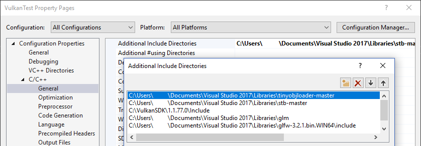
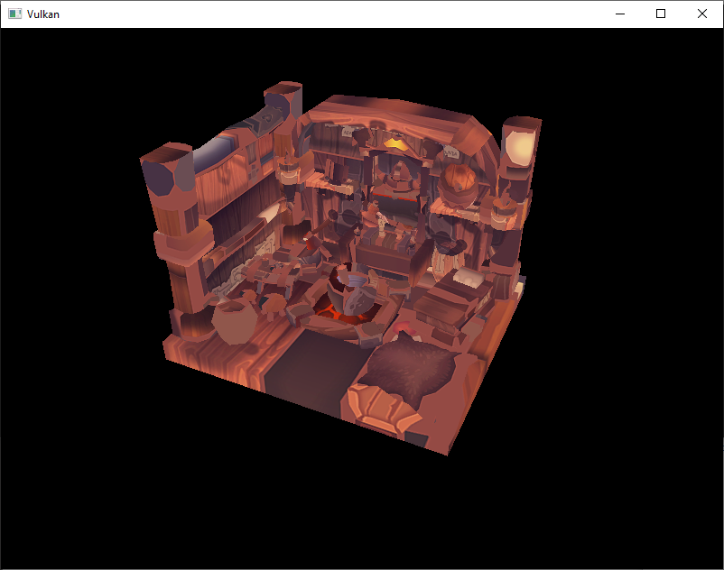
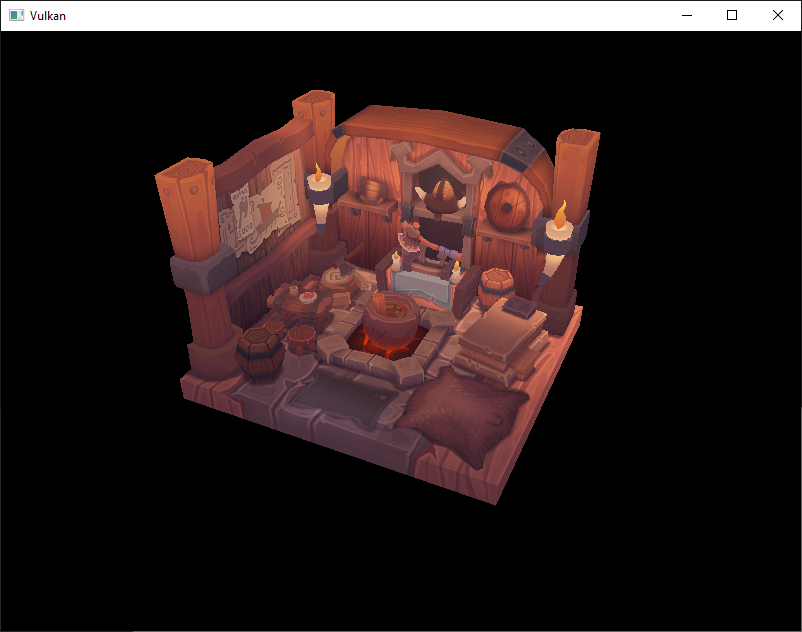

-[Khronos Vulkan Tutorial](https://docs.vulkan.org/tutorial/latest/00_Introduction.html)


# 소개

이제 프로그램이 텍스쳐가 있는 3D 메시를 렌더링할 준비가 되었지만, 현재 지오메트리의 `vertices`와 `indicies` 배열은 그다지 흥미롭지 않습니다. 이번 챕터에서는 실제 모델 파일에서 정점과 인덱스를 로드하여 실제 일부 작업을 수행하도록 프로그램을 확장시켜보겠습니다.

많은 그래픽 API 튜토리얼에서는 독자가 자신의 obj 로더를 작성하도록 합니다. 이것은 3D 어플리케이션이 스켈레탈 애니메이션 같은, 파일 포맷을 지원하지 않는 기능을 필요로 한다는 문제가 있습니다. 이 챕터에서는 obj 모델에서 메시 데이터를 로드하지만 파일에서 로드하는 디테일보다는 프로그램 자체와 메시 데이터를 통합하는데 더 집중하겠습니다.

# 라이브러리

[tinyobjloader](https://github.com/syoyo/tinyobjloader) 라이브러리를 이용하여 obj 파일에서 정점과 면을 로드합니다. stb_image 같은 단일 파일 라이브러리이기 떄문에 빠르고 쉽게 통합할 수 있습니다. 위에 링크된 저장소로 이동하여 `tiny_obj_loader.h` 파일을 라이브러리 디렉토리 폴더에 다운로드합니다. 최신 공식 릴리스가 오래되었으므로 `mater`브랜치의 파일을 사용해야 합니다.

**Visual Studio**

`tiny_obj_loader.h`가 있는 디렉토리를 `Additional Include Directories` 경로에 추가합니다.



**Makefile**

`tiny_obj_loader.h`가 있는 디렉토리를 GCC용 include 디렉토리에 추가합니다.

```makefile
VULKAN_SDK_PATH = /home/user/VulkanSDK/x.x.x.x/x86_64
STB_INCLUDE_PATH = /home/user/libraries/stb
TINYOBJ_INCLUDE_PATH = /home/user/libraries/tinyobjloader

...

CFLAGS = -std=c++17 -I$(VULKAN_SDK_PATH)/include -I$(STB_INCLUDE_PATH) -I$(TINYOBJ_INCLUDE_PATH)
```

# 예제 메시

이 챕터에서는 아직 라이팅을 활성화하지 않을 것이므로, 라이팅이 텍스쳐에 베이크된 샘플 모델을 사용하는 것이 도움이 됩니다. 이러한 모델을 찾는 쉬운 방법은 [Sketchfab](https://sketchfab.com/)에서 3D 스캔을 찾는 것입니다. 해당 사이트의 많은 모델은 허용 라이센스가 있는 obj 포맷으로 사용할 수 있습니다.

이 튜토리얼에서는 [nigeloh](https://sketchfab.com/nigelgoh) ([CC BY 4.0](https://web.archive.org/web/20200428202538/https://sketchfab.com/3d-models/viking-room-a49f1b8e4f5c4ecf9e1fe7d81915ad38))의 [Viking room](https://sketchfab.com/3d-models/viking-room-a49f1b8e4f5c4ecf9e1fe7d81915ad38) 모델을 사용하겠습니다. 모델 크기와 방향을 조정하여 현재 지오메트리를 대체할 드롭인으로 사용했습니다.

- [viking_room.obj](https://vulkan-tutorial.com/resources/viking_room.obj)
- [viking_room.png](https://vulkan-tutorial.com/resources/viking_room.png)

당신이 가지고 있는 모델을 자유롭게 사용해도 좋지만, 하나의 매터리얼로 구성되어 있고 1.5 x 1.5 x 1.5 단위의 크기로 되어있는지 확인하십시오. 이보다 크다면 view 매트릭스를 변경해야 합니다. `models` 디렉토리를 만들고 모델 파일을 넣습니다. 텍스쳐 이미지는 `textures` 디렉토리에 넣어야 합니다. 

모델 및 텍스쳐 경로를 정의하기 위해 두 개의 새로운 변수를 정의합니다.

```cpp
const uint32_t WIDTH = 800;
const uint32_t HEIGHT = 600;

const std::string MODEL_PATH = "models/viking_room.obj";
const std::string TEXTURE_PATH = "textures/viking_room.png";
```

`createTextureImage`를 수정해서 이 경로를 사용하도록 합니다.

```cpp
stbi_uc* pixels = stbi_load(TEXTURE_PATH.c_str(), &texWidth, &texHeight, &texChannels, STBI_rgb_alpha);
```

# 정점과 인덱스 불러오기

이제 모델 파일에서 정점과 인덱스를 로드할 것입니다. 현재 있는 전역 `vertices`, `indicies` 배열을 제거해야 합니다. 클래스 멤버로 비-const 컨테이너를 사용하도록 교체합니다.

```cpp
std::vector<Vertex> vertices;
std::vector<uint32_t> indices;
VkBuffer vertexBuffer;
VkDeviceMemory vertexBufferMemory;
```

65535보다 더 많은 정점이 있을 것이기 때문에 인덱스 유형을 `uint16_t`에서 `uint32_t`로 변경해야 합니다. [`vkCmdBindIndexBuffer`](https://www.khronos.org/registry/vulkan/specs/1.0/man/html/vkCmdBindIndexBuffer.html) 매개변수도 변경해야 합니다.

```cpp
vkCmdBindIndexBuffer(commandBuffer, indexBuffer, 0, VK_INDEX_TYPE_UINT32);
```

tinyobjloader 라이브러리는 STB라이브러리와 동일한 방식으로 포함됩니다. `tiny_obj_laoder.h` 파일을 포함하고 `TINYOBJLOADER_IMPLEMENTATION` 디파인을 정의해야 링커 오류를 방지할 수 있습니다.

```cpp
#define TINYOBJLOADER_IMPLEMENTATION
#include <tiny_obj_loader.h>
```

이제 이 라이브러리를 사용하여 `vertices`, `indicies` 컨테이너를 메시의 것으로 채우는 `loadModel` 함수를 작성하겠습니다. 정점과 인덱스 버퍼가 생성되기 전에 어딘가에서 호출되어야 합니다.

```cpp
void initVulkan() {
    ...
    loadModel();
    createVertexBuffer();
    createIndexBuffer();
    ...
}

...

void loadModel() {

}
```

모델은 `tinyobj::LoadObj` 함수를 호출하여 라이브러리의 데이터 구조에 로드됩니다.

```cpp
void loadModel() {
    tinyobj::attrib_t attrib;
    std::vector<tinyobj::shape_t> shapes;
    std::vector<tinyobj::material_t> materials;
    std::string warn, err;

    if (!tinyobj::LoadObj(&attrib, &shapes, &materials, &warn, &err, MODEL_PATH.c_str())) {
        throw std::runtime_error(warn + err);
    }
}
```

OBJ파일은 position, normal, texture coordinate와 face로 구성됩니다. face는 임의의 버텍스의 수로 구성되며, 각 정점은 인덱스에 의해 position, normal이나 texture coordinate를 나타냅니다. 이를 통해 전체 정점뿐 아니라 개별 속성도 재사용할 수 있습니다.

attrib 컨테이너는 `attrib.vertices`, `attrib.normals`, `attrib.texcoords` 벡터를 통해 모든 position, normal, texture coordinate를 보유합니다.

`shapes` 컨테이너는 개별 객체와 face를 모두 포함합니다. 각 face는 정점 배열로 구성되며, 각 정점에는 position, normal, texture coordinate가 포함됩니다. OBJ 모델은 face마다 material과 texture를 정의할 수도 있지만 무시하겠습니다.

`err` 스트링에는 오류가 포함되고 `warn` 스트링에는 누락된 material 정의 같이, 파일을 로드하는 동안 발생한 경고가 포함됩니다. `LoadObj` 함수가 `false`를 반환하는 경우에는 로드가 실제로 실패합니다. 위에서 언급했듯이, OBJ 파일의 face는 실제로 임의의 수의 정점을 포함할 수 있지만, 우리의 어플리케이션은 삼각형만 렌더링할 수 있습니다.

다행히도 `LoadObj`에는 자동으로 삼각형 단위로 face를 나눠주는 선택적 매개변수가 있으며, 기본적으로 활성화 되어 있습니다.

파일의 모든 면을 단일 모델로 결합할 것이므로 모든 모양을 반복해줍시다.

```cpp
for (const auto& shape : shapes) {

}
```

삼각형으로 나누는 기능은 이미 face당 3개의 정점이 있다는 것을 확인되었으므로, 정점을 직접 반복하고 `vertices` 벡터에 넘길 수 있습니다.

```cpp
for (const auto& shape : shapes) {
    for (const auto& index : shape.mesh.indices) {
        Vertex vertex{};

        vertices.push_back(vertex);
        indices.push_back(indices.size());
    }
}
```

단순화를 위해, 모든 정점이 고유하다고 가정하였기 때문에 간단히 인덱스를 auto-increment 하겠습니다. `index` 변수는 `tinyobj::index_t` 타입이며, `vertex_index`, `normal_index`, `texcoord_index` 멤버를 포함합니다. `attrib` 배열에서 실제 정점 속성을 조회하려면 다음 인덱스를 사용해야 합니다.

```cpp
vertex.pos = {
    attrib.vertices[3 * index.vertex_index + 0],
    attrib.vertices[3 * index.vertex_index + 1],
    attrib.vertices[3 * index.vertex_index + 2]
};

vertex.texCoord = {
    attrib.texcoords[2 * index.texcoord_index + 0],
    attrib.texcoords[2 * index.texcoord_index + 1]
};

vertex.color = {1.0f, 1.0f, 1.0f};
```

불행히도 `attrib.vertices` 배열은 `glm::vec3` 같은 것이 아니라 `float` 배열이므로, 인덱스에 `3`을 곱해야 합니다. 마찬가지로 항목당 두 개의 texture coordinate 컴포넌트가 있습니다. 오프셋 `0`, `1`, `2`는 x, y, z 컴포넌트에 사용되며, texture coordinate의 경우 u, v에 접근할 때 사용합니다.

최적화가 활성화된 상태에서 프로그램을 실행해보세요. (예를 들어 비쥬얼 스튜디오에서 `Release` mode나  GCC에서 `-O3` 컴파일러 플래그를 사용). 그렇게 하지 않으면 모델을 로드하는 속도가 매우 느려질 것입니다. 다음과 같은 내용이 표시되어야 합니다.



좋습니다. 지오메트리가 정확해 보이지만, 텍스쳐는 어떤가요? OBJ형식은 수직 좌표가 `0`이 이미지의 하단을 의미하는 좌표계를 가정하지만, 우리는 `0`이 이미지의 상단을 의미하는 Vulkan에 이미지를 업로드하였습니다. 텍스쳐 좌표의 수직 컴포넌트를 뒤집어서 이 문제를 해결합니다.

```cpp
vertex.texCoord = {
    attrib.texcoords[2 * index.texcoord_index + 0],
    1.0f - attrib.texcoords[2 * index.texcoord_index + 1]
};
```

프로그램을 다시 실행하면 올바른 결과가 표시됩니다.



그동안 노력이 드디어 이런 데모로 결실을 맺기 시작했습니다!

> 모델이 회전할 때 후면이 약간 재밌게 보이는 것을 알 수 있습니다. 이것은 정상이며, 단지 모델이 실제로 그 측면에서 볼 수 있도록 만들어지지 않았기 때문입니다.
> 

# 중복되는 정점 제거

불행히도 아직 인덱스 버퍼를 제대로 활용하지 못하고 있습니다. 많은 정점이 여러 삼각형에 포함되어 있기 때문에 `vertices` 벡터에는 중복된 정점 데이터가 많이 포함되어 있습니다. 고유한 정점만 유지하고 인덱스 버퍼를 사용하여 정점이 나타날 때마다 재사용해야 합니다. 이를 구현하는 간단한 방법은 `map`이나 `unordered_map`을 사용하여 고유한 정점과 인덱스를 추적하는 것입니다.

```cpp
#include <unordered_map>

...

std::unordered_map<Vertex, uint32_t> uniqueVertices{};

for (const auto& shape : shapes) {
    for (const auto& index : shape.mesh.indices) {
        Vertex vertex{};

        ...

        if (uniqueVertices.count(vertex) == 0) {
            uniqueVertices[vertex] = static_cast<uint32_t>(vertices.size());
            vertices.push_back(vertex);
        }

        indices.push_back(uniqueVertices[vertex]);
    }
}
```

OBJ 파일에서 정점을 읽을 때마다 이전에 정확히 동일한 위치와 텍스쳐 좌표를 가진 정점을 본 적이 있는지 확인합니다. 그렇지 않은 경우에는 `vertices`에 추가하고`uniqueVertices` 컨테이너에 저장합니다. 그 다음 새 정점의 인덱스를 `indices`에 추가합니다. 이전에 똑같은 정점을 본 적이 있다면 `uniqueVertices`에서 인덱스를 조회하고 해당 인덱스를 `indices`에 저장합니다.

`Vertex` 구조체와 같은 사용자 정의 유형을 해시 테이블의 키로 사용하려면 두가지 기능을 구현해야 하기 때문에 아직 컴파일이 되지 않을 것입니다. 두 가지 기능이란 equality test와 hash calculation 입니다. 전자는 `Vertex` 구조체에서 `==` 연산자를 재정의하여 구현하기 쉽습니다.

```cpp
bool operator==(const Vertex& other) const {
    return pos == other.pos && color == other.color && texCoord == other.texCoord;
}
```

`Vertex`의 해시 함수는 `std::hash<T>`에 대한 template specialization을 지정하여 구현됩니다. 해시 함수는 복잡한 주제이지만 [cppreference.com](http://en.cppreference.com/w/cpp/utility/hash)에서 적절한 품질의 해시 함수를 생성하기 위해 구조체의 필드들을 결합하는 방법을 찾아보는 것을 추천합니다.

```cpp
namespace std {
    template<> struct hash<Vertex> {
        size_t operator()(Vertex const& vertex) const {
            return ((hash<glm::vec3>()(vertex.pos) ^
                   (hash<glm::vec3>()(vertex.color) << 1)) >> 1) ^
                   (hash<glm::vec2>()(vertex.texCoord) << 1);
        }
    };
}
```

이 코드는 `Vertex` 구조체 외부에 배치해야 합니다. GLM 타입에 대한 해시 함수는 다음 헤더를 사용하여 포함해야 합니다.

```cpp
#define GLM_ENABLE_EXPERIMENTAL
#include <glm/gtx/hash.hpp>
```

해시 함수는 `gtx` 폴더에 정의되어 있습니다. 즉, 기술적으로는 아직 GLM에 대한 실험적인 확장입니다. 그러므로 `GLM_ENABLE_EXPERIMANTAL`을 정의해야 사용할 수 있습니다. 이는 API가 향후 GLM의 새 버전으로 변경될 수 있지만, API가 실제로는 매우 안정적이라는 것입니다.

이제 프로그램을 성공적으로 컴파일하고 실행할 수 있습니다. `vertices`의 크기를 확인하면 150만개에서 26만개로 줄었음을 알 수 있습니다. 이는 각 정점이 평균 6개의 삼각형에서 재사용됨을 의미합니다. 이는 확실히 GPU메모리를 많이 절약합니다.

[C++ code](https://vulkan-tutorial.com/code/28_model_loading.cpp) / [Vertex shader](https://vulkan-tutorial.com/code/27_shader_depth.vert) / [Fragment shader](https://vulkan-tutorial.com/code/27_shader_depth.frag)