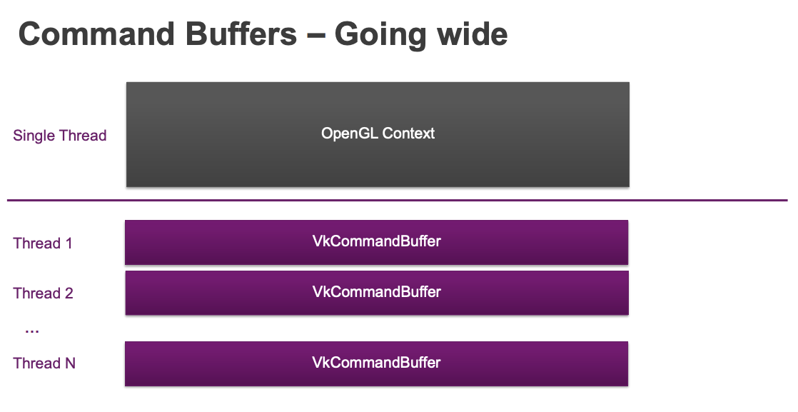

## OpenGL vs Vulkan
- OpenGL과 Vulkan은 모두 비영리 오픈소스 플랫폼이다.
- Vulkan은 처음에 ‘Next generation OpenGL initiative’ ‘OpenGL next’ 등으로 불렸다.
- Vulkan은 GPU에 대한 직접적인 제어를 제공하고, CPU 사용량을 줄여 오버헤드 압력을 낮춘다. 이 개념은 DirectX12 , Metal과 유사하다.
- OpenGL은 GLSL 언어로 작성된 셰이더를 런타임에 GPU 기계코드로 변환한다.
- Vulkan은 이미 중간 바이너리 데이터가 존재한다. (SPIR-V)
- Vulkan은 레이어 간의 유효성 검사를 독립적으로 실행할 수 있다. 크로스 플랫폼 간 이식을 쉽게 할 수 있다.
- Vulkan, DirectX12, Metal은 모두 명령 버퍼 기반 인터페이스를 사용한다.

---

## 명령 버퍼 (Command Buffer)
- OpenGL은 즉각적인 API이기 때문에 여러 CPU코어를 사용하여 DrawCall 할 수 없다.
- Vulkan은 원하는 수의 명령 버퍼를 생성하고, 각 버퍼에 대한 작업을 여러 스레드에 할당할 수 있다.
- 현재 렌더링된 이미지가 이전과 크게 다르지 않을 경우 명령 버퍼를 재사용하여 CPU 시간을 절약할 수 있다.
- CPU→GPU / GPU→CPU / GPU→GPU간의 데이터 전송

---

## 렌더 패스
- 그래픽을 렌더링하는 규칙.
- OpenGL에는 렌더패스 같은 개념이 존재하지 않았다. 드라이버는 어떤 렌더링 명령이 단일 패스를 형성하는지 추론해야 한다.
- Vulkan은 렌더패스가 도입되면서 타일 기반 렌더러에서 셰이딩 작업으로 변환될 수 있는 단일 패스 내의 하위 패스 개념을 포함한다.
- 렌더패스 구조를 미리 구축할 수 있으므로 드라이버의 부하를 줄인다.

---

## 스왑체인
- OpenGL은 렌더링 프로세스가 보통 출력 버퍼로 끝난다.
- Vulkan은 기본 출력 버퍼가 없다. 이와 비슷한 버퍼를 스왑체인(SwapChain)이라 부르며, 응용프로그램에서 직접 생성하여 사용한다.
- 서로 다른 백버퍼를 전환하고, 새로고침 빈도 및 백버퍼 스와핑 같은 렌더링 측면을 제어한다.

## Vulkan 장점 및 단점
- 장점
    - Vulkan은 드라이버 및 렌더링 로직의 CPU 부하를 줄인다. (API 인터페이스 간소화와 다중 스레드)
    - 중간 메모리 재활용으로 프로그램의 메모리 요구량을 줄여준다.
- 단점
    - 응용 프로그램에 많은 책임을 부과한다. (메모리 할당, 작업 부하 종속성관리, CPU-GPU 동기화)

---

## 참고자료
- [A Comparison of Modern Graphics APIs](https://alain.xyz/blog/comparison-of-modern-graphics-apis)

- [OpenGL vs Vulkan](https://www.educba.com/opengl-vs-vulkan/)

- [What are Metal and Vulkan?](https://computergraphics.stackexchange.com/questions/8185/what-are-metal-and-vulkan)

- [Vulkan vs OpenGL – part 2](https://cybertic.cz/vulkan-vs-opengl-part-2/)

- [2-Command_buffers_and_pipelines.pdf](https://www.khronos.org/assets/uploads/developers/library/2016-vulkan-devday-uk/2-Command_buffers_and_pipelines.pdf)
