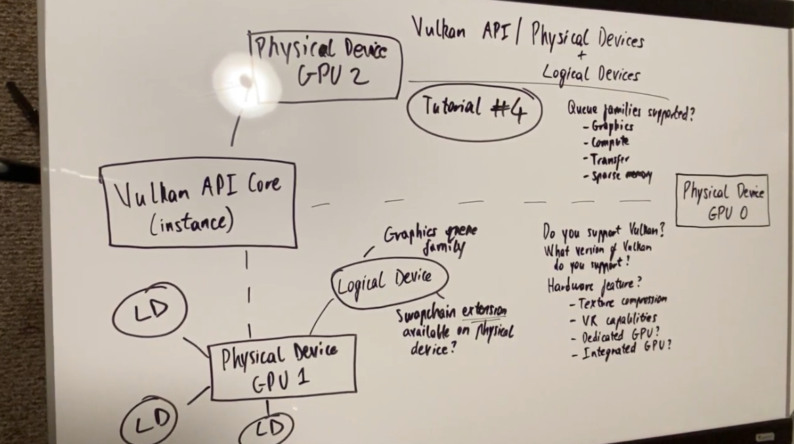

- 어플리케이션에서는 Vulkan API Core Instance를 생성하여 사용한다.
- Physical device는 장치 하드웨어(GPU 등)를 말한다. 하나의 PC에 여러개의 장치가 연결될 수 있으므로, Physical device도 여러개가 존재할 수 있다.
- Core는 Physical device가 Vulkan을 지원하는지 확인한다.
    - Vulkan을 지원하는지
    - 지원하는 Vulkan 버전
    - 하드웨어 기능 (Texture composition / VR capabilities / Dedicated GPU / Integrated GPU)
- Physical device가 사용하려는 명령어를 지원하는지 확인해야 한다. (queue families)
    - Graphics / Compute / Transfer / Sparse memory
- 사용할 Physical device가 결정되면 인터페이스할 Logical device를 생성한다.
    - 당연하게도 Logical device를 생성하려면 Physical device가 필요하다.
    - 사용 목적에 따라 하나의 Physical Device가 여러개의 Logical Device를 가질 수 있다.

---

## 참고 자료

- [Youtube Cuda Education - Vulkan API Discussion | Physical Device & Logical Device | Cuda Education](https://www.youtube.com/watch?v=DRl-3c3OJLU)

- [Vulkan Tutorial - Physical devices and queue families](https://vulkan-tutorial.com/Drawing_a_triangle/Setup/Physical_devices_and_queue_families)

- [Vulkan Tutorial - Logical device and queues](https://vulkan-tutorial.com/Drawing_a_triangle/Setup/Logical_device_and_queues)